# 工作区系统架构分析与渐进重构建议

> 日期：2026-10-01。源码基线：`a6d2f63`。本文完整整理本轮架构讨论；“当前”表示本轮源码中已存在的实现，“建议”表示尚待实施的设计。本文是设计提案，不将目标能力声明为已实现，也不替代现有正式任务的权限、事务和恢复约束。
>
> 后续状态：本文源码事实冻结于 `a6d2f63`，包括当时工作视图对任务控制器的依赖。第一轮已收敛投影并解耦身份查询，当前结构见[包架构](target-package-map.md)与[第一轮结果](../refactoring/round-01-results.md)；下文建议和配套 PDF 保留为设计快照。
>
> 需求依据：[工作区协作需求](../requirements/2026-10-01-project-workspace-collaboration.md)。配套 PDF：`2026-10-01-workspace-architecture-review.pdf`。第一轮实施提示词：[round-01](../refactoring/round-01-codex-prompt.md)。

我对当前项目的判断是：**正式任务状态的可靠性基础值得保留；工作区、内容维护和协作界面的抽象，需要成为下一轮架构的中心。**

现在的系统已经能够比较严谨地回答：“这是哪个正式任务？状态是什么？谁可以修改？修改依据是什么？失败后如何恢复？”而你这次提出的需求，还要求系统回答：“这个工作的材料在哪里？我现在怎么理解它？哪些新想法尚未整理？面对当前问题，我需要看到什么？agent 刚改了什么？我接下来可以动手做什么？”

这两组能力可以共享来源、身份和版本机制，但它们的职责、更新频率与交互方式不同。**下一轮重构的关键，是让这些能力各自形成清晰的边界，同时通过稳定的工作区身份和来源引用连接起来。**

下面先解释当前实现，再给出建议架构及其内部设计。标注“当前”的图依据本轮源码；标注“建议”的图表示我推荐的演进方向。

---

**先看当前系统：它已经形成“一个 Logseq 插件 + 一个本地服务”的整体形态。**

从运行位置看，当前系统可以画成这样：

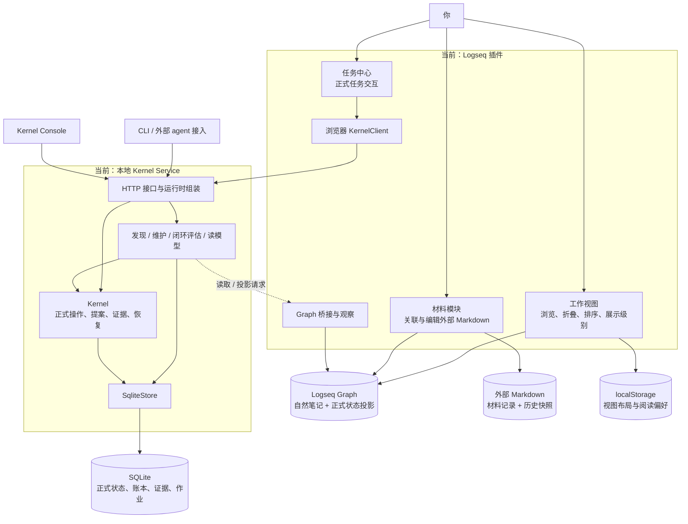

这里已经有几条很好的边界：插件不直接写 SQLite，Kernel 不依赖 Logseq SDK，正式任务操作通过服务执行，视图排序也不会被误当成正式任务归属。这些边界在[现有包架构文档](target-package-map.md)中有明确说明。

另外，**当前数据分散在几个存储位置，是有合理原因的。** 不应该仅仅为了“统一”，就把它们全部复制进一个数据库。

| 数据 | 当前权威位置 | 应承担的职责 |
|---|---|---|
| 用户写下的自然笔记 | Logseq Graph | 保存原始表达、背景、讨论和想法 |
| 外部材料正文 | 原来的 Markdown 文件 | 保存可独立使用的文档成果 |
| 正式任务状态 | SQLite | 保证状态、权限、版本和操作记录一致 |
| 正式状态在笔记中的展示 | Logseq 中的受管理投影 | 呈现 SQLite 中的正式状态 |
| 视图排序、折叠、展示偏好 | localStorage | 服务个人阅读，不改变来源语义 |
| 材料恢复记录和历史 | `.longdoc` 记录及快照 | 支持关联、恢复和冲突处理 |

你要解决的是这些数据之间的**可追踪关系和共同使用方式**。各类内容仍应有明确的权威来源。

---

**当前模块已经实现了新需求中的哪些部分？**

可以把现有能力和缺口对应起来：

| 当前模块 | 已经覆盖的需求 | 主要缺口 |
|---|---|---|
| `domain` | 正式任务身份、生命周期、等待状态、推进点、目标、归属约束 | 缺少连接笔记、文件夹、材料和交流的工作区对象 |
| `contracts` | 类型明确的操作、来源引用、上下文、证据、agent 输出协议 | 来源模型主要围绕 Logseq block，尚未贯通文件与交流 |
| `kernel` | 正式状态写入、版本检查、证据、提案、恢复、撤销 | 内容组织、上下文管理和部分交互语义也集中在其中 |
| 工作视图 | 保留来源块身份，独立调整展示结构，折叠与强调内容 | 没有基于问题的语义剪枝、源内容编辑和变更审阅闭环 |
| 材料模块 | 关联已有 Markdown、保留原文件、编辑、冲突提示、历史快照 | 主要管理单份材料，缺少任务工作区中的文件集合与角色 |
| 维护协调器 | 观察变化、组织上下文、调用 agent、维护正式推进状态 | 尚未形成自然笔记的持续维护能力 |
| 投影协调器 | 重入摘要、当前状态、最近变化、关联上下文、注意事项 | 聚合、来源读取、选择策略和文案组织混在一起 |
| agent 与 skill | 有边界的执行、版本化 skill、受控输出 | 缺少内容维护、阅读聚焦与个人风格的独立协议 |
| 对话入口 | 可以取得对象上下文并转交外部讨论 | 尚未建立任务与外部交流的持久关联 |

最后一项需要特别区分：目前“打开对象对话”的实现主要是复制上下文和对象 ID，提示在外部工具中继续讨论，尚未保存工作区与会话的关联。见[当前对话入口](../../apps/logseq-plugin/src/features/task-center/controller.ts#L923)。

因此，项目已经拥有很多可复用的基础，但**这些基础围绕“正式任务”组织得更完整，围绕“持续工作的上下文”组织得还不够完整。**

---

**当前最需要处理的耦合，首先出现在插件内部。**

现在有三个表面上并列的功能模块：工作视图、材料、任务中心。但任务中心还承担了一些应该由插件共享运行时承担的职责。

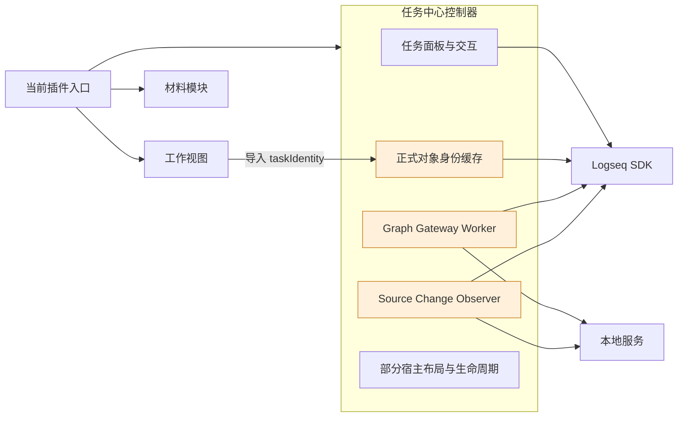

这里有两个明确的源码事实：

工作视图直接从任务中心控制器导入 `taskIdentity`，见[工作视图的依赖](../../apps/logseq-plugin/src/features/work-view/controller.ts#L5)。Graph 桥接和来源观察也由 `startTaskCenter()` 启动，见[任务中心的运行时初始化](../../apps/logseq-plugin/src/features/task-center/controller.ts#L1098)。

问题在于：**身份识别、Graph 通信和变化观察，是工作台的共享基础能力，它们的生命周期目前却依附于某个界面功能。**

随着新需求增加，工作视图会需要身份，材料会需要来源观察，外部 agent 会需要 Graph 桥接。继续从任务中心取这些能力，就会逐渐形成“其他模块都依赖任务中心控制器”的结构。

我建议先改成下面这种内部组织：

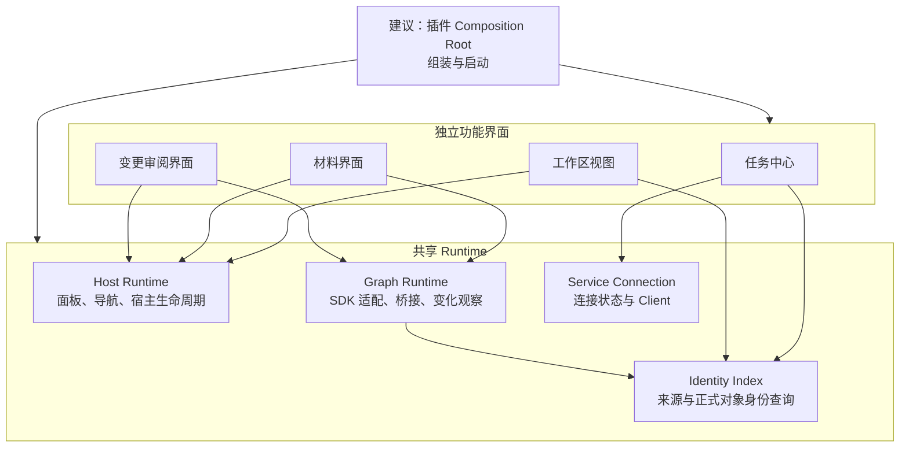

这样，关闭一个面板、禁用一个界面功能，不会自然演变成关闭其他功能所需要的共享能力。至于是否允许关闭某项后台能力，可以成为单独的设置和生命周期决策。

**这是我最建议优先做的重构：收益明确，范围相对可控，也直接为后面的需求铺路。**

---

**服务端的问题，则是职责逐渐集中在 Kernel、Store 和 Coordinator 三类对象上。**

当前结构大致是：

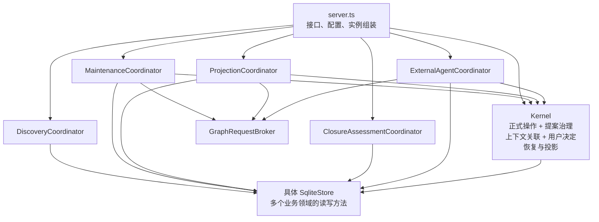

这里不能简单地说“大文件就是坏设计”。真正的问题是：**这些模块存在多个彼此独立的修改理由，却通过一个较大的对象接口连接起来。**

例如：

- 修改正式操作的约束，需要调整 Kernel。
- 修改上下文关联方式，也可能需要调整 Kernel。
- 修改用户阅读基线，同样进入 Kernel。
- 修改重入摘要如何选取信息，需要调整投影协调器。
- 修改摘要读取哪些来源，仍然需要调整投影协调器。
- 新增一类作业或协作记录，会扩展所有服务都能访问的 Store。

当前 `ProjectionCoordinator.objectContext()` 就同时做了正式状态查询、历史筛选、Graph 内容读取、子任务选择、问题聚合和摘要组织，见[对象上下文组装](../../apps/kernel-service/src/projection-coordinator.ts#L177)。

这意味着，一个本应只是“改变重入摘要措辞”的修改，很容易碰到 Graph 在线状态、上下文选择和查询性能。**高内聚的目标，就是让同一种变化集中发生，让不同种变化尽量独立发生。**

还有一处更具体的重复：Kernel 和插件各自组装正式投影并计算 hash。分别见[Kernel 投影构造](../../packages/kernel/src/index.ts#L51)与[插件投影构造](../../apps/logseq-plugin/src/features/task-center/controller.ts#L83)。

这一处应该收敛，因为它们表达的是同一份正式状态的同一种投影。否则新增字段、闭环状态或 hash 规则时，两端可能发生漂移。可以提取一个共享的纯函数，或者由服务返回权威的预期投影，插件只负责读取和执行 Graph 效果。

但另一处需要谨慎：当前 legacy 与 formal 两种提交接口，**已经共享同一个 `#prepare` 实现**，并非两套完全独立的验证引擎。见[提交入口与共享实现](../../packages/kernel/src/index.ts#L632)。这里值得逐步收敛的是提交模式和调用路径，而不是误判为重复算法后大规模重写。

---

**我建议的整体架构：继续采用模块化单体，把工作区能力补到现有正式任务内核旁边。**

部署形态仍然保持一个插件、一个本地服务、一个 SQLite 数据库。新增的是逻辑边界。

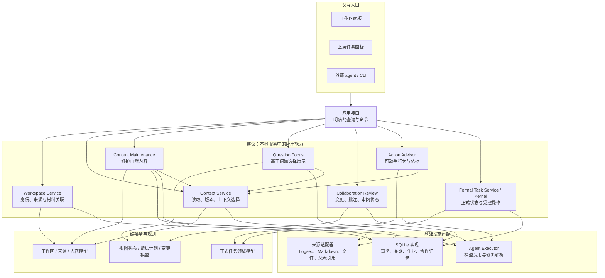

这些服务不必立刻变成七八个 npm 包。**先在现有应用和包里建立职责边界，等确实出现跨入口复用，再提取包。**

从开源项目看，Joplin 的桌面、移动和 CLI 入口共享后端服务、模型和数据库，这是值得借鉴的方向：入口可以不同，业务能力应当复用。这里借鉴的是复用边界，无需同时引入它完整的同步体系。[Joplin 架构说明](https://joplinapp.org/help/dev/spec/architecture/)

---

**第一个必须补上的抽象，是 Workspace。它表达“这一份工作”，而不是某个面板或某种正式任务类型。**

你描述的稳定关系是：

> 一份工作，有一个主要笔记入口、一个文件夹、一组材料，以及若干次与 agent 的交流。

当前 `WorkObject` 主要表达生命周期、等待状态、目标、推进点等正式任务语义，见[正式任务模型](../../packages/domain/src/index.ts#L14)。把目录、材料、聊天关联和阅读偏好全部加进去，会让它同时承担两种不同职责。

建议采用下面的关系：

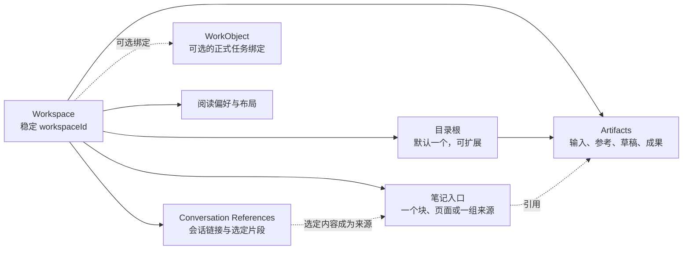

这个抽象有几个实际价值。

**工作区可以先于正式任务存在。** 你建立块和文件夹后，就能开始工作；是否正式化、正式化成什么类型，可以稍后决定。

**工作区身份不应取决于当前路径。** 文件夹改名、笔记入口调整，不应该等于创建了一个新项目。文件路径是定位信息，工作区 ID 是身份。

**材料属于工作区，与材料是否进入当前上下文，是两件事。** 一个文件夹里可以有大量成果、临时文件和参考资料，agent 不应每次把全部文件都读进上下文。

**交流关联也不等于保存所有聊天全文。** 第一阶段可以保存会话引用、用途和用户或 agent 选定的片段；有访问能力时再读取。无法访问的会话应明确显示为引用，不能假装其内容已经进入上下文。

这里还应避免一种新的冗余：一份工作区关联记录同时在 SQLite、目录 JSON 和笔记属性中各维护一套权威版本。我倾向于先由 SQLite 管理关联元数据，需要可迁移性时提供导出；笔记和文件中保留可用的链接，而不是建立三套双向同步的注册表。

---

**第二个模块是统一的来源与上下文能力。但统一的是接口、身份和版本，不是正文存储。**

当前 `SourceRef` 主要是 `graphId + blockUuid`，见[来源引用定义](../../packages/contracts/src/index.ts#L783)。材料模块则有自己的文档 ID、路径和保存逻辑。这两套能力现在尚未贯通。

建议形成这样的读取过程：

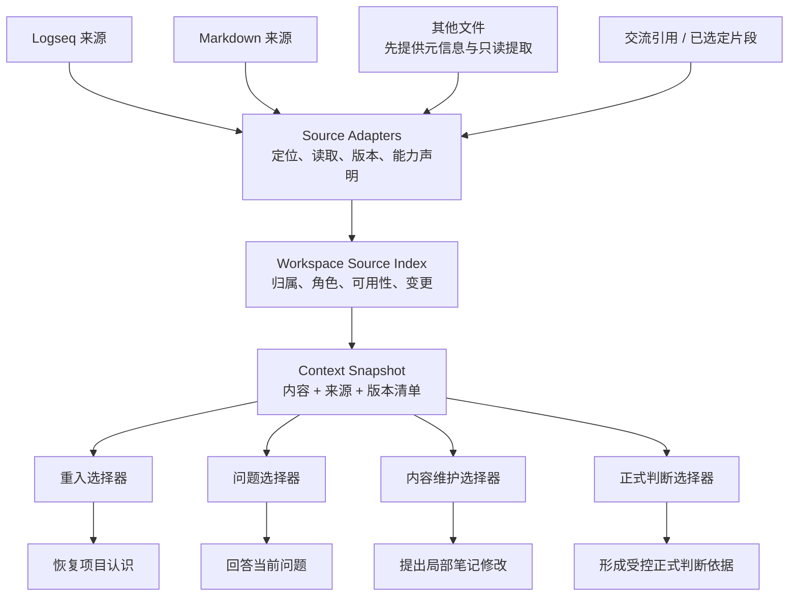

来源适配器应明确自己能做什么：可读、可编辑、可取得版本、可监测变化、可定位到段落，或者只能打开原文件。**不能让所有来源都伪装成同一种可编辑文档。**

更重要的是，上下文选择必须区分用途。

重入时要看到“目标、当前状态、未决问题”；判断下一步时要看到“阻塞、可行动条件、相关决定”；维护笔记时需要“受影响段落、新输入、写作约束”；修改正式状态时需要可追踪的证据和正式操作边界。

因此，我不建议让一个越来越大的 `ObjectContextPack` 成为所有场景的唯一输入。现有 ContextPack 的角色、来源 handle、预算和证据选择机制很有价值，可以沿用；但选择策略应独立出来。

这里有一个容易被忽略的技术细节：**跨 Logseq 和文件系统的 Snapshot，并不天然具有原子一致性。** 它应记录每个来源的版本和读取时间；执行修改、展示建议之前，再检查相关来源是否改变。Graph 离线时可以使用明确标记的旧快照，不能把缓存当作最新事实。

---

**第三个模块是内容维护。它必须直接改善原始笔记，才能解决“渲染层很好、原文很乱”的问题。**

我不建议靠渲染器长期遮盖原文的混乱。渲染器可以改善阅读密度，但原始笔记应逐渐成为可独立理解的工作记录。

与此同时，用户自由输入不应被视为破坏结构。更合理的方式，是让内容具有不同的语义状态和处理状态：

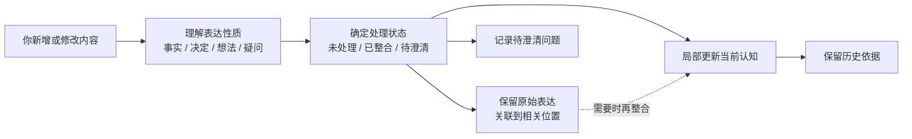

比如，你写下“也许可以把这个方案改成异步处理”，它是一个想法；agent 可以关联到相关选型，指出需要验证的条件，但不应把它改写成“已决定采用异步处理”。

如果你明确写下“最终决定采用异步处理”，系统可以据此更新相关自然记录，同时保留决定的来源。若这又涉及正式状态修改，则继续走正式操作机制。

所以，**内容维护的核心不是把所有零散输入整理成确定答案，而是保持表达的确定程度，并逐步消除重复、过时和位置不当的内容。**

维护模块应该输出局部 `ContentPatch`，而不是一整篇重新生成的项目说明。每个 patch 至少表达：

| 信息 | 用途 |
|---|---|
| 修改哪个来源、哪个块或范围 | 精确落点 |
| 基于哪个版本 | 防止覆盖后续修改 |
| 原内容和新内容 | 支持比较与恢复 |
| 修改原因与相关输入 | 让改动可以理解 |
| 是修正、补充、合并还是归档 | 区分行为 |
| 哪些原始表达必须保留 | 保护用户语气和不确定性 |

**“允许不修改”也应该是正式输出。** 没有增加有效信息、只是换一种说法的改写，会增加审阅负担，也会让笔记越来越像 agent 的周报。

维护触发也不宜默认设为每次输入之后立即重写。可以观察输入，合并一次工作的连续变化，在 agent 完成阶段工作、用户结束一段输入或明确请求整理时执行。用户正在编辑的范围应受到保护。

---

**第四个模块是工作区视图。它需要拆开来源内容、个人布局和临时展示三个层次。**

当前工作视图已经很好地保留了来源身份，并允许布局独立于来源。但是它现在会在刷新时读取整棵子树，使用 650ms 轮询作为补充，渲染时清空内容区域并重新建立节点；`seq` 也同时随内容刷新和界面渲染增加。见[刷新机制](../../apps/logseq-plugin/src/features/work-view/controller.ts#L57)和[渲染实现](../../apps/logseq-plugin/src/features/work-view/controller.ts#L155)。

这些实现对当前简单视图是可用的。面对精确高亮、批注、正在输入的编辑器和紧缩动画，代价会明显增加：界面重建容易打断选区、焦点和节点位置关系，一个混合版本号也难以判断究竟是什么改变了。

建议把视图状态拆成下面几部分：

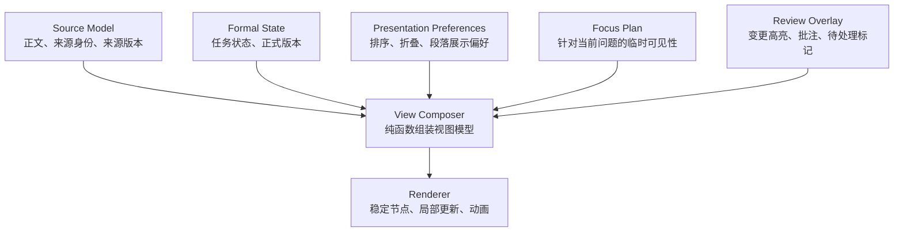

这会形成一条很有用的规则：**隐藏、强调、聚焦和变更高亮属于展示状态；它们不会自动改写正文。**

版本也应各自表达清楚：

- 来源版本：正文是否变了。
- 正式版本：任务状态是否变了。
- 布局版本：用户排序和折叠偏好是否变了。
- 工作区索引版本：来源集合是否变了。
- 聚焦计划的依据版本：这份展示选择基于哪次读取。

这样，用户调整折叠状态不必让内容修改提案过期；而来源中的关键约束改变，则应让相关建议重新检查。

这里可以借鉴 CodeMirror 的架构：状态与变更计算集中在纯模型中，DOM 和命令执行放在外层。对本项目来说，收益是让视图逻辑可以脱离 Logseq 和浏览器验证，而不是继续写进一个大控制器。[CodeMirror 系统设计](https://codemirror.net/docs/guide/)

还有一个与你的阅读习惯直接相关的结论：**机器处理的单位、用户阅读的单位、用户审阅修改的单位，不必相同。**

来源可能是一个 Logseq block；阅读时可以呈现为完整段落；审阅时可以只高亮其中一句话。无需为了让 agent 容易操作，把所有文字拆成一条条列表。

---

**第五个模块是问题聚焦，它负责“用笔记本身回答问题”。**

这项能力与普通的摘要生成有明显区别。你提出问题后，agent 应选择当前工作区中哪些内容值得呈现，渲染器则保持你熟悉的结构。

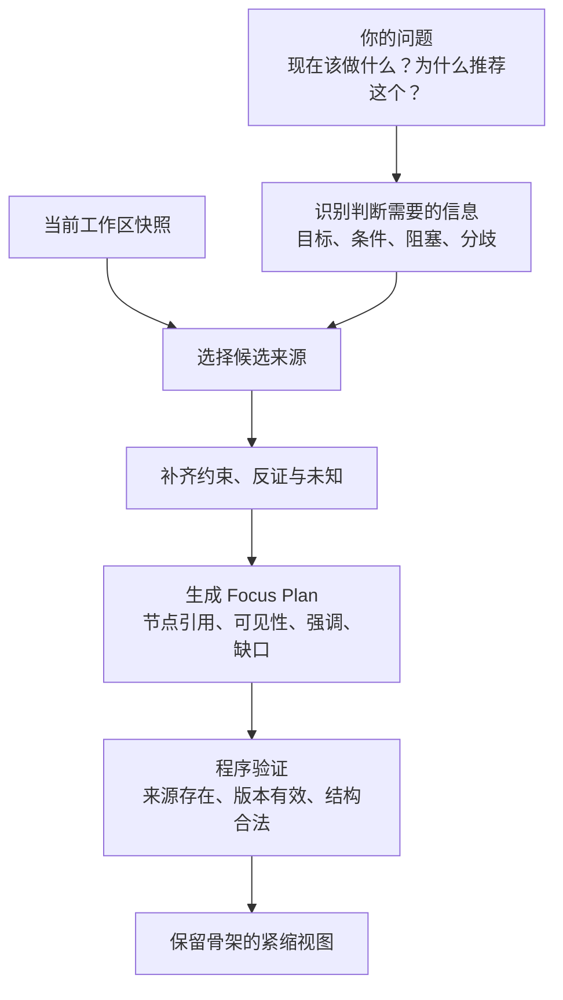

这里最重要的约束是：**系统应先判断需要哪些信息，再形成建议和展示计划。** 如果先生成一句建议，再选择支持它的笔记，就容易把选择性渲染变成选择性证明。

举一个紧缩效果的例子。原页面有目标、方案、进展、问题、历史五部分；你问“现在是否可以发布？”，紧缩后可能保留：

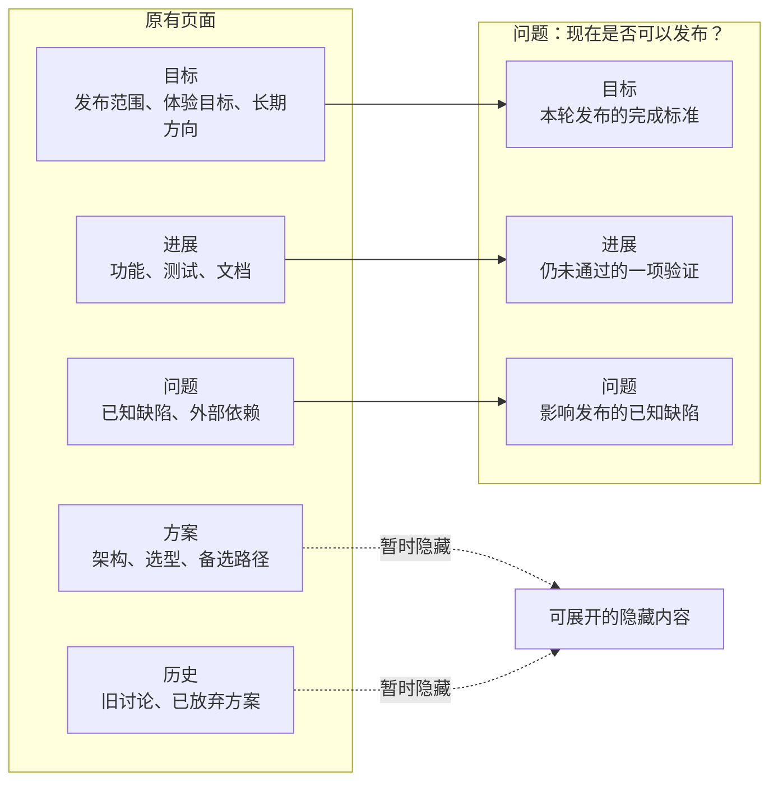

保留下来的内容仍然在原来熟悉的区域。必要的标题、祖先节点和位置关系得到保留，历史背景则暂时收起。

Focus Plan 应当是一份受约束的数据，例如“显示哪些节点、强调哪些段落、哪些区域保留标题、缺少什么依据”。**不建议让 agent 自由生成一份 HTML 页面。** 那样会失去稳定的来源定位、结构连续性和可编辑性。

而且，“最小”应该以**足以作出判断**为标准。一个漂亮而简短的页面，如果隐藏了重要反证或未知条件，认知负担确实降低了，但判断质量也降低了。

对于段内剪枝，第一阶段应优先保留完整段落或块。句子级剪枝涉及指代、转折和限定条件，稍有不慎就会改变原意，适合在来源映射成熟后再引入。

---

**第六个模块是协作审阅。这里需要明确区分“提出修改”和“已经修改”。**

你的描述包含两种合理模式：

一种是 agent 已经按授权维护笔记，你看到高亮后确认、修改或批注；另一种是涉及重大决定时，agent 先提出修改，等你接受后再写入。

这两种模式可以共用变更界面，但状态不能混淆。

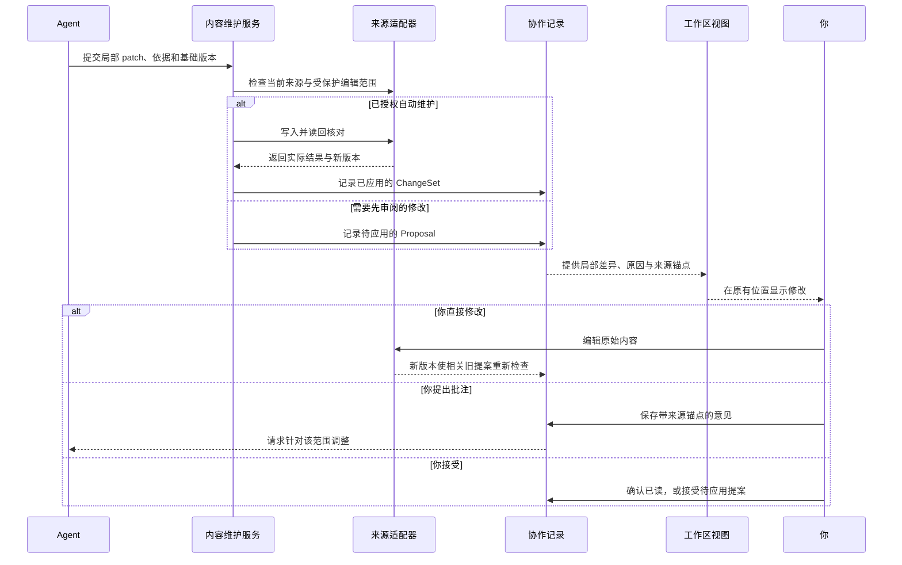

**“我看过了”“我同意这句话”“我批准这个正式操作”，是三种不同语义。** 当前系统已经有正式阅读基线和正式决定机制，新界面应保留这种区分。

协作记录也不应只保存在浏览器内存里。批注、未应用提案和已应用变更需要可恢复，并且能被 agent 读取。它们可以先存放在服务端 SQLite 中，重要意见再按需写入笔记；不必把所有界面高亮标记都写进正文。

高亮锚点至少需要来源 ID、来源版本和块或文本范围。来源发生变化后，可通过编辑变换更新位置；如果定位已经有歧义，应显示“原位置已变化”，避免把批注静默挂到另一句话上。

ProseMirror 将文档内容与展示用 decorations 分离，并提供随着文档变更映射标记位置的机制。这一原则很适合借鉴到高亮和批注中，但不意味着现在就需要整体采用它作为编辑器。[ProseMirror 设计指南](https://prosemirror.net/docs/guide/)

这里还要保留当前材料模块已有的保护：基础内容比较、历史快照、保存后读回核对。它也明确承认普通文件 IO 不具备跨进程原子比较写入能力，见[材料保存实现](../../apps/logseq-plugin/src/features/materials/store.ts#L92)。重构时应延续这个准确的边界，不能把一次 rename 当成完整的并发冲突解决方案。

---

**正式任务内核应该更专注，但其可靠性机制不应被简化掉。**

当前 formal 提交会在同一个 SQLite 事务中更新正式对象、提交记录和投影义务。这是一个值得保留的设计：Graph 暂时不可用，不必否定已经成立的正式状态更新。见[当前正式提交事务](../../packages/kernel/src/index.ts#L816)。

建议把内部职责整理成下面的形态：

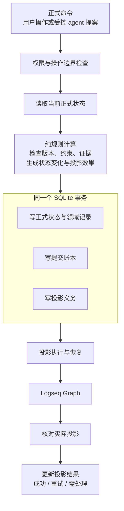

我建议把上下文关联、阅读基线、部分 agent 编排和部分用户决定流程，逐步移到应用服务；Kernel 保留正式命令的验证、计划、事务和恢复核心。

同时，可以让 Kernel 依赖较小的提交存储接口，而不是整个具体 `SqliteStore`。但**不要因此拆成每个表一个 Repository，再让一次业务事务跨十几个对象协调。**

更合适的切分单位是业务操作族：正式提交、上下文索引、协作记录、作业管理、读模型查询。它们可以共享一个 SQLite 连接及事务边界。

当前 Store 的大接口可以渐进拆分，先保留兼容门面，再逐个迁移调用方。没有必要在这一阶段更换数据库。

---

**skills 也需要按职责分层，否则个人写作风格会与正式操作权限混在一起。**

建议区分三类约束：

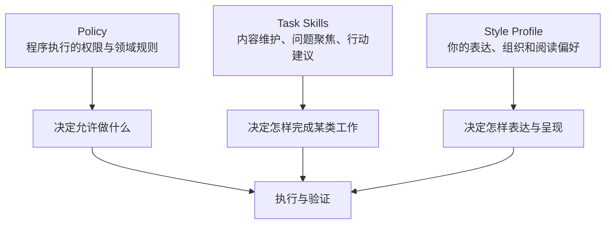

Policy 应继续由程序和正式协议执行。比如 agent 可以维护某些推进字段，不代表它可以自行完成任务；写作 skill 也不能授予它新的权限。

内容维护、问题聚焦、行动建议，可以分别建立 skill，因为它们的输入、输出与成功标准不同。

个人风格则应包含你认可的实例和反例：哪些段落密度合适，什么时候使用列表，怎样写选型和未决问题，哪些词句让你觉得没有信息。**它需要易于迭代，但不应自动把“你没有反对”当作偏好确认。**

正式操作 skill 的固定版本和 hash 有其治理价值。普通措辞偏好则可以采用更轻的版本管理，不宜让每次调整表达风格都走完整的正式授权流程。

---

**上层任务系统的“可动手行为”，建议形成独立的 Action Advisor。**

当前 Now 投影根据最近变化、等待复查、未覆盖来源和待确认事项，选择值得你注意的对象。见[Now 投影实现](../../apps/kernel-service/src/projection-coordinator.ts#L31)。

这很有价值，但**“值得注意”与“现在能动手”是两种查询。** 没有最近变化的任务，也可能已经具备推进条件；刚发生变化的任务，也可能仍在等待。

建议保留现有注意力投影，再增加行动建议能力：

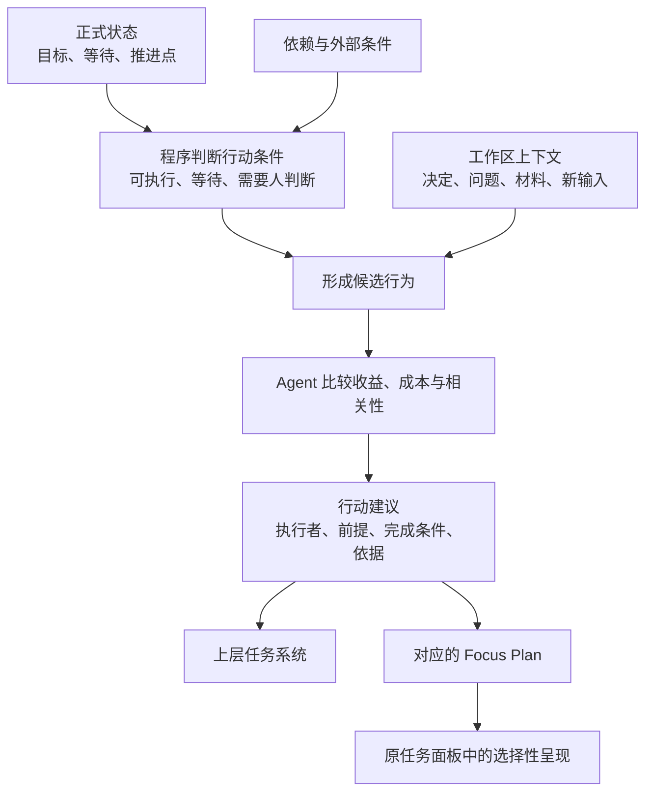

每个建议最好能明确：

| 要素 | 用户价值 |
|---|---|
| 具体做什么 | 可以立即开始 |
| 谁来做 | 区分你、agent 或外部参与者 |
| 前提条件 | 解释为什么现在可以做 |
| 完成条件 | 避免行动无限延伸 |
| 依据引用 | 可以回到项目原有内容判断 |
| 仍存在的未知或阻塞 | 防止建议表现得过度确定 |

这里可以直接复用问题聚焦模块。你点击一个建议，任务面板紧缩到相关目标、当前进展、阻塞和决定，无需另外生成一篇长篇理由。

跨任务关系也应单独设计。现有 Primary Ownership 回答“这个任务归谁”；`depends_on` 回答“这个行动依赖什么”。**不要用归属树表达依赖。** 第一阶段有真实场景时增加明确的依赖关系即可，不必先建立一个支持所有关系类型的通用图系统。

---

**技术选择上，我推荐渐进采用 Svelte，但先拆好模型和职责。**

当前工作视图的主要交互已经包含层级、排序、折叠和不同展示等级。接下来还会加入局部编辑、批注、高亮和动画，继续用大控制器手工创建 DOM，维护成本会明显上升。

我的选择是：**在工作区视图和审阅界面中逐步采用 Svelte，保留现有宿主接入和成熟材料编辑能力。** 不必一次重写任务中心和所有面板。

Svelte 的 keyed 列表能让界面节点围绕稳定来源 ID 更新；其动画和 transition 能辅助保留节点位置关系。需要注意，`animate` 主要处理已有项重排，添加、移除和紧缩仍需配合 transition 或专门的布局过渡，不能仅靠一个 `animate:flip` 完成全部体验。[Svelte keyed 列表](https://svelte.dev/docs/svelte/each)、[动画机制](https://svelte.dev/docs/svelte/animate)、[过渡机制](https://svelte.dev/docs/svelte/transition)

但框架只能解决渲染和组件组织的一部分问题。**稳定身份、来源映射、状态拆分和局部变更协议，才是这些交互能够可靠工作的基础。**

我倾向于采用下面这些技术选择：

| 领域 | 建议 | 原因与边界 |
|---|---|---|
| 运行形态 | 保留 TS、Node、本地服务和 Logseq 插件 | 已符合本地工作、文件访问和正式状态管理需求 |
| 数据库 | 保留 SQLite | 事务、作业、关联和协作记录均可在本地完成 |
| 应用组织 | 模块化单体，手动组装依赖 | 当前不需要分布式服务或复杂 DI 框架 |
| 核心模型 | 纯 TypeScript 模型与状态变换 | 可以独立验证，不依赖 DOM 和 SDK |
| 工作区界面 | 渐进采用 Svelte | 适合稳定节点、局部更新与动画交互 |
| 局部文本编辑 | 优先考虑 CodeMirror；简单范围也可先用普通编辑控件 | 保持 Markdown 原文，控制编辑器接入成本 |
| 完整富文本编辑 | 暂缓全面引入 ProseMirror | 先确认真正需要富文档模型和双向转换的场景 |
| 内容解析 | 使用 Markdown AST 思路，保留来源范围 | 支持段落、强调与来源定位；避免用正则承载全部语义 |
| agent 接入 | 先复用 HTTP 与 CLI，保持输出协议稳定 | 协议适配可以后加，业务能力不绑定某个 agent 产品 |
| 并发协作 | 先做版本检查、冲突保留与重新计算 | 当前主要是你与 agent，尚不需要完整 CRDT 体系 |
| 异步任务 | 复用本地持久化作业机制 | 需要的是重启恢复和过期判断，无需引入消息中间件 |
| Git | 可选的文件版本能力 | 不应成为建立普通工作区的前提 |

Markdown AST 可以用来识别段落、列表、强调和链接，但解析后的树不应成为一份新的权威正文。修改原文时，还要尽量保留未修改区域，避免重新序列化整份文档导致无关格式变化。[mdast 项目](https://github.com/syntax-tree/mdast)

Git 也有清晰边界：它记录文件版本，正式账本记录任务状态操作，来源版本用于判断当前内容是否变化。三者可以互相引用，但不应互相替代。代码项目通常适合启用 Git；大量二进制材料、普通资料整理工作区，则可以保持轻量。

你或 coding agent 对成果文件的日常编辑，也应该继续直接发生在文件夹中。来源适配器负责发现变化、维护索引。无需把每一次正常文件编辑都包进系统命令；系统代写笔记和正式状态时，再使用相应的受控入口。

---

**变化传播也需要整理：界面刷新与语义维护应该走不同的节奏。**

目前不同界面和协调器各自有观察或轮询机制。新增文件观察后，继续叠加会产生重复读取、重复维护和旧结果晚到的问题。

建议形成以下分工：

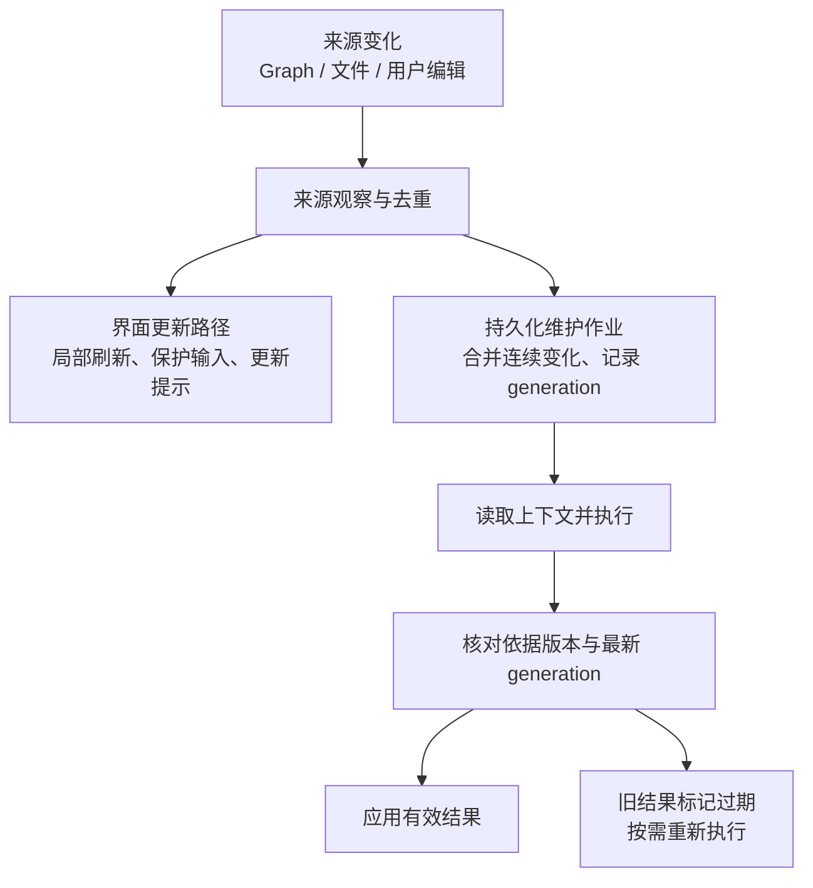

**用户输入应很快反映到界面，但不必每次触发一次完整的语义维护。** 同一阶段的连续输入可以合并；agent 结果返回时检查来源与作业代次，避免旧判断覆盖新现实。

这里不需要一个所有模块都订阅的万能事件总线。少量明确的来源变化通知，加上需要恢复的持久化作业，通常就足够。

---

**哪些设计应该保留，哪些值得收敛，哪些应该暂缓？**

这部分是我对“多余设计和冗余”的具体判断：

| 设计 | 判断 |
|---|---|
| 正式操作的权限、版本、证据、账本与恢复 | **保留。它们承担真实的可靠性职责。** |
| Graph 桥接 | 保留，Logseq SDK 所在位置决定了它的必要性 |
| 正式提交与异步投影分离 | 保留，并逐步收敛旧提交路径 |
| 插件和 Kernel 重复构造同一正式投影 | 收敛为一处权威构造 |
| 功能控制器启动共享运行时 | 拆开，运行时应有独立生命周期 |
| Kernel 承担上下文、阅读状态和多种编排 | 按职责逐步移出 |
| 一个投影协调器承担查询、来源 IO、选择和文案 | 拆为查询、上下文选择和展示组装 |
| 一个通用大 Store 被所有服务直接访问 | 收窄接口，共享底层事务 |
| 为所有用途构造一个通用大上下文包 | 避免，按问题和操作选择内容 |
| 在渲染层永久修补原始笔记混乱 | 避免，原文也应得到持续维护 |
| 保存所有 agent 聊天全文 | 暂缓，先做引用和选定片段 |
| 每个逻辑模块新建一个包 | 暂缓，先形成真实边界与复用 |
| 全系统事件溯源、通用工作流引擎、微服务、CRDT | 暂缓，当前需求不足以承担这些成本 |

另外，现有边界检查主要检查少数禁止依赖的字符串，而且只扫描 `.ts`，见[当前边界检查脚本](../../scripts/check-boundaries.mjs#L5)。它还不能有效阻止工作视图依赖任务控制器这样的内部耦合。

下一轮可以补充针对实际 import 的规则，覆盖 `.mjs` 和新增界面文件，检查功能模块间的禁止依赖与循环依赖。**架构约束最好能在检查中执行，而不仅存在于文档里。**

---

**实施顺序上，我建议先完成一条真实的工作闭环，再逐步扩大能力。**

第一阶段先处理现有结构中明确的耦合：提取插件共享运行时与身份索引，收敛正式投影构造，分开工作视图的来源版本和展示状态，并为 Store 和读模型建立较小的接口。这个阶段主要为后续能力提供稳定落点。

第二阶段建立一个最小 Workspace：一个笔记块、一个目录、一份已有 Markdown、一个交流引用，以及可由 agent 读取的上下文接口。让“建立工作 → 添加文件 → 继续交流 → 回到笔记”真正连通。

第三阶段优先打通**局部内容维护与变更审阅**：agent 修改一小段，你在原有位置看到变化，能够直接编辑或批注，意见又能回到 agent。这个阶段决定系统是否真的能持续维护有价值的记录。

第四阶段再引入问题聚焦和行动建议。此时已经有稳定来源、版本、内容质量与审阅机制，“紧缩页面”才能成为可信的判断工具。

验证也应围绕这些真实行为：来源变化后旧提案不能覆盖新内容；关闭任务面板后共享 Graph 能力仍按配置工作；审阅过程中输入和选区不会被刷新打断；Graph 离线和服务重启后正式状态与投影能恢复；聚焦视图保留必要约束和来源路径。性能优化则先测量，再决定是否需要索引、缓存或虚拟列表。当前读模型存在反复读取全量账本和归属集合的路径，值得观察，但本轮没有性能数据支持把它认定为实际瓶颈。

**我认为最值得先做出的产品闭环，是：你自由表达，agent 局部维护，你在熟悉的位置看清变化，再从这些内容中判断下一步。** 只要这个闭环成立，工作区、渲染、skills 和上层任务建议就会围绕同一个真实使用过程生长，架构也更容易保持清晰。

本轮做了源码和官方设计资料的分析，没有修改业务代码，也没有运行测试、性能基准或实际界面验证；上述重构方案属于设计建议。
