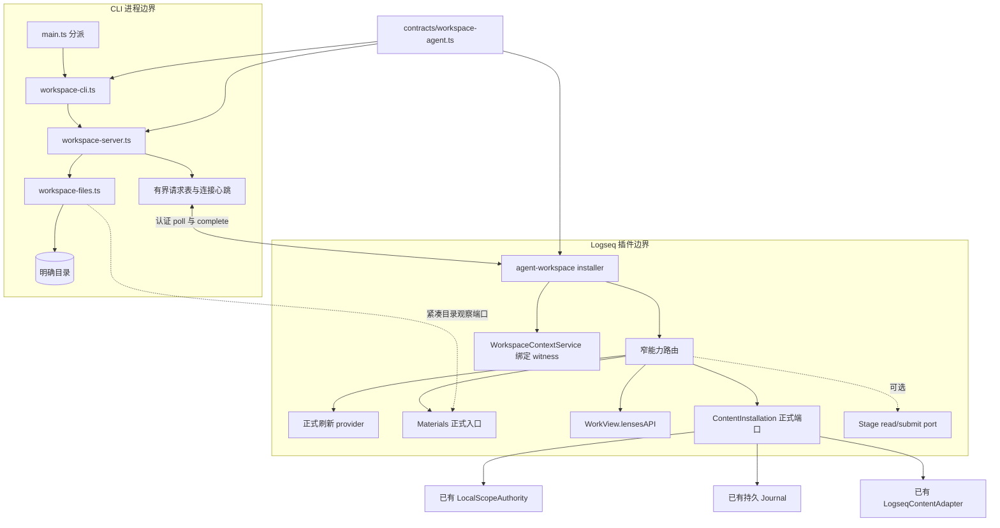
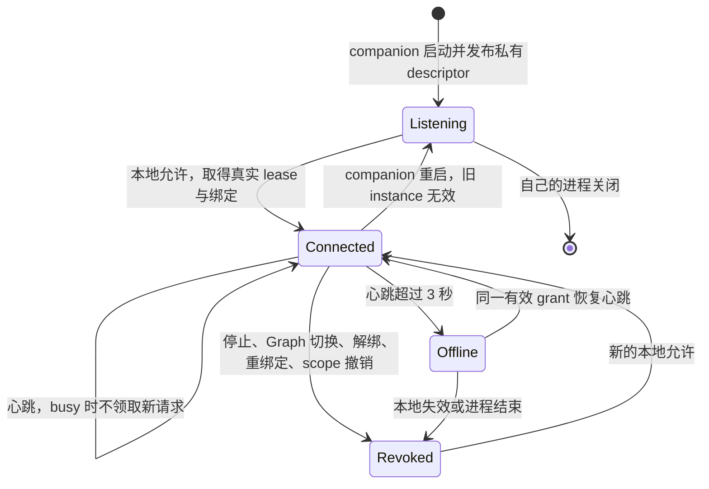
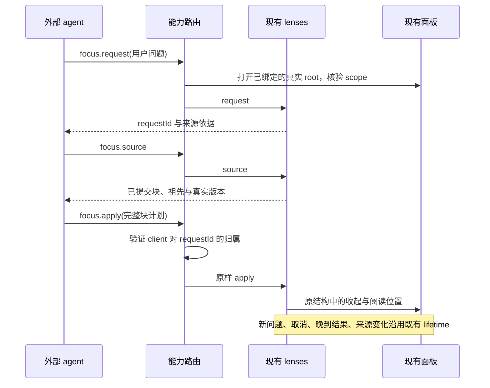

# Agent 工作区：模块架构

日期：2026-10-03。产品语义见 [设计](../design/agent-workspace-design.md)，实际命令、基线和证据见 [handoff](../implementation/agent-workspace-handoff.md)。

## 传输取舍与职责

既有外部 CLI 使用 Kernel descriptor 与正式 Graph broker，适合正式任务运行；其 service 与维护周期依赖 Kernel。自然工作若直接挤入该 broker，会把无正式任务模式带回 Kernel 生命周期。本分支复用 CLI 解析、错误和 JSON 输出习惯，增加同一 CLI 内的 `workspace` 子命令与一个按需 companion，使用现有 HTTP 风格的私有 descriptor。没有新 package、依赖、模型运行时、SQLite 或通用 RPC。

| 文件 | 拥有的职责 |
| --- | --- |
| `packages/contracts/src/workspace-agent.ts` | 纯闭合命令、输入边界、作用域、binding、descriptor、reply 类型；无 Node IO |
| CLI `workspace-cli.ts` | 当前目录识别、manifest 身份投影核验、私有 descriptor 校验、shell 参数与 JSON 输入输出 |
| CLI `workspace-server.ts` | loopback HTTP、认证、请求幂等、客户端隔离、连接心跳、文件操作串行、派生缓存及连接事实 |
| CLI `workspace-files.ts` | 有界事实观察、路径检查、受限 UTF-8 预览、明确会话引用存取；不拥有 MaterialRecord |
| feature `installer.ts` | 本地允许/停止、可信 content lease、正式绑定 lifetime、poll/dispose、材料区目录端口注入 |
| feature `router.ts` | 调用既有能力，固定外部 actor 与 scope，隔离问题与正文请求；不执行自己的正文算法 |

组合根仅新增 installer/dispose/namespace，并注入正式 workspace provider。host 不导入 feature，runtime 不导入 controller，work-view 不导入 task-center，插件没有 Node fs 或 SQLite，CLI 不直接访问 Stage controller。`content.apply` 不走 presentation apply 或 GraphEffect。

## 连接与协议

私有状态目录必须是本机绝对、真实目录且 POSIX 权限不向 group/other 开放；文件 descriptor 600，目录 700。CLI descriptor 有外部 token，插件 descriptor 另有 pluginToken。插件只读取私有路径，不把 descriptor 文本放入设置、WORKSPACE.md、manifest 或共享日志。令牌属于本机 capability，不代表用户作者身份。

HTTP 只监听 `127.0.0.1` 随机端口；校验 Host、instanceId、令牌、POST、闭合字段与大小。CLI 路由拒绝所有浏览器 Origin。插件路由只接受无 Origin 或 `null`、`lsp://logseq.io`、`http://logseq.local`，CORS 预检不执行命令，实际请求仍需插件令牌。没有 eval、任意 SDK RPC、任意路径写入或匿名写服务器。

路由为 `/call` 和插件专用 `/plugin/connect/revoke/poll/complete/call`。`plugin/call` 仅供已连接的本地目录 UI 使用，仍经过同一命令、范围和文件保护。连接定位文件为 `.task-workspace/agent-connection.json`，只含实例、连接及派生绑定；修改它不能通过实时插件的范围复核。

installer 同时保留 content 的真实 `ScopeLease` 和 WorkspaceContextService 的 `observeScope` 只读 witness。后者沿用正式 provider 的 epoch/revision，在同 scope 重新绑定时也失效；不复制工作身份或修订算法。每次能力调用及重要异步边界复核，两者任何一个失效都不再执行新请求。provider 的绑定解析还检查真实 Graph、目录、workspaceId。已 dispatch 的写入可能存在未知结果，后续以 Journal 查询，不作“撤销已抹去事实”的承诺。

首版一个 private state/process 同时拥有一个 grant。lock 使用 `wx`；已有 lock 会拒绝启动，没有自动抢占、删除旧锁或杀 PID。companion 正常退出只清理自身 descriptor 和 lock，保留缓存、事实和便携记录。硬杀后的 lock 需要操作者先核验所属进程再处理。

## 请求、缓存与结果

外部 envelope：schemaVersion、instanceId、connectionId、clientId、requestId、闭合 command/payload。scope/binding 由 broker 添加，caller 不能提供。命令 payload 上限 1 MiB，HTTP body 上限 20 MiB（供实际完成结果），broker 最多 512 项，整条命令的回执表也最多 512 项（包括会话和文件命令），Node 操作队列最多 128 项，逐一执行文件观察与会话写入。插件忙时继续心跳，不并发领取第二条 SDK 请求。

broker key 为 connection/client/request；摘要包含 command 与 payload。重复 ID 换内容被拒绝。送达后的超时是 `TRANSPORT_OUTCOME_UNKNOWN`，未送达是 `WORKSPACE_TIMEOUT`；已经送达不再领取第二次。晚到合法 complete 可以补齐未知请求，已完成回包不能被不同结果覆盖。broker 请求表是有界内存事实，正文持久幂等仍由既有 executor/Journal 拥有。

正文 ID 映射是 `external-` 加 SHA-256(`agent-workspace`,scope,clientId,caller patch ID)，不包含临时 instance/connection。重启重新允许后，同一 client 与 scope 可以查询原结果。不同客户端可使用同名 ID，不互相覆盖。clientId 是会话命名空间，拥有相同 token 的本机程序能选择它；这不是对不同 OS 用户的强身份隔离。

CallOrigin 保留既有 `local-capability`。私有 `connection-facts.jsonl` 记录已验证连接、client、request、command、payload 摘要与返回/错误事实；不存令牌或请求全文，不声称用户亲自操作。Stage/run metadata 仍只是线索，不授予正式权力。

`refresh` 通过正式 WorkspaceContextService，使用 `observed.primary` 和显式关联源，不靠焦点读取。只有正式 provider 确认 checked 才返回权威读取。镜像发布或刷新状态保存失败时返回 SOURCE_UNAVAILABLE，错误保留 provider 的问题说明，已有镜像与缓存继续作为 last-known 使用。`content read` 继续使用带专用 protection/target 的 content API。`source read` 只能命中该正式工作区实际读取的 Logseq 来源；材料按 ID 走材料能力。普通 `read` 在 CLI 端读取私有派生缓存，把外层和工作区阅读 freshness 都标为 last-known。

缓存按目录摘要定位，再核验完整绑定；不是权威版本。原文 contentVersion、真实先序和 parent/order/depth、structureVersion/sourceSetVersion 均由既有 provider/lenses/content 原算法提供，时间、DOM seq 和草稿不参与互通正文版本。

## 文件与会话边界

文件扫描只读授权目录；lstat/realpath 由 Node 提供，插件 Desktop 的有限 stat 不冒充 inode/realpath 证明。拒绝根目录的符号链接别名、每个访问路径的 symlink 组件、路径越界与元数据路径预览。预览使用 O_NOFOLLOW。材料写路径的既存组件也作 symlink 预检查；实际保存、转换、权限和历史仍由材料模块执行。对检查后的并发路径替换没有跨进程锁或 CAS 保证。

| 限制 | 实际值 |
| --- | --- |
| 遍历深度 | 从根往下 8 层；更深目录只列元信息并报告截断 |
| 遍历项 | 1000，包含经过的排除项 |
| 目录 | 128 |
| IO 并发 | 1 |
| 普通预览 | 262144 字节，UTF-8 严格解码 |
| ignore 配置 | 8192 字节，至多 64 个 basename |
| session refs | 至多 64，记录文件 128 KiB |
| entry 发现 | 当前目录向上最多 16 级 |

默认排除：`.task-workspace`、`.longdoc`、`.git`、`node_modules`、`dist`、`build`、`coverage`、`.cache`、`.parcel-cache`、`.vite`、`.DS_Store`。额外配置是 `.task-workspace/files-ignore-v1.json`：`{"schemaVersion":1,"exclude":["vendor"]}`，不是任意规则执行器或全文索引。不自动解释所有项目配置；此闭合文件是首版支持的明确排除配置。

FileObservation 可重建，mtime/size 只是观察事实。已登记材料从实际材料列表按准确路径对应 ID（包括正式 manifest 明确关联的材料），不按 hash 认领。完整扫描才报告上次观察项 missing；截断时缺席表示未知。一次结果最多还包括上次扫描的 missing 项，不将缺席历史无限累计。扫描和重复扫描不会登记材料或 Stage。

会话记录唯一位置：`.task-workspace/agent-sessions-v1-<workspaceId摘要>.json`，闭合 schemaVersion/identity/references。identity 消费正式工作区身份；记录只拥有显式引用，不改 manifest，不存聊天副本、权限、agent run 或 Stage。未知 schema/字段、无效链接和身份不吻合会拒绝；没有静默任意 JSON 兼容。

## Focus 与可选阶段端口

路由最多保存 64 个问题归属，卸载/撤销清空。它不复制 lenses 状态机；不把 renderer/composer 改为 Stage 审阅。可选 `OptionalStagePort.read/submit(input,binding)` 只传给正式 Stage provider；本分支没有 provider 时 unavailable。Stage schema 与持久校验属于阶段分支，用户认可不在外部命令表中。
