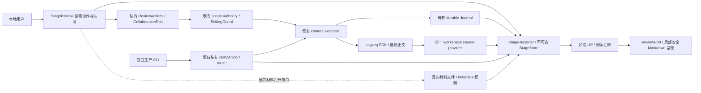
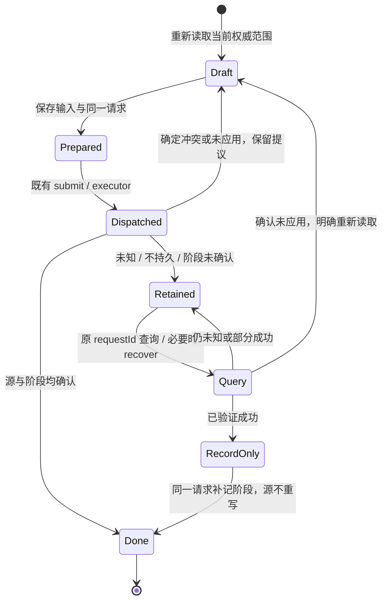

# 协作审阅的实际架构

2026-10-05。复用基线 `8529212296f0b65fb78ef7ccd2a2102474d9310a` 的写回、workspace transport、阶段存储和材料；没有新增正文数据库、阶段 schema 或模型进程。

## 数据与权限边界



实线表示实际调用或事实读取；虚线表示现有材料导航。Logseq 是正文权威，材料文件是材料正文权威，StageStore 只存不可变观察及可证明事实。图中的本地私有端口不能由外部 JSON 创建权限；CLI 无 begin / accept 权限。Kernel 不在本模块调用链中。

## 模块职责与窄端口

| 落点 | 责任 |
| --- | --- |
| `stage-workbench/review.ts` | 一个协作入口、当前／提交／历史模式、所见修订门禁、草稿及未知请求现场、现有 bookmark 往返 |
| `stage-workbench/collaboration-setup.ts` | 按需连接说明；文本／结构许可的明确本地按钮；仅观察连接状态，不启动或联络 agent |
| `stage-workbench/diff.ts` | 不可变快照比较、实际移动事实归责、当前 SDK 文字／位置晚改注释 |
| `work-view/review-port.ts` | 阅读消费的 ReviewChange / ReviewFrame；没有正文写入或阶段 controller |
| `work-view/review-renderer.ts` | 安全 Markdown、文本节点局部高亮、旧文及位置说明、历史的重新读取动作 |
| `work-view/text-diff.ts` | 有界的展示用 code-point Myers 差异；输出 UTF-16 显示范围，不用作写回定位 |
| installer / index | 最小私有端口组合、注册命令和释放；既有 namespace 保持权限边界 |

`ReviewActions` 沿用 authorize / read / submit / materials，并增加 result / recover。submit 返回既有 ApplyResult 加 `stageProblem`，以区分源写入事实与阶段保存失败。`CollaborationPort` 只提供 `status()`、`connect(rootUuid, organize)`、`stop()`，由组合根连接 agent installer 的私有 local 端口；不出现在 `window.taskCopilotWorkbench.agentWorkspace` 或 stages namespace 中。

组合顺序是安装 content / work / workspace / materials / stages / agent 后，调用：

```ts
stages.setCollaboration({
  status: agentWorkspace.api.status,
  connect: agentWorkspace.local.connect,
  stop: agentWorkspace.local.stop,
});
```

stages.dispose 清除端口、命令、连接说明计时器及 review；agent 的已有 dispose 释放 transport。Graph/root 变化继续走既有 scopeChanged、content lease、workspace epoch 与 runtime 生命周期。host、runtime、Kernel 和公共 panel 没有反向引入新 feature。

## 版本、展示与归责

Patch 仍使用已有 schemaVersion 1 文本／insert-child 与 2 move-block；StageEvent / RequestRecord 仍为版本 1。没有新操作或新权限布尔字段。旧记录与旧审阅草稿继续可读。

完整原文版本、structureVersion、sourceSetVersion 和幂等摘要仍由共享协议／executor 计算 UTF-8 SHA-256。普通呈现不改这些值，不写 id。当前 SDK rows 的后改注释 `version:null`，并通过 `submitted:{content,revisionId}` 保留当时结果；不把 layout seq、DOM 顺序或猜测 hash 包装成新快照。

比较始终按 sourceId / UUID。实际 move 只有 Journal durable、APPLIED_VERIFIED、move.verified 且对应源正文／结构读回一致时才有程序事实归责；propertiesBefore 中的 UUID 集合识别被移动子树。因邻块移动而自然改变位置的其他兄弟块仍标来源未知。后来人工文字／结构变化同样来源未知；不会把调用方自报的 agent 名字当作者证据。

高亮先按原规则 DOMPurify / safeMarkdownURI 渲染，再比较可见文本并包裹 Text 节点，保留链接、strong、code 与段落。差异计算上限为前后合计 60,000 UTF-16 单位、编辑距离 256；超限保留完整正文，提示展开旧文。只改格式／链接目标时也提示核对旧文。高亮范围没有写权限，也不反向解析 HTML 来生成补丁。

认可前检查当前已实际呈现的 revision；收起状态／尚未呈现的新版先打开审阅，不直接认可。当前来源比记录新时，先明确查看提交版本，认可只绑定该不可变 revision 及其完整 JSON SHA-256。原生／审阅草稿期间保持已展示 revision 和 frame；外部新记录不乘机换成所见版本。

## 草稿与不确定写入

草稿沿用插件 origin 的 localStorage：`workbench:stage-draft:<scope JSON>:<blockUuid>`。旧字段为 stageId / text / suggest / type；新增可选 request，含规范化 Patch、expectedRevision、correctionOf。输入和 request 在 dispatch 前一起保存；保存失败阻止写入，关闭时保存失败则保留编辑框。

Graph Journal 仍由 Logseq.FileStorage 管理，键为 `content-writeback-v1-<SHA256>-<sequence>`；StageStore 使用 `stage-workbench-v1-<scope SHA256>-<event UUID>` 及完整 prepared 副本。本轮 Desktop 验证其位于隔离 home 的 `.logseq/storages/task-copilot-vnext/`。descriptor 和完整正文日志不作为公开证据附件。



箭头均表示明确用户动作或当前请求的返回结果；不存在启动时自动回放。未知状态及记录暂不可发现时都禁止重新生成建议 UUID／新请求，文本仍可复制，关闭保留草稿。查询／恢复不会扩大权限。部分结果继续保留逐项事实，不全量回滚；确定未应用后才可明确读取新版本创建新请求。

SDK 无跨程序 CAS／全局事务保证。原生输入、版本检查、Graph/scope 失效和读回沿用既有 executor；UI 不强制保存或取消原生草稿。显示用差异和位置不是新写入前提。系统 IME / Undo 的物理操作证据范围见交接。
