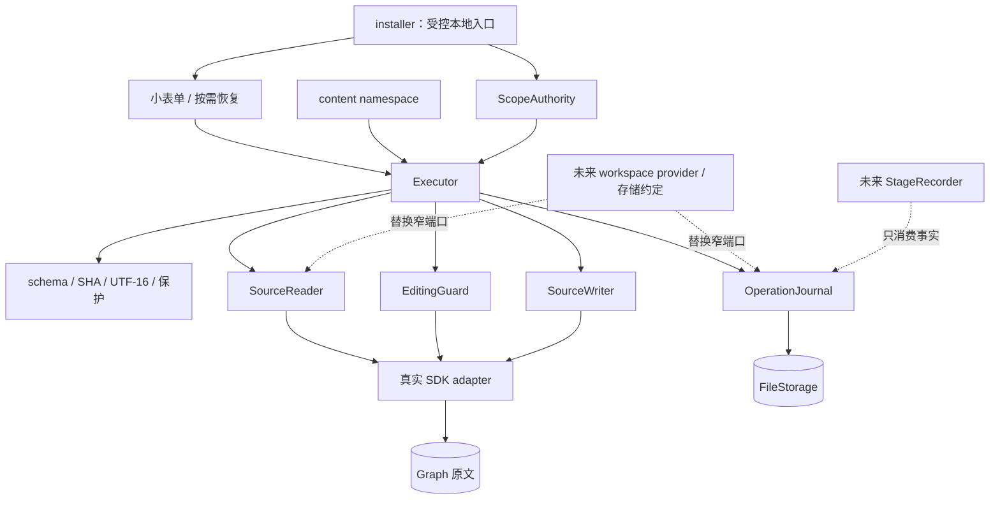
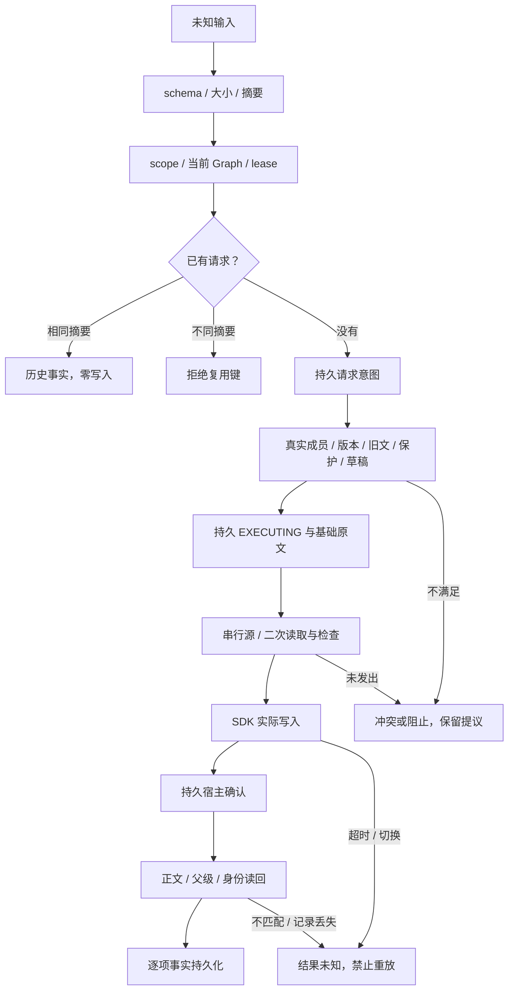
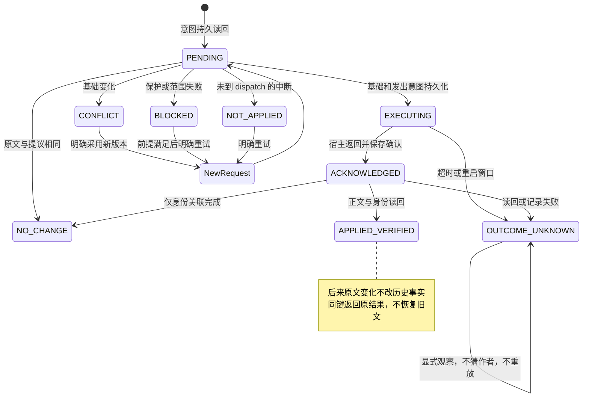

# 正文写回架构

实现位于 apps/logseq-plugin/src/features/content-writeback/。权威正文在宿主，权限由可信本地入口建立。补丁、来源文字、run/stage 元数据及缓存均非权限证明。行为见[设计](../design/content-writeback-design.md)，验证见[交接](../implementation/content-writeback-handoff.md)。

## 职责与端口

| 文件 | 职责 |
| --- | --- |
| protocol.ts | 消费者窄协议、请求与逐项事实 |
| validation.ts | 未知输入、封闭 schema、SHA-256、UTF-16、组合范围、稳定 UUID |
| protection.ts | 属性、正式第一行、managed、TODO 的纯保护规则 |
| authority.ts | 不公开的本地 lease、内部 epoch、撤销和具体 TODO 授权 |
| logseq-adapter.ts | 真实 SDK 子树/祖先/顺序、Graph/编辑保护、正文及身份写入 |
| journal.ts | 私有每请求追加修订、读回、独立查询和发现 |
| executor.ts | 持久意图、串行、二次前提检查、写入、读回、恢复与事实 |
| ui.ts | 受控小表单、持久输入、按需冲突处理 |
| installer.ts | 默认组合、可信用户命令、namespace、订阅及释放 |

SourceReader、ScopeAuthority、EditingGuard、SourceWriter、OperationJournal 均为消费者定义的窄端口。Executor 不接触 DOM、Kernel 事务或材料目录。Adapter 可读既有正式 identity/index；正式 runtime 已运行且 Graph 匹配时复用 withSelfWrite，tasksEnabled=false 时独立走受保护 SDK。未修改 runtime、graph-adapter、observer 或身份缓存生命周期。

SourceReader.read 返回完整、实际顺序的 Snapshot；内部 block 查询只返回正文、版本与真实父级，用于 UUID 占用检查和身份读回。它不发布虚构的局部 order/depth，也不通过诊断向调用方透露范围外正文。



实线为默认实现，虚线未接线。host 不反向导入 feature；runtime 不导入本 controller；插件不导入 SQLite。共享组合根 index.ts 仅增加 import、初始化、释放和 namespace。

## 来源与版本

SourceScope = {graphId,rootUuid}；BlockTarget = {kind:"logseq-block",graphId,blockUuid}。Snapshot 采用本轮共同形状，保留在本消费者端口内，没有新增另一份 workspace/source-protocol。

采用 crypto.subtle 的 SHA-256，输入 TextEncoder 的 UTF-8，输出小写 64 位十六进制：

- sourceId = JSON.stringify(["logseq",graphId,blockUuid])。
- contentVersion = 宿主完整原文 SHA-256；不 strip id、trim、转换换行或清 Markdown。优先 content，content 缺失时才采用 title。
- structureVersion = 真实先序数组中 [sourceId,parentUuid,order,depth] 元组数组的 JSON SHA-256。
- sourceSetVersion = 同一顺序的 [sourceId,availability,contentVersion] 元组数组的 JSON SHA-256。

order 为实际同父级顺序。子树根从实际父级 children 定位；页级根沿原生 left 链确认，不能把展示局部序号当源顺序。无法确认时拒绝。depth 在所选 scope 从 0 开始。capturedAt 不参与版本。

graphId 复用 graphIdentity，是宿主身份，未声明跨 Graph 搬迁稳定。内部 epoch 只保护晚到结果，不进入 JSON 或正文版本。缺失根为 null 正文/版本的 missing 行；不缓存伪装 available。Executor 拒绝未授权或路径改变的根。

## Operation schema 1

```ts
type Patch = {
  schemaVersion: 1;
  requestId: string;
  scope: { graphId: string; rootUuid: string };
  operations: readonly Operation[];
  metadata?: { runId?: string | null; stageId?: string | null } | null;
};
type Base = {
  operationId: string;
  target: { kind: "logseq-block"; graphId: string; blockUuid: string };
  expectedContentVersion: string;
  expectedParentUuid: string | null;
};
type Operation = Base & (
  | { type: "replace-text" | "insert-text";
      range: { start: number; end: number };
      expectedText: string; text: string;
      context?: { before: string; after: string } | null }
  | { type: "insert-child"; content: string; childUuid?: string | null }
);
```

仅接受普通对象及所列字段。校验 schema、UUID、版本、整数边界、UTF-16 字符、对象形状和真实来源。最多 64 项、单块 262144 UTF-16 单元、规范化请求 1 MiB UTF-8、读取 2000 块/64 层；请求/操作 ID 各 128 字符、graphId 2048 字符、邻近文本各 256 字符。未知来源、actor、权限布尔值、脚本及材料路径不接受。

replace-text 的旧文长度等于范围长度，且真实对应位置完全相同。insert-text 为零长度范围、空旧文及非空新文；零长度 replace-text 采用同样位置检查。完整基础版本仍须匹配；非空原文插入至少有一侧实际邻近内容。代理对中间位置拒绝。

规范化按固定字段顺序重建对象，可选字段补 null，操作数组顺序保留。摘要是规范化 Patch JSON 的 SHA-256。幂等键绑定 scope 和 requestId；同键不同摘要报 IDEMPOTENCY_KEY_REUSED。8 位 stableHash 不用于冲突或幂等。

未给 childUuid 时，从 SHA256(JSON.stringify(["content-child",scope,requestId,operationId])) 前 128 位构造确定 UUID，并固定格式/version 位。它用于幂等，不宣称通用 UUID v5 命名算法。已存在 UUID 不覆盖，历史事实从 Journal 返回。仅末尾追加，父级版本及子集写前再次确认。

## 真实本地 API

插件 ready 后的 window.taskCopilotWorkbench.content：

| API | 行为 |
| --- | --- |
| scope() | 同步查询当前 scope 或 null；不授权 |
| read(scope?) | 已授权 Snapshot，附 targets 保护范围 |
| apply(patch) | 执行或返回原请求事实，来源记 local-capability |
| result(requestId) | 当前 scope 的持久结果，零写入 |
| pending() | 独立记录发现；成功 retry 只用于发现过滤，不改原事实 |
| conflict(requestId,operationId) | 原事实、原操作和当前真实目标 |
| recover(requestId) | 显式观察旧意图，不应用、不猜作者 |
| retry({previousRequestId,patch}) | 新请求/版本；限确定未应用的原目标、原操作类型 |
| resolve({requestId,operationId,resolution}) | keep-current / copied，保存处理选择并保留原事实 |
| resumeIdentity({requestId,operationId}) | 重验已创建子块或 scope 身份，只保存身份 |
| revoke() | 撤销范围并关闭此模块面板 |

查询、恢复、重试须重新建立可信范围，不由 JSON 根自动授权。异步 API 拒绝非法输入；执行按项返回。外部 session 无远程调用此 window 的通道，没有匿名 HTTP、文件镜像写通道或模型入口。

```js
// 用户先在真实块菜单选择“允许维护此处正文”；在插件上下文调用。
const content = window.taskCopilotWorkbench.content;
const source = await content.read();
const block = source.blocks.find(b => b.content?.includes("需要修订的片段"));
const old = "需要修订的片段", start = block.content.indexOf(old);
const patch = {
  schemaVersion: 1, requestId: crypto.randomUUID(), scope: source.scope,
  operations: [{ operationId: "replace-1", type: "replace-text", target: block.target,
    expectedContentVersion: block.contentVersion, expectedParentUuid: block.parentUuid,
    range: { start, end: start + old.length }, expectedText: old, text: "修订后的片段" }]
};
const actual = await content.apply(patch);
const history = await content.result(patch.requestId);
```

调用方保留 requestId 和真实逐项结果，不凭总状态冒充批次完成。TODO 修改另须具体可信用户动作，此示例没有该权限。

## 补丁校验与执行



每个异步边界检查内部 lease；Journal 失败后停止后续写入。请求队列键为 [graphId,rootUuid,requestId]，源队列键为 [graphId,blockUuid]；不同 scope 的同源也串行。新增父块与 UUID 按确定顺序取得锁；同块不相交范围一次组合，跨块按首次出现的组顺序执行。

SDK 没有 CAS 或全局锁，检查与宿主处理间仍可能有外部写入；读回不匹配记未知，不用旧整块回滚。宿主请求不可取消。默认 15 秒超时后源保留 inFlight fence 至真实 Promise 结束；同 JS 上下文释放/重新安装也保留该 fence。跨进程和完整重启没有这份内存锁，依赖持久意图与稳定 UUID；未知请求不自动重放。

保护来自实际宿主、祖先和已核验 index。所有属性行保持原字节、正式第一行冻结、managed 子树禁写。离线时不把缓存负结论当普通权限：未确认的正式直接单行叶子及分支/后代拒绝；正式根确切描述、普通多行叶子和普通新增仍可用。TODO 的连续说明/后代默认保护；具体授权仅由本地用户动作建立。原生编辑和组合态检查不结束草稿。

## 私有 Journal 与恢复

默认 logseq.FileStorage。当前 Desktop 实际目录为 Logseq home 的 .logseq/storages/task-copilot-vnext/，不是公开 Graph 正文、SQLite、descriptor 或材料 catalog。workspace 可后续提供 OperationJournal 存储约定。

每请求键：content-writeback-v1-<SHA256(JSON.stringify([graphId,rootUuid,requestId]))>-<六位sequence>。修订保存完整记录并读回，不使用共享可覆盖 catalog。已存在不同内容的同修订不可覆盖；最新修订损坏时失败关闭，不退回旧意图重写。新目录 allKeys 返回 null 视为空目录，真实 IO 错误保持失败。SDK 没有提供 fsync/硬断电保证；中断窗口按未知处理。

单条 Journal JSON 的读取与写入均限 16,777,216 个 UTF-16 单元。组合基础原文使意图超出上限时，执行在 dispatch 前停止，已有的小记录仍可查询和恢复；不保存一条自己随后无法读取的修订。

Record 保存 schema、规范化 Patch/摘要、intentKind、可信调用来源、retryOf、时间、事实和用户处理选择。intentKind 区分 content-patch 与 scope-identity；身份关联不是公开属性写补丁。事实含基础/提议/实际/当前原文和完整版本、目标/父级/新 UUID、发出/确认/核验时间、身份前后版本、contentVerified/expectationObserved 和失败理由。没有 StageRecorder。

| 状态 | 含义 |
| --- | --- |
| NOT_APPLIED | 未发出，或 PENDING 意图显式恢复为未执行 |
| APPLIED_VERIFIED | 宿主确认，正文、父级及所需身份读回吻合 |
| CONFLICT / BLOCKED | 未发出；版本、范围、保护或草稿条件不满足 |
| OUTCOME_UNKNOWN | 发出后无法确认，或崩溃窗口不能证明结果 |
| NO_CHANGE | 自然正文无变化；可有独立的已核验身份事实 |

总状态为 complete / partial / not-applied / outcome-unknown。partial 可含已核验正文但身份未完成，也可为一块成功一块失败；仍须看各项。durable:false 表示当前回包事实未可靠落入 Journal，不把真实成功简化为可重写的失败。



观察到提议只设置 expectationObserved，不提升为自己当时完成。宿主 ACK 也不等于完整读回。retry 只接受确定未应用项；未知和已核验项不能重写。子块正文已核验但 id 中断时，resumeIdentity 重验父级、正文、保护，只保存身份；scope 身份同样不重放正文。

身份使用已有 helper，其内部 canonical 检查不替代本模块完整版本。独立读回只接受一个精确 id:: UUID 原生行在合法行界插入，其他原字节须一致。DB Graph 不追加文本 id。程序调用来源为 local-capability，不推断 agent/user 作者；真实本地用户动作才保存命令来源。run/stage 只是调用方提供的关联元数据，未认证其来源。

## 后续接线

workspace-context 合入时统一 SourceReader 形状与 OperationJournal 位置。view-lenses 消费真实来源更新，不由本 executor 修改其草稿或展示状态。StageRecorder 消费事实和未知状态，不参与授权。

外部 agent transport 要在可信接入层选择范围与来源；actor/capability JSON 不能补齐权限。未来材料 adapter 只能消费现有 MaterialService 身份、版本化 save 和 editing 权限，本轮未实现此 adapter。通用数据库、CRDT、事件总线、阶段、认可及整体 rollback 均未实现。
