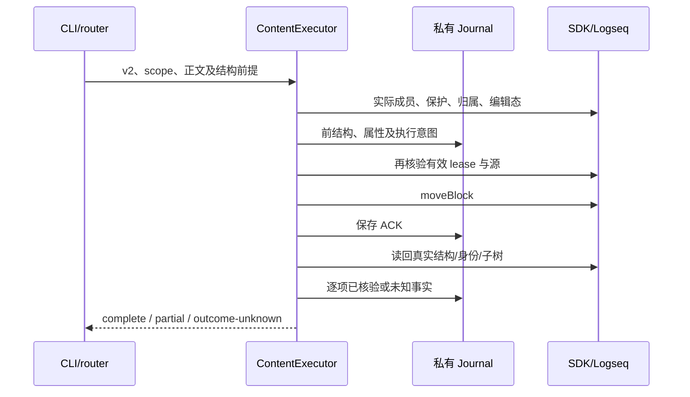
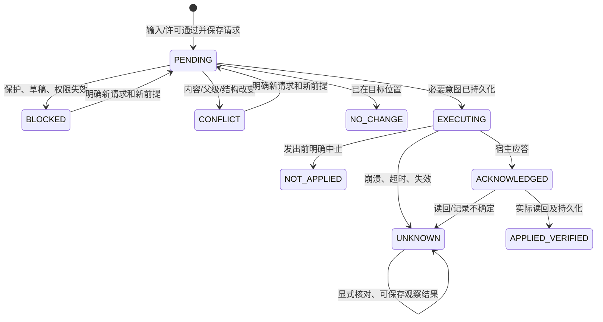

# 正文结构写回架构

2026-10-04。扩展既有 content-writeback，复用 `workspace/source-protocol.ts`、私有 workspace transport 与 StageRecorder；没有新增 source provider、Kernel schema、事件总线或材料存储。

## 职责与依赖

| 实际落点 | 职责 |
| --- | --- |
| content-writeback/protocol、validation | v1/v2 封闭操作、未知输入校验及规范化摘要 |
| authority | 私有 lease 与独立结构许可；外部输入没有 grant |
| structure | 实际子树、归属、拓扑预期与 SDK 读回；durable 移动事实验证 |
| executor、journal | 原有队列、意图先落盘、调用 fencing、逐项事实、显式恢复 |
| logseq-adapter | 实际 SDK 读取、正式/managed/祖先保护、EditingGuard、moveBlock |
| content/agent installer、router、CLI | 最小命令注册、释放、能力协商和既有生产路由 |
| stage recorder/store/diff/review | 旧事实兼容、不可变结构事实、当前观测归因与历史呈现 |
| work-view/review-port、renderer | 消费旧新位置描述，保留原块定位入口 |

host 不导入 feature；runtime 未导入 feature controller。本分支没有修改 index、plugin-runtime、source-change-observer、graph-adapter 或正式 registry。

## Operation schema 与兼容

Patch 的 schemaVersion 1 原语义与规范化字段顺序不变；schemaVersion 2 增加 move-block，同时接受旧三种操作。v1 中 move-block 返回 `MOVE_REQUIRES_SCHEMA_2`；未知操作、未知字段、错误大小/UUID/摘要仍拒绝。新能力在本地 `content.capabilities()` 与生产 `workspace status` 的 `contentProtocol` 中可协商：`patchSchemas:[1,2]`、操作集合、当前可信 `structureAuthorized`。无 SDK moveBlock 时不广告该操作，直接申请也拒绝。

```ts
{
  schemaVersion: 2,
  requestId: "organize-001",
  scope: {graphId, rootUuid},
  metadata: {runId: null, stageId: null},
  operations: [{
    type: "move-block", operationId: "move-1",
    target: {kind: "logseq-block", graphId, blockUuid: sourceUuid},
    expectedContentVersion: source.contentVersion,
    expectedParentUuid: source.parentUuid,
    destination: {kind: "logseq-block", graphId, blockUuid: destinationUuid},
    expectedDestinationVersion: destination.contentVersion,
    expectedDestinationParentUuid: destination.parentUuid,
    position: "before", // after / first-child
    expectedStructureVersion: snapshot.structureVersion
  }]
}
```

所有前提来自可信 scope 的新读取。结构 SHA 绑定真实父级、邻接及成员集合，不套用旧绝对 order 到新来源。旧/新父级的相关保护和归属再次读取；普通父块文字变化本身不是新增的正文版本绑定，但正式/managed/属性改变会改变检查结果。

算法沿用共享协议：contentVersion 为完整原文 UTF-8 SHA-256 小写 hex64；structureVersion 为真实先序 `[sourceId,parentUuid,order,depth]` 数组 JSON 的 UTF-8 SHA-256；sourceSetVersion 为同顺序 `[sourceId,availability,contentVersion]` 的 SHA-256。sourceId 为 `JSON.stringify(["logseq",graphId,uuid])`；capturedAt 不参与摘要。

请求摘要为 `SHA256(UTF8(JSON.stringify(parsePatch(input))))`，包含结构操作的所有含义。scope/requestId 的 journal 键同样使用完整 SHA-256。生产 router 继续将调用者请求 ID 按 scope、clientId、原请求 ID SHA-256 命名空间化；结果/恢复使用同一 client 与原请求 ID。runId/stageId 是关联信息，不证明作者或授权。

## 执行及保存事实

纯 structure 模块构造预期父级与邻接，保持所有 UUID、完整子树和真实先序。executor 检查 lease、SDK 能力、实际保护、EditingGuard，保存前结构及子树属性/归属，再次读源并核验后调用：

```ts
logseq.Editor.moveBlock(sourceUuid, destinationUuid, {
  before: position === "before",
  children: position === "first-child"
});
```

没有删块重建、Graph 文件写入或 focus。启用正式 runtime 且有效时继续使用已有 withSelfWrite；tasksEnabled=false 直接使用受保护 SDK，不启动正式系统。SDK 定义见 [官方 Editor API](https://logseq.github.io/plugins/interfaces/IEditorProxy.html)；真实行为的本轮证据另见 handoff。

同一 JS 运行环境中的 content 写入按 Graph 串行，并锁定 request/root/source/destination/新身份。scope 身份落盘与身份恢复也进入 Graph 队列。超时的已发 SDK 调用仍保留 in-flight fence，直到实际 Promise 结束。它不是 Logseq 与其他程序共享的全局锁，SDK 没有 CAS/跨程序事务。

读回必须符合预期全范围结构；移动子树每个 UUID 的正文、属性及对象归属都核验。仅容许宿主新增一个匹配本 UUID 的 native id 属性行/属性，其余原文字节与属性必须保留；实际前后内容版本照实保存，不宣称永远不变。新 MoveFact 的实际字段：

```ts
{
  before: SourceSnapshot, after: SourceSnapshot | null,
  propertiesBefore: Record<UUID, Record<string, unknown>>,
  ownersBefore: Record<UUID, UUID | null>,
  propertiesAfter: Record<UUID, Record<string, unknown>> | null,
  verified: boolean
}
```

owner 核验要求移动后相同；属性与内容不符或结构变化时记录结果未知。事实另含既有 request/operation、基础/真实内容版本、实际时间、失败理由、可信本地命令或实际作者未知的程序来源。



箭头表示真实调用。检查后外部仍可能并发修改；此时核验失败不会以旧整块或旧树补齐。

## Journal、重启与阶段

沿用 append-only `RequestRecord.schemaVersion=1` 和 `content-writeback-v1-<SHA256>-<sequence6>`；内部 patch 可以是 v2。FileStorage 为真实 durable 默认：Desktop 位于隔离/实际 profile 对应的 `.logseq/storages/task-copilot-vnext/`，不是工作镜像的公开日志。每请求独立版本，没有共享可覆盖 catalog。单记录 16 Mi 字符、源块/深度/文本限制继续沿用；必要意图过大或写盘失败即停止宿主写入。

加载时校验旧记录摘要、scope、状态与新 MoveFact 的共同快照版本/拓扑/属性。最新记录损坏不回落旧意图重写。旧 v1 文本、insert-child、身份事实与 StageEvent schema1 保持可读；旧客户端遇到 v2 明确不支持，没有静默执行为文本。



UNKNOWN 对应 OUTCOME_UNKNOWN；恢复只读最新源，观察到目标位置仍不证明作者/当时结果。相同键同 payload 返回历史，历史成功后人工再次移动不会恢复旧位置。新版本纠正是新写入；unknown 无盲目重试。批次是逐项事实，不承诺回滚。

StageRecorder 保存实际前后来源，纯移动也创建 revision；Store 复验新事实。同 UUID 的父级/order/depth 变化显示结构差异。程序归因必须来自 durable、verified 的匹配事实；当前位置也必须匹配事实的后位置。当前 SDK rows 可用于提示再次移动，不能被造为新的 SourceSnapshot/内容版本或阶段事实。历史模式只读取不可变 revision。

后续 01 可将统一 provider 的来源事实接到阅读上下文，替换当前 SDK 行的只读位置观察。02 的引用同步调用版本化文本协议；跟随证据、materialId、别名与历史策略仍归 materials。没有新增 workspace/stage adapter 框架或权限捷径。
