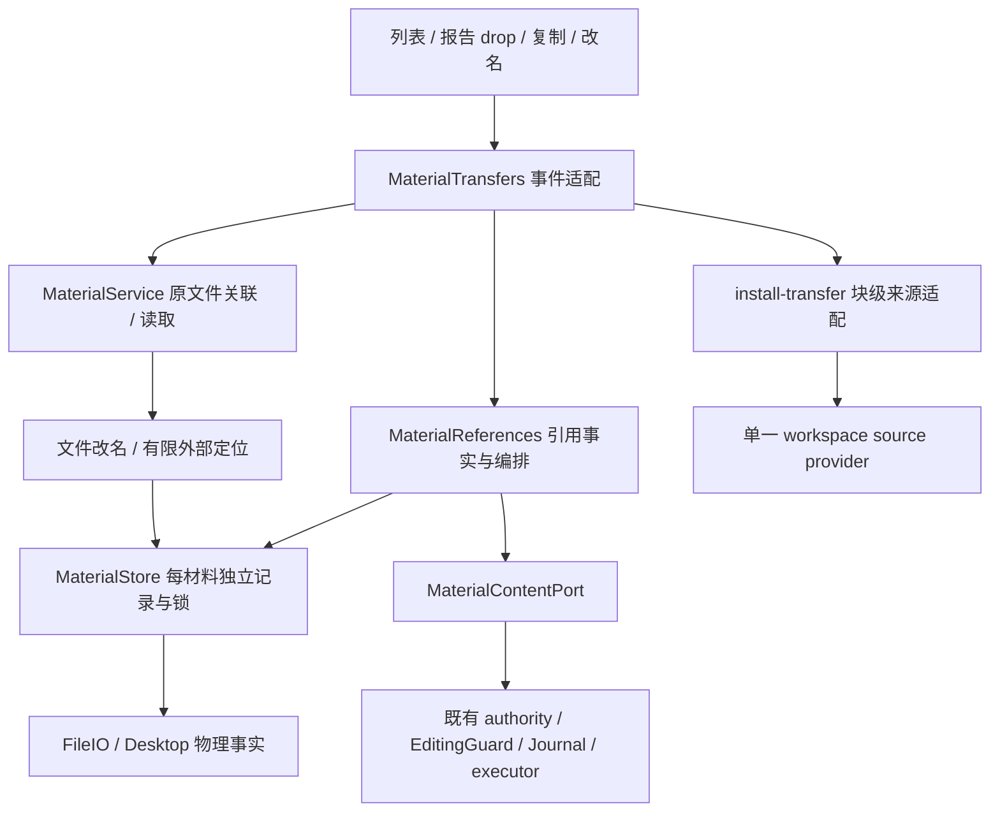
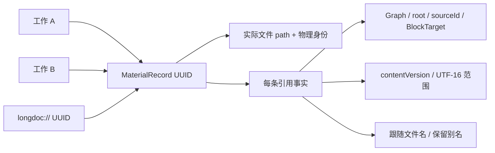
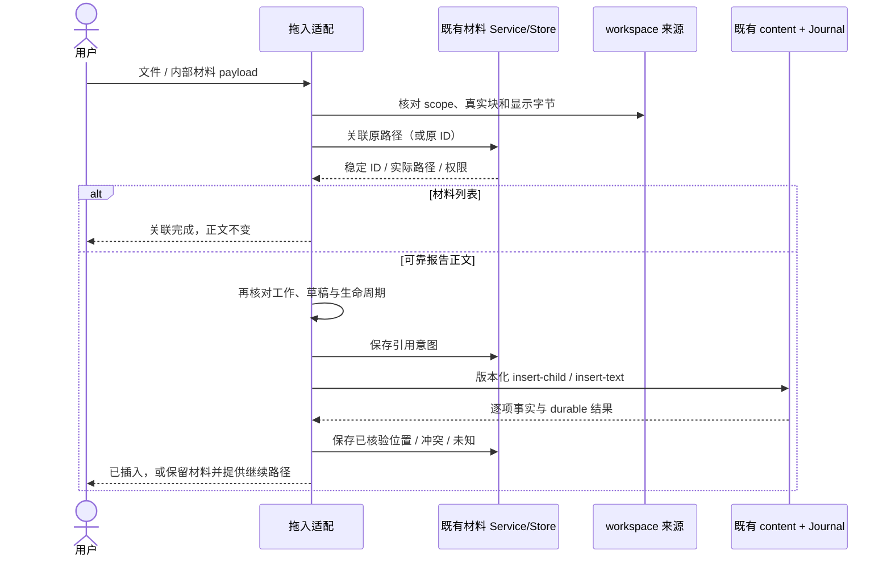
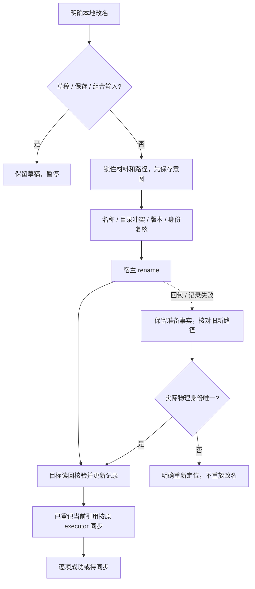
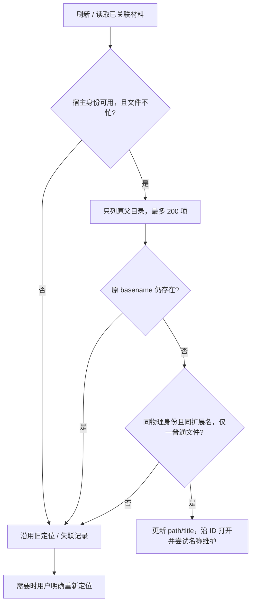

# 材料拖入、引用事实与改名架构

2026-10-04。[产品设计](../design/materials-drop-rename-design.md)；[交接与实测](../implementation/materials-drop-rename-handoff.md)。本页描述基于 `e666e7b` 的实际代码，不定义另一个 Workspace、正文 executor 或材料 catalog。

## 边界与权威



材料真实文件是正文权威；`.longdoc/<id>.json` 是材料身份、位置、用途、编辑边界、关联及改名／引用事实权威。Graph 是引用正文权威。目录登记和定位提示仍是已有可校验索引；无新的共享 catalog。`sourceContent` 只是有界且版本绑定的范围证据，不能提交为另一份可编辑正文。

源码职责：

| 路径（插件 src 下） | 实际职责 |
| --- | --- |
| `features/materials/drop.ts` | 独立内部 MIME、scope 验证、实际 Electron File 路径核验、消费端口 |
| `transfer-ui.ts` | 事件快照、列表意图、连续路径、真实 Clipboard API、就近失败处理和释放 |
| `install-transfer.ts` | main 现有报告块映射、当前工作复核、现有 ContentInstallation 窄接线 |
| `references.ts` | 生成、版本范围登记、按 Journal 恢复、按证据更新名称；不实现写入 executor |
| `file-operations.ts`、`names.ts` | basename 校验、逐项意图／恢复、有限物理身份查找 |
| `service.ts`、`store.ts` | 复用原读取／关联／锁／独立记录／文件保护，增加必要事实 |
| `source.ts` | 既有收纳与 SDK 插入读回后记录生成证据；普通粘贴仍由原生完成 |
| `host/file-io.ts`、`desktop-files.ts` | 可选 `identity`，无 feature 反向依赖 |

`index.ts` 仅导入并调用 `installMaterialTransfers`，位于既有 workspace/content/work 安装之后。没有改 work-view renderer、共同 panel、正文协议、Kernel、Agent transport 或布局 apply 白名单。

## 身份、引用与文件



保留材料 schemaVersion 2 与旧格式兼容。可选新增字段：

- `fileIdentity`：宿主观察的 `[dev,ino,birthtimeMs]` JSON 字符串；全项可靠才提供，不能用名称、大小、mtime 或 hash 合成。旧记录可为空。
- `rename`：`requestId/from/to/identity/version/size/status/problem`。状态为准备、文件已核验改名、完成或不确定。Markdown 版本校验 bytes hash；普通二进制只核验已声明的系统身份和大小，不假称全文读回。
- `references[]`：`key/scope/sourceId/target/parentUuid/mode/text/start/end/contentVersion/status`，以及真实 `patch/operationId/insertionParent/problem`。可选 `sourceContent` 最多 12000 UTF-16 单位，只用于核验已登记范围的有限位移。

加载时校验 scope、目标、来源身份、范围、版本形状、数组上限、同目录改名和状态；未来 schema 仍拒绝。旧引用无生成证据不更新其字面。旧文件不批量补 metadata 或改名；明确读取与原文件关联可记录未来物理定位事实。

## 列表与报告拖入



当前组合器只给出 `position: {kind:"child"}`；core 能消费版本绑定 UTF-16 `offset`，但此能力未在 main UI 中虚报为精确鼠标字位。实际报告目标包含 `SourceScope/sourceId/BlockTarget/contentVersion/parentUuid/structureVersion`，显示字节必须等于 provider 已提交字节。合成标题与坐标不生成身份。来源写入和冲突恢复全部使用既有 executor。

内部 MIME 为 `application/x-task-copilot-material`，仅接受版本、UUID 和当前 scope，不接受 actor／authorized 字段。重复原路径关联按 Graph+路径协调同一请求，并复用已有记录。重复已核验报告 drop 查询已登记 child，沿用同一材料和引用；未知请求查询原 Journal，不盲重放。导入与正文请求不是一笔事务，部分结果可以分别核验。

## 复制、粘贴与生成证据

`navigator.clipboard.writeText` 成功后才说已复制；失败提供只读可选择 textarea。当前工作复制生成的一次性证据保留两分钟。原生 paste 观察器不 `preventDefault`，只观察精确对应这次复制的链接；待结束原生编辑后从只读 provider 读回预期内容、唯一范围和版本，才登记。未验证、重复链接、composition 或过期行为保持普通未管理链接。

收纳当时原文、Markdown 正文、编辑历史与引用事实职责分开。既有显式收纳与 SDK 子块插入读回成功时记录跟随证据；自动收纳继续服从原设置与阈值。没有让 agent 自行生成命名／转换／恢复规则。

## 实际文件改名与外部定位



名称只允许 basename，保持原扩展名。改名前两次校验目录冲突，并在派发前比较已读版本、大小与物理身份；不主动覆盖观察到的其他文件。case-only 回包丢失使用 exact 目录名及物理身份区别大小写不敏感的路径别名。文件已确认后，尚待同步的跨范围引用不冻结后续改名。



不递归目录、不猜同内容文件、不识别任意跨目录移动；多个硬链接视为歧义。已知原路径被替换文件时仍沿既有显式路径读取，不据此声称识别到外部 rename。旧身份不会由内容相同升级为自动定位证据。

## 引用更新与并发限制

只处理生成证据范围。标签人工修改转保留别名；有界已知正文的一次外部范围改动可调整登记偏移，复杂变动保守保留文本。一个块内多条已登记引用组合成同一既有版本化 patch，executor 保留属性、TODO 和正式字段。Graph/root、成员、版本、原生输入、dispose 保护仍成立；范围之外显示待同步，历史保持原版。

Web Locks／进程内协调只约束本插件同源协作。普通 stat、read、rename 不能提供跨进程 CAS、无覆盖 rename 或文件+JSON+Graph 的全局事务：即使派发前校验，另一进程仍可能在校验与普通 rename 之间创建同名目标，二进制同大小外部改写也无法用当前接口证明全文未变。本轮不作更强承诺；出现不可证明结果保留逐项事实供恢复。需要宿主 no-replace 原语的严格并发保证留给后续适配。

## 真实调用与接入

已有公开入口保持：

```js
// Logseq 插件上下文，绝对路径由用户明确提供。
const api = window.taskCopilotWorkbench;
const scope = api.read();
const linked = await api.materials.associate({
  path: "/absolute/work/research.md", sourceUuid: scope.root,
});
const material = await api.materials.read(linked.material.id);
await api.openMaterial(material.id); // 原读取 / 返回工作路径
// Agent 文件保存仍需要权限、原文和基础版本。
await api.materials.save({id: material.id,
  expectedVersion: material.version, expectedContent: material.content,
  next: "明确获准修改的正文"});
```

`associate` 沿用既有补关联子块行为；**列表 drop** 使用 Service 的原文件登记能力，因此不会调用这段有正文插入语义的公开适配。此例不声称 readonly 参考资料能保存，也不声称新增了外部 HTTP 服务。

真实内部组合：

```ts
installMaterialTransfers(materials, content, workspace.source, work);
// MaterialTransferPort.resolve 返回可靠版本目标；valid 必须复核当前工作。
// MaterialReferences(service, port.content).insert(id, target, requestId)
// MaterialReferences(service, port.content).sync(id)
// 本地明确 UI 才调用 service.renameLocal(id, basename, requestId)。
```

01 可替换消费端口的 `resolve/valid/navigate`，提供精确来源片段／原生明确意图；02 保留材料导入与引用编排；03 的现有 authority/Journal 是唯一正文写入边界。baseline 对 MiniProject 结构含糊的保护仍可能阻止引用名称同步，后续接入需在正文模块确认真实来源保护，不由材料模块扩大授权。阶段系统只消费真实版本结果，不改其历史或认可。
