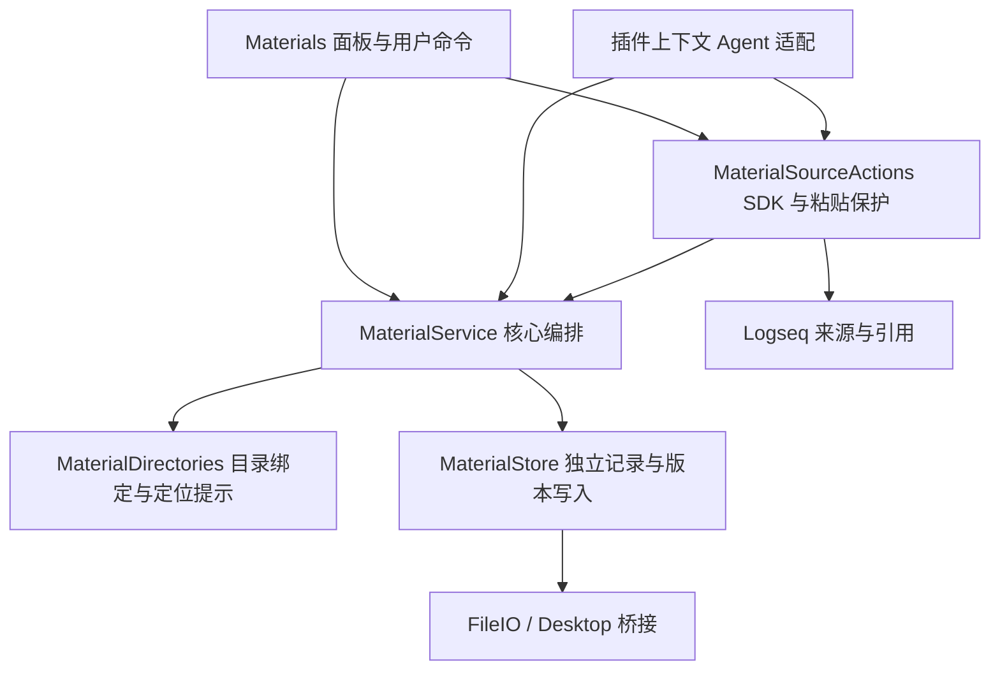
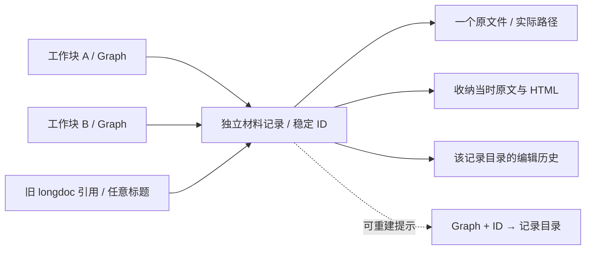
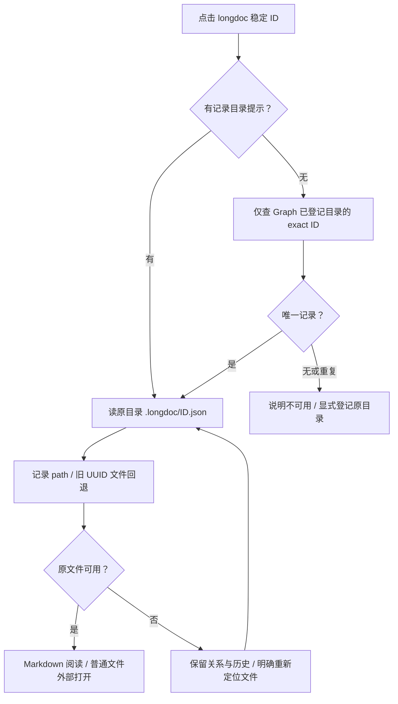
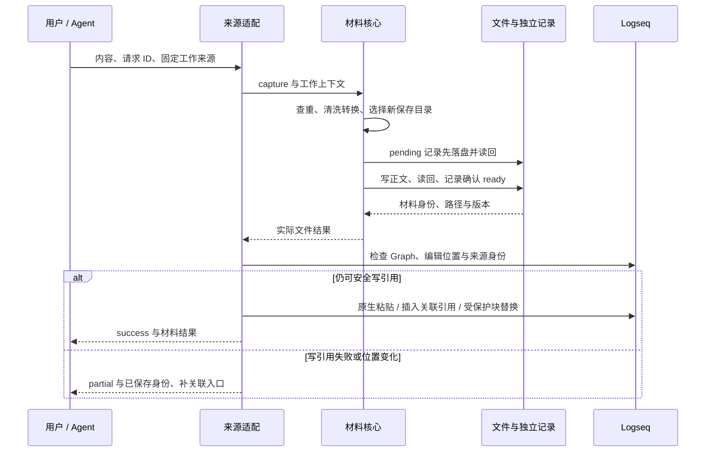
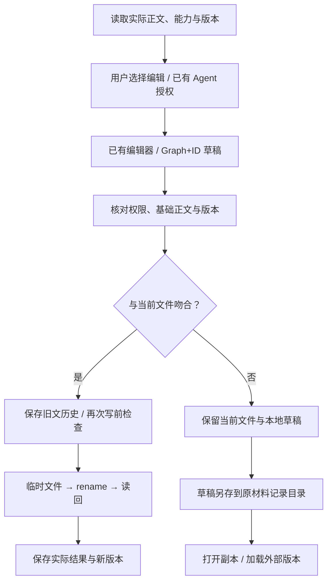

# 材料模块架构与调用契约

2026-10-02。本页描述已经实现的材料能力，产品路径见[产品设计](../design/materials-module-design.md)。总工作区设计中的镜像、阶段、聚焦和正式授权接口仍为其他模块的目标，不是本页已经提供的 API。

## 模块与依赖



- `features/materials/service.ts`：人和 Agent 共用的读取、收纳、关联、保存与实际结果，不依赖 DOM、Logseq SDK 或 Kernel。转换函数与文件能力由边界注入。
- `store.ts`：独立材料记录、正文路径、权限检查、元数据修改、收纳断点、版本比较、历史、临时文件与读回。
- `workspace/material-context.ts`：最小 `MaterialWorkContext`、目录绑定、已知目录登记和可重建定位提示；不管理任务生命周期或正式层级。
- `source.ts`：Logseq SDK、稳定来源身份、引用插入、块收纳、原生粘贴及 Graph/epoch 检查。
- `controller.ts`：阅读、编辑器复用、草稿与冲突、面板和 UI 协调。`conversion.ts` 清洗 HTML 与转换 Markdown，`ui.ts` 提供只读渲染和局部输入，`links.ts` 集中材料身份解析与安全协议规则，供材料与工作视图渲染复用。
- `host/file-io.ts`、`host/desktop-files.ts`：文件能力；host 不反向依赖 feature。现有共享 Runtime、只读身份查询、工作视图和面板串行协调均复用，不引入 task-center 控制器依赖。

没有新包、HTTP 服务、端口、事件总线、通用 Workspace 框架或正式 Kernel 操作。展示 `apply` 的白名单不包含材料文件写入。

## 数据权威与身份



`.longdoc/<id>.json` 是材料身份、定位、来源、用途、编辑边界及关联的权威；Markdown 或原普通文件是正文的唯一权威。没有共享可覆盖 catalog，也不让索引或 Logseq 链接重写记录。

记录保持旧字段 `id/title/createdAt/kind/path/graph/sourceUuid/original/originalHTML/recoveredFrom`。新增字段为 `schemaVersion: 2`、`role`、`editing: {user, agent}`、`associations: [{graph,sourceUuid}]`、`requestKey/requestFingerprint`、`creation`、临时 `pendingBody`，以及显式整块收纳的 `restoreMode: "block"`。记录读取会拒绝未来 schema 和非法角色、权限、关联形状，不按文件名推断授权。

`id` 不依赖标题和文件名。普通新材料随机生成 UUID；带幂等请求的收纳用 Graph 与请求标识的 SHA-256 派生 UUID 形状的稳定 ID。hash 在这里仅生成请求身份，不用于认领同内容或同名文件。标题修改只修改记录。新 capture 在记录中保存可读文件路径，重名追加 ID 前 8 位；旧 capture 无 `path` 时按旧 `<id>.md` 读取。外部文件保留原路径与名称。

`sourceUuid/graph` 保留第一来源与原文恢复位置；`associations` 允许多个工作共同引用同一正文。没有新数组的旧记录从第一来源派生关联。新关系不覆盖收纳原文，也不转移正式任务语义。

| 持久数据 | 职责与限制 |
| --- | --- |
| `.longdoc/<id>.json` | 独立权威记录；pending 只在收纳未确认期间保留转换正文 |
| `.longdoc/history/<id>.<time>.<uuid>.md` | 每次真正修改前的文件快照，不是阶段认可 |
| `workbench:draft:<graph>:<id>` | 本地未保存正文及基础内容；切换和冲突恢复，非第二正文权威 |
| `workbench:pending:*` | 粘贴位置、原文、Graph、固定工作上下文及已保存 ID；兼容旧恢复记录 |
| `workbench:material-binding:[graph,uuid]` | 显式单源目录绑定，可解除；无完整 Workspace 对象 |
| `workbench:material-root:[graph,root]` | 每目录一键登记，只记录可查目录，不保存可覆盖材料列表 |
| `workbench:material-locator:[graph,id]` | 派生记录目录提示；失效时显式重登记，缺失可 exact ID 重建 |

目录登记与绑定在插件本地存储，清缓存会失去它们。独立记录仍在文件目录，可通过“登记材料目录”重建定位。它们不是完整跨机器迁移格式；备份或交接应包含 `.longdoc`，新环境显式登记路径。

## 新材料保存与旧材料定位

`MaterialWorkContext` 只有 `{graph, sourceUuid, directory, organization}`。无工作区提供方时由本轮轻量绑定提供；源祖先就近查找最多 32 层。`organization` 为 `flat` 或 `project`，不表示正式工作种类或生命周期。当前用户界面识别明确项目标记，默认普通任务平铺；适配器可直接传入组织方式。

`captureDirectory` 检查显式工作根可用，选择既有材料/工作记录/成果目录，缺少结构时返回用途默认路径，由首次实际收纳创建。无绑定才使用全局配置目录。已绑定但不可用时拒绝回退。关联原文件的记录存于工作根或全局根；正文不搬迁，也不为关联创建模板目录。



已有材料定位不会使用当前工作的新收纳目录。失效提示不会自动改指另一个副本；没有提示时已知目录中的重复 ID 拒绝自动选择。列表来自独立记录，可重建，不全盘搜索、不做同名或内容 hash 认领。目录记录不可读时其他可读目录继续列出，并报告部分目录失败。

路径检查限定当前 macOS 绝对路径、拒绝 `.`/`..` 和 Graph 内路径；未解决符号链接的真实路径防护，用户配置不应通过符号链接指向 Graph。Desktop `stat` 的缺文件空值或空对象通过父目录列表确认，不能将已存在但不可读的条目当作缺文件。

## 核心与真实调用入口

插件 iframe 中提供 `window.taskCopilotWorkbench.materials`：

| 方法 | 输入 | 输出 |
| --- | --- | --- |
| `list({sourceUuid?, query?})` | 不传工作块时查当前 Graph 已登记材料 | 含 status、materials 数组及 problems 的结果 |
| `read(id)` | 稳定 ID | `MaterialView` |
| `capture({requestKey,text,html?,title?,role?,sourceUuid?})` | 请求身份与原内容；sourceUuid 指定工作 | 保存结果及引用插入实际结果 |
| `associate({id?,path?,sourceUuid})` | 已有材料或原文件及工作来源 | 原文件登记/多任务关联及引用结果 |
| `save({id,expectedVersion,expectedContent,next})` | 读到的版本、预期旧文和提议正文 | success 或 conflict；权限/IO 无法执行时拒绝 Promise |

读取结果包含 `id/title/kind/role/path/recordRoot/sourceUuid/associations/reference/content/version/availability/writeState/capabilities/problem?`。Markdown 正文版本为 SHA-256，其他文件明确 `content/version: null`、`read: "external"`，不假称提取内容或有二进制版本。权限是分别可查的 user/agent 编辑能力。`success/partial/conflict` 表达实际结果，冲突带当前正文和提议正文；该程序结果可供未来阶段模块消费，但不创建阶段。

```js
// 仅在启用材料模块的插件上下文中调用；从工作读取拿到真实 sourceUuid。
const workbench = window.taskCopilotWorkbench;
const materials = workbench.materials;
const sourceUuid = workbench.read()?.root;
if (!sourceUuid) throw new Error("请先从实际工作块打开工作视图");
const saved = await materials.capture({
  requestKey: "discussion-2026-10-02-01", // 重试沿用；新内容使用新标识
  sourceUuid,
  text: "# 讨论稿\n\n完整内容",
  html: "", // 有 HTML 时由模块清洗、转换
});
if (saved.status === "partial") console.log(saved.problem, saved.material.reference);
const view = await materials.read(saved.material.id);
if (view.content === null || !view.version || view.writeState !== "ready" || !view.capabilities.edit.agent) {
  throw new Error(view.problem || "材料未完成保存或未授权编辑");
}
const write = await materials.save({
  id: view.id,
  expectedVersion: view.version,
  expectedContent: view.content,
  next: view.content + "\n\n补充说明",
});
if (write.status === "conflict") console.log(write.current, write.proposed);
// 用户切到另一工作视图后，再运行下面的关联操作；正文不复制。
const anotherSourceUuid = workbench.read()?.root;
if (anotherSourceUuid && anotherSourceUuid !== sourceUuid) {
  await materials.associate({id: view.id, sourceUuid: anotherSourceUuid});
}
```

Agent `capture` 默认角色为 output，可修改；UI 用户收纳默认 input，不自动取得 Agent 权限。Agent 保存不能请求提升权限；用户“编辑原文件”仅授予用户编辑，“允许 agent 编辑此工作稿”授予单个完整文件。此处是可信插件上下文的能力约定，不是隔离恶意插件脚本的安全沙箱，未提供外部进程连接、token 或 HTTP 接入。正式 Agent 任务操作继续使用现有 Kernel/CLI。

兼容入口 `openMaterial(id)` 与 `readMaterials(content)` 保留。后者解析旧 longdoc 引用并返回材料内容、实际定位、能力、版本或不可用结果。正文能力与布局 `apply` 完全分开。

## 收纳、引用与部分失败



请求 fingerprint 覆盖原文、HTML、标题、用途及固定工作目标。相同请求和 payload 返回原记录；修改内容或目标必须换请求标识。模块内同一请求协调与目录创建串行避免重复创建；记录中的请求身份支持重载后恢复。引用重试检查来源子块中的同一 ID，已有引用不重复追加。Logseq 与文件不是同一个事务；中断窗口内不能保证任意跨进程恰好一次引用插入。

pending 记录在正文写前保存原文和转换正文，正文或 ready 记录失败时不丢失输入。继续保存检查现有正文：相同则完成确认，不存在才创建，不同则保留并报告冲突，不默认覆盖外部修改。原文恢复按稳定 ID 匹配唯一引用，标题变化不影响恢复。整块收纳恢复完整旧块并保留稳定来源 ID；有新增正文或修改其他属性时拒绝自动替换。恢复的是收纳前语义，不是后来文件的当前内容。

## 编辑、冲突与恢复



UI 编辑器复用，切换材料清理旧文撤销栈；同文轮询不重建输入节点。中文组合态暂停自动保存，近期输入期间不应用外部版本，焦点与选区继续由现有编辑器保护。外部正文连续两次稳定后才刷新；脏草稿/组合态有变化时转冲突。保存失败的 Promise 结束后清理 saving 状态，后续操作可继续。

保存用捕获的 store、path 和 Graph 完成，不因当前工作切换改变目标。草稿按 Graph/ID 保存基础正文，Graph 或 epoch 变化会阻止晚到结果更新新界面。重新定位保存现有草稿，随后与新路径文件核对基础版本，不能把旧草稿静默覆盖到新原件。

## 并发保证与限制

同源 Web Locks 协调创建、单记录修改及文件保存；没有 Web Locks 时使用本 JS 模块按 key 的 Promise 队列，失败不会毒化队列。保存同时取得记录与文件锁，防止本模块元数据定位变更穿过写前检查。基础正文与 SHA-256 比较、历史快照、第二次写前核对、临时文件、rename 与读回检测普通外部修改。

这些不是跨进程全局原子比较交换，也不是多个文件、Graph 与元数据的原子事务。外部编辑器可能在最后核对与 rename 之间写入；本模块能缩小和检测竞争，不能声称消除所有竞争。独立浏览器 origin、任意外部程序、崩溃/断电以及权限故障需显式保留失败和恢复结果。不是 CRDT、全文索引或自动合并平台。

## 兼容与未来边界

旧文件不批量改名、移动或补元数据；旧独立记录、longdoc 链接、恢复记录、草稿键和 history 继续使用。旧引用无目录信息时从配置过/登记过的已知目录按 exact ID 定位。更改全局设置不会忘记此前登记的目录。记录读取不会改写旧格式；仅用户实际授权、关联、改标题、重新定位等明确操作更新对应记录。

完整工作区以后可提供同一窄上下文，替代本地绑定；阶段模块可消费当前文件版本和修改结果；外部 Agent 的传输和更细范围授权需另行设计。材料模块不实现镜像、阶段认可、正式任务授权、主动建议或全目录移动识别。

验证按[整合验证](../integration/VALIDATION.md)区分自动化、实际 Desktop 和尚未验证条件；测试 fixture 使用隔离 Graph、临时目录与合成文件。
