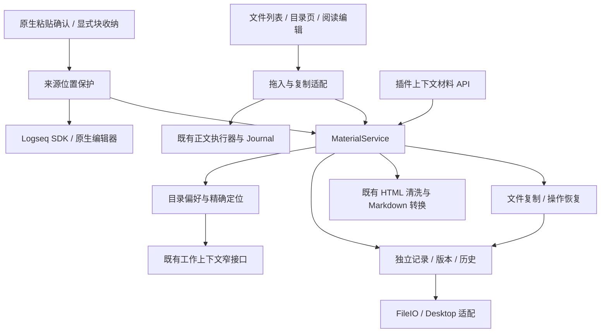
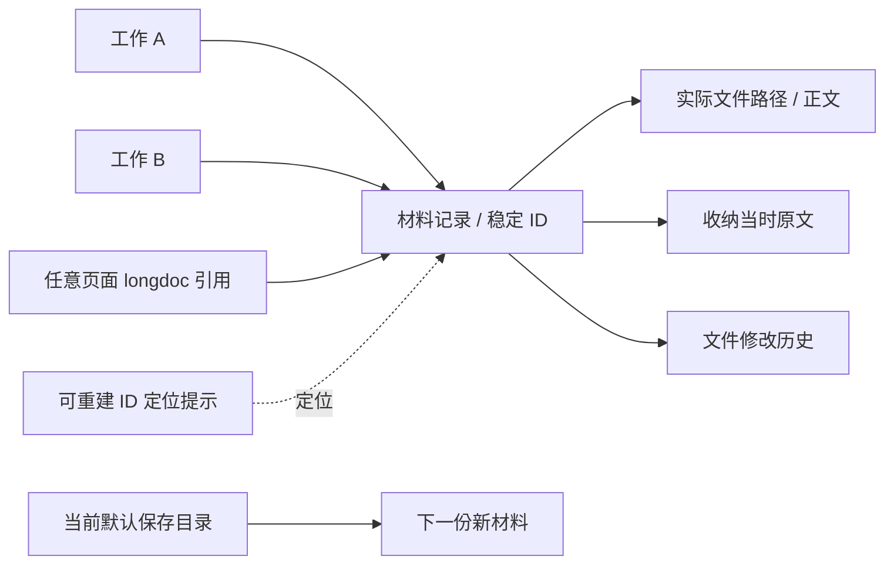
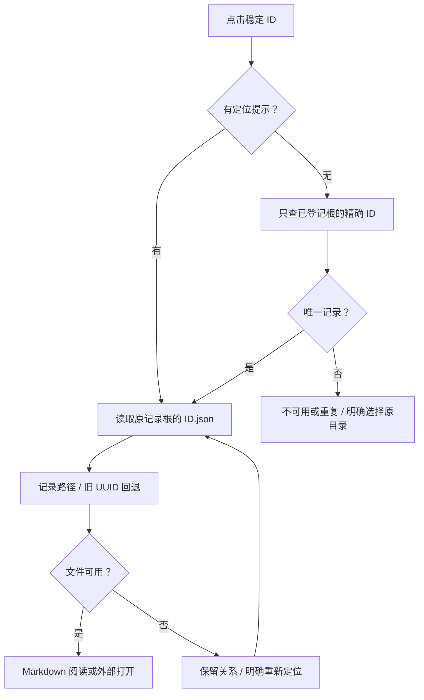
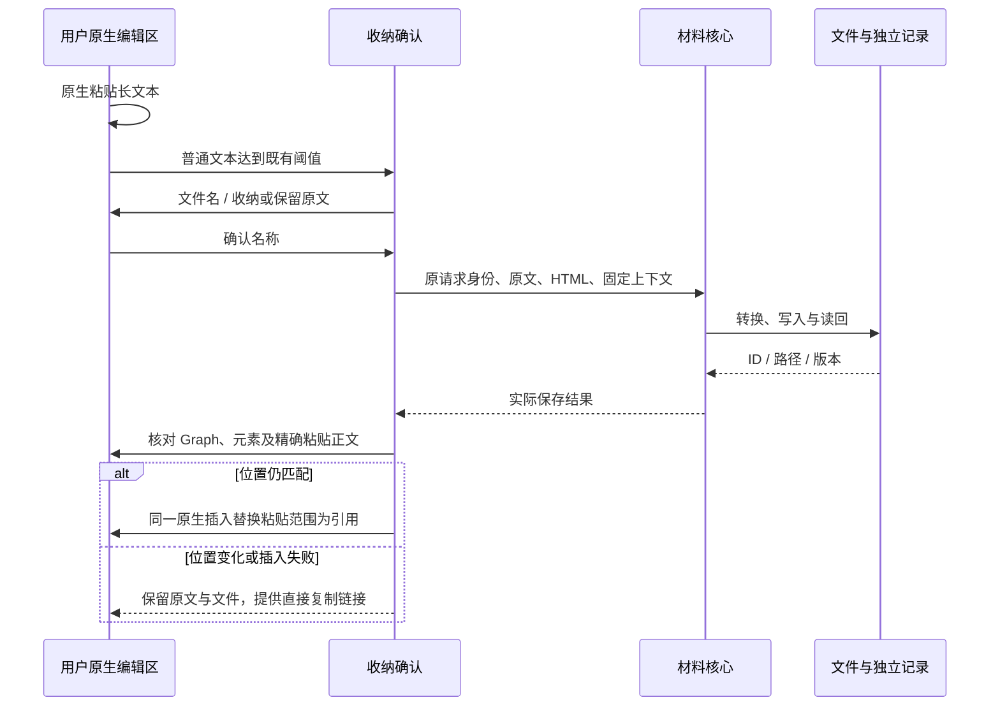
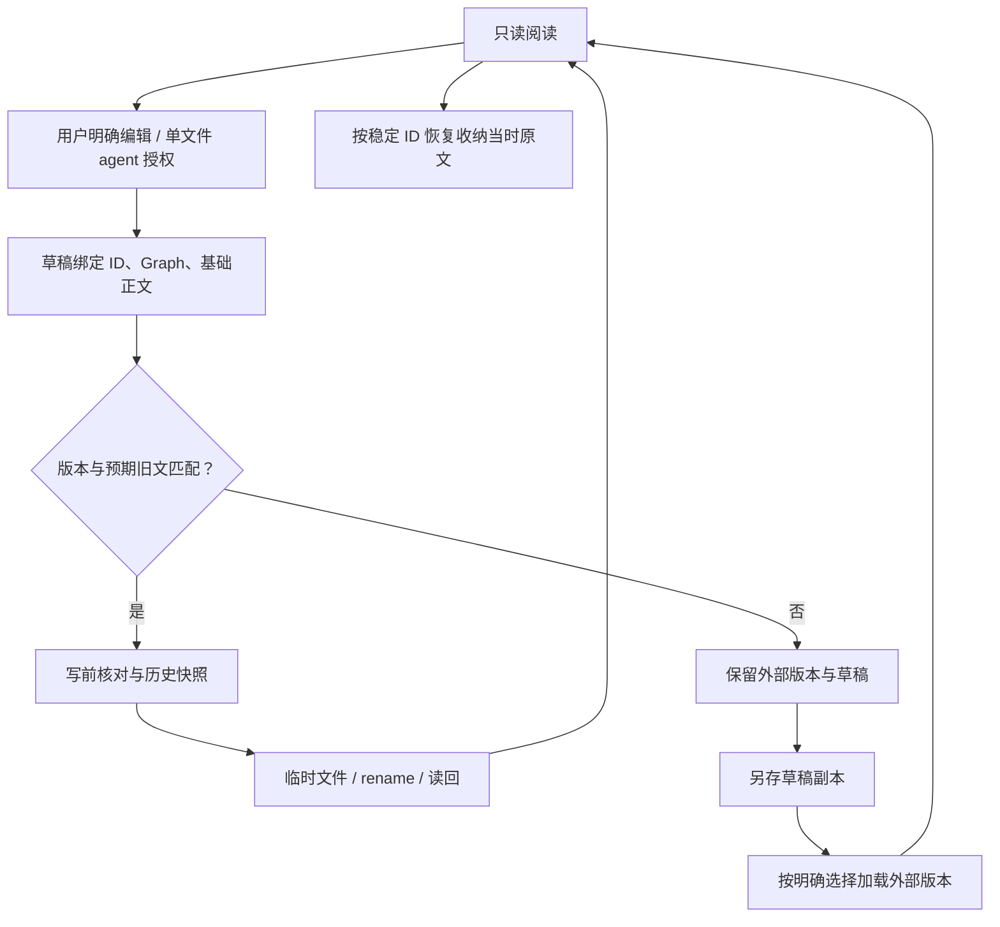

# 材料模块架构

2026-10-05。对应[当前产品设计](../design/materials-module-design.md)。沿用现有材料记录、文件保存、正文 Journal、工作区提供方和共享面板，不新建 Kernel 操作、服务端口或 Workspace 框架。

## 边界与依赖



`service.ts`、`store.ts`、`imports.ts` 和目录选择核心不依赖 DOM 或 Logseq SDK。`controller.ts` 保留阅读、编辑、草稿及面板协调；`folder-ui.ts` 管目录交互；`paste-ui.ts` 管一次收纳决定；`transfer-ui.ts` 管事件与反馈。`desktop-files.ts`、`clipboard.ts` 把桌面 IO 和浏览器能力限定在宿主适配层。

材料文件写入与展示 `apply` 分开。原文插入通过 `MaterialSourceActions` 或已有可信落点／正文 executor，文件写入没有加入布局白名单。工作区主 manifest 和正式 agent 授权仍由原模块负责。

## 身份与数据权威



`.longdoc/<id>.json` 是身份、路径、来源、用途、编辑边界和多工作关联的权威；实际文件是正文权威。没有共享可覆盖 catalog。标题与 basename 可变，ID 不依赖它们。旧 capture 没有 path 时继续读取 `<id>.md`。

保留 schemaVersion 2 与旧字段，新增可选 `imported: {sourcePath: string|null, requestKey}`，区分导入副本与原文件关联；`kind` 仍兼容 capture/reference。程序视图的 `origin` 为 capture/reference/import。用途 role 和 user/agent 编辑能力独立于来源，导入不自动授权。

`sourceUuid` 保留实际来源块；`ownerUuid` 是上下文中的材料目录归属。新材料关联同时包含来源和归属工作，便于工作列表呈现。多工作关联只添加关系，不复制正文。旧记录没有关联数组时从旧 graph/sourceUuid 派生。

| 数据 | 职责 |
| --- | --- |
| 实际 Markdown／普通文件 | 唯一正文；二进制没有伪造文本或版本 |
| `.longdoc/<id>.json` | 独立权威材料记录、权限、原文、关联及恢复事实 |
| `.longdoc/history/` | 修改前正文快照，非阶段认可 |
| `.longdoc/imports/<操作摘要>.json` | 单次复制目标、临时文件、阶段和身份；恢复后由材料记录回答读取 |
| `workbench:draft:<graph>:<id>` | 未保存输入与基础内容，非第二正文权威 |
| `workbench:pending:*` | 收纳原文、位置、固定 Graph／上下文及已保存 ID |
| `workbench:material-binding:*` | 既有 Workspace 主绑定；材料偏好不覆盖它 |
| `workbench:material-folders:*` | 工作的材料目录集合、默认位置及兼容主目录的显示选择 |
| `workbench:material-root:*` | 已知记录根登记，不存材料正文或共享目录列表 |
| `workbench:material-locator:*` | ID 或单次导入操作的派生精确目录提示 |

材料目录偏好只有一个本地写入权威。清理本地存储后需重新选择已有目录；选择动作注册根并可读取其中独立记录。备份应包含 `.longdoc`。路径提示、导入操作记录、正文历史和阶段快照不互相覆盖。

## 保存目的地与跨目录定位

`MaterialWorkContext` 为 `{graph, sourceUuid, ownerUuid?, directory, organization}`。UI 接入现有 `WorkView.materialContext`，随后做最多 32 层来源查找。没有 provider 时使用明确来源和已有目录绑定，不读取任务中心私有状态。

保存首先使用工作默认材料目录。未绑定时复用已配置或宿主准备的 Graph 专属根，实际保存时创建 `workspaces/<编码的工作身份>`；无工作归属才保存到全局根。原接口的项目用途子目录能力继续可用；材料页添加的目录使用 flat，直接作为默认位置。明确目录不可读时失败，不回退。



已有材料读取从不查询当前默认目的地。已知提示失联时保留原位置；缺提示时唯一精确 ID 可重建。有限外部改名只接受同父目录中唯一可靠物理身份，不以名称、大小或内容 hash 认领文件；跨目录移动继续明确重定位。

添加目录或选择“刷新文件”会遍历该显式目录中的普通文件，登记为当前工作只读关联，跳过隐藏目录和系统工作入口。最多 1000 项、24 层；无全盘扫描、语义分类或 watcher。登记根持续保存，解除显示关联不破坏旧材料定位。

## 收纳、导入与引用



收纳继续使用既有 conversion、capture pending 和请求指纹。确认弹窗不阻止原生 paste；内部点击与键盘事件不冒泡到宿主的结束编辑／快捷键处理。保存成功后才替换，且只接受原 Graph、原输入元素和精确预期正文。无持久来源 id 时通过同一原生 insertText 加入引用及 id；已持久时只替换粘贴范围。原生位置变了不调用写入。提示开启设置默认 false，旧 true 继续生效。未完成收纳以可折叠恢复入口保留原文和选择的文件名。

拖入适配同步保留 File 与浏览器目录 handle。File.path 存在时必须通过宿主 stat、名称与大小核验；无路径时使用实际 File bytes，不要求用户输入路径，也不从虚拟 fullPath 猜 OS 路径。普通文件通过 FileIO.copy，浏览器内容通过 writeBytes；二者共用导入核心。目录遍历兼容浅层名称和宿主的递归绝对文件清单。文件夹保留文件相对结构，浏览器 bytes 按文件依次读取，不整批缓存正文；空嵌套目录和原文件系统元数据不保证复制。

单次导入先持久化操作记录和可读目标名，复制到独立临时位置，核验后保存 copied 阶段，再检查重名并 rename，最后登记独立材料记录。副本完成但记录失败时，重试使用同一请求、目标和预分配 ID。请求核验包含提交内容、来源及工作归属，不把首次自动准备或之后切换的默认目录当作新请求；已保存收纳同样继续使用原记录位置，旧收纳指纹按原格式兼容核验。rename 回执不明时只能用保存的可靠物理身份核对；没有可靠证据则保留内容并报告待核验，不认领同内容文件。不同显式导入请求可生成独立副本；已在默认目录内的精确原路径复用关联。

桌面适配通过宿主已有 `copyDirectory` 的普通文件复制（overwrite false、errorOnExist true）和 ArrayBuffer writeFile。Markdown 会实际读回比较正文，二进制由宿主字节复制加文件类型／大小核验，核心不声称执行二进制逐字节读回或给它生成 Markdown 内容版本。自动测试另从真实临时文件读取字节比较。

立即显示待处理名称与阶段，成功后刷新紧凑列表，失败条目保留原请求以供重试。没有宿主字节进度回调，UI 不生成百分比。列表空查询读取记录而不全文搜索，列表视图检查可用性而不预读所有 Markdown 正文；打开时才取完整内容。

直接复制优先在用户点击栈内通过宿主 document 的 copy 执行，恢复焦点，失败再用 Clipboard API；实际回执成功才显示已复制。缓存引用只提供别名文字与稳定 ID，不构成写权限。正文拖放仍使用既有可信块级子块、范围核验及 Journal，部分失败不重导入。

## 编辑、冲突与恢复



程序 save 同样检查 editing 边界、expectedVersion 和 expectedContent。生成文件后续被人工改动仍有冲突保护，TODO 和批注不构成授权。草稿缓存失败或 IME 组合态会保留现场；开始的保存持有原记录根和 Graph，后续导航不能改目标。恢复草稿是明确操作；restoreCapture 恢复的是 record.original，别名变化不影响定位。

同一运行时的写入队列／Web Locks 只协调参与者。普通 stat、copy、rename 和读回不是与任意外部程序之间的原子 CAS，也不提供全局多文件事务、绝对 no-replace rename 或断电保证。路径验证拒绝 Graph 内词法路径、`.`／`..`；符号链接的完整真实路径防护仍有限，不配置指向 Graph 的别名目录。

## 核心入口与真实例子

仅在启用插件的 iframe 上下文使用 `window.taskCopilotWorkbench.materials`；不声称已提供外部进程的完整材料服务。

| 方法 | 实际行为 |
| --- | --- |
| `list({sourceUuid?, query?})` | 按工作或全局读取已登记材料，返回 status、materials、problems；程序查询仍兼容 |
| `read(id)` | ID、标题、来源、路径、关联、能力、正文／版本或不可用结果 |
| `capture({requestKey,text,html?,title?,role?,sourceUuid?})` | 同核转换、保存，来源可用时尝试写引用，返回实际部分失败 |
| `import({path,requestKey,sourceUuid})` | 将普通文件复制到工作默认目录；不隐式写正文引用 |
| `associate({id?,path?,sourceUuid})` | 复用身份或登记原文件，再通过来源接口关联引用 |
| `save({id,expectedVersion,expectedContent,next})` | 检查 agent 编辑许可、版本及旧文；返回 success/conflict，执行错误拒绝 Promise |

```js
const api = window.taskCopilotWorkbench.materials;
const captured = await api.capture({
  requestKey: 'agent-document-42', sourceUuid: workRootUuid,
  title: '研究草稿', text: '# 研究草稿\n\n内容', role: 'output'
});
const imported = await api.import({
  requestKey: 'import-file-42', sourceUuid: workRootUuid,
  path: '/absolute/external/source.pdf'
});
// 导入不写原文；明确需要引用时再关联。
await api.associate({id: imported.material.id, sourceUuid: workRootUuid});
const read = await api.read(captured.material.id);
const saved = await api.save({id: read.id, expectedVersion: read.version,
  expectedContent: read.content, next: read.content + '\n\n补充'});
```

Markdown version 是实际正文 SHA-256，普通二进制 content/version 为 null、read 能力为 external。结果包括 `origin/kind/role/path/recordRoot/sourceUuid/associations/reference/availability/writeState/capabilities`。部分失败仍返回已保存材料，阶段模块可消费实际版本与修改结果，材料不自行创建阶段。

旧 API、UUID 文件、longdoc 链接和恢复记录继续兼容；不自动迁移。完整检查、UI 验证与实机限制见[本轮交接](../implementation/materials-drawer-handoff.md)。
