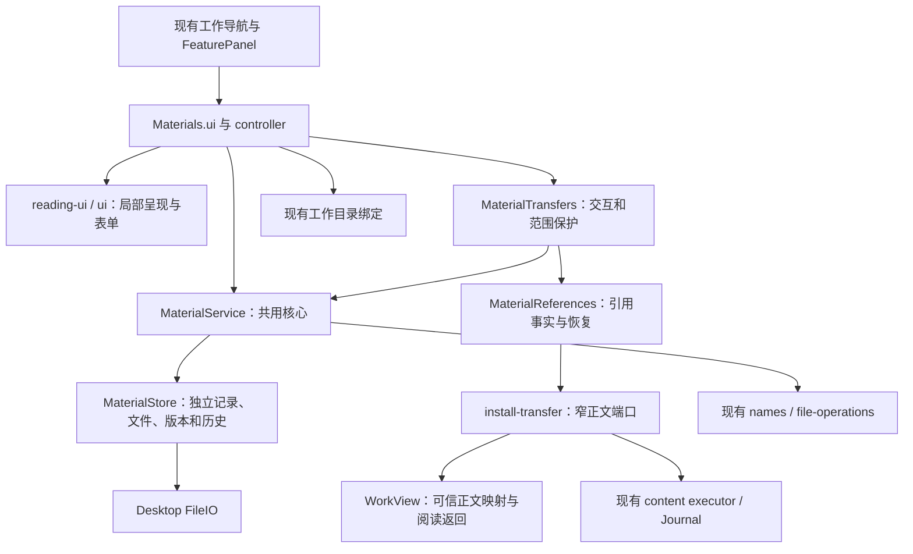
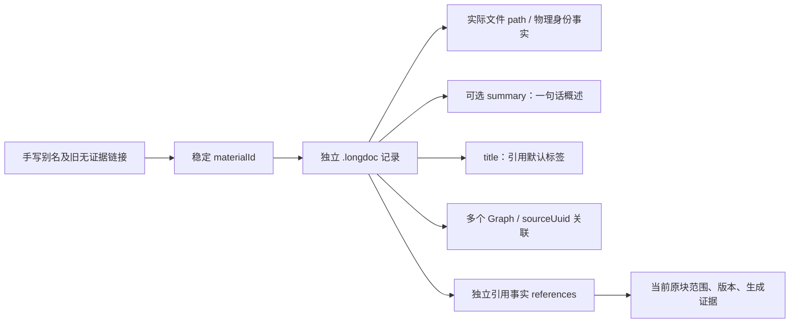
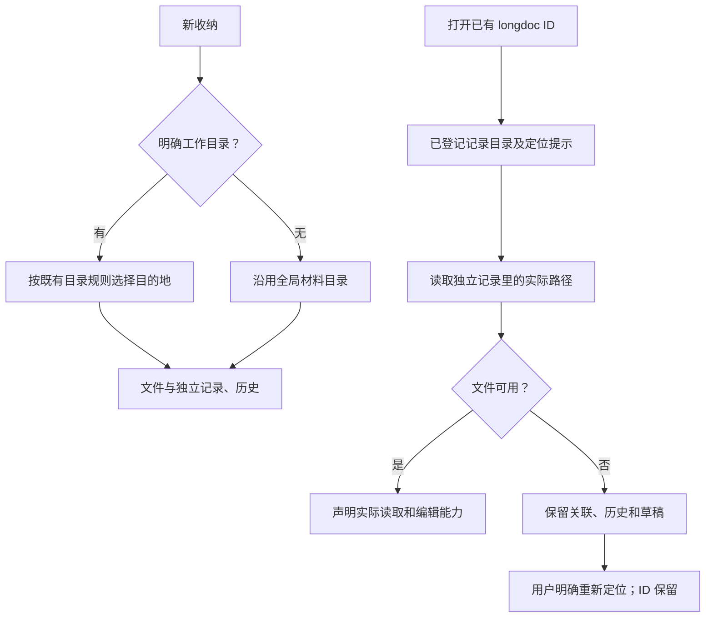
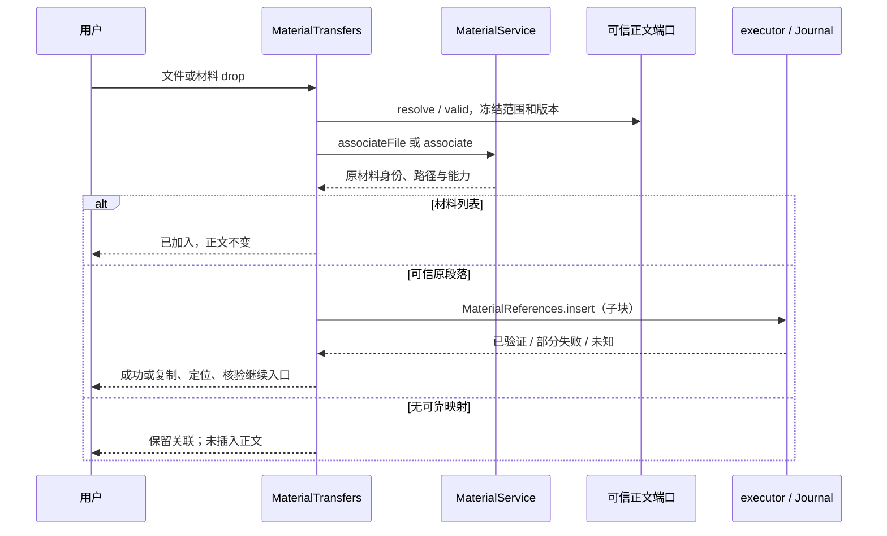
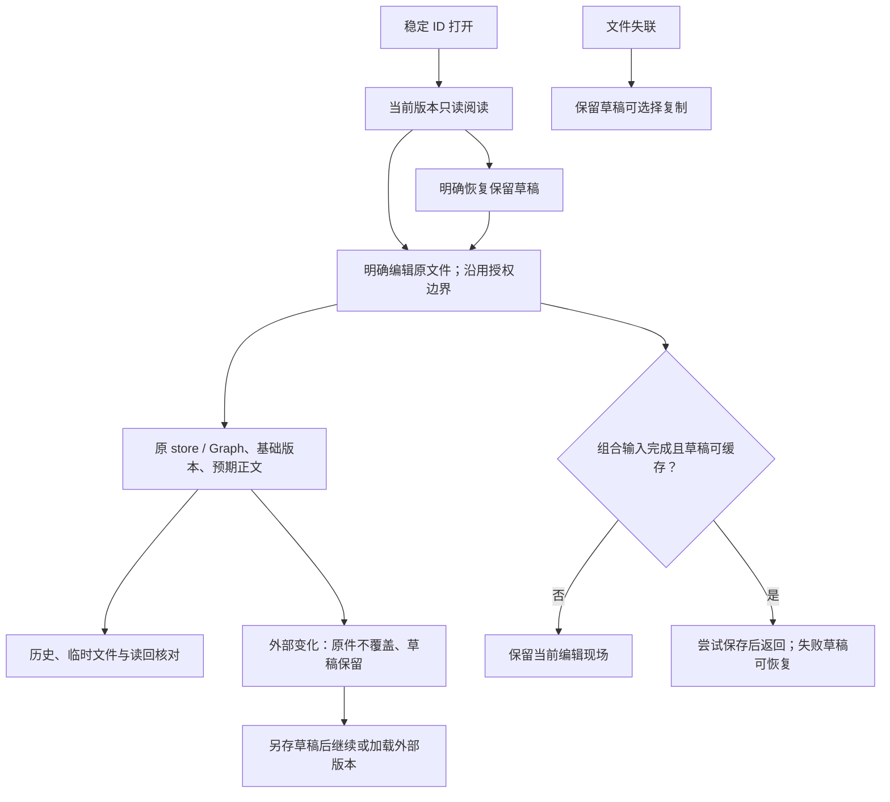

# 材料阅读与交互架构

2026-10-05。增量起点为 main `8529212296f0b65fb78ef7ccd2a2102474d9310a`。产品行为见[设计](../design/materials-reading-ux-design.md)，验证、提交和实际 UI 边界见[交接](../implementation/materials-reading-ux-handoff.md)。本文描述实际接线，不替代既有[材料核心](materials-module-architecture.md)和[拖入与改名](materials-drop-rename-architecture.md)的保存、授权及恢复协议。

## 模块职责与数据权威



controller 继续负责阅读／编辑器和面板协调；新增局部列表、状态与样式在 reading-ui，失败后保持输入的表单在 ui。transfer-ui 只适配浏览器／Desktop 事件与提示；身份、读写、改名和引用规则保留在已有 core 中。新增两处宿主消费接线与局部业务提交分开，未修改共享 panel、工作视图控制器、正文执行器或 Kernel。

## 身份与名称



`MaterialRecord.summary?: string` 和 `MaterialView.summary?: string` 为兼容的可选字段。核心接受 trim 后不超过 160 字、无换行的字符串，留空删除。`MaterialService.describe` 只更新独立记录，不写正文、不授权、不重新生成链接。读取校验无效字段，搜索可以匹配标题、概述和原有正文；没有新增 catalog 或索引权威。表单不会在 IO 失败时移除输入，组合输入期间也不提交。

## 保存位置与跨目录读取



UI 加入文件调用 `MaterialService.associateFile(path, context)`，保持原件的位置和字节；不调用自动插引用的旧 `Materials.associateMaterial`。目录发现无论在线或离线均如此。仅查看未关联目录文件不写材料记录。新收纳仍用 captureDirectory 的现有 flat／project 规则，不借阅读位置改变已打开文件的保存目标。

## 真正可消费的 UI 端口

`Materials.ui` 导出已挂载的材料根元素和真实动作：

```ts
interface MaterialReadingUI {
  element: HTMLElement;
  show(rootUuid?: string | null, sourceContent?: string): Promise<void>;
  open(id: string): Promise<void>;
  returnToBody(): Promise<void>;
  dispose(): void;
}
```

可信插件组合代码示例，与当前 main 的构造方式一致：

```ts
const materials = new Materials(
  uuid => work.open(uuid),
  () => (work.snapshot() as {root?: string}).root ?? null,
  workspace.materialBindings,
);
installMaterialTransfers(materials, content, workspace.source, work);
await materials.ui.show(rootUuid, committedSourceText);
await materials.ui.open(materialId);
await materials.ui.returnToBody();
// 插件卸载时调用一次；不是另挂一套 panel。
materials.ui.dispose();
```

main 的“材料”导航实际调用 `ui.show(currentWorkRoot())`。`element` 已属于现有 FeaturePanel；后续 shell 负责共同宿主时应统一注册／释放，不能把元素克隆成第二份编辑器。返回正文调用既有 work.open，WorkView/lens/report 自己保留选区、焦点、模式和锚点。材料仅保存上一列表的查询、滚动和所选材料，并按 Graph／root 检验；这不是工作范围提供方。

## 可信落点与部分结果

`MaterialTransferPort` 增加两个呈现适配钩子：`body(element)` 返回可进行悬停反馈的正文容器；`currentScope()` 返回现有工作所有者，用于落点不可靠时只关联文件。两者都不授予正文写权限。唯一写入定位仍来自 `resolve(element)`，提交前仍由 `valid(scope)`、现有正文 executor、授权与 Journal 核验。

当前 install-transfer 消费 main 的 `.wb-row .wb-body`，用 WorkView.resolveBodyDrop 的 `child` 结果及 workspace source 的实际内容／结构版本再次核验。报告 DOM 更新后由该 adapter 修改呈现钩子；Materials 不认识展示小标题或持有报告内部状态。



Clipboard API 失败只在捕获的当前 epoch 展示真实可选择文本。写入成功后，正文范围事实无法取得时不虚报复制失败；切换后的迟到结果不会在新工作渲染旧链接。原生 paste 的生成证据观察保留原实现，不阻止原生粘贴、Undo、选区或组合输入。

## 编辑、冲突与释放



已开始保存捕获原 store／记录，不读取后来的当前目录。dispose 先停止事件、样式、轮询和新请求；等待已开始保存结束，再销毁编辑器。未开始写入的旧 epoch 不能复活面板。改名依然受未保存草稿／编辑状态保护，不因为 UI 只读而绕开版本规则。

普通 IO、stat、rename 和 Web Locks 不提供与任意外部进程之间的原子 CAS、no-replace 或跨 Graph 事务。二进制只声明外部读取能力，现有版本事实不能冒充二进制全文内容核验。名称同步只维护登记证据内的当前引用，不追溯改变手写别名、旧未知引用或阶段历史。

## 人和 agent 的边界

插件现有 `window.taskCopilotWorkbench.materials` 保留 list/read/capture/associate/save 接口，agent 与用户复用 MaterialService/Store。capture 的幂等键、真实材料版本、权限拒绝、部分失败与冲突结果保持原契约。此轮没有开放新的 HTTP 端口或把文件写入放进展示 apply 白名单。

```ts
const api = window.taskCopilotWorkbench;
const list = await api.materials.list({sourceUuid: rootUuid, query: "研究"});
const material = await api.materials.read(materialId);
// 原 associate 接口明确包含建立正文引用；UI 的“加入”使用核心 associateFile。
const linked = await api.materials.associate({path: absolutePath, sourceUuid: rootUuid});
const captured = await api.materials.capture({requestKey: "capture-unique", text, sourceUuid: rootUuid});
if (!material.capabilities.edit.agent || material.content === null || !material.version) {
  throw new Error("当前材料没有可用的 agent 保存权限或 Markdown 版本。");
}
const saved = await api.materials.save({
  id: material.id, expectedVersion: material.version,
  expectedContent: material.content, next: authorizedMarkdown,
});
```

示例仅在已加载插件的可信上下文调用，保存仍须实际 agent 授权；参考资料默认拒绝。它不表示任意外部进程已能通过此全局变量访问插件。原 agent-workspace 连接、阶段成果与 source provider 沿用其各自权威和版本，不在本模块重新实现。
