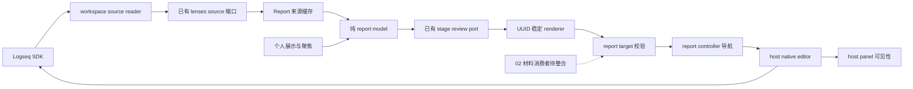
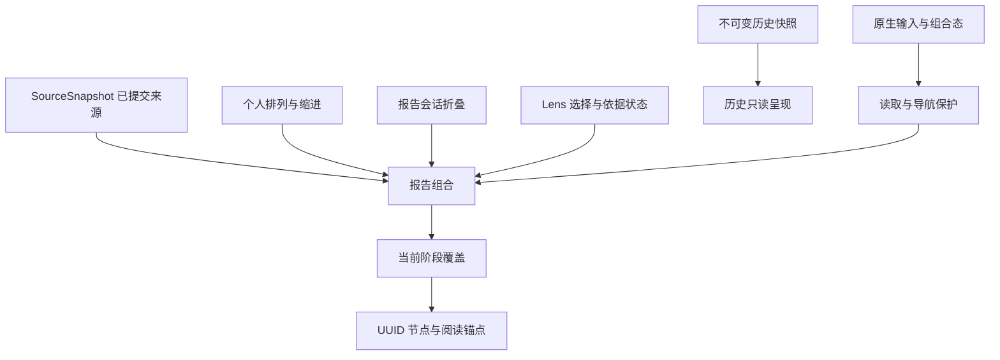
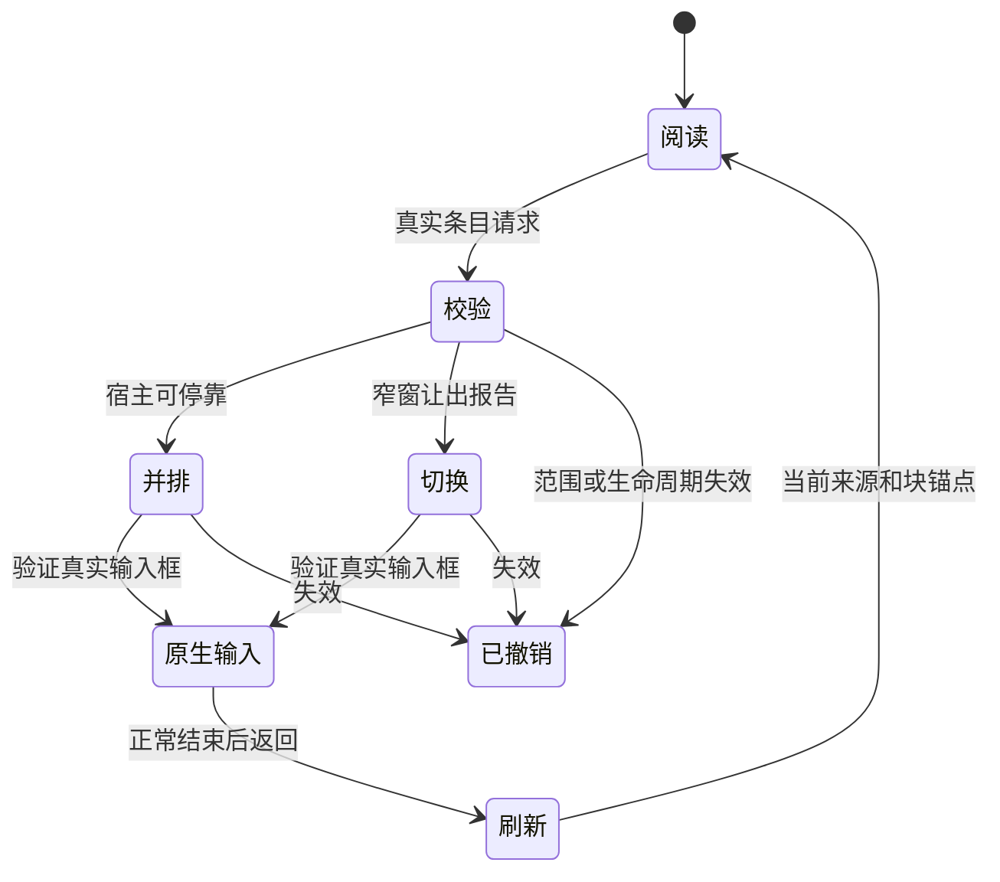

# 原生编辑与报告视图：实际架构

2026-10-04；基线 `e666e7be1367e97dabf5f787c7dcb944ac70e815`。实现留在现有 Logseq 插件，复用单一 source provider；没有新增进程、npm 包、依赖或正文存储。

## 数据流与职责



下表源码路径以 `apps/logseq-plugin/src/` 为前缀。

| 模块 | 已实现职责 |
| --- | --- |
| `features/work-view/report-model.ts` | 有限标记、整组与子树排列、完整块映射、无 UUID 展示标题 |
| `features/work-view/report-target.ts` | 封闭输入校验、当前成员／正文／结构版本、真实父级事实 |
| `features/work-view/report-controller.ts` | 会话模式、来源缓存、折叠、返回锚点、失效保护、六个本地 API |
| `features/work-view/report-style.ts` | 局部报告样式与减少动画支持 |
| `features/work-view/controller.ts` | 接真实 provider、面板、聚焦、阶段及已有材料往返 |
| `features/work-view/lens-controller.ts` | 从既有 provider 暴露已提交 source；不创建第二份 reader |
| `features/work-view/renderer.ts` | 稳定原块节点、展示小标题、条目菜单与键盘原生入口 |
| `host/native-editor.ts` | 真实输入框校验、SDK 跳页、原生返回控件、组合态及可选 drop 观察 |
| `host/panel-host.ts` | 宽窗并排、窄窗让出，避免旧光标恢复覆盖输入 |
| `index.ts` | 发布 `taskCopilotWorkbench.report`，单行注册 |

host 不导入 feature；report 不导入 Kernel／SQLite、材料 controller 或写回 executor。旧 `apply` 仍仅接受展示操作。现有材料权限、阶段授权、不可变存储和 source schema 未改动。

## 状态分层与版本



来源复用 `workspace/source-protocol.ts` 的 `SourceScope`、`BlockTarget` 和 `SourceSnapshot`。`sourceId` 为 `JSON.stringify(["logseq", graphId, blockUuid])`；正文版本为完整宿主原文 UTF-8 SHA-256，结构版本为真实先序下 `[sourceId,parentUuid,order,depth]` 元组的 SHA-256。来源集合版本沿用共享协议。展示去除属性行、DOM 排列、个人 seq、草稿、本地 generation 和 `capturedAt` 均不冒充正文版本。

Report 缓存只接收已有 source 端口的提交事实。读票据拒绝旧结果；读取期间再次变化会排队，结束后补读。组合态拒绝刷新或重组，结束事件触发读取。Graph／root、revision 与生命周期用于导航晚到保护，不用这些内部计数互通版本。来源不可用时保留原缓存并报告不可用／过期，落点始终重新读当前事实后校验。

当前阶段的可见范围覆盖继续进入报告 composer，因此“看全部变化”不会被原聚焦范围重新裁掉。历史分支直接呈现保存的旧来源与排列，不生成当前报告标题或映射，解析和新增原生编辑入口均拒绝 `historical-view`。报告模式仍保留供返回当前工作使用。

## 端口 A：完整块映射

`ReportFragment` 定义在 `report-model.ts`，复用共享类型：

```ts
interface ReportFragment {
  scope: SourceScope;
  sourceId: string;
  target: BlockTarget;
  contentVersion: string;
  range: { unit: "block" };
  parentUuid: string | null;
  objectKind: string | null;
}
```

`report.read()` 返回当前 scope、状态、完整可用块映射及 `structureVersion`／`sourceSetVersion`。映射不是当前可见性或写权限证明。报告内容仍是各原块，显示分组没有拼出新的正文。`ReportHeading` 只有展示 key、title、beforeUuid、depth 及其组内完整有序 `sourceIds`（含子树）；标题自身没有 BlockTarget 或 UUID。

本轮范围只支持完整 block，未提供 UTF-16 段内映射或外部报告计划。已有 sanitizer 继续处理展示正文，原始版本仍绑定未经展示清理的完整原文。

## 端口 B：正文落点与导航

插件上下文本地发布 `taskCopilotWorkbench.report` 的六个方法：`read`、`setMode`、`refresh`、`resolve`、`openNative`、`resume`。其中 `resolve` 使用封闭输入；示例中的 `selectedUuid` 来自真实来源条目：

```ts
const report = taskCopilotWorkbench.report;
const current = report.read();
const fragment = current.fragments.find(f => f.target.blockUuid === selectedUuid);
if (!fragment) throw new Error("source-not-in-scope");
const request = {
  schemaVersion: 1,
  scope: fragment.scope,
  sourceId: fragment.sourceId,
  contentVersion: fragment.contentVersion,
  structureVersion: current.structureVersion,
  position: { kind: "after" },
};
const resolved = await report.resolve(request);
```

合法位置为 `block`、`before`、`after`、`child`。解析重读当前 scope，核验成员、可用性、正文与结构版本。前／后落点返回真实父块的 sourceId、BlockTarget 与正文版本，子块位置返回目标自身作为父级；根块外部父级不在范围内时拒绝前／后落点。输出的 `target` 和 `parent` 是事实，不能原样塞回封闭请求，也不能作为授权。

未知字段、调用者伪造的 actor／capability、任意偏移或额外访问器均被拒绝。材料或受控写回消费者仍需自己的权限、EditingGuard、父级与版本最终核验、Journal 和恢复流程。普通“定位”不写 `id::`，没有扩大正式对象权限。

实际原生导航消费者为 renderer 的真实 UUID 条目及工作视图“编辑原文”入口：`forBlock` → `resolve` → `openNative`。`openNative` 只接受 `block` 位置，不把前／后／子块语义猜成光标。

`WorkView.resolveBodyDrop` 只接受本工作面板的真实正文／条目位置；展示标题、工具栏和面板外目标不解析。`WorkView.observeNativeDrops` 是供 02 注入消费者的 TypeScript 端口，不默认安装文件处理。宿主仅观察主区真实 block body 的 `isTrusted` drop，尊重已阻止事件，拥有自己的卸载函数，不全局接管 drop／paste 或调用 `preventDefault`。消费者解析前再次核验 Graph、版本、范围和原生输入状态；窄窗面板隐藏时当前实现返回 `view-not-visible`。

02 导入／引用插入／改名编排未接线。整合时由 02 保留已导入文件，并在模糊或失效落点提供复制链接等降级路径；这些后续材料行为尚未作为本轮交付宣称。

## 原生导航与生命周期



导航先核验来源及 Graph，拒绝组合态或另一个块的原生输入，再用 SDK `getBlock` 的 raw SHA-256 和 page 核对目标。已在主区渲染的块不重置页面；其他页面使用 `App.pushState` 等待实际跳页请求，然后等待宿主渲染、重新核验来源，再 `Editor.editBlock`。

安装的 SDK 0.3.4 中 `scrollToBlockInPage` 包装没有返回 `pushState` 的 Promise；仅等待它会让后续路由取消输入。实现直接等待路由，检查 `#main-content-container` 下与 UUID 一致的 `.block-editor textarea`、SDK 当前编辑 UUID、连接／可见状态及焦点。最多在无其他输入且来源仍有效时重试一次。成功依据是宿主真实输入框，不是仅滚到原块或返回空值。

同一 UUID 已在编辑时只聚焦原输入框，不重载正文或选区。并排暴露保留面板；窄窗关闭主 UI 时关闭旧的自动光标恢复。导航自身让出面板由 `yielding` 区分，外部面板切换会取消待完成导航。返回要求输入已正常结束，重开同一 root、重读来源并恢复原块锚点；不强制结束输入。

关闭／Graph 与 root 切换／dispose 撤销读票据和导航、清除会话缓存与返回控件。composition、drop 监听及局部样式均按所属生命周期释放。源版本和 Graph 在跳页后的进入输入阶段再次核验，旧请求不能带用户进入失效工作。

[官方 Editor API](https://logseq.github.io/plugins/interfaces/IEditorProxy.html) 仅用于确认宿主接口；已结合锁定 SDK 源码与 Logseq 0.10.15 实机验证。证据及未验范围见 [实施交接](../implementation/native-editor-report-handoff.md)。
