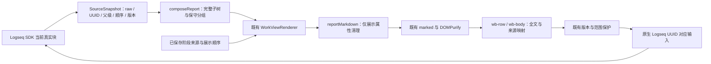

# 长篇报告的来源与组合架构

本轮继续使用 main 已整合的 SourceScope、BlockTarget、SourceSnapshot、ReportFragment、ReportHeading、sanitizer 和原生编辑保护。没有修改来源协议、Kernel、材料登记身份或阶段存储格式。

## 模块与薄接线

| 模块 | 本轮职责 |
| --- | --- |
| `work-view/report-model.ts` | 真实来源树、完整子树排列、有限标记标题、覆盖范围；新增 `defaultReportFolds()` 薄策略端口 |
| `work-view/report-body.ts` | 区分真正的 `id::` 属性行与 fenced code、引文、缩进示例中的字面原句；保留原行尾 |
| `work-view/report-style.ts` | 全文自然段、浅缩进、对象层次及代码/表格/长链接布局 |
| `work-view/report-controller.ts` | 仅在进入报告时调用空的默认折叠策略；继续由既有 controller 管理显式折叠、导航、bookmark 和版本保护 |
| `work-view/renderer.ts` | 最小接线：正文 helper、完整映射、范围标识及复制与原生编辑入口；保留稳定行节点与材料钩子 |

模型/样式与公共 renderer/controller 接线分开提交，供宿主布局与来源导航的后续工作独立核对。没有整体重排共享 controller、renderer、入口安装或 provider。

## 确定性重排

树从 SourceSnapshot 的真实 preorder 与 parentUuid 建立，不消费个人手动顺序来猜无标签归属。普通父段直接依原顺序递归；工作对象只处理自己的直接子级。

未知或无标签项固定自身和左右邻居，工作对象及不可用来源也固定。剩余连续区间只有多类别时才分组；每个同级项及全部后代一起发出。标题 key 包含父 UUID、区间起点和类别，避免多个独立区间撞 key。标题携带完整子树 sourceIds，不获得 BodyTarget。

ReportComposition 新增 `coverage`：total、available、shown、full/limited/unavailable、hiddenSourceIds 和 unavailableSourceIds。它计算结构可见范围；独立的逐源正文核对用于证明内容没有被遗漏，不能以 coverage 条数代替文字比较。当前报告的每个 view item 使用 full 展示。

## raw 版本与正文

完整 raw content 的 UTF-8 SHA-256 继续由来源协议提供。清理展示属性不更改 raw、正文权限或 contentVersion。正文 helper 按 fenced code 的标记和长度追踪代码范围，只有代码范围以外 0–3 空格开头的 `id::` 属性行被隐藏；引文和四空格示例不被全局正则误删。

marked 和 DOMPurify 的既有 URI/tag 约束保持一致。`longdoc://materialId` 继续交给既有材料服务，手写别名保留。每个真实阅读行继续使用 `.wb-row .wb-body`，附带 reportSourceId、reportContentVersion、reportStructureVersion；退出当前报告或进入只读历史时清除当前映射。

## 历史、协作与返回

阶段 overlay 的来源、可见项与顺序继续由既有 review port 提供；只读历史不再运行当前报告分组。历史 Markdown 使用同一个字面内容保护 helper，因此旧代码里的 `id::` 行完整呈现。bodySignature 包含报告/历史状态，切换后不会复用来自另一个模式的错误 DOM 正文。

既有协作变化、inline diff、明确修改建议入口与历史限制继续可用。报告中的普通正文点击不抢占复制选区；原结构模式原有修改入口保持原行为。原生编辑、Graph/root 失效、晚到读取、材料落点和历史禁止写入继续由原有 controller/port 验证，没有新增旁路。

真实 Desktop 中间块修改后仅该块 raw 版本变化，全部 94 个行节点及滚动位置保留。选区在原生返回后为空，不能把自动化的无关选区/菜单焦点保持写成真实 Desktop 全部焦点恢复。材料返回读取同一来源集合版本；历史保存事件与认可 hash 未改变。

实现与验证边界见 [交接](../implementation/report-fulltext-layout-handoff.md)。
