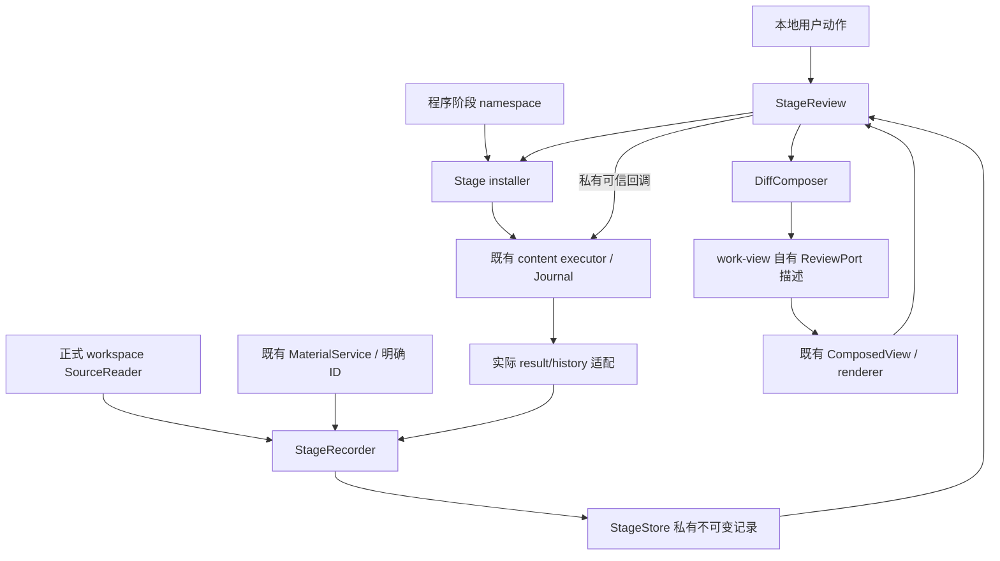
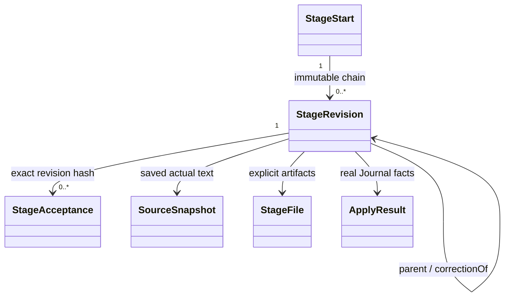
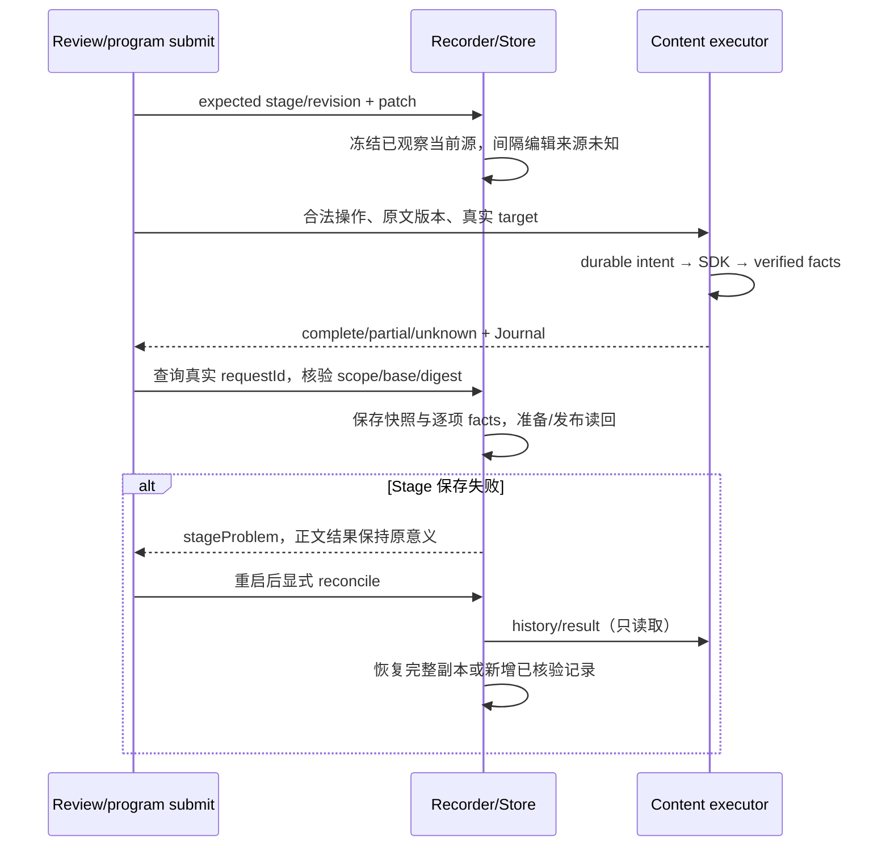
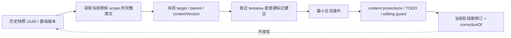

# stage-workbench 模块架构

2026-10-03。纯记录核心、宿主事实适配、描述型审阅端口与薄安装器组成完整本地功能。源码位于 `apps/logseq-plugin/src/features/stage-workbench/`。

## 数据流与职责

`protocol.ts` 拥有 StageStart、StageRevision、StageAcceptance、StageFile 和事件。来源类型复用正式 workspace/source-protocol；正文 facts 直接保留 content 的专用保护/parent/identity/current/base 等事实，没有删去或混进 Stage schema。正式 reader 的 root parent/order 是范围内的 null/0；正文写回的真实父级来自 content.read 和持久 ItemFact，二者不替代。

`store.ts` 只读写 StageStorage 与 SHA-256，不依赖 SDK、DOM、Kernel 或 Git。`recorder.ts` 核验阶段版本、实际事实与范围，捕获快照、幂等记录、认可、候选选择和显式对账。`diff.ts` 是有界纯计算。`installer.ts` 消费真实 content、材料和 workspace 来源窄端口，负责队列、scope/生命周期、命令及公开 namespace。`review.ts` 是局部 UI 状态，输出 work-view 自有的 ReviewFrame；work-view 不导入阶段 controller，host/runtime 不导入 feature。

## 记录、版本和认可

稳定 UUID 用于 stage、revision、acceptance、事件和写回 request；程序输入闭合字段与大小校验。StageStart 包含一句目标、scope、时间、起点快照、文件及开始时前阶段/版本。修订保存父版本、必要内容、真实累计 facts、文件、幂等键/输入摘要、结果 fingerprint 和可选 correctionOf。认可独立追加，固定 revision ID 和整个修订 JSON 的 SHA-256；仅内部 acceptLocal 接受 UI 冻结的所见版本。

正文版本是原文 UTF-8 SHA-256；structureVersion/sourceSetVersion 沿用正式协议，capturedAt 不参与内容去重。块按真实先序、范围内 parent/order/depth 核验，不能由个人布局/DOM 顺序反推。diff 按 sourceId/UUID 匹配，跨版本不复用旧文本偏移。块内简单变化以 Array.from 避免切开代理对，再转 UTF-16 [start,end)。写入仍由 content 的范围授权、EditingGuard 和 protection 验证。

## 存储和恢复提交顺序

唯一元数据权威为 `logseq.FileStorage`。每个工作 scope 有 SHA-256 前缀，事件 key 为 `stage-workbench-v1-<scopeHash>-<eventId>`；完整准备 key 为 `stage-prepared-v1-<scopeHash>-<eventId>`。每项保存 `{payload,hash}`，payload 是不可变事件，读取时检查 envelope、scope、拓扑、正文/材料哈希、修订 fingerprint 和事实 digest。

追加顺序：核验既有 key 不冲突 → 写准备记录 → 读回完全一致 → 写发布记录 → 再读回。历史优先完整发布，损坏/缺失发布可从完整准备副本重建同一事件；无发布的损坏准备没有阶段生命周期效果，保留原字节并提供对账提示。发布和准备都不可读则保留问题、禁止依赖它的继续写入。没有 mutable index；每次从明确 scope 的私有记录重建，认可不被后续覆盖。不自动清理任一历史或准备记录。

上限为单条 envelope 16,777,216 UTF-16 units、scope 快照 2,000 块/64 层、单块 262,144、快照正文 4,000,000、64 个材料/累计 content 请求、每份文件正文 1,000,000。超限拒绝阶段存储并保留实际正文/材料及 Journal，不宣称阶段完整。未建设通用版本数据库或大文件字节库。

同作用域本地队列串行，expected revision 拒绝竞争并保存候选。跨进程同父修订分叉时不选最后写入者；候选选择另加 resolution 记录，不修改源文本。两次选择发生竞争也失败关闭。FileStorage 与 SDK 不提供跨进程全局 CAS/断电原子性：记录可检出分叉，不能保证两个进程的正文调用全局串行。并发开始目标导致可写归属不明确时保留全部阶段并关闭继续写入；需要核对记录，不自动选目标。

## 生命周期与权限

Stage lease 同时绑定 recorder epoch、content 私有 authority lease 和 workspace sourceVersion。scope 切换、Graph A→B→A、unbind/rebind、dispose 使晚到结果无效。正式 workspace.readSource 使用现有 reader，包含无目录场景，只返回本次实际读取，镜像不代替它。readSource/sourceVersion 是安装器内部端口，公开 workspace namespace 未扩大权限。

metadata.stageId/runId 只是关联线索；实际 Journal scope、stage 起点时间、操作身份、事实 digest、base/actual 哈希及已观察版本都需核验。local-capability 不证明 agent 身份；只有私有 local.apply 的 UI 路径记录 local-user-command。公开 namespace 无 accept、actor、authorize 或 caller facts；不把建议/外部文本当权限。内存来源与私有存储均是本机受信插件边界，不宣称抵抗能任意执行 iframe JS 或篡改整个本机存储的恶意代码。

材料适配核验注册 ID 与当前 Graph/path、root association，实际读回版本和权限。已登记小型 txt/csv/json 通过只读文件桥保存历史字符串，不能因此获得写权限。历史 Markdown 可以查看，实际恢复仍用材料历史；二进制不复制字节。审阅草稿使用 `workbench:stage-draft:<scope>:<uuid>`，绑定阶段，重启只恢复输入，重新读取当前源计算操作；无草稿自动提交。

## 审阅组合边界

ReviewFrame 是 rows/state/view/changes/historical 描述。review 不写持久 presentation，lens 独立持有问题、plan、历史和 bookmark。范围外计数和看全部揭示变化及祖先，返回恢复原 lens/位置。renderer 按 UUID 复用元素，变化描述不变时保留正文和控件节点；组合态跳过正文替换，审阅输入期间冻结描述帧。旧块以历史前驱定位，不复用同名块。HTML 只用于安全渲染，不参与写入范围推导。

当前原文与待认可修订不一致时，Review 比较真实 rows 的身份、原文及范围内结构，暂停该当前视图的认可入口，提供保存版本的阅读动作；历史模式只渲染不可变 source。renderer 的局部描述签名包含当前/提交正文是否一致，后来人工编辑会正确更新提示及按需结果文本。既有认可保持，正常一致视图仍一键完成。
