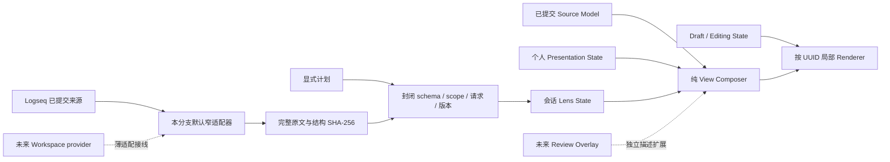
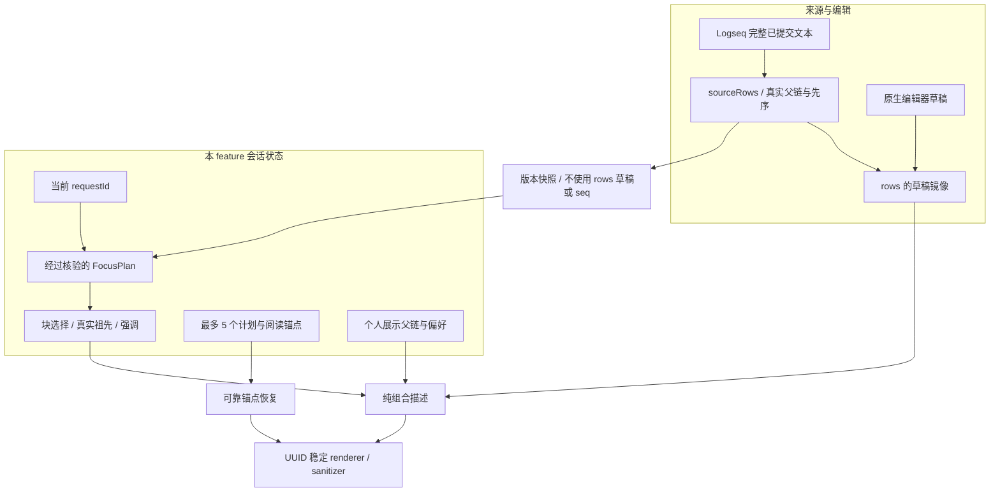
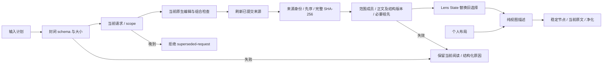
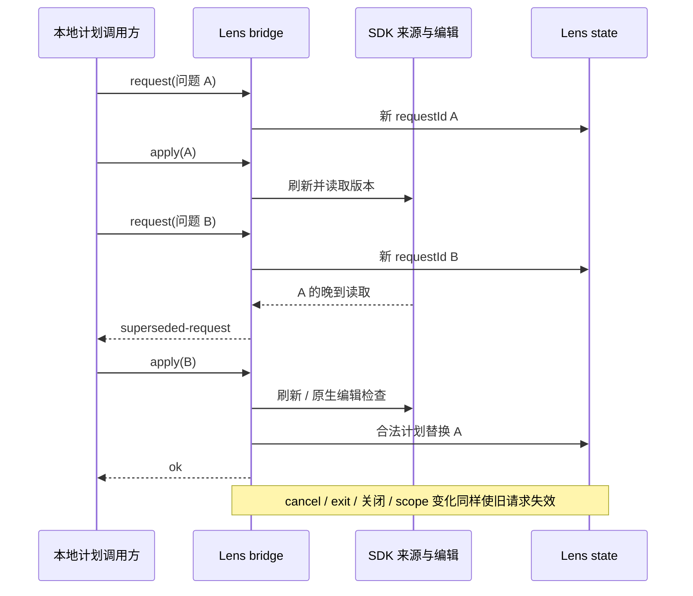

# View lenses 架构

来源权威、个人布局、临时阅读选择与编辑草稿各自保留状态。逻辑模块位于现有插件的 `features/work-view`，不引入包、后台模型或服务。

默认适配器只消费来源刷新实际读取的已提交行，不使用 `work-view.read()` 中的草稿、排列或 seq。来源身份、完整原文 SHA-256、真实先序结构和来源集合版本采用共同交换约定。范围外保留行不能成为当前来源成员；不可用来源没有当前正文或版本。

`LensSourcePort.read(scope)` 是本 feature 的窄消费端口，返回同形来源快照。正式共享协议文件与 provider 由 workspace 分支拥有，本分支不创建另一份 workspace 协议。可信安装的 provider 仍须经过 schema、大小、身份、先序结构与 hash 校验。

FocusPlan v1 包含 requestId、scope、短 question、structureVersion、必要 sourceVersions 与 visibleRanges；可选完整块 emphasisRanges、gaps、temporaryInference 及 sourceSetVersion。所有未知字段和非完整块范围拒绝。程序根据真实来源计算祖先，并要求祖先版本作为依据；个人展示父链另用于保持熟悉布局。两种父链都不成为正式归属。

入口由 `window.taskCopilotWorkbench.lenses` 暴露，真实 WorkView 构造时创建桥接并使用默认来源适配器。旧 `apply` 的展示操作白名单和原 `focus` 选中语义不改变。该 API 位于插件 JavaScript 上下文，不能描述为外部 Codex session 已有跨进程 transport。

## 状态分层

| 层 | 所有者与权威 | 持久性 |
| --- | --- | --- |
| Source Model | 既有 `source.ts` 调度；controller 的 `sourceRows` 是已提交 SDK 读取 | Logseq 正文权威，行与 hash 缓存在内存 |
| Presentation State | 既有 operations/model；个人排列、折叠、级别、选中、全文偏好 | 既有 scope 布局记录 |
| Lens State | `LensState` 当前请求、已验证选择、明确用户折叠、失效、最多 5 个历史 | 会话内存 |
| Draft / Editing | 既有 `readDraft` 与原生 Logseq；renderer 监听局部组合事件 | 原生编辑器所有，本轮不保存正文 |
| Review 扩展边界 | 纯 composer 输出 `ComposedView`，renderer 可接收独立描述 | 本轮没有 ReviewOverlay 数据协议或业务 |

## 模块内部职责与流水线

| 文件 | 职责 |
| --- | --- |
| `lens-input.ts` | 封闭的普通数据对象、字段、稠密数组、文本与 hash 边界；拒绝 accessor、未知字段和超限 |
| `lens-source.ts` | feature-local 窄来源端口；完整原文、拓扑和来源集合 hash；验证成员、scope、真实先序与可用性 |
| `lens-plan.ts` | v1 解码与版本核验；程序计算真实祖先；声明依据变化检查 |
| `lens-state.ts` | 独立请求、选择、用户折叠与有限历史；纯状态，无 IO/存储 |
| `view-composer.ts` | 个人相对顺序、来源祖先与展示祖先组合；临时展开、全文与受控块强调 |
| `lens-controller.ts` | 刷新及 provider 桥接；生命周期、晚到结果、编辑检查、材料暂停与锚点恢复 |
| `lens-ui.ts` | 稳定简洁状态条、纯文本提示与局部可释放样式 |
| 既有 controller / renderer | 命令与按钮接线；sourceRows 权威、原生草稿镜像、稳定 DOM 与既有安全 Markdown |

`sourceRevision` 与 `lifetime` 只用于本组件竞态保护。默认适配器以 revision 缓存已验证 hash，`source()` 返回独立副本，捕获时间不参与版本。来源捕获前后及最后的编辑检查后检验请求与 scope；源码 revision 在检查期间变化时拒绝。它是阅读一致性边界，不是正文事务/CAS。

## 宿主与共享改动

`PanelCoordinator` 与 `FeaturePanel` 只增加通用关闭原因 `switch | close`，没有导入 lens feature 或代管业务。WorkView 自己决定切换时保留现场、明确关闭时清除。回到同一 scope 时重新渲染状态条，即使来源未变化，也不能让已取消的等待仍出现在界面。

`index.ts` 仅将工作材料打开 callback 的 Promise 交给 WorkView 处理失败，并注册 `lenses` namespace；没有重排启动顺序。既有 dispose 会释放本功能状态/样式并删除根 API。host 不反向导入 feature，runtime 不导入 controller，插件不导入 SQLite；无依赖或 lockfile 变化。

future Review 的接线位置是已实际调用的 `composeWorkView → ComposedView → renderer.render(..., composition)` 描述边界。该边界可扩展局部渲染决策，不代表已交付阶段状态、diff、认可或提交。未来正文 capability 使用已提供的 `BlockTarget` 和来源版本交给 content 模块处理；本 feature 仍只导航原生来源或消费写回后的新快照。

图中的实线表示本轮真实调用路径，虚线表示未交付接线。API、异常、验证证据和后续接线清单见[实施交接文件](../implementation/view-lenses-handoff.md)。
