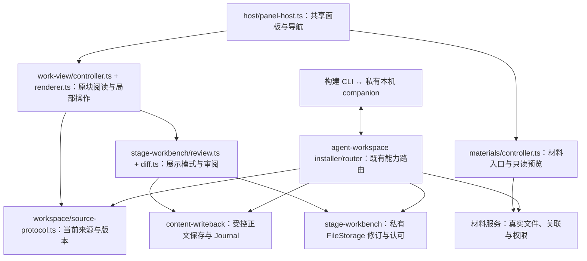
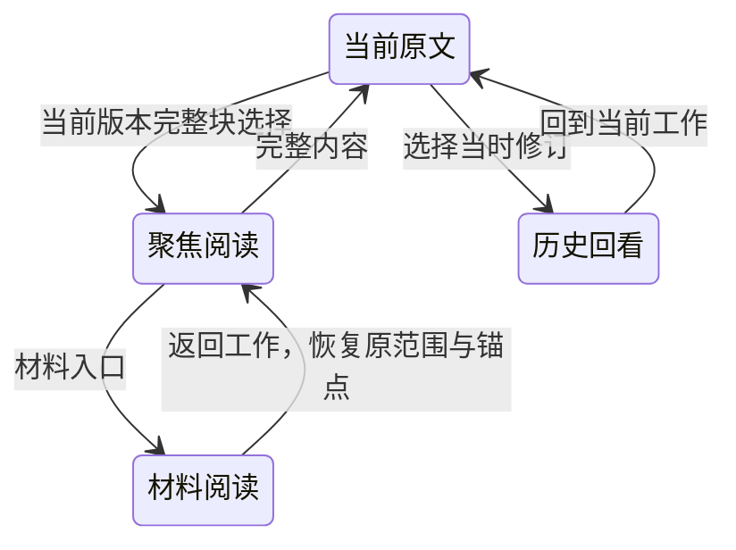

# 工作台体验优化：实际架构

日期：2026-10-04；产品源码 `10f0a664ec136902e839e2503127e249da8ce81a`。本轮修改既有组件展示及一处 Logseq 插入焦点，不改原协议或模块组合。使用见[手册](../user-guide/README.md)，实施路径与验证见[交接](../implementation/workbench-ux-polish-handoff.md)。

## 组件与能力关系

`review-port.ts` 继续隔离工作视图与阶段具体实现；`lens-ui.ts`、`view-composer.ts` 的完整块聚焦与组合逻辑未改。普通块不依赖正式任务 Kernel，`tasksEnabled=false` 时仍走自然来源、材料和 workspace 连接。

| 修改位置 | 具体职责 | 继续复用的边界 |
| --- | --- | --- |
| `host/panel-host.ts` | 菜单下方布局、标题换行、焦点样式 | `FeaturePanel`、`panels` 导航与关闭生命周期 |
| `work-view/controller.ts` | 来源标题、跟随文字、显示/总量口径、菜单关闭协调 | 来源调度、view 状态、lens 与 review port |
| `work-view/renderer.ts` | UUID 节点、紧凑局部菜单、无效控件隐藏、变化渲染 | 原回调、选区恢复、组合输入、布局操作 |
| `stage-workbench/review.ts` | 目标输入开合、模式、认可按钮状态与旧文展开 | 原 stages action/content action、冻结展示与草稿 |
| `stage-workbench/diff.ts` | 去除展示元信息、受限单区间文字差异 | 原 source/version、durable fact 归因，不推断作者 |
| `materials/controller.ts` | 目录文件直达、只读预览、连接反馈、离线材料识别 | 原材料核心、desktopFiles、directory observer、scope epoch |
| `content-writeback/logseq-adapter.ts` | background insert 明确 `focus:false` | 原范围、版本、原生编辑保护、读回与身份核验 |

## 状态与生命周期归属

来源由 workspace/source-protocol 与原适配器读取，scope 仍是 Graph/root。展示布局、raw body 与菜单状态留在原 work-view/controller/renderer；历史阅读来自阶段快照，不能保存成第二份正文。

菜单入口随 UUID 节点创建，回调仍按 UUID 定位；更新内容不把所有条目 DOM 重建。开菜单只影响阅读 viewport 的保留空间，不插入正文行。Escape 返回对应 summary；组合态继续阻止误关闭或提交。编辑器草稿与选区保护沿用原所有权。

阶段目标开合是 `StageReview` 的局部展示状态。stage start、revision、acceptance 仍由原 stages service 的私有 FileStorage 持久保存。审阅冻结来源版本后，认可必须核对所见修订与 hash；历史快照不接受正文或结构写入。历史审阅保留“在当前内容中纠正”和“建议”，它们重新读取现存 source，保存到当前 writable stage，并记录 correctionOf，不改旧快照。当前 source 与 submitted revision 不同时维持区分。

材料 `contextUuid/current/mode/epoch` 仍由既有 controller 管理。切 Graph、离开材料或换面板使旧请求失效；新目录读取每次通过 scope/epoch 复核。目录预览没有调用 associate/save，直到用户明确关联。离线匹配使用当前工作已过滤材料的实际 path，涵盖原文件关联和收纳文件，保留 id、权限、关联及历史。

`agent-workspace` 原 installer 设置目录 observer、允许/停止命令和 Graph 切换撤销。scope 变化、卸载与停止使旧连接和晚到结果失效。本轮未改变这些路由或授予更大能力。

## 有界预览与插入焦点修复

已连接目录使用正式 `files.list/read/associate` observer；离线读取已有绑定目录，经桌面文件能力列出前 200 项、排除隐藏元数据，只对最多 256KiB 的 `.md/.markdown/.txt` 读取正文。不新增文件管理服务、全盘扫描或文件适配器；非支持格式继续沿原材料外部打开能力。

审阅文字差异是确定性的单区间 helper，前后总长度超过 12000、复杂 Markdown 或重复歧义返回 null，使用原块级展示。它只影响视觉，不提供补丁或写入目标。

实机第一次 external insert-child 后，Logseq 默认打开新块原生编辑器，原有身份保存检查随后诚实返回未知。本地原请求恢复成功后，将既有 `insertBlock` options 明确加入 `focus:false`，避免 background write 主动制造编辑态。选项保留 sibling/before/customUUID；没有移除 `checkEditing` 或放宽来源保护。当前 SDK 类型未显式列 focus，使用结构化 options 常量传入；安装的 Logseq 0.10.9 实际插入已读回核验，新回归建模默认聚焦行为。

## 数据与权限未改变

- Logseq 自然正文与真实材料文件分别是当前权威；工作目录镜像只用于读取副本。
- 阶段修订与认可记录不可变，权威在插件私有 FileStorage；工作目录不能提供跨电脑历史迁移保证。
- content 范围、版本、预期旧文、结构、Journal、未知结果、身份核验、原生编辑与正式字段/TODO 保护全部沿用。
- 参考/输入默认 user/agent 不可写，output 沿用既有可编辑能力；发现、关联、授权和阶段成果没有隐式合并。
- 外部生产连接继续是构建 CLI → 私有本机 companion → 插件 router → 已安装 provider。Desktop 调试端口只用于本轮隔离夹具、只读事实、真实浏览器输入与原始截图，未替代生产 transport。
- 无新增生产依赖、数据库、状态管理、全局事件总线、默认模型、API key、聊天系统或后台服务。

共享整合时优先比较上述七个源码路径与对应回归，保留 install/dispose 所有权。不要将本轮共享 CSS 的行局部优化变成组合根重构。
