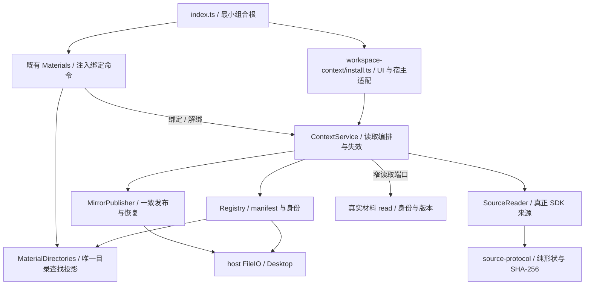
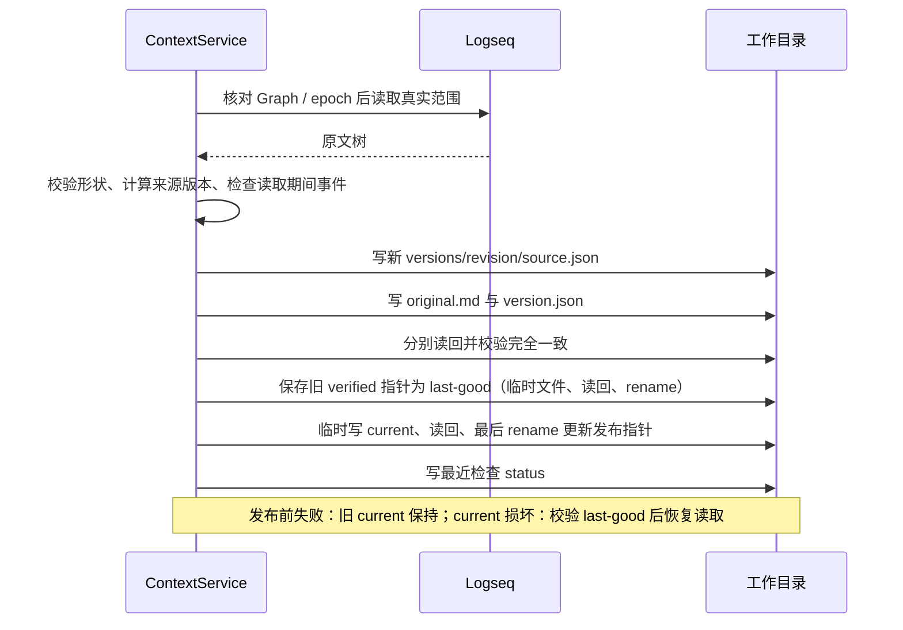
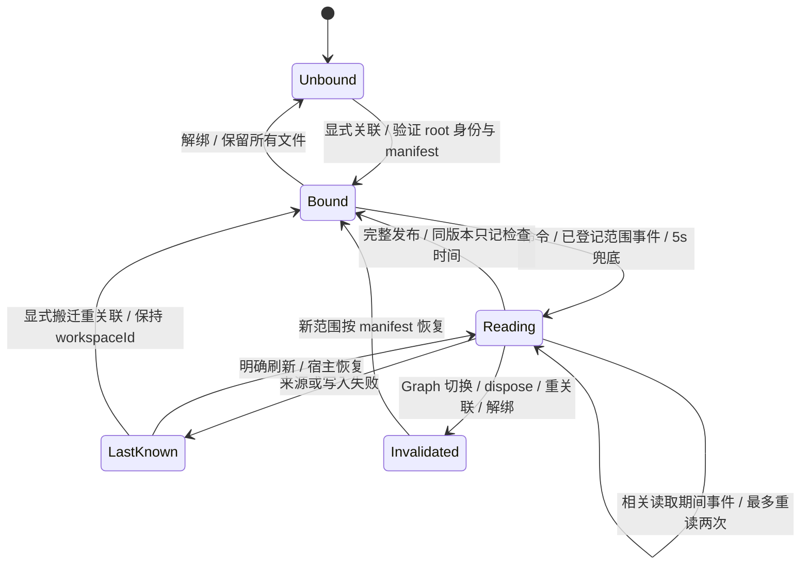

# 工作区上下文：实现架构与读取协议

2026-10-02。产品路径见 [设计](../design/workspace-context-design.md)，实际验收与环境见 [交接](../implementation/workspace-context-handoff.md)。逻辑模块留在现有插件，无新包、模型、HTTP 端口、SQLite 表或 Kernel 路由。

## 模块与权威



实线为实际依赖或注入调用。host 不导入 feature；runtime 未导入本功能；工作视图 controller / renderer / parser、PanelCoordinator、公共样式及正式任务领域未改。

`registry.ts` 管理随机身份与便携关联，不读取全部 Graph。`source-reader.ts` 只读明确范围的宿主数据。`mirror.ts` 生成读取副本与范围映射、读回校验并发布指针。`context-service.ts` 串行协调、保留最后已知结果和内部 epoch。`install.ts` 注册命令、轻量目录表单、订阅与释放，并实现真正 Logseq/材料适配器。

正文权威分别是 Logseq 和材料原文件。manifest 是身份与便携关联权威；材料已有路径索引是兼容查找投影，可从用户明确选择的 manifest 重建。镜像、状态文件和缓存只是派生读记录，不接受反向正文写入。

## 数据布局

```text
<明确选择的目录>/
  WORKSPACE.md                       # 或不冲突的等价文件，manifest 记录名称
  .task-workspace/
    manifest.json                    # schemaVersion=1，workspaceId，primarySource，organization，associations，entryFile，updatedAt
    current.json                     # revision + 三文件 SHA-256 + capturedAt
    last-good.json                   # 更新指针前保存的上一份已验证指针
    status.json                      # 最近尝试时间、可用性、发布版本、实际问题
    versions/<随机 revision>/
      source.json                    # ReadingBundle：primary、sources、lastKnownSources
      original.md                    # 原文、源顺序、层级、独立旧副本标识
      version.json                   # 正文/结构/集合版本、哈希、UTF-16 映射
```

`revision` 只定位一次文件发布，不冒充正文版本；capturedAt 不参加内容版本计算。第一版保留历史版本和未完成文件，无自动删除成果或版本目录；长期保留策略后续可加。单次树上限 10,000 块、深度 128、8,000,000 字符，整个读取包 JSON 上限 16,000,000 字符，映射最多 25,000 行；超过界限报告不可用并保留旧副本。manifest 最多 64 个显式来源，读取校验 schema、大小、形状及身份。

本地 `workbench:workspace:[graphId,rootUuid]` 只保存 workspaceId 与材料 Graph 定位键，不保存第二份可编辑目录。实际目录只在原 `workbench:material-binding:[graphPath,uuid]`。材料服务仍用旧 graph.path 键；共享读取协议用 `graphIdentity(name/url)`。组合根在真实宿主上建立这两个定位的映射，不把它们混成一个身份。已有绑定无 manifest 时材料继续工作；明确 bind 才承接，自动观察不偷偷升级旧绑定或写 id。

## 共享来源协议

正式落点为 `workspace/source-protocol.ts`，导出共同约定的 SourceScope、BlockTarget、BlockSnapshot、SourceSnapshot。sourceId 精确为 `JSON.stringify(["logseq",graphId,blockUuid])`。content 使用宿主 content（或 DB 形状的 title）完整原文，不 trim、不移除 id、不改换行。contentVersion 是该文本 UTF-8 SHA-256 小写 64 位十六进制。

blocks 为真实先序顺序，order 为同父下序号；结构版本计算 `[sourceId,parentUuid,order,depth]` 数组 JSON UTF-8 SHA-256，集合版本计算 `[sourceId,availability,contentVersion]` 同序数组。missing / unavailable 内容与版本均 null。磁盘读取还校验原文 hash、根范围、拓扑和整份版本。

显式 block / page 各返回独立快照，pageName 是定位信息且 pageUuid 必须与真实读取相符。材料通过注入的真实 `materials.read` 返回 actual ID/path/availability/content/version，权限及保存仍归材料；不可读时明确 unavailable。当前来源与独立 lastKnownSources 分开，后者保留旧 capturedAt，绝不放进本次 available 快照。

Markdown 没有属性清理；层级和续行前缀有 UTF-16 `[start,end)` 精确映射。版本清单中的映射对应完整内容版本，不能把旧绝对偏移用于跨版本写回。首版可靠定位单位是完整 block，无句子精确定位声明。

## 发布、失败与恢复



每次新文件写入、读回及 pointer rename 前后都有失效检查。旧目录不能被改投新目录，缓存不决定写入目标。新指针带三文件哈希；恢复还重算来源版本、Markdown 和映射，三者必须对应同一读取结果。status 与镜像不是一个多文件事务：status 写失败会诚实返回问题，即使正文指针已发布；文件阅读者同时核对 status 的时间与 publishedRevision。

manifest 用临时文件与读回替换。首次 manifest 后入口写入失败可重试该身份；发现没有 manifest 的既有 `.task-workspace` 不擅自覆盖，须核查残留。已有用户入口无法证明管理归属时拒绝覆盖。程序写入只使用明确目录加固定相对路径；manifest 的 entryFile 受闭合文件名规则约束，pointer 的 revision 必须是 UUID，文件中的任意路径不能变成扫描或执行命令。

## 事件与并发



内部 epoch / revision 只保护运行生命周期；来源变化计数只使读取失效，均不作为互通内容版本。同一 scope 的 refresh 和同一目录的 bind 有串行队列，支持同源 Web Locks，失败不会毒化队列。100ms 固定合并窗口不随事件无限延长；本地 pending Map 每个 scope 一项。观察 DB 事件只重新读取已登记范围，不推断语义、不扫描全 Graph；5s 兜底自身不制造正文变化版本。

SDK 子树读取不是数据库级事务。观察到读中变化则重读；连续变化不能稳定时保留失败，不宣称 Graph 原子冻结。未观测到的宿主变化以及检查后发生的变化仍可能存在。已经进入 SDK/文件桥接的单次调用无法撤回，rename 前最后检查也不是跨进程 CAS；绝对目标捕获与后续失效保护确保晚到结果不接入另一目录，极端外部竞争/断电需进一步实机验证。

reload/dispose 取消计时器、待刷新项和订阅；Graph 切换立即失效再读取新 Graph 的既有 manifest。任务模块关闭与 Kernel 离线不影响这条生命周期。解绑删实际绑定，保留本地身份提示便于后来明确恢复。

## 程序入口与后续接线

`window.taskCopilotWorkbench.workspace` 提供 `bind({scope,directory,organization?,create?,rebind?})`、`resolve(scope)`、`refresh(scope)`、`read(scope)`、`unbind(scope)`、`associate({scope,source})`。读取结果有 workspaceId、binding（含 entryPath）、freshness、mirror（指针/原文/快照）、status、observed 与实际 problem。read 不进行来源写入；refresh 不写用户正文。bind/associate 只执行输入 schema 与真实来源校验，不接受调用方 capability / actor 布尔值作为权限证明。

view-lenses / content-writeback 后续消费本模块正式 source-protocol 与读取 provider；本分支未依赖它们的未提交文件。既有 read/open/openMaterial/close/readMaterials/materials/apply 保留，apply 仍只做展示。插件上下文 API 不等于外部 Codex session 可调用的远端通道；跨进程 CLI/MCP transport 待接入。
