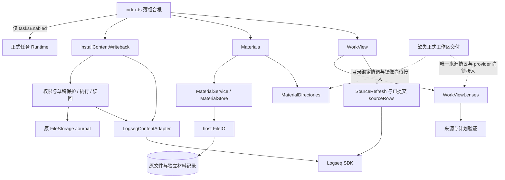
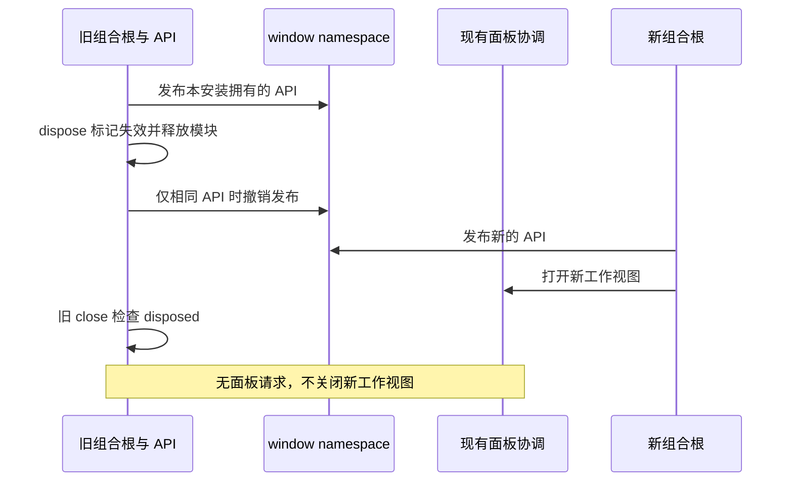
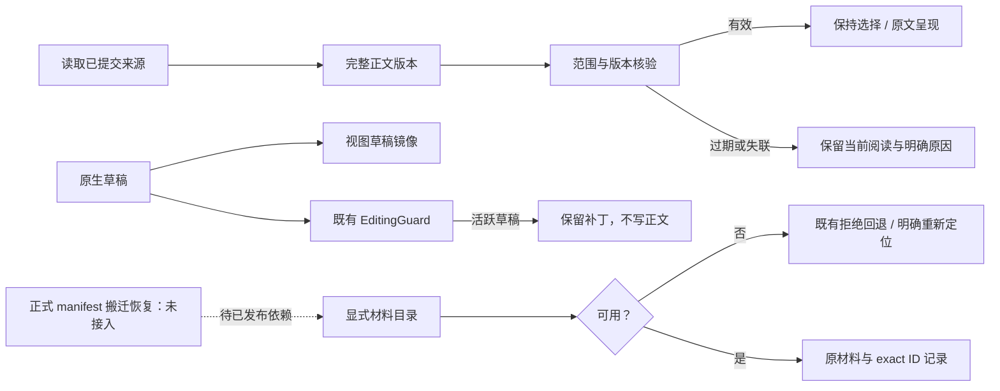

# 工作区整合架构：现有接入修复与缺失依赖

2026-10-02。本页只描述分支当前实现。正式 `workspace/source-protocol.ts`、source-reader、registry、mirror、context-service 及 workspace-context 安装器均不在锁定远端基线中，本分支没有复制或重造它们。[交接](../implementation/workspace-integration-handoff.md)记录远端获取失败与未完成验收。

## 当前组合和职责

没有新包、依赖、lockfile 修改、事件总线、SQLite 引用或外部服务。host、runtime 和工作视图依赖边界保持；正式任务操作不进入自然正文入口。`index.ts` 的共享修改仅涉及发布/释放所有权和旧入口生命周期检查。

| 当前窄端口 | 所有者与事实 |
| --- | --- |
| `LensSourcePort.read(scope): Promise<unknown>` | work-view 消费者；可信构造 options.source 注入，调用方 JSON 不能指定 provider |
| `LogseqContentAdapter.read(scope, valid): Promise<SourceRead>` | content 默认实际 SDK 读取；保留 snapshot、protections、children、paths |
| `SourceReader / EditingGuard / SourceWriter / ScopeAuthority` | content 专用保护与执行端口，本轮未改写 |
| `MaterialWorkContext / MaterialDirectories` | 材料已有目录绑定协调路径；graph 为文件 Graph 路径 |
| `window.taskCopilotWorkbench` | 组合根现有本地能力；workspace namespace 仍不存在 |

未来统一必须消费正式交付的 source-protocol 和 provider。上述消费端口不是另一份正式共享协议。只读快照不能替代 content 的权限、保护、成员、路径和写入读回事实；Journal 不因目录整齐而搬迁。

## 真实根拓扑的消费修复

provider 快照仍经过封闭 schema、scope、唯一 sourceId、UTF-8 正文 hash、结构与集合 hash 核验。根块 depth 为 0，可以带范围外 parentUuid 和非零实际 order；parentUuid 不得指向自身或任何范围内块。后代必须按真实先序出现，parent 对应深度栈，兄弟 order 从零连续增长。非法结构即使重算了正确 hash 也拒绝。

FocusPlan 的必要祖先遍历在 scope.rootUuid 停止。范围外父块的定位事实不会成为范围成员，也不会要求读取范围外正文。未改变完整块选择、必要范围内祖先版本、内容/结构过期拒绝或短暂推断失效行为。

本轮测试将现有默认 content adapter 的真实读取结果通过已有 provider 注入点交给 WorkView，验证嵌套根、后代选择及 Graph 切换。**该接线仅用于测试已运行消费端口；生产组合根仍未注入正式 provider。** 默认 lenses 的局部根拓扑尚未统一；正文算法相同不等于四模块已经共享来源。

## 生命周期和异常

撤销 namespace 与导航在等待正式任务 stop 之前完成，避免晚到 cleanup 无条件删除新发布入口。旧 read 返回 null；旧 apply 返回 `workbench-disposed`；旧 open/openMaterial/readMaterials 及材料子入口拒绝已关闭安装。content/lenses 继续使用自身现有撤销和晚到结果检查。

镜像刷新、manifest 身份核验、保持 workspaceId 的搬迁、绑定持久恢复及材料 locator 联动没有完成。已有 SDK 无正文 CAS；文件版本检查、rename 与读回不是跨进程原子比较交换。本轮未验证实际 Desktop、原生输入/IME、断电或目录搬迁，不能用 DOM/合成 SDK 代替。
