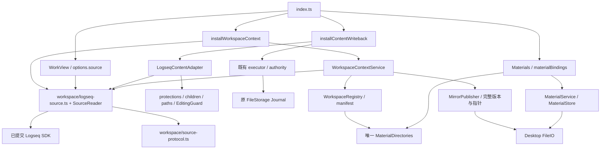
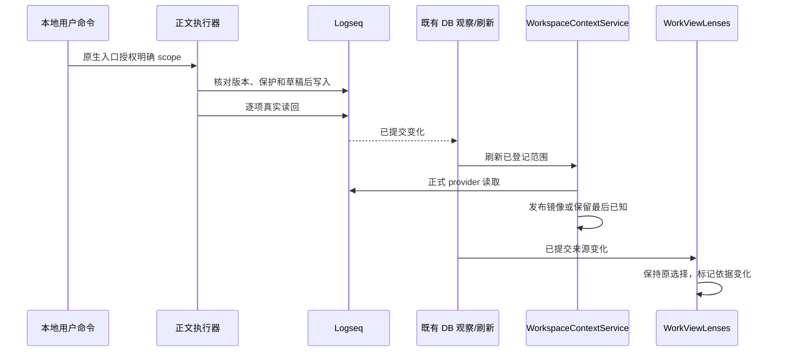

# 工作区整合架构

2026-10-03。正式工作区代码来自远端 `acb1f4a3adb5d7122632245f0c2456853d4f6897`，在本功能分支合并，未重造 workspace-context。参见[设计](../design/workspace-integration-design.md)和[交接](../implementation/workspace-integration-handoff.md)。

## 组合与职责

不增加包、事件总线、SQLite 或外部传输。host 不导入 feature；work-view 未导入 task-center。WorkView controller/renderer/composer 没有重写，组合根只注入正式 provider。材料绑定继续使用正式交付的唯一协调路径。

| 窄端口 | 用法与边界 |
| --- | --- |
| `workspace/source-protocol.ts` | 唯一 SourceScope/BlockTarget/BlockSnapshot/SourceSnapshot 定义，sourceId、sha256、snapshot 和磁盘验证 |
| `logseqSourceReader(): SourceReader` | 真正 SDK provider；不要求绑定工作目录，不读取草稿或布局 |
| `SourceReader.read(scope, valid, pageName?)` | 返回已提交快照；Graph 与生命周期检查；显式 page 读取保留原有路径 |
| `installWorkspaceContext().source` | 供 lenses 的 read(scope) 窄适配；安装/Graph epoch 使旧结果失效 |
| `installWorkspaceContext().sourceReader` | 可信组合根将同一 reader 注入 content adapter；不是外部 JSON 输入 |
| `LogseqContentAdapter.read` | 保留专用写入事实，再读取共享快照；结构/集合版本不一致则拒绝本次读写 |
| `materialBindings` | graph.path 与 graphIdentity 映射及原 MaterialDirectories；不另建目录索引权威 |

content 的独立祖先遍历与保护计算仍是必要消费者适配。它与共享快照的两次 SDK 读取不是数据库事务；若读中变化导致版本不同，返回 `SOURCE_CHANGED_DURING_READ`，不把旧保护套用新正文。严格的 content 范围/大小/UTF-16 校验继续保留。模块独立测试仍可构造专用 adapter，生产默认安装和组合根均接共享 reader。

共享 reader 的真实 SDK rootPosition 保留外部 parentUuid 与实际 order。页级根沿原生 left 链计数，嵌套根用真实父块 children 定位；这些范围外读取只确定位置，快照与授权不扩大。正式 validateSnapshot 与 lenses 消费者均拒绝环、负序号、错误先序/父链及不匹配的 hash。lenses 保留更窄输入校验，类型和版本算法复用正式协议。

## 刷新、绑定与失效

registry/manifest、material binding、mirror 发布机制沿用正式交付。旧目录失联不能使缓存成为写入目标。重新关联 UI 即使 resolve 失败也可显示旧绑定路径；新选择仍须经过正常 registry 核验。原目录仍有同身份记录时拒绝认领另一副本；只有本机登记的 pending 目标可重试中断的关联。pending 记录不改变实际目录绑定，成功后移除，缺失入口文件本身不构成认领依据。未提供磁盘身份全局唯一性服务，不扫描未知备份。

Graph 切换、unbind/rebind、dispose 使用正式服务 epoch/revision；service 的已释放能力在开始 IO 前拒绝。组合根先撤销自己拥有的 namespace 和导航，再等待任务 stop。旧 read 返回 null、旧 apply 返回关闭原因、旧 close 无操作，不能关闭新安装的面板。

## Desktop 兼容与限制

工作区块菜单使用 ASCII 命令键，修复 Logseq 0.10.15 中文生成 hook 可见但未路由的问题。显示标签不变。

`host/desktop-files.ts` 接受既有带 mode 的 stat，也支持 0.10.15 的 size/times 形状：对明确路径调用宿主目录操作，目录返回列表，文件返回 ENOTDIR；其他失败继续拒绝。缺失 stat 且该路径 listdir 返回 null 时，继续确认存在可读取状态的祖先，再按宿主已核验语义判缺失；整条桥接不可用仍报错。跨 iframe 错误归一到本 realm Error，供 optionalRead 正确区分失联与不可读。没有替换 IPC 或引入 Node 文件访问到插件。

该版宿主 listdir 会递归列出所选目录的文件；兼容分支继承此限制，不声称是常数成本 stat，也不提供符号链接 realpath 或跨进程 CAS。SDK 单次写入、文件检查到 rename 之间仍有竞态。原文件保护、最后读回及历史保留不等于断电事务保证。
