# 工作区协作：使用场景、产品交互与内部逻辑详细设计

> 整理日期：2026-10-02。本文汇总最初的工作区设想、架构讨论、本轮使用场景访谈与第 1–68 项确认，并按最新决定消除旧方案中的冲突。它是**目标产品设计**，不是现有功能验收报告，也不表示本文中的协议、目录或界面已经实现。
>
> **设计状态**：核心使用原则已确认，可以据此制作完整原型；并发合并、阶段交叠、局部拒绝、跨层级工作区等细节采用明确标识的建议方案，仍需通过真实工作验证。重入高亮的选择规则明确延后。**主动行动建议及向上层系统推送下一步的能力已取消。**

> **功能开发初始基线**：2026-10-02 已从 GitHub 同步 `main` 至 `85ef106`，四轮重构结果已进入代码基线。本文需求与目标图保持不变，第 20 章的现有能力对照已按该提交校准；新材料能力仍未实现。重构交付的验证范围见[第四轮结果](../refactoring/round-04-results.md)，不视为材料新功能的验收。

## 阅读入口与设计效力

本文使用三种状态，避免把完整设计误解为所有细节都已由用户确认：

| 标记 | 含义 | 后续使用方式 |
| --- | --- | --- |
| **已确认** | 用户明确提出，或接受本轮推荐的规则 | 产品实现与原型应遵守；改变时需重新讨论 |
| **建议方案** | 为使内部逻辑闭合而补充的设计 | 可以进入原型；不能冒充已确认的用户偏好 |
| **待验证 / 延后** | 缺少真实案例，或用户明确留待后续 | 保留问题与验证方法，不提前固化 |

除特别标注外，场景中的基本使用原则属于已确认；实体名称、文件名、事件名、字段与接口样例属于建议方案。图中的服务是**逻辑模块**，不意味着新增同等数量的进程、npm 包或数据库。

本文配有 **19 幅本地 SVG 图例**，无需联网或依赖阅读器支持 Mermaid；每幅图下方折叠保留可编辑的 Mermaid 逻辑源码。分享文档时应连同 `assets/2026-10-02-workspace-diagrams/` 目录一起保留。图 12 采用固定阅读布局，突出原结构与剪枝后的对应关系。

历史依据与适用关系：

- [最初的阶段性需求](../requirements/2026-10-01-project-workspace-collaboration.md)：保留问题来源；其中行动建议、单独的重入概括等内容，以本文的新决定为准。
- [工作区架构分析](../architecture/2026-10-01-workspace-architecture-review.md)：复用职责划分思路；其中 `Action Advisor` 不进入本设计。
- [现有整合说明](../integration/README.md)、[现有包边界](../architecture/target-package-map.md)：用于辨认现有能力，不能据此宣称新设计已经实现。
- [正式任务领域规范](../vnext/06-Task-Copilot-vNext-领域模型与Agent架构规范.md)：正式任务的权限、状态提交与恢复仍沿用现有边界；阶段认可不替代正式任务操作。
- [写作习惯研究](../architecture/logseq-writing-convention-reconnaissance.md)：提供既有写作语言参考；本轮还只读查看了部分真实笔记，没有将私人原文复制进本文。

**发生冲突时，较新的明确用户决定覆盖早期讨论；本文的建议方案不覆盖已确认规则。**本次取消的是新设计中的主动行动建议能力，不是授权本次文档工作删除现有 Kernel 的正式状态或代码。

### 目录

1. [最终产品与第一性原理](#1-最终产品与第一性原理)
2. [范围、角色与不可混淆的边界](#2-范围角色与不可混淆的边界)
3. [核心对象与关联模型](#3-核心对象与关联模型)
4. [系统运行与模块职责](#4-系统运行与模块职责)
5. [工作目录、便携记录与 Git](#5-工作目录便携记录与-git)
6. [场景总览](#6-场景总览)
7. [建立一份工作与接入 agent](#7-建立一份工作与接入-agent)
8. [持续推进、阶段历史与修订](#8-持续推进阶段历史与修订)
9. [查看改动、纠正与认可](#9-查看改动纠正与认可)
10. [写入新想法、批注与局部 TODO](#10-写入新想法批注与局部-todo)
11. [关联零散内容与外部来源](#11-关联零散内容与外部来源)
12. [加入文件、长文本与中间成果](#12-加入文件长文本与中间成果)
13. [重新进入一份工作](#13-重新进入一份工作)
14. [按问题收紧页面](#14-按问题收紧页面)
15. [完成、暂停、重开与交接](#15-完成暂停重开与交接)
16. [原文、视图与编辑器内部逻辑](#16-原文视图与编辑器内部逻辑)
17. [同步、并发、失败与恢复](#17-同步并发失败与恢复)
18. [agent 接入协议与本地程序协议](#18-agent-接入协议与本地程序协议)
19. [写作风格、组织与 skill](#19-写作风格组织与-skill)
20. [现有能力复用与模块演进](#20-现有能力复用与模块演进)
21. [端到端场景脚本与验收](#21-端到端场景脚本与验收)
22. [未决事项与设计验证](#22-未决事项与设计验证)
23. [完整需求与决定索引](#23-完整需求与决定索引)

## 1. 最终产品与第一性原理

### 1.1 最终要做出什么

我们要做的是一套**以 Logseq 任务块为主要入口、以本地文件夹承载材料和成果、由用户与 agent 共同维护的持续工作环境**。一份工作可以关联任务正文、日记中的零散记录、外部笔记、文件以及多轮交流；关联不要求把所有内容搬到同一个位置。工作有持续身份，换一个对话或换一个 agent，仍能接着做。

Logseq 中的任务正文保持权威与可读性，本地文件夹提供可承接的上下文入口。**本地程序维护机械性的同步、存储、历史和渲染；agent 负责理解、工作执行与有意义的内容整理。**agent 暂时离开时，用户仍可以编辑、阅读和查看已有历史，不需要等待模型运行。

渲染层帮助安排注意力：普通阅读保留熟悉的项目结构，查看改动在原文位置展示变化，提出问题时暂时剪去无关内容。**减少阅读量主要依靠选择原文、折叠和局部强调，避免另造一套不断概括的正文。**当用户直接编辑渲染内容时，改变的是对应的源内容。

用户保持推进权。agent 可以按明确工作意图开展工作、维护记录，并在用户主动提问时参与判断；**系统不主动维护行动建议、排序下一步，或向上层任务系统推送可动手动作。**已有 TODO 和想法不构成自动执行的授权。

### 1.2 从不可再拆的需求出发

- **工作必须能被承接。**人和 agent 的会话都会中断，所以工作连续性应由持久内容、身份、来源和历史维持，而非依赖某个对话记忆。
- **同一段正文必须有明确权威。**多个展示副本可以存在，但不能让它们各自成为可写的事实中心。
- **记录应保留影响判断的含义。**简洁需要消除重复与空话，不能删除条件、反例、不确定性和选择理由。
- **自由记录的成本应接近普通写笔记。**用户不必为了机器理解而先分类、填写表单或把每个随想整理成正式条目。
- **人的注意力比存储更稀缺。**界面应帮助决定此刻看什么，完整记录可以保留在背后。
- **改变需要可定位、可辨认、可纠正。**有历史还不够，用户必须能看懂当前这一步改变了什么。
- **阅读、认可与授权是不同动作。**看过内容不表示接受方案，认可阶段也不等于批准正式状态变化。
- **语义判断与机械保证应各负其责。**agent 决定内容意义，程序保证定位、版本检查、写入、读回和恢复。
- **状态应描述已有事实，工作方向由用户发起。**去掉主动行动建议后，事实、问题和依赖仍需清楚记录，但不再派生独立行动清单。

### 1.3 对几组张力的处理

| 张力 | 采用的处理 | 代价与边界 |
| --- | --- | --- |
| 原始记录自由 vs 正文清楚 | 自由输入进入现有结构；agent 在相关工作中局部整理 | 暂时存在未整理内容是允许的，不靠持续提醒逼用户处理 |
| 原文稳定 vs 动态界面 | 一个源模型，加可逆的展示选择 | 渲染器必须保留源锚点，不能只生成漂亮 HTML |
| 简短 vs 含义完整 | 完整段落、必要限定、引用与展开 | 最短页面不一定是足以判断的页面 |
| 自动维护 vs 用户控制 | 常规维护按授权写入；重要选择保留身份 | 普通批注和 TODO 不得转成新授权 |
| 文件夹便携 vs Logseq 权威 | 单向镜像与版本化工作记录 | 离线可承接，不表示离线镜像可以反向覆盖 Graph |
| 详细历史 vs 轻量交互 | 后台存储细粒度修订，前台显示有意义阶段 | 历史不按每次保存堆成阶段列表 |

**核心洞见：阅读单位、修改单位和存储单位可以不同。**一个 Logseq block 可包含多行，用户可按段落阅读、按局部范围反馈，程序按稳定锚点和来源版本保存变化；无需为了 agent 操作方便把所有内容拆成列表。

## 2. 范围、角色与不可混淆的边界

### 2.1 角色

| 角色 | 主要职责 | 不自行承担的职责 |
| --- | --- | --- |
| 用户 | 提出工作目标、自由记录、编辑、反馈、认可、决定任务状态 | 不必维护同步注册表或逐条清空输入队列 |
| agent | 读取当前记录、理解新输入、执行明确工作、整理正文、提交阶段与聚焦计划 | 不把 TODO 当命令，不直接实现长文本收纳，不冒充用户批准正式操作 |
| 本地程序 | 身份与关联、观察变化、同步镜像、写回、阶段持久化、渲染与恢复 | 不凭标记自动得出技术选型，不在无模型时假装完成语义判断 |
| Logseq | 任务正文与自由笔记的主要编辑环境 | 不承载所有二进制文件或每一条界面状态 |
| 文件系统 | 参考材料、草稿、成果与可迁移记录 | 路径本身不作为项目身份 |
| 正式任务内核 | 用户授权后的正式生命周期、归属和提交账本 | 阶段认可、聚焦和折叠不自动成为正式命令 |

### 2.2 本轮范围

**已确认包含**：任务块与工作目录关联、镜像读取入口、agent 持续维护、阶段历史、修订审阅、行首标记处理、外部来源、文件加入、长文本收纳、重入、按问题聚焦、完成与暂停，以及支撑这些场景的本地逻辑。

**未作为首版承诺**：独立于 Logseq 的完整编辑应用、多设备协同、多人实时编辑、所有笔记软件的双向写回、聊天平台全文自动同步，以及通用文件格式的完整内嵌编辑。

**明确取消**：主动行动建议、自动下一步排序、面向上层任务系统的行动建议接口、建议刷新作业，以及为这些建议单独维护的解释文字。跨任务的材料与依赖关系可以记录，用户主动询问时可以查看依据，但不因此恢复主动建议。

### 2.3 权威来源与展示副本

| 数据 | 权威来源 | 副本与展示 | 修改路径 |
| --- | --- | --- | --- |
| 任务自然正文、想法、批注 | Logseq 中的原块及其子树 | 渲染视图、工作目录镜像、历史快照 | Logseq 原生编辑或本地程序精确写回 |
| Markdown 成果正文 | 对应的 Markdown 文件 | 材料编辑器、引用、阶段快照 | 材料模块或已授权文件编辑 |
| 其他文件 | 原文件 | 元信息、预览、适配器提取 | 原生工具或范围内的 agent 文件操作 |
| 正式任务状态 | 现有 Kernel 正式状态与提交账本 | Logseq 受管理投影 | 可信用户命令与既有提交路径 |
| 工作区关联、阶段、修订、认可 | 本地协作记录 | 工作目录中的带版本导出 | 本地程序的协作命令 |
| 排序、折叠、阅读位置 | 个人视图状态 | 恢复用缓存 | 展示操作 |
| 当前问题的内容选择 | 临时 Focus Plan | 聚焦视图 | 用户意图触发，agent 选择，程序验证 |

这里的“Logseq 权威”针对用户的任务正文。**现有正式任务状态是另一类数据，不能通过改写自然段绕开内核，也不能把自然段变成内核生成摘要的副本。**若未来希望正式状态也完全转为 Graph 权威，那属于另一次领域架构决定，本次不预设。



<details>
<summary>图 1 的 Mermaid 源码</summary>

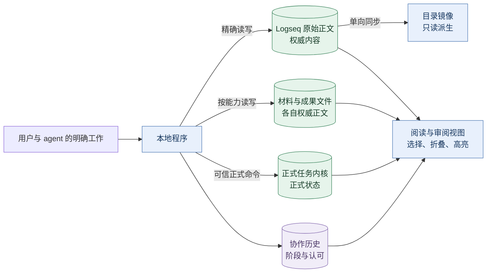
```mermaid
flowchart LR
    U["用户与 agent 的明确工作"] --> P["本地程序"]
    G[("Logseq 原始正文<br/>权威内容")]
    F[("材料与成果文件<br/>各自权威正文")]
    K[("正式任务内核<br/>正式状态")]
    M["目录镜像<br/>只读派生"]
    V["阅读与审阅视图<br/>选择、折叠、高亮"]
    H[("协作历史<br/>阶段与认可")]
    P -->|"精确读写"| G
    P -->|"按能力读写"| F
    P -->|"可信正式命令"| K
    G -->|"单向同步"| M
    G --> V
    F --> V
    K --> V
    P --> H
    H --> V
    classDef source fill:#e6f4eb,stroke:#438963,color:#183c29;
    classDef local fill:#e8f0fc,stroke:#537db6,color:#17375e;
    classDef history fill:#f1edf8,stroke:#8a70b2,color:#493564;
    class G,F,K source;
    class P,M,V local;
    class H history;
```

</details>

*图 1：正文、正式状态、历史和展示各有来源。镜像是读取副本，不建立第二条独立的正文写入路径。*

## 3. 核心对象与关联模型

### 3.1 对象定义

| 对象 | 表达什么 | 关键身份与关系 |
| --- | --- | --- |
| Workspace | 持续存在的一份工作 | `workspaceId`；主要笔记入口；默认一个目录根；可选正式任务绑定 |
| Source | 可以读取或引用的内容来源 | `sourceId`、种类、定位信息、能力、版本和可用性 |
| Source Association | 某来源为什么属于这份工作 | 工作区、来源、角色、相关范围、关联依据 |
| Artifact | 文件作为材料或成果的角色 | 稳定 ID、路径、来源、编辑权限、当前角色 |
| Conversation Reference | 与工作有关的一次交流入口 | 平台或工具、会话标识、可打开地址、用途；可选选定片段 |
| Stage | 一次有意义结果的协作阶段 | 阶段 ID、目标、起点、修订序列、当前结果、认可记录 |
| Revision / ChangeSet | 某次实际变化 | 来源基础版本、前后内容、作者来源、应用结果、所属阶段 |
| Input Range | 一个有意义的个人输入范围 | 所在来源、块或段范围、标记、语义用途、处理关联 |
| Decision | 一个选择及其确定程度 | 选择、理由、条件、依据；区分建议、明确决定与验证事实 |
| Focus Plan | 针对当前问题的临时阅读选择 | 来源范围、祖先结构、强调、隐藏范围、依据版本 |
| Acceptance | 用户认可当时的阶段结果 | 阶段、具体修订、时间、用户来源；不是正文或任务状态 |

**路径是定位信息，ID 才是身份。**任务改名、文件移动、会话更换不应生成一份新工作。正文标签是语义线索，不能替代对象 ID。

### 3.2 关联图



<details>
<summary>图 2 的 Mermaid 源码</summary>

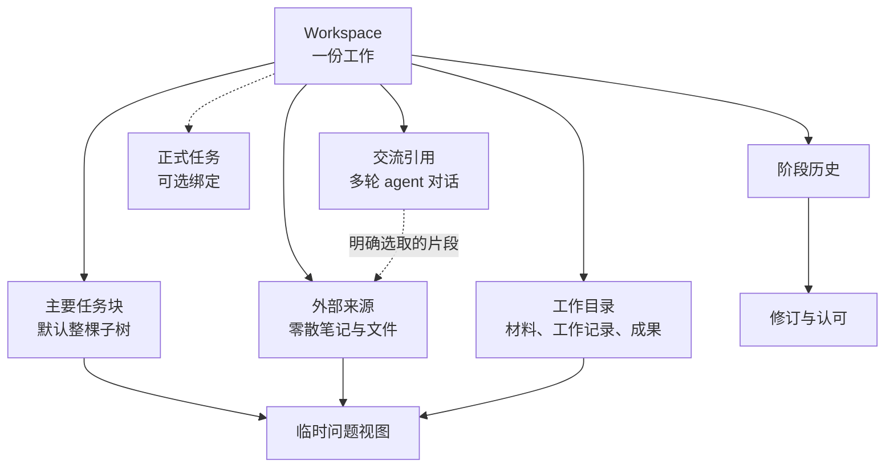
```mermaid
flowchart TB
    W["Workspace<br/>一份工作"]
    N["主要任务块<br/>默认整棵子树"]
    D["工作目录<br/>材料、工作记录、成果"]
    O["外部来源<br/>零散笔记与文件"]
    C["交流引用<br/>多轮 agent 对话"]
    T["正式任务<br/>可选绑定"]
    S["阶段历史"]
    R["修订与认可"]
    Q["临时问题视图"]
    W --> N
    W --> D
    W --> O
    W --> C
    W -.-> T
    W --> S
    S --> R
    N --> Q
    O --> Q
    D --> Q
    C -. "明确选取的片段" .-> O
```

</details>

*图 2：关联关系连接内容，正文仍保存在原位置。交流入口和可读取的交流正文是两种能力。*

### 3.3 来源能力与上下文身份

来源适配器需明确声明 `readable`、`editable`、`watchable`、`versioned`、`rangeLocatable`、`openable` 等能力。一个 PDF 可能可读但不可直接回写；一个其他笔记软件的链接可能只能打开；一个会话引用可能无法自动读取全文。程序与 agent 不得把这些来源伪装成可编辑 Markdown。

上下文中的每段内容至少带有来源、版本、读取时间与角色。机器内部区分事实、用户意图、未确定想法、待讨论选择、验证结果和历史内容；**这些身份不要求全部变成可见标签或属性。**

相同材料属于多个工作区时，原文身份可以共享，关联理由、处理结果和任务判断各自保存。A 项目的结论不会自动成为 B 项目的结论。

### 3.4 工作区与任务层级

**已确认**：任何层级的任务都可能包含任务本身的描述与工作现场；只有 MiniProject 及以上通常需要更明显的目录组织。

**建议方案**：工作区绑定与正式任务归属分开。一项工作默认一个目录根，子任务可使用父工作区内的范围；确有独立材料和成果边界时再建立独立工作区。父工作区不会因为形式上的子树包含，就无限读取每个独立子工作区的全部文件。

**待验证**：子工作区建立后，镜像是否仍包含其任务描述、是否折叠现场、跨目录材料如何去重。首版可先明确支持单一主要任务块与单一目录根，保留关联扩展点。

## 4. 系统运行与模块职责

### 4.1 运行形态

沿用一个 Logseq 插件与一个本地服务的总体部署方式，建立职责清楚的逻辑模块。agent 作为可暂时接入的工作参与者，不成为本地编辑和渲染的运行前提。



<details>
<summary>图 3 的 Mermaid 源码</summary>

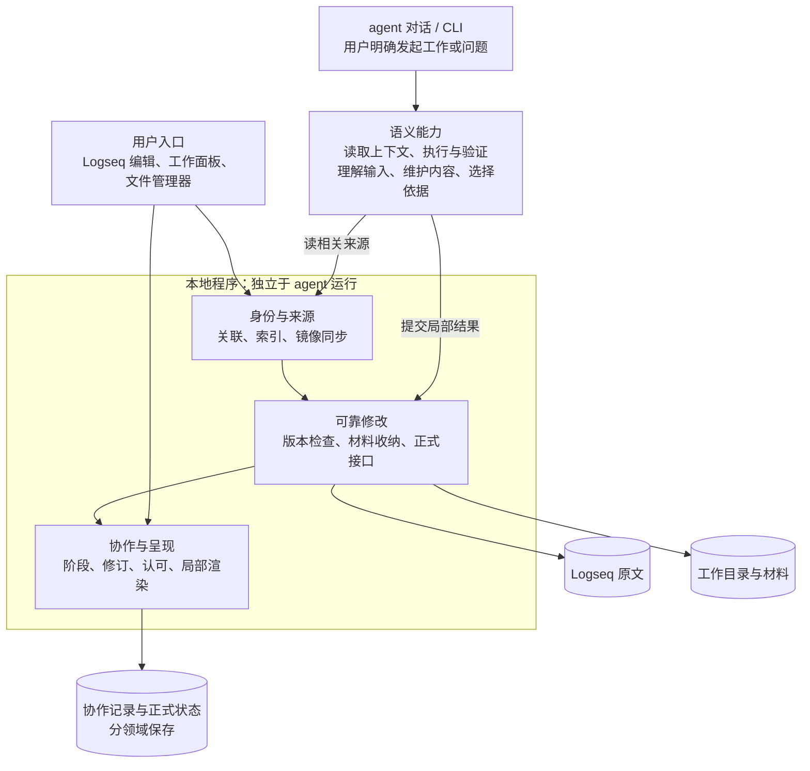
```mermaid
flowchart TB
    USER["用户入口<br/>Logseq 编辑、工作面板、文件管理器"]
    CHAT["agent 对话 / CLI<br/>用户明确发起工作或问题"]
    AGENT["语义能力<br/>读取上下文、执行与验证<br/>理解输入、维护内容、选择依据"]
    subgraph LOCAL["本地程序：独立于 agent 运行"]
        INDEX["身份与来源<br/>关联、索引、镜像同步"]
        WRITE["可靠修改<br/>版本检查、材料收纳、正式接口"]
        RECORD["协作与呈现<br/>阶段、修订、认可、局部渲染"]
        INDEX --> WRITE
        WRITE --> RECORD
    end
    GRAPH[("Logseq 原文")]
    FILES[("工作目录与材料")]
    STORE[("协作记录与正式状态<br/>分领域保存")]
    USER --> INDEX
    USER --> RECORD
    CHAT --> AGENT
    AGENT -->|"读相关来源"| INDEX
    AGENT -->|"提交局部结果"| WRITE
    WRITE --> GRAPH
    WRITE --> FILES
    RECORD --> STORE
```

</details>

*图 3：本地程序持续运行，agent 按工作意图介入。没有主动行动建议模块，也没有后台全库语义扫描模块。*

### 4.2 模块接口边界

| 模块 | 拥有的职责 | 与其他模块的连接 |
| --- | --- | --- |
| Workspace Registry | 工作身份、主要入口、目录绑定、来源关系 | 为读取、材料和历史提供稳定身份 |
| Source Adapter / Index | 定位、读取、版本、观察、能力和可用性 | 不组织技术选型；提供可靠来源事实 |
| Context Builder | 按用途选择原文与历史，输出版本清单 | 重入、维护、问题判断使用不同选择策略 |
| Content Maintenance | 理解输入，产生局部修改计划 | agent 提出计划，确定性执行器检查并写入 |
| Stage Recorder | 阶段与修订、作者来源、结果与认可 | 只记录已发生的写入，不把提议算成成果 |
| View Composer | 来源模型、布局、问题筛选和修订覆盖层组合 | 纯模型计算，不直接调用模型生成 HTML |
| Renderer / Editor Bridge | 稳定节点、动画、局部编辑和来源回写 | 不改正式状态，不自行发起内容整理 |
| Materials | 收纳、转换、关联、历史与文件保存 | agent 调用已有能力，不复制实现 |
| Formal Task Adapter | 将可信用户意图交给现有 Kernel | 不接受阶段认可作为完成授权 |
| Agent Gateway | 读取入口、命令能力、结果协议与会话引用 | 不要求具体模型或会话平台成为唯一入口 |

### 4.3 无 agent 时的能力

**已确认**：agent 不在线时，Logseq 原生编辑、现有视图渲染、文件关联的机械维护、阶段历史与直接修改继续可用。语义整理等待下一次 agent 介入。

**建议方案**：已生成且来源有效的 Focus Plan 可以继续呈现；内容改变后标识其依据变化。重新回答一个新的语义问题需要 agent；无 agent 时可以手动折叠或筛选，但界面不声称已完成语义选取。

如果 Logseq 关闭，目录镜像和历史仍可读取；Graph 写回与实时镜像刷新暂停。如果本地服务也不可用，普通 Logseq 编辑与文件编辑继续，协作命令需待服务恢复。明确区分“agent 离开”“Graph 不可用”“本地服务不可用”，三者的退化范围不同。

## 5. 工作目录、便携记录与 Git

### 5.1 目录原则

**已确认**：目录尽可能简单；普通 Task 可以不分层；MiniProject 及以上按需要组织材料、过程和成果；已有目录结构优先。空目录不为模板完整性而创建。

以下名称是建议，不是要求用户改变既有命名习惯：

```text
普通任务/
  WORKSPACE.md                 # 可发现的读取入口，不是另写一篇项目总结
  整理稿.md                    # 直接放置所需文件
  参考资料.pdf
  .workspace/                  # 协作元数据与只读镜像，按需出现
    manifest.json
    task-mirror.md
    stages/

中等项目/
  WORKSPACE.md
  材料/                        # 参考、原始输入
  工作记录/                    # 独立讨论、实验记录、长文本
  成果/                        # 已形成的可用产出
  .workspace/
    manifest.json
    task-mirror.md
    source-index.json
    stages/
    recovery/
  .longdoc/                    # 仅材料模块实际使用时存在，沿用其记录语义
  .git/                        # agent 判断启用或沿用已有仓库
```

不要求每个尝试都产生 Markdown 报告；短结论可以留在 Logseq，代码、数据、图片保留原生格式。材料模块的恢复记录和协作模块的阶段记录有不同职责，不能各自维护一套同义材料目录。

### 5.2 显式入口与隐藏记录

**显式读取入口**应短小，告诉新 agent 如何刷新和读取、哪个来源权威、当前能力和编辑边界、怎样提交阶段，以及怎样回到 Logseq。它是操作入口，不是另外维护的项目摘要。

**隐藏目录**存储机器记录、版本清单、来源锚点和历史导出，避免侵占日常文件浏览。将工作记录放在隐藏目录，不表示它可以不备份；整个工作目录的便携交接需包含这些记录。

建议入口示例：

```markdown
# 本工作区读取入口

- 工作身份：workspace-…；主要任务入口：由本地程序提供的 Logseq 块链接。
- 开始工作：调用工作区刷新与读取入口；离线时读取带时间和来源版本的镜像。
- 任务正文以 Logseq 为准；task-mirror.md 是程序生成的读取副本。
- 先读任务原文、当前相关成果与新输入，再按当前意图扩展材料。
- 局部 TODO 默认只读；参考材料默认只读；不得把批注当作新增执行授权。
- 修改正文使用本地写回接口；长文本调用材料模块；结果阶段交给程序持久化。
```

示例中的调用名称待接口定稿；读取入口不得写入无法使用的假命令。

### 5.3 单向镜像与便携性

用户希望得到类似“软链接”的实时联系。**实际采用逻辑镜像：Logseq 原文变化，经本地程序单向同步到工作目录。**块不是独立文件，不能仅靠操作系统软链接实现该能力。

镜像默认覆盖主要任务块的整棵子树；明确关联的外部来源单独注明，不自动展开全页或所有传递引用。镜像记录 Graph 身份、块身份、来源版本、同步时间与可用性；缓存和最新状态有明确区别。

**建议方案**：在线协作元数据由本地程序的协作存储串行维护，目录中的记录是带导出版本的便携快照。新环境导入时重建身份、关联和历史索引，并检查 Graph 定位；不让数据库、目录 JSON 与 Logseq 属性各自接受独立关联写入。目录内普通成果仍是原文件，不因导入被复制成第二套权威。

离线读取能够恢复已有背景和进度，但不会假装连接到原 Graph。目录整体复制作为备份时可保留工作身份；作为新项目分支时是否生成新身份，列为待验证，不在首版自动猜测。

### 5.4 Git

**已确认**：是否启用 Git 由 agent 判断，用户认为绝大多数情况可以启用；已有 Git 沿用；默认本地，不要求远端。不要将规则收窄为“只有某类项目才能启用”。

Git 保存文件版本，协作系统保存阶段语义、认可和来源关联。二者可以关联，但不能把 commit 等同于阶段，更不能把 commit 等同于用户认可。一个阶段允许多个文件保存和内部修订；既有仓库也可能包含与该阶段无关的内容。

**建议方案**：后台 checkpoint 仅记录本次涉及的文件，不替用户提交无关改动；存在有价值的未认可稿也可保留版本。大型二进制是否纳入 Git、历史留存与空间策略需按项目判断。凭据、临时锁、可重建缓存不进入 agent 的默认上下文或提交集合。

## 6. 场景总览

| 场景 | 用户触发 | 用户看到的结果 | 主要内部能力 |
| --- | --- | --- | --- |
| 建立工作 | 新建任务块并关联目录，或从已有入口绑定 | 块、文件夹与 agent 有可用入口 | 身份、关联、初次镜像 |
| 接入新 agent | 在工作目录启动并表达意图 | agent 依据现有记录承接 | 刷新、按用途读取、会话关联 |
| 持续推进 | 与 agent 对话开展工作 | 正文与成果逐步更新 | 局部写回、版本、阶段 |
| 看本阶段改动 | agent 形成有意义结果 | 原文位置的紧凑修订 | 差异、锚点、审阅覆盖层 |
| 纠正与认可 | 直接改、批注、对话反馈或认可 | 同阶段修订、保留认可时点 | 变更来源、阶段内部修订 |
| 写入想法 | 在任意相关位置自由记录 | 保留自然表达，下轮被读取 | 范围识别、语义处理、溯源 |
| 关联零散来源 | agent 在相关工作中发现材料 | 合理关联或引用，保留来源 | 有界检索、关联与引用 |
| 加入文件 | 文件管理器加入、移动或重命名 | 文件顺畅进入工作理解 | 文件观察、身份与角色 |
| 收纳长文本 | 粘贴或调用材料能力 | 本地 Markdown 与笔记引用 | 转换、存储、恢复与关联 |
| 重入 | 打开任务 | 熟悉结构中呈现关键原文 | 重入选择、阅读状态恢复 |
| 按问题判断 | 明确表达阅读或判断意图 | 页面收紧，保留依据与结构 | Focus Plan、版本验证 |
| 查看历史 | 打开紧凑阶段入口并选择阶段 | 当时变化与认可情况 | 不可变修订与历史快照 |
| 完成或暂停 | 明确改变状态 | 成果视图或保留工作现场 | 正式命令、视图选择 |
| 交接与迁移 | 更换 agent 或移动工作目录 | 已有内容可承接，链接尽量恢复 | 便携记录、路径重定位 |

**场景不是独立功能按钮的集合。**一轮协作可能同时包含文件加入、个人批注、内容维护和阶段修订；后文用同一套来源与版本模型贯穿这些行为。

## 7. 建立一份工作与接入 agent

### 7.1 默认使用路径

1. 用户在 Logseq 新建任务块，按已有习惯写目标或背景。
2. 用户新建或选择本地目录，建立任务与目录的关联；agent 可以在授权的工作中协助完成关联。
3. 本地程序确定工作身份、主要源块与目录位置，建立可发现的读取入口和初次镜像。
4. 用户在该目录启动 agent，并说明这次想开展的工作。
5. agent 执行明确的刷新与读取动作，获得源版本、关联材料和权限边界，再开始工作。

初次建立不要求写完项目说明、分好所有文件或先整理历史笔记。已经存在的背景和材料可以逐步关联，空字段不显示。

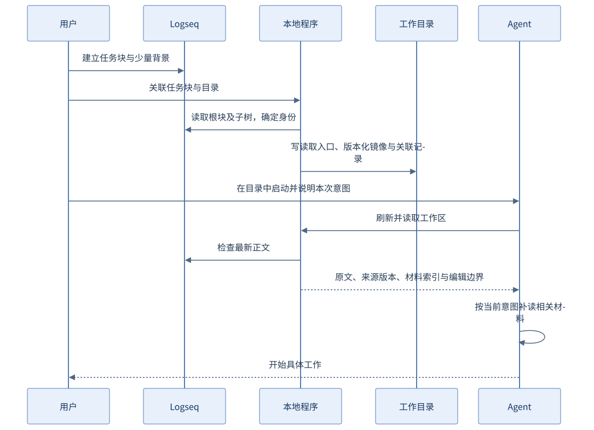

<details>
<summary>图 4 的 Mermaid 源码</summary>

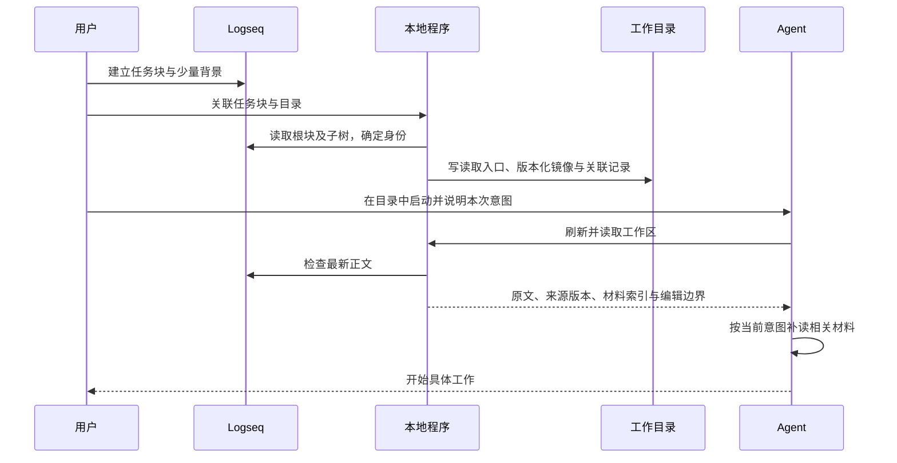
```mermaid
sequenceDiagram
    participant U as 用户
    participant G as Logseq
    participant L as 本地程序
    participant F as 工作目录
    participant A as Agent
    U->>G: 建立任务块与少量背景
    U->>L: 关联任务块与目录
    L->>G: 读取根块及子树，确定身份
    L->>F: 写读取入口、版本化镜像与关联记录
    U->>A: 在目录中启动并说明本次意图
    A->>L: 刷新并读取工作区
    L->>G: 检查最新正文
    L-->>A: 原文、来源版本、材料索引与编辑边界
    A->>A: 按当前意图补读相关材料
    A-->>U: 开始具体工作
```

</details>

*图 4：目录提供承接入口，agent 显式读取最新来源；目录路径本身不等于完整上下文。*

### 7.2 建立过程的变体

以下是建议支持路径，具体入口位置待原型验证：

| 起点 | 建议处理 | 保持的原则 |
| --- | --- | --- |
| 已有目录，后来建立任务块 | 绑定已有目录，扫描文件元信息，按需理解材料 | 不搬文件，不套目录模板 |
| 已有任务，做一半需要工作区 | 就地绑定，保留原任务身份和已有历史 | 不复制成第二个任务 |
| Task 升为 MiniProject | 先改变工作组织需要，再按需建立子目录 | 不因类型变化强制迁移所有文件 |
| 目录已有工作记录 | 先读取并核对原身份，判断恢复还是新关联 | 不静默覆盖旧记录 |
| 块已绑定另一个目录 | 明确显示既有关系，区分迁移与新增来源目录 | 不由重复点击生成两个独立权威 |
| 当前 Graph 无法连接 | 使用带版本的既有缓存；全新关联需保存待校验状态 | 不伪造块身份或最新内容 |

**待验证**：一块多目录、多个根块共用目录、Task 拆分合并和整包复制为新项目的体验。本轮完整收纳这些分支，但不把它们列为已经确认的首版能力。

### 7.3 新 agent 的上下文读取

读取分三步：先恢复工作身份和当前原文，再读取与本次工作有关的新输入及成果，最后按问题扩展到历史和外部材料。默认不把整库笔记、所有文件、全部会话全文塞进上下文。

返回的内容需让 agent 知道：当前目标与范围、已有选择及条件、成果与验证程度、未决问题、相关个人输入、进行中的阶段、相关材料路径，以及来源的新旧程度。这些信息优先来自原有段落和文件，不另写一套独立事实摘要。



<details>
<summary>图 5 的 Mermaid 源码</summary>

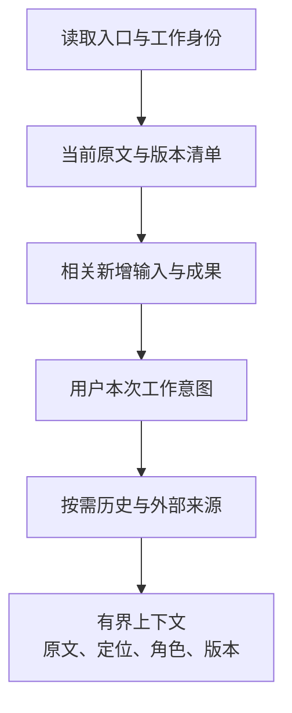
```mermaid
flowchart TB
    ENTRY["读取入口与工作身份"] --> CURRENT["当前原文与版本清单"]
    CURRENT --> INPUT["相关新增输入与成果"]
    INPUT --> PURPOSE["用户本次工作意图"]
    PURPOSE --> MORE["按需历史与外部来源"]
    MORE --> PACK["有界上下文<br/>原文、定位、角色、版本"]
```

</details>

*图 5：材料关联范围可以很广，每次进入模型的范围则由本次用途决定。*

### 7.4 交流的双向关联

**最初需求保留**：从任务入口能找到相关交流，从交流能回到任务与成果；支持多轮会话、多个 agent，以及一次交流涉及多项工作的归属区分。

**建议方案**：有稳定会话地址时保存引用、工具标识与用途；没有可打开地址时保存本地运行标识，并明确其能力限制。阶段可以关联一次或多次交流。重要讨论接入正文或作为选定片段来源，过程聊天不必全部归档。

交流关联不自动授予读取外部平台的权限，也不要求把全部聊天同步进 Graph。没有可访问正文时，agent 只能知道该引用存在，不能声称已读。

## 8. 持续推进、阶段历史与修订

### 8.1 阶段的用户含义

**阶段由有意义的结果划分。**形成一个可评价的方案、完成一轮验证、交付一份可用稿，都可以是一阶段；一次工具调用、保存、聊天轮次或格式润色通常不是。

agent 在工作中可以持续保存。阶段结果形成后，提交目标、成果引用和实际变更，本地程序验证并持久化。这里的“结果说明”是内部元数据或必要的短标题，不能自动变成一篇界面汇报。用户也可以手动建立 checkpoint。

阶段的修正按工作目标判断：修改刚形成的方案措辞、补足遗漏、根据反馈重写，仍属同阶段；开始实际验证这个方案，则可以是新阶段。用户无需每次点“切换阶段”。

### 8.2 三条独立状态轴

**建议方案**：内部不把“写完、看过、认可、任务完成”压成一个状态。

| 状态轴 | 示例 | 所表达的事实 |
| --- | --- | --- |
| 工作结果 | `IN_PROGRESS`、`RESULT_RECORDED`、`INTERRUPTED` | 有无阶段性结果，执行是否中断 |
| 阶段审阅 | `UNREVIEWED`、`REVIEWING`、`ACCEPTED` | 用户认可了哪个具体修订 |
| 来源应用 | `PENDING`、`APPLIED`、`PARTIAL`、`CONFLICT` | 修改是否真的到达各来源 |

前台可以只显示“进行中”“待查看”“已认可”等少量词，不把内部枚举全部铺出来。任务生命周期属于另外一条轴。



<details>
<summary>图 6 的 Mermaid 源码</summary>

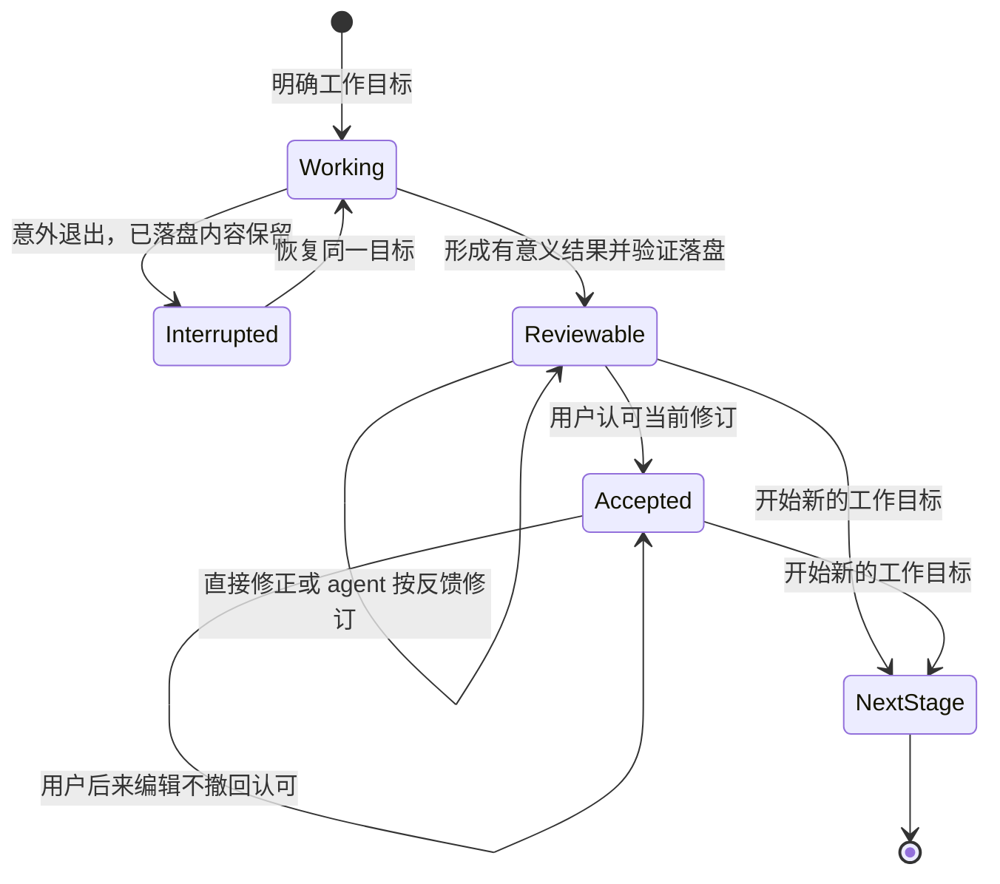
```mermaid
stateDiagram-v2
    [*] --> Working: 明确工作目标
    Working --> Interrupted: 意外退出，已落盘内容保留
    Interrupted --> Working: 恢复同一目标
    Working --> Reviewable: 形成有意义结果并验证落盘
    Reviewable --> Reviewable: 直接修正或 agent 按反馈修订
    Reviewable --> Accepted: 用户认可当前修订
    Accepted --> Accepted: 用户后来编辑不撤回认可
    Reviewable --> NextStage: 开始新的工作目标
    Accepted --> NextStage: 开始新的工作目标
    NextStage --> [*]
```

</details>

*图 6：这是用户理解阶段的示意，不代替三条内部状态轴。未认可就开始下一目标的行为属于建议方案，需验证。*

### 8.3 阶段内部修订与冻结历史

一个阶段包含多个不可变修订，前台历史列表只占一行；点开才看到修订顺序。认可绑定具体修订，保留当时的正文、文件版本、选择身份和认可时点。



<details>
<summary>图 7 的 Mermaid 源码</summary>

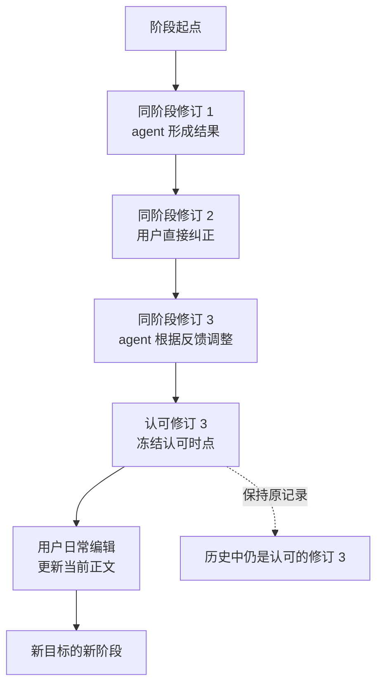
```mermaid
flowchart TB
    B["阶段起点"] --> R1["同阶段修订 1<br/>agent 形成结果"]
    R1 --> R2["同阶段修订 2<br/>用户直接纠正"]
    R2 --> R3["同阶段修订 3<br/>agent 根据反馈调整"]
    R3 --> A["认可修订 3<br/>冻结认可时点"]
    A --> H["用户日常编辑<br/>更新当前正文"]
    H --> N["新目标的新阶段"]
    A -. "保持原记录" .-> HIST["历史中仍是认可的修订 3"]
```

</details>

*图 7：认可之后的人工修改改变当前正文，不改变旧认可，不增加重新认可义务。*

人工编辑连续保存，有可靠证据时标为用户来源；无法判断时保留“外部编辑 / 来源未知”，不得为了界面整齐误归因给 agent。阶段间的人工修改可在后续差异中显示为独立来源，但用户不需要认可自己的输入。

### 8.4 比较基线与未认可阶段

**建议方案**：每个阶段记录两个基线。

- **工作起点**：开始本次目标时的各来源版本，用于判断本阶段实际修改与并发冲突。
- **展示比较点**：上一有意义阶段的已保存结果，用于展示“相比上个阶段改变了什么”；间隔人工编辑单独标明。

上个阶段未认可不阻止新的明确工作目标。它保留自己的未认可结果，下一阶段不自动将它算成已同意。后阶段依赖一个尚未确定的重要选择时，仍以未确定身份表达。

阶段之间若有重叠，按来源版本与实际发生时间定位，不尝试用一条 Git 父链代替所有关系。首版建议一个工作区只允许一个活跃的阶段目标；多 agent 同时开展独立目标的体验留待验证。

### 8.5 阶段历史界面

历史入口默认紧凑或折叠。展开后显示短标题、时间、是否有结果和当时认可情况，不为每次内部修订创建一张卡片。点击阶段默认进入原位置差异，必要时切换到完整当时内容。

历史视图要明确“当时”和“当前”。历史内容不会随外部材料更新；点击旧问题进行纠正时，修改应用于当前来源，旧记录保留并关联后来的纠正。如果当前原文已经变化，先定位当前内容，不能把旧全文覆盖回去。

## 9. 查看改动、纠正与认可

### 9.1 默认修订呈现

**已确认**：采用类似 Word 修订模式的原位置阅读。默认显示新文并轻量高亮，旧文点击展开；纯删除以紧凑标记呈现；必要的周围正文和标题保留。长代码、图片和数据可按需进入文件级差异。

默认不在每处改动旁增加一段解释，不建立独立巨大的变化清单。说明有价值时保存在内部，并由用户点开；即使有空间，也不能因此自动加长正文。

```text
方案
  当前采用按需读取材料，保留每份来源的版本。
  [局部高亮：新增的限制条件] 来源变化时，重新检查受影响的修改。
  [旧内容 ▸]                 [本阶段认可]

工作记录
  完成一次测试，结果与数据文件关联。
  [删除内容 ▸]               # 只有需要时展开
```

上述是布局示意，实际颜色、图标与按钮位置待原型确定；不是向正文插入这些方括号。

### 9.2 用户的三种反馈路径

| 操作 | 改变什么 | agent 如何接收 |
| --- | --- | --- |
| 点击变化并直接编辑 | 当前源内容立即按版本保存 | 下次读取获知新文及用户修改来源 |
| 在对应内容写批注 | 源中的个人输入；尽量沿用行首标记 | 读取并按内容用途处理 |
| 在对话中提出修正 | 当前阶段的反馈意图 | agent 针对本阶段修订后提交新版本 |

**建议方案**：渲染层的“建议”操作帮助创建贴近目标的普通批注块；暂未提交的输入可作为本地草稿保留，但不永久形成另一套可编辑批注正文。已经写入 Graph 的批注由 Graph 权威，界面仅保存定位与关联。

直接编辑、批注后的调整和对话修正都属于同阶段。用户点击历史内容进行反馈时，界面明确显示修正将进入当前正文，并关联原阶段。

### 9.3 认可的精确含义

整阶段认可表示接受当前阶段结果的记录，不需要对每个成果文件再确认一次。**它不自动采纳所有尚未确定的建议，不自动完成任务，也不自动批准更改归属等正式操作。**已在对话中明确决定的内容可准确接回正文，无需重复询问。

**建议方案**：内部认可命令包含阶段 ID 与修订 ID。认可时检查当前显示版本；如果 agent 已提交更新，不能将用户对旧版的点击静默解释为认可新版。界面只在这个真实冲突发生时要求查看新变化，不对普通人工编辑制造审批。

### 9.4 局部保留、拒绝与回退

**尚未确认完整交互。**推荐以直接编辑和轻量恢复旧内容为第一路径，不增加多层审核工作流。用户可以保留一处新文、恢复另一处旧文，结果记为同阶段人工修订，然后认可修正后的整体结果。

恢复旧内容也是对当前源的修改，必须检查后续变化；不能直接回滚整块、整文件或整个 Git 提交而覆盖用户后来写的内容。无法机械恢复时，保留双方文本并定位给用户。是否提供“拒绝本阶段全部变更”快捷操作，需在真实复杂阶段中验证后决定。

### 9.5 审阅中的稳定性

用户正在编辑的范围保持焦点、选区和草稿，后台变化不强制重建界面。与当前阅读无关的变化可以后台记录，历史入口保留可发现性；**这不同于新增个人批注的未处理提醒**，后者明确不做。

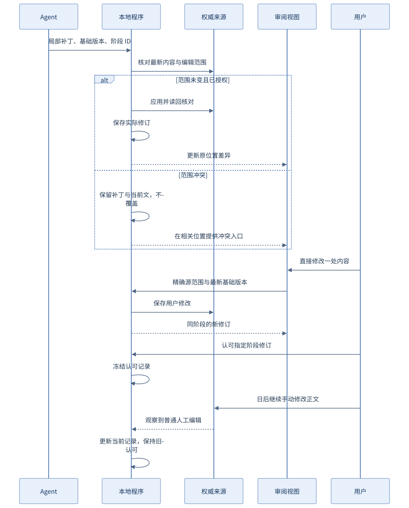

<details>
<summary>图 8 的 Mermaid 源码</summary>

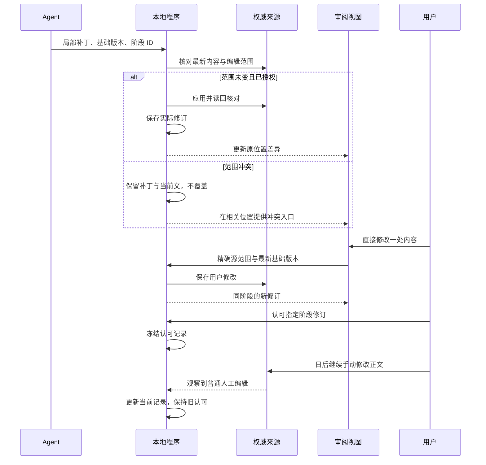
```mermaid
sequenceDiagram
    participant A as Agent
    participant L as 本地程序
    participant S as 权威来源
    participant V as 审阅视图
    participant U as 用户
    A->>L: 局部补丁、基础版本、阶段 ID
    L->>S: 核对最新内容与编辑范围
    alt 范围未变且已授权
        L->>S: 应用并读回核对
        L->>L: 保存实际修订
        L-->>V: 更新原位置差异
    else 范围冲突
        L->>L: 保留补丁与当前文，不覆盖
        L-->>V: 在相关位置提供冲突入口
    end
    U->>V: 直接修改一处内容
    V->>L: 精确源范围与最新基础版本
    L->>S: 保存用户修改
    L-->>V: 同阶段的新修订
    U->>L: 认可指定阶段修订
    L->>L: 冻结认可记录
    U->>S: 日后继续手动修改正文
    S-->>L: 观察到普通人工编辑
    L->>L: 更新当前记录，保持旧认可
```

</details>

*图 8：写入、审阅与认可各有独立事实；最后一步不会重新请求认可。*

## 10. 写入新想法、批注与局部 TODO

### 10.1 保留自然输入方式

用户可以在正文旁、结构中的相关位置、任务末尾或其他笔记位置写新内容。**不要求一个固定输入箱、一个新表单，也不要求先判断内容应该归到哪里。**既有行首标记继续使用，例如 `**[注]**`、`**[想法]**`；同一个 block 内后续行的标记也需识别。

原始笔记需要保持清楚，但自由输入不是错误。agent 先读取与理解，相关工作中再整理；不在进入工作区时机械清洗全部笔记。暂未确定的想法可以原样留存，不增加提醒、计数器或待清理面板。

### 10.2 按“用途与位置”处理，不按标签一刀切

任何层级都可能包含两类内容：**任务本身的描述**与**工作现场记录**。这是一种语义区分，不要求固定建立两个栏目。

| 内容用途 | agent 的处理 | 当前正文最终如何保存 |
| --- | --- | --- |
| 对任务描述的修改意见 | 按意图修改目标表述 | 已落实意见融入正文后删除原批注 |
| 对工作记录的修改意见 | 修正对应记录，保留其条件 | 已落实意见融入记录后删除原批注 |
| 工作现场中的长期补充 `[注]` | 适度润色，必要时调整位置 | 说明保留，不因被读过而删除 |
| 尚未展开的 `[想法]` | 理解、关联相关讨论，保持未确定身份 | 通常保留，不自动执行 |
| 发展为尝试或选型讨论的想法 | 新内容引用原想法，记录尝试或讨论结果 | 原位置可以删除，无需另留一个占位链接 |
| 局部 TODO | 读取为用户的局部提醒 | 默认只读，不执行、不自动正式化 |
| 用途不清楚的 `[注]` | 先保留，在相关讨论中必要时澄清 | 不擅自融合或删除，不额外提醒 |
| 未知标记 | 保留拼写并结合上下文理解 | 不因未进入词表而删除 |
| 无标记正文 | 识别解释、步骤、标题、答案或记录 | 作为正常正文，可在范围内润色，不强制加标签 |

TODO 的只读边界包含不因整理顺便删除、完成或重写它；明确的用户请求可以授权对应操作。讨论提到 TODO，不等于要求执行 TODO。



<details>
<summary>图 9 的 Mermaid 源码</summary>

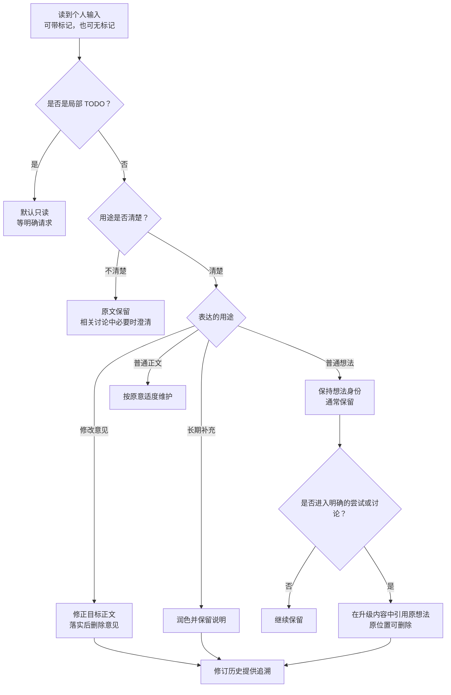
```mermaid
flowchart TB
    I["读到个人输入<br/>可带标记，也可无标记"] --> T{"是否是局部 TODO？"}
    T -->|"是"| TODO["默认只读<br/>等明确请求"]
    T -->|"否"| K{"用途是否清楚？"}
    K -->|"不清楚"| KEEP["原文保留<br/>相关讨论中必要时澄清"]
    K -->|"清楚"| PURPOSE{"表达的用途"}
    PURPOSE -->|"修改意见"| FIX["修正目标正文<br/>落实后删除意见"]
    PURPOSE -->|"长期补充"| NOTE["润色并保留说明"]
    PURPOSE -->|"普通想法"| IDEA["保持想法身份<br/>通常保留"]
    PURPOSE -->|"普通正文"| TEXT["按原意适度维护"]
    IDEA --> UPGRADE{"是否进入明确的尝试或讨论？"}
    UPGRADE -->|"否"| KEEPIDEA["继续保留"]
    UPGRADE -->|"是"| QUOTE["在升级内容中引用原想法<br/>原位置可删除"]
    FIX --> HISTORY["修订历史提供追溯"]
    NOTE --> HISTORY
    QUOTE --> HISTORY
```

</details>

*图 9：决定处理方式的是用途，标记是线索。未知或含糊内容不进入自动删除路径。*

### 10.3 多行、子树与范围识别

**建议方案**：识别 block 首行标记时，将其相关子树作为候选语义范围；识别 block 内部某行标记时，只取该段到下一个同级标记或明确段界的范围，不把整个 block 后半部分都算成一条批注。

解析代码块、引用、Markdown 列表与 Logseq 属性时保留语法身份。代码里的 `[注]` 不是批注，引用中他人的 TODO 不是用户新指令，属性也不因位于行首就被当作内容标签。

一个标记可以同时包含补充说明与修改要求。范围明确时局部处理；无法可靠拆分时保留原表达，由 agent 在相关工作中解释处理，而非强行给整个块一个分类。

### 10.4 前后例子

以下均为合成例子，不是私人笔记摘录。

**修改意见融入描述：**

```markdown
处理前：
  本轮验证全部终端的部署流程。
  **[注]** 这里先只验证两台样机，其他终端下轮再说。

处理后：
  本轮先验证两台样机的部署流程，其他终端留到后续验证。
```

原批注消失，限制条件进入正文，旧内容与修改意图通过阶段修订追溯。

**长期补充保留：**

```markdown
  本轮测试使用独立环境。
  **[注]** 该环境中的时间偏差会影响日志顺序，比较结果时需要先校准。
```

agent 可以润色这条说明，但不能因为已经读过就删除，也不能将其改成“日志已经校准”。

**想法升级为尝试：**

```markdown
处理前：
  **[想法]** 是否可以只读取变化过的材料？

处理后：
  按变化读取材料的尝试
    > 是否可以只读取变化过的材料？
    先在一组材料上验证增量读取。当前已测得读取量下降，
    尚未确认能否正确发现引用关系变化。
```

想法的原位置可以删除；尝试中的引用提供联系，结果的未验证部分保留。它不是“已决定采用增量读取”。

### 10.5 内部追溯与上下文污染

**建议方案**：内部保存输入范围、读到的版本、处理方式和融合目标，不向用户展示待处理计数。内容发生变化后重新判断，不把旧处理状态当作新文本已处理的证明。

上下文污染主要来自**身份被错误提升**，而非文字零散：把想法写成决定、把讨论写成验证、把 TODO 当执行指令，才会改变工作判断。合理做法是保留语义角色和范围，让 agent 读到自由表达，却不误用它。

**读到、理解、整合、采纳与执行分别记录。**读到不等于已落实，保留想法不表示遗漏，适度润色不表示完成了它提出的工作。

## 11. 关联零散内容与外部来源

### 11.1 发现与关联

用户可能在 Logseq 其他页面、日记或另一款笔记软件记录相关内容。agent 在进入工作区或接受新目标时，先读取已关联材料，再做有目的、有限范围的相关检索。本地程序维护已知关联的机械变化，**不默认常驻一个 agent 扫描整库**。

关系足够清楚时，agent 可以关联、引用或提取内容进任务，相关修改进入阶段差异；存在实质歧义时，保留候选关系，在相关讨论中澄清。没有内容访问能力时，仅建立可打开链接，不假装已检索其他笔记软件。

外部来源默认保留原位置；“升级想法后原位置可删除”针对已处理想法的目标位置，不扩展为自动删除所有外部原文。用户明确要求移动或删除时，才按照来源能力执行。

### 11.2 活引用、摘录与派生解释

| 关联形式 | 更新方式 | 用户与 agent 应如何理解 |
| --- | --- | --- |
| 活引用 | 适配器读取当前来源，可机械刷新 | 原始材料当前是什么 |
| 明确摘录 | 保存引入时的原句、范围与版本 | 当时引用了什么，不等于最新原文 |
| 派生解释或决策 | agent 检查新来源后再调整 | 项目如何理解材料，不随源文本机械改写 |
| 阶段历史快照 | 冻结当时材料或必要摘录 | 当时基于什么作出判断 |



<details>
<summary>图 10 的 Mermaid 源码</summary>

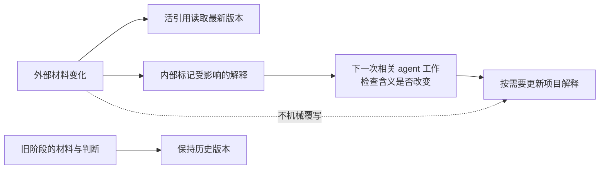
```mermaid
flowchart LR
    E["外部材料变化"] --> REF["活引用读取最新版本"]
    E --> FLAG["内部标记受影响的解释"]
    FLAG --> A["下一次相关 agent 工作<br/>检查含义是否改变"]
    A --> DERIVED["按需要更新项目解释"]
    OLD["旧阶段的材料与判断"] --> FROZEN["保持历史版本"]
    E -. "不机械覆写" .-> DERIVED
```

</details>

*图 10：源材料可以实时更新，项目理解需要语义检查，历史保持当时状态。*

### 11.3 来源不可用与共享

来源删除或暂不可读时，保留已经引入的摘录、分析和最后可用内容。只有用户或 agent 需要使用该来源时，显示可用性与版本；不增加日常弹窗。未来结论确实依赖来源有效性时，agent 应表达这一限制。

一个来源可供多个任务使用，各任务独立记录关联理由与处理状态。共享文件不是所有任务都可写的公用草稿，A 项目不得把自己的解释直接改进参考原文而影响 B。

## 12. 加入文件、长文本与中间成果

### 12.1 文件直接进入

用户通过文件管理器把已有资料、自制成果或草稿加入目录，不需要先经过导入向导，也不要求先分类和填写用途。程序先登记发现事实与元信息；agent 在相关工作中判断用途，并建立必要链接。

**建议方案**：文件的用途与权限分开记录。用途可为参考、输入、草稿、实验数据、成果或未知；权限由来源与授权确定，不能仅根据“放在成果目录”推断已验证、已认可或可随意改写。

| 文件情况 | 默认行为 | 需要额外判断的地方 |
| --- | --- | --- |
| 用户提供的参考或原始资料 | 只读、可引用 | 不因需要简洁而改写原件 |
| 用户明确交给 agent 修改的工作稿 | 在授权范围内修改 | 保留基础版本与修改历史 |
| agent 生成的文件 | 默认可修改 | 用户后续人工内容仍需保护 |
| 新加入的已完成成果 | 关联并按目标检查用途 | “已做好”不自动等于满足全部项目要求 |
| 不明文件 | 可登记位置与类型，暂不全部读入 | 不从文件名猜测决定或指令 |

### 12.2 长文本必须经过材料模块

短解释和过程结论留在 Logseq；长文本、独立复用文档或明显影响页面密度的内容，由已有材料模块转换 Markdown、保存并建立笔记引用。原生代码、图像和数据保留其格式。

**已确认**：有工作区时新收纳内容就近保存于该目录；无工作区时使用全局材料目录。已有外部文件默认引用，不自动搬迁。转换、恢复原文、落盘与链接由材料模块实现，agent 只提供内容或调用模块。



<details>
<summary>图 11 的 Mermaid 源码</summary>

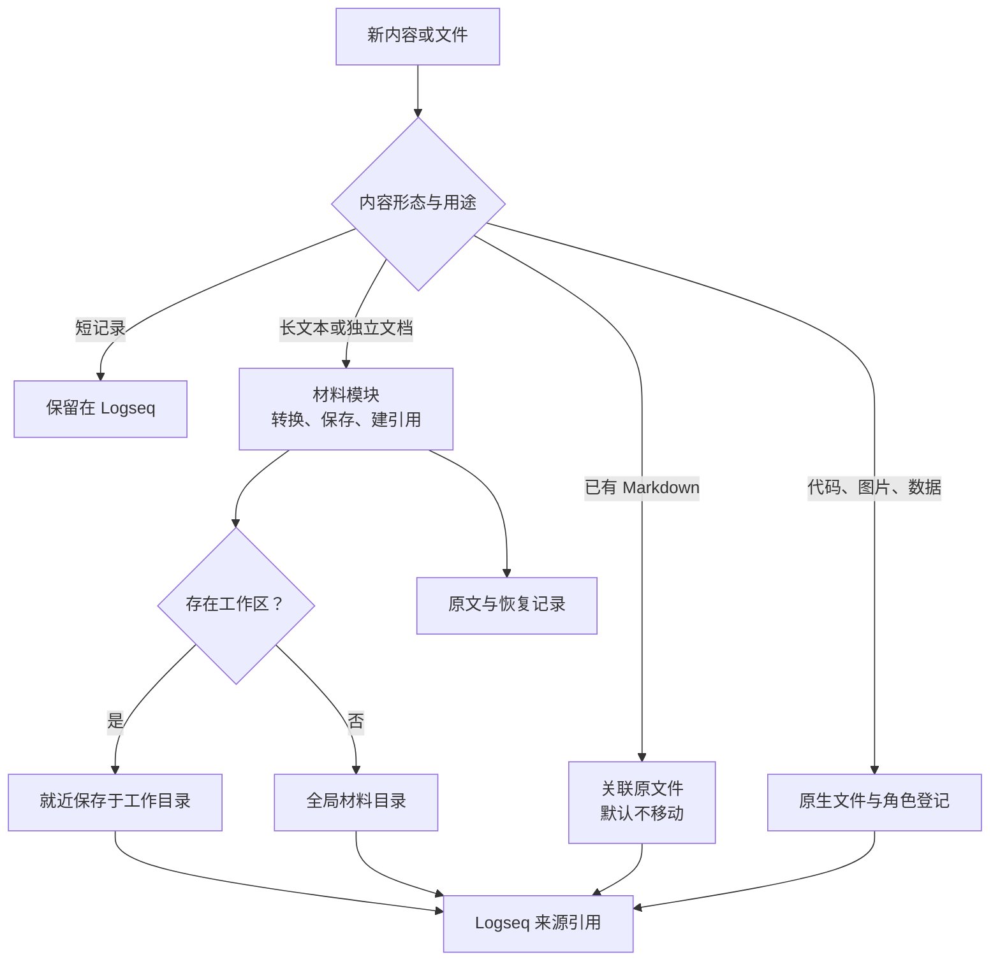
```mermaid
flowchart TB
    I["新内容或文件"] --> TYPE{"内容形态与用途"}
    TYPE -->|"短记录"| NOTE["保留在 Logseq"]
    TYPE -->|"长文本或独立文档"| MAT["材料模块<br/>转换、保存、建引用"]
    TYPE -->|"已有 Markdown"| REF["关联原文件<br/>默认不移动"]
    TYPE -->|"代码、图片、数据"| NATIVE["原生文件与角色登记"]
    MAT --> ROOT{"存在工作区？"}
    ROOT -->|"是"| LOCAL["就近保存于工作目录"]
    ROOT -->|"否"| GLOBAL["全局材料目录"]
    LOCAL --> LINK["Logseq 来源引用"]
    GLOBAL --> LINK
    REF --> LINK
    NATIVE --> LINK
    MAT --> REC["原文与恢复记录"]
```

</details>

*图 11：长文本能力复用材料模块，agent 不另写一套转换和存储逻辑。*

### 12.3 中间产物与失败尝试

保留会影响以后判断的失败结论、实验数据和有价值的工作稿。可重建缓存与构建输出不进入默认审阅；**失败本身不构成自动删除文件的理由**。重复过程可以压缩描述，但不能丢失失败条件。

建议实验记录放在工作记录目录、对应数据保持原生文件；短尝试只需 Logseq 中的一个说明和必要链接，不为每个命令建立报告。整理或清理大量文件时，区分可重建噪声和具有信息价值的内容。

### 12.4 从草稿到成果

agent 在阶段中标明产出及用途，认可阶段后无需再点一次“确认文件成果”。通常保持同一个文件，通过角色与链接表达其当前状态；需要稳定交付版本时再另存，而非每次状态变化都复制文件。

“生成”“运行”“通过特定验证”“满足项目要求”必须分别表达。文件成为成果不意味着所有条件已验证。用户后来修改文件也不自动撤销之前的阶段认可，历史仍保留当时交付版本。

### 12.5 文件变化的审阅粒度

任务正文、相关 Markdown 和主要成果可纳入阶段修订。代码按文件或代码差异查看，数据与图片以元信息、预览及必要版本呈现。默认不把所有文件都铺开，不将日志和缓存噪声混入结果。

用户重命名或移动文件时，本地程序尽量更新关联；不能可靠定位时保留原 ID 和原关系，并在使用时提供重新定位入口。内容 hash 仅是线索：同样内容可能有多个副本，不能据此自动把两个文件当成同一个文件。

跨工作区移动文件时，各工作区的关联分别处理，不自动转移任务语义归属；整个工作目录移动保持工作身份。文件变化无需每次召回 agent 才能维护已知链接。

## 13. 重新进入一份工作

### 13.1 默认入口

进入任务仍在熟悉的项目结构中，不另建欢迎页。优先显示足以恢复理解的原文：目标、当前成果、重要选择、限制与未决问题；具体内容随项目而异。**不维护另一篇“当前状态摘要”或“摘要的摘要”。**

重入视图和原文维护互相配合：如果原文缺少重要事实，应在相关工作中补写到正确位置，而不是用重入页面临时生成一句话补洞。agent 生成的空泛进展、重复背景和无依据结论不能进入默认入口。

### 13.2 安静与位置感

默认不自动进入修订模式，阶段历史按需查看；存在尚未审阅的阶段时只需紧凑入口，不挤占阅读区域。新增个人批注不产生提醒或待处理计数。

已确认可在进入时有短暂高亮。**高亮选择规则明确延后**：由 agent 判断、上次阅读位置、最近有意义变化或组合，尚未决定。它不应顺带变成主动下一步建议。

**建议方案**：普通重入恢复用户折叠与位置，再应用有限的默认原文选择；未结束工作优先保持暂停前现场。来源发生变化时，使用稳定源锚点寻找最接近的位置，不能将旧字符偏移直接套到新文。

### 13.3 重入的充分性

“少”不是固定行数。入口应能让用户辨认正在做什么、已经有什么、哪些选择已定、哪些仍未知。重要条件不能因为折叠默认隐藏到难以发现的位置。用户能快速展开完整原文，检查呈现是否遗漏依据。

重入既服务用户也服务新 agent，但两者预算不同：用户看到少量原文，agent 可按本次目标读取更大的相关范围；无需强迫二者使用同一份摘要。

## 14. 按问题收紧页面

### 14.1 意图触发

agent 对话是主要问题入口，面板配合展示，不再建设第二套完整聊天应用。少量常用问题快捷入口可以存在，但不得挤占常规阅读。

**已确认**：当用户表达判断、比较或“展示依据”的意图时才触发。普通聊天、执行指令和笔记更新不任意改变当前视图。用户主动问“下一步怎么办”时仍可讨论，取消的是后台主动行动建议能力。

### 14.2 选择内容而不是再生成一份回答正文

agent 先判断问题需要什么材料，再从原文中选择范围，同时检查约束、反证与未知。程序验证来源、版本与结构，然后渲染。不要先决定答案再挑支持材料。

首版以完整块、段落及必要标题和祖先为主，保留原顺序。一个很长的 block 可取有可靠段界的完整段落；默认不逐句剪枝。指代、转折和限定条件必须保留。

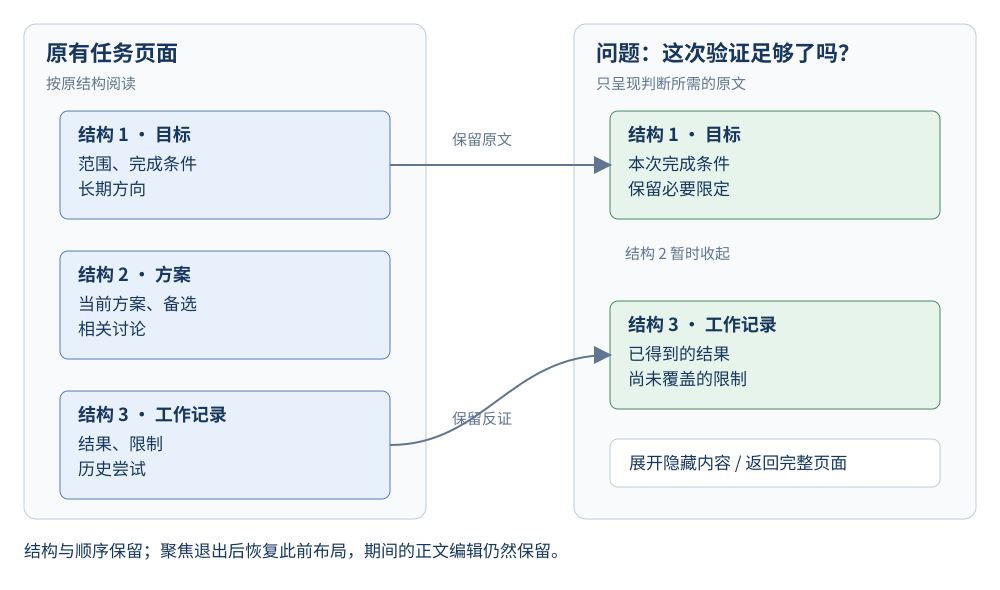

<details>
<summary>图 12 的 Mermaid 源码</summary>

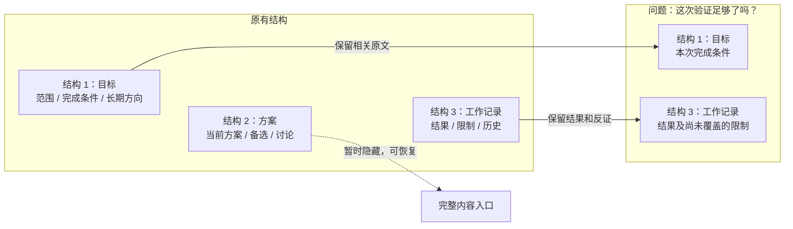
```mermaid
flowchart LR
    subgraph FULL["原有结构"]
        direction TB
        A["结构 1：目标<br/>范围 / 完成条件 / 长期方向"]
        B["结构 2：方案<br/>当前方案 / 备选 / 讨论"]
        C["结构 3：工作记录<br/>结果 / 限制 / 历史"]
        A ~~~ B
        B ~~~ C
    end
    subgraph FOCUSED["问题：这次验证足够了吗？"]
        direction TB
        A2["结构 1：目标<br/>本次完成条件"]
        C2["结构 3：工作记录<br/>结果及尚未覆盖的限制"]
    end
    A -->|"保留相关原文"| A2
    C -->|"保留结果和反证"| C2
    B -. "暂时隐藏，可恢复" .-> REST["完整内容入口"]
```

</details>

*图 12：结构 1 与 3 仍在熟悉位置，结构 2 暂时收起。最小选择包含反证，不只是有利信息。*

### 14.3 临时推断与缺口

原文已经足够时，只展示原文。需要连接证据时可增加一条很短的临时推断；找不到必要材料时表达缺口。**临时推断不是任务正文，不自动进入工作记录，也不演变成另一份长期摘要。**

界面在必要时区分原文与临时推断，保持短小；不强制每个回答都有解释条。用户要把讨论结论正式接回正文时，走内容维护与局部写回。

### 14.4 收紧动画与恢复

**建议方案**：渲染器复用稳定节点，相关内容留在原位；无关区域收起，必要时留下轻量恢复入口。动画帮助理解内容去向，不以夸张移动或重复重排吸引注意。

提供紧凑返回入口与快捷操作。退出聚焦恢复进入前的布局、折叠和阅读位置，期间源内容的编辑保留。对减少动态效果有需求时可直接切换，无需动画才能理解结构。

### 14.5 聚焦中编辑、材料切换与连续问题

聚焦中直接修改原文时，当前选定范围保持稳定，内容就地更新；不因每个字变化重新剪枝。相关推断失去依据时，轻量标识需要更新；新问题或显式刷新才重新选择范围。

打开长 Markdown 使用现有材料阅读与编辑能力，返回时保留问题、选区和阅读位置。默认不把整篇长文铺进任务面板。来源已无法定位时，明确给出当前对应范围，不伪造精确定位。

新问题替换旧筛选，不把多次问题叠成越来越小的交集。支持轻量返回前题，返回前检查来源版本；不永久生成一组“每个问题一页”的笔记。



<details>
<summary>图 13 的 Mermaid 源码</summary>

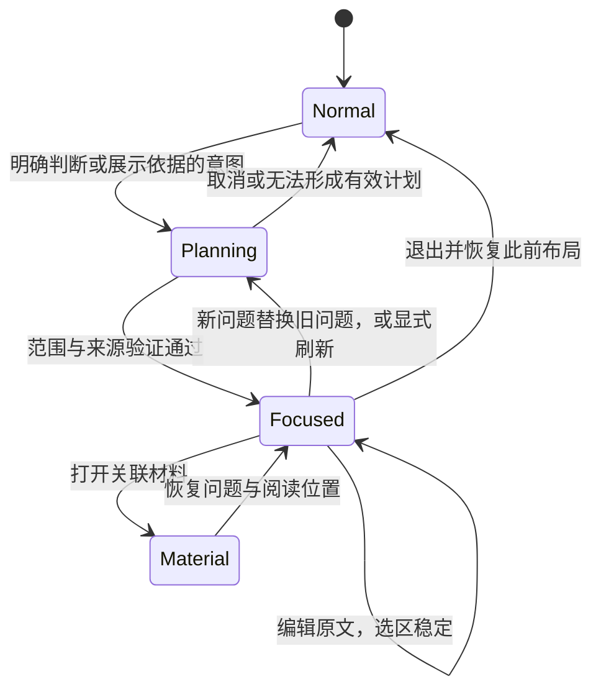
```mermaid
stateDiagram-v2
    [*] --> Normal
    Normal --> Planning: 明确判断或展示依据的意图
    Planning --> Focused: 范围与来源验证通过
    Planning --> Normal: 取消或无法形成有效计划
    Focused --> Focused: 编辑原文，选区稳定
    Focused --> Planning: 新问题替换旧问题，或显式刷新
    Focused --> Material: 打开关联材料
    Material --> Focused: 恢复问题与阅读位置
    Focused --> Normal: 退出并恢复此前布局
```

</details>

*图 13：聚焦是暂时的视图状态；它不创建第二份正文，也不把问题堆成永久页面。*

### 14.6 Focus Plan 建议结构

```json
{
  "workspaceId": "workspace-…",
  "questionId": "question-…",
  "question": "这次验证足够了吗？",
  "sourceVersions": [{ "sourceId": "source-…", "version": "v…" }],
  "visibleRanges": [{ "sourceId": "source-…", "rangeId": "paragraph-…" }],
  "requiredAncestors": ["section-…"],
  "emphasisRanges": [],
  "gaps": ["尚未找到重复运行的验证结果"],
  "temporaryInference": null
}
```

字段是协议建议，不要求用户看到 ID。计划描述源范围与呈现规则，agent 不输出任意 HTML、脚本或自由样式；程序负责安全渲染及版本验证。

## 15. 完成、暂停、重开与交接

### 15.1 完成

阶段认可只表明接受阶段结果。**只有明确的用户完成操作或有效的完成指令，才完成整个任务。**无需另填结项表单，也不以 agent 表示“做完了”代替用户决定。

正式任务按现有可信用户命令路径处理。用户在 Logseq 改状态时，使用既有适配与 Kernel 约束；不能直接用自然正文覆盖内核。明确对话意图如何接入可信用户通道属于接口设计问题，不向外部 agent 发放伪装用户的权限。

完成视图从已有目标、成果、关键决定和遗留问题中选择原文，过程记录可展开；不另写结项总结，不自动移动目录。

### 15.2 完成后的补充与重开

添加笔记、批注、想法、TODO 或文件不自动重开。资料可以继续编辑，任务状态保持已完成；agent 不能看到新 TODO 就决定重启工作。

用户明确要重新推进或手动改变状态时，按任务状态操作处理。**建议方案**：上下文明确的“继续这个任务”可以形成重开意图；引用、条件句、历史讨论或仅要求补一条说明不视为重开。是否另建后续任务，依据用户意图，不强制把每次补充变成新任务。

### 15.3 暂停

暂停保留工作结构、阅读位置和未结束阶段，方便接续。**不强制填写暂停原因、下一步或交接总结。**目录默认原地保留。

体验上的停止会话或暂时离开，不必自动变为正式的 `PARK`、等待或生命周期变化；只有明确改变任务状态时才走正式路径。暂停期间人工编辑正常保存，不立即召回 agent 整理。



<details>
<summary>图 14 的 Mermaid 源码</summary>

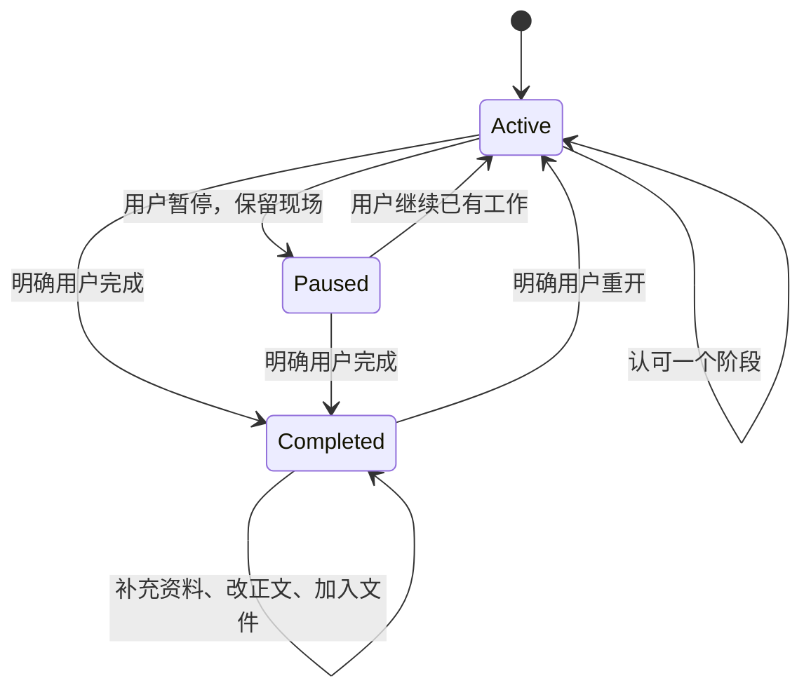
```mermaid
stateDiagram-v2
    [*] --> Active
    Active --> Active: 认可一个阶段
    Active --> Paused: 用户暂停，保留现场
    Paused --> Active: 用户继续已有工作
    Active --> Completed: 明确用户完成
    Paused --> Completed: 明确用户完成
    Completed --> Completed: 补充资料、改正文、加入文件
    Completed --> Active: 明确用户重开
```

</details>

*图 14：体验层状态示意。暂停不必映射到内核的某一个正式枚举，认可与完成也不相互代替。*

### 15.4 新 agent 交接与目录迁移

新 agent 从显式读取入口恢复工作身份、原文、相关阶段、成果、新输入与权限，不要求用户粘贴一篇旧会话总结。未结束阶段可以在同一目标下接续；已结束历史继续保留。

整个目录移动后用稳定身份重定位。Graph 或外部材料路径改变时，保留最后可用关联，再按来源能力恢复；不通过全盘模糊搜索自动认领一个同名项目。

**待验证**：对外分享工作记录、跨电脑迁移、选择性导出、缺失外部文件的整包交付。本轮目标是本机可承接与目录便携记录，不额外承诺所有外部来源已打包。

## 16. 原文、视图与编辑器内部逻辑

### 16.1 六层组合



<details>
<summary>图 15 的 Mermaid 源码</summary>

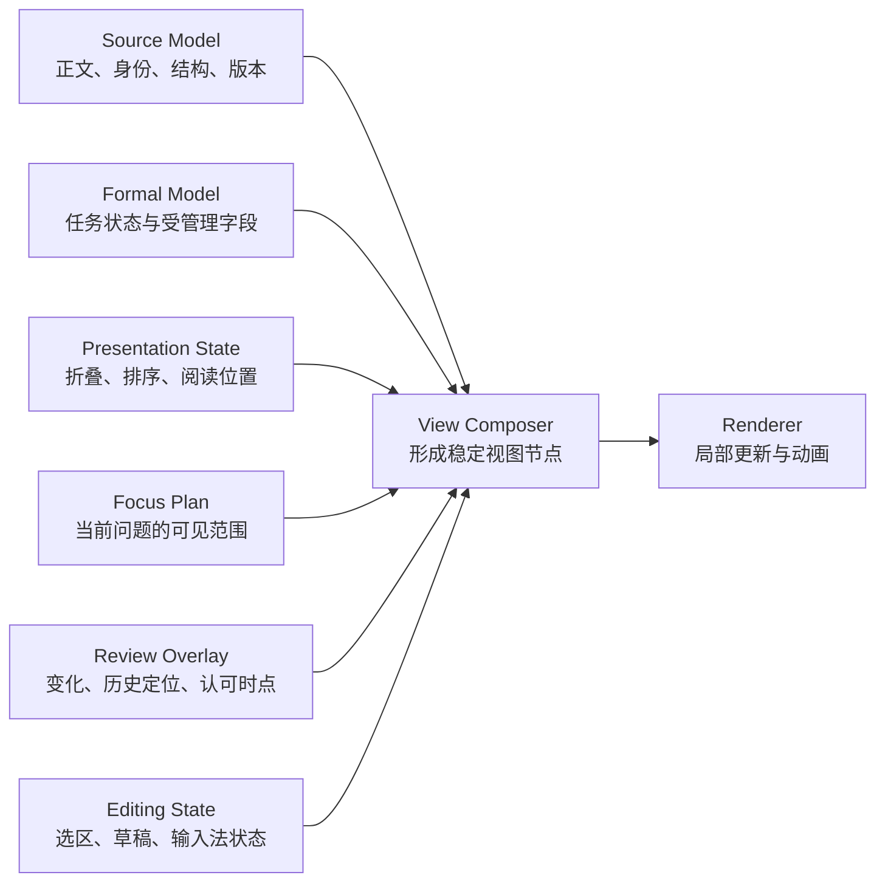
```mermaid
flowchart LR
    S["Source Model<br/>正文、身份、结构、版本"]
    F["Formal Model<br/>任务状态与受管理字段"]
    P["Presentation State<br/>折叠、排序、阅读位置"]
    Q["Focus Plan<br/>当前问题的可见范围"]
    R["Review Overlay<br/>变化、历史定位、认可时点"]
    E["Editing State<br/>选区、草稿、输入法状态"]
    C["View Composer<br/>形成稳定视图节点"]
    DOM["Renderer<br/>局部更新与动画"]
    S --> C
    F --> C
    P --> C
    Q --> C
    R --> C
    E --> C
    C --> DOM
```

</details>

*图 15：原文、个人布局、问题筛选、审阅和草稿分别有状态。改变折叠不使内容提案失效。*

一个来源 block 可以呈现为自然段，同时保留机器范围。界面稳定 key 以源身份和范围为基础，不以当前排序索引为基础。内容版本、布局版本、来源集合版本、聚焦依据版本与 agent 作业 generation 分开。

### 16.2 源范围定位

**建议方案**：Logseq 用 graphId、blockUuid、块版本与范围；Markdown 用材料 ID、文件版本、段落锚点与上下文；局部文字范围同时保存预期旧文和邻近文字。编辑后进行范围映射，不能只保存绝对字符偏移。

锚点失去唯一对应时，视图保留历史依据并显示位置变化，避免把批注挂到另一段相似文字上。恢复位置可以退到可靠的块或章节，不谎称句子级定位成功。

### 16.3 布局与信息密度

自然段承载因果、权衡与条件；分点承载并列、步骤、检查和对照。少量加粗用于结论、限制和变化，不整页强调。布局不强制每个概念一个标题、每句话一个 bullet、每次变化一张卡片。

历史、旧文、说明与系统健康按需展开。重点审阅区域优先占空间，解释存在并不表示必须显示。目录和标题空项不占位置。内容增长后通过选择与展开控制阅读量，同时维护原文结构，不能永久隐藏混乱正文。

### 16.4 编辑保护

输入中保持 DOM 节点、焦点、光标、输入法组合态与未提交草稿；后台更新只作用于可安全更新的区域。晚到的 agent 结果与异步读取结果必须核对工作区、来源范围和 generation，不能复活已关闭面板或覆盖新问题。

聚焦中的编辑稳定当前范围，审阅中的编辑稳定当前 diff 落点。两种覆盖层可以同时存在，但第一版应在主任务模式上清楚指示当前是阅读、审阅还是问题聚焦，避免多种颜色叠加失去含义。

## 17. 同步、并发、失败与恢复

本章给出**内部逻辑建议**。用户已确认避免覆盖人工修改、允许离线读取、持久保存历史等原则，但下面的事件、合并算法与恢复状态仍需实现和真实使用验证。

### 17.1 正常同步链

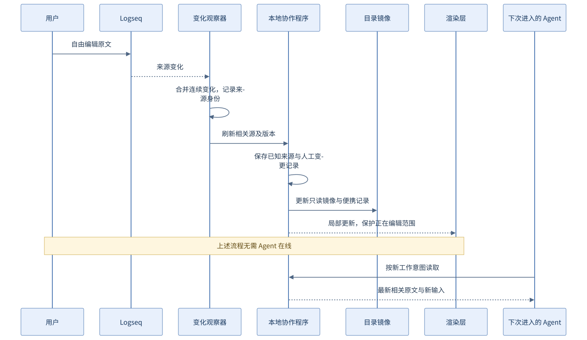

<details>
<summary>图 16 的 Mermaid 源码</summary>

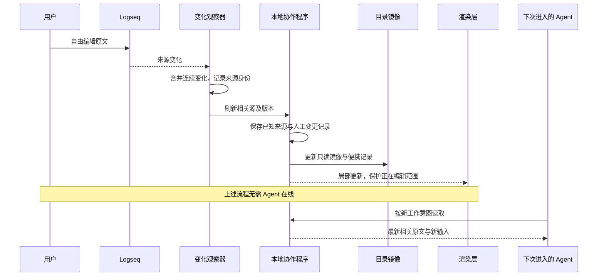
```mermaid
sequenceDiagram
    participant U as 用户
    participant G as Logseq
    participant O as 变化观察器
    participant L as 本地协作程序
    participant F as 目录镜像
    participant V as 渲染层
    participant A as 下次进入的 Agent
    U->>G: 自由编辑原文
    G-->>O: 来源变化
    O->>O: 合并连续变化，记录来源身份
    O->>L: 刷新相关源及版本
    L->>L: 保存已知来源与人工变更记录
    L->>F: 更新只读镜像与便携记录
    L-->>V: 局部更新，保护正在编辑范围
    Note over U,V: 上述流程无需 Agent 在线
    A->>L: 按新工作意图读取
    L-->>A: 最新相关原文与新输入
```

</details>

*图 16：机械观察、持久化与渲染独立运行；语义整理在 agent 下次介入时发生。*

Graph 变化合并与文件监听负责发现事实，不负责识别用户已经作出了什么技术决定。镜像原子替换只是镜像文件的写入完整性，不代表 Graph、多个文件与 SQLite 同时原子更新。

### 17.2 局部修改协议

每个补丁建议包含：工作区、阶段、来源 ID、基础版本、目标范围、预期旧内容、新内容、操作类型、相关输入与幂等键。批量补丁记录逐项实际应用结果。



<details>
<summary>图 17 的 Mermaid 源码</summary>

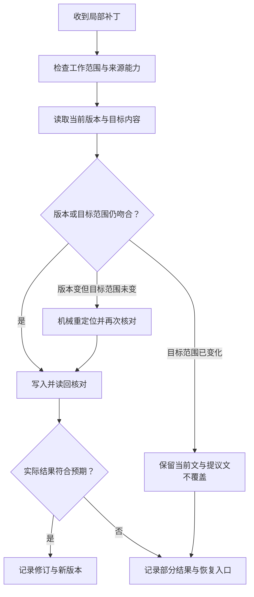
```mermaid
flowchart TB
    P["收到局部补丁"] --> AUTH["检查工作范围与来源能力"]
    AUTH --> READ["读取当前版本与目标内容"]
    READ --> CHECK{"版本或目标范围仍吻合？"}
    CHECK -->|"是"| APPLY["写入并读回核对"]
    CHECK -->|"版本变但目标范围未变"| REBASE["机械重定位并再次核对"]
    CHECK -->|"目标范围已变化"| CONFLICT["保留当前文与提议文<br/>不覆盖"]
    REBASE --> APPLY
    APPLY --> RESULT{"实际结果符合预期？"}
    RESULT -->|"是"| RECORD["记录修订与新版本"]
    RESULT -->|"否"| RECOVERY["记录部分结果与恢复入口"]
    CONFLICT --> RECOVERY
```

</details>

*图 17：对当前内容的核对先于写入；冲突保留双方版本，而不是静默整篇重写。*

跨进程普通文件 IO 没有全局 compare-and-swap。基础版本比较、临时文件、rename、Web Locks 与读回核对能缩小风险和发现异常，但不能宣称消除了所有竞争。必要时以来源适配器的具体能力给出更强保证。

### 17.3 多来源阶段的一致性

**建议方案**：阶段结果使用版本清单，记录每个文件或块的实际写入版本、快照引用和验证结果。不同来源不是一个原子事务，因此先落执行记录，再逐项写入并读回；只有达到本次阶段规定的结果条件，才显示为完整结果。

若正文成功、文件失败，保留部分应用状态和可恢复项，不谎报“阶段全部落盘”。重试使用幂等键和预期内容，已经正确写入的项不会重复追加。补偿也是新的当前源修改，需检查后续编辑，不进行盲目全量回滚。

阶段历史冻结的是所记录版本，不是之后重新读取的“当时路径当前内容”。无法留完整二进制版本时，应保存可用的版本定位或 hash，并明确是否能够恢复原件。

### 17.4 异常矩阵

| 情况 | 仍可做什么 | 恢复逻辑 | 用户交互 |
| --- | --- | --- | --- |
| agent 退出 | 阅读、编辑、查看历史、机械同步 | 已落盘进行中工作可接续 | 不强制创建失败阶段或总结 |
| Graph 暂不可用 | 读镜像，讨论、分析与处理允许的成果文件 | 连接后重读最新 Graph，再核对补丁 | 在使用旧来源时说明时间与版本 |
| 本地服务不可用 | 普通 Logseq 与原生文件操作 | 服务恢复后重新索引已知变化 | 协作操作不可用时才说明 |
| 文件保存冲突 | 当前原件与草稿都保留 | 重新读取后比较、合并或明确选择 | 相关位置的紧凑入口 |
| 部分写入失败 | 查看实际成功与失败项 | 幂等重试或保留待处理补丁 | 不显示完整成功 |
| 旧聚焦计划依据变化 | 原文仍能读与编辑 | 标识旧推断，显式刷新时重算 | 不自动重新剪枝打断阅读 |
| 外部引用丢失 | 读已引入内容和最后可用材料 | 使用时重定位或保持不可用 | 不持续弹窗 |
| 文件移动无法识别 | 原关系和历史仍保留 | 手动定位后更新 locator | 不按同名自动认领 |
| 重复执行请求 | 可查询已执行结果 | 幂等键复用结果，不重复追加 | 不出现重复批注和阶段 |
| 迟到的 agent 结果 | 当前新状态继续使用 | 标记已被新 generation 替代 | 不覆盖新目标或新问题 |

### 17.5 离线编辑与并发范围

离线镜像不是可写第二权威。离线期间可以生成成果、讨论方案；**建议方案**允许保留带基础版本的待回写补丁，重新连接后检查，不把镜像全文反向同步。

首版建议按来源串行执行程序管理的写入，保护正在编辑的范围。多个 agent 可读取同一工作记录，但其提交均需检查当前来源。多个独立阶段同时活跃、自动语义合并和多人协同不在本轮已确认范围，不能以“版本检查”声称这些体验已经解决。

## 18. agent 接入协议与本地程序协议

### 18.1 读取用途

| 用途 | 优先读取 | 避免的默认行为 |
| --- | --- | --- |
| 承接与重入 | 原文目标、相关成果、已定选择、未结束阶段、新输入 | 全部历史与全部文件全文 |
| 维护内容 | 受影响范围、相关个人输入、写作规则、最新版本 | 重新生成整篇项目说明 |
| 回答判断问题 | 必要依据、约束、反例、缺口 | 只筛支持既定答案的材料 |
| 审阅阶段 | 起点、实际变更、当前修订、相关文件版本 | 将提议或计划冒充已应用变化 |
| 正式任务操作 | 现有正式状态、证据、可信用户意图 | 将阶段认可或 TODO 当命令 |

### 18.2 建议能力接口

下表是目标能力契约，不是已经存在的 CLI/API 清单。

| 能力名称 | 输入 | 输出与保证 |
| --- | --- | --- |
| `workspace.bind` | 主要源、目录、现有工作身份 | 建立或恢复关联，重复调用不制造重复工作 |
| `workspace.refresh` | 工作区、期望读取范围 | 最新可用性、来源版本与镜像更新结果 |
| `context.read` | 工作区、用途、当前意图、预算 | 原文范围、角色、定位、版本与能力 |
| `content.apply` | 局部补丁、基础版本、授权范围 | 实际逐项结果、修订、冲突或待恢复状态 |
| `materials.capture` | 内容、原文形态、目标工作区、源位置 | 材料模块转换、保存、恢复记录与引用 |
| `materials.associate` | 已有文件、相关源与用途 | 原文件引用与角色，不默认搬迁 |
| `stage.checkpoint` | 当前阶段、目标与实际结果引用 | 验证落盘后的阶段修订记录 |
| `stage.accept` | 可信用户来源、阶段及修订 | 精确认可记录，不执行正式任务操作 |
| `focus.plan` | 问题与来源版本、范围选择 | 经验证的临时呈现计划 |
| `conversation.associate` | 工作区、会话引用、用途 | 可用的交流关系与访问能力 |

正式任务完成、重开等继续通过现有正式接口与可信用户通道。**不新增行动生成、行动排序或主动建议刷新接口。**

### 18.3 补丁示例

```json
{
  "workspaceId": "workspace-…",
  "stageId": "stage-…",
  "idempotencyKey": "operation-…",
  "sourceId": "logseq-source-…",
  "baseVersion": "v12",
  "target": { "blockUuid": "block-…", "rangeId": "paragraph-2" },
  "operation": "REPLACE_RANGE",
  "expectedText": "本轮验证全部终端的部署流程。",
  "nextText": "本轮先验证两台样机的部署流程，其他终端留到后续验证。",
  "inputRefs": ["annotation-…"],
  "reason": "落实本轮范围批注",
  "decisionStatus": "USER_EXPLICIT"
}
```

`decisionStatus` 只是内容角色，不是 agent 自报即可获得的正式权限。执行器核对输入来源和授权；修改理由可以保留在内部，界面不必显示。

### 18.4 agent 工作约定

1. 开始前执行读取入口，检查来源可用性，不假装缓存是最新。
2. 读新增批注、想法和相关成果，保留未确定身份；TODO 默认只读。
3. 按用户当前目标工作，必要时做有界检索；不要常驻扫全库。
4. 优先局部更新，允许“无需修改”，不为了留下进度而改写正文。
5. 使用本地接口维护任务正文；长文本调用材料模块；普通文件按授权范围操作。
6. 形成有意义结果时提交真实成果、验证与变更，程序保存阶段。
7. 根据反馈修订同阶段；新目标开始新阶段。
8. 留存影响后续判断的条件、失败与来源；不强制写下一步和总结。
9. 只在用户表达判断意图时提供问题聚焦计划。
10. 尊重正式状态权限、个人后续编辑和已有认可，不自动完成或重开任务。

## 19. 写作风格、组织与 skill

### 19.1 个人写作与组织 skill

内容应高密度、精确、清楚，读完能恢复项目理解。风格学习包括选择哪些信息、怎样组织因果和权衡、怎样表达限制与未确定性，不只是模仿加粗标签。

| 写作对象 | 应写清什么 | 应避免什么 |
| --- | --- | --- |
| 当前事实 | 已发生什么，证据或产出在哪里 | “持续推进”“完成优化”等空泛描述 |
| 技术选择 | 当前选择、关键理由、条件、重新考虑的触发因素 | 没有实际权衡的优缺点模板 |
| 未决问题 | 问题本身、为何影响判断、已知条件 | 强行补成下一步清单 |
| 验证 | 运行范围、结果、未覆盖部分 | 把运行一次写成全面满足需求 |
| 失败尝试 | 尝试条件、失败结论与保留价值 | 每一步操作流水账 |
| 背景 | 足以理解本任务的必要前因 | 每阶段重复历史背景 |

自然段优先用于连贯论述，适时分点，不全篇分点，也不为减少 bullet 把并列步骤挤成难读长段。重要部分适量加粗，选型与待解决问题参考用户认可样本。

### 19.2 行首标记处理 skill

独立记录已知标记、典型用途、范围识别、允许润色、保留或删除条件、升级关联与反例。它与写作风格 skill 分开：前者决定内容如何处理，后者决定处理后的文字如何表达。

开放词表，不以当前少数标记封闭整个笔记语言。未知标记的真实案例得到确认后再增加规则。尤其保存同为 `[注]` 却分别代表修改意见和长期说明的对照。

### 19.3 内容维护与问题聚焦规则

内容维护 skill 约束何时修改、怎样局部融合、如何保护条件、何时保持原文。问题聚焦规则约束证据充分性、祖先结构、整段选择与临时推断；可以作为独立 skill，也可先作为明确协议中的策略，不为分类完整而过早建立大量技能。

**取消行动建议 skill。**既有正式治理 skill 不因此被删除，但不能用于重新引入主动下一步推荐。

### 19.4 样例、版本与反馈

**建议方案**：每个 skill 记录版本与适用范围，配少量高质量前后样例及不能照做的反例。阶段内部记录使用过的规则版本，便于分析为什么写坏；不要把全部私人笔记复制进项目。

维护质量用真实重入、局部审阅和纠正成本检验。若只是换词、增加标题或重复概括，应允许无修改。skill 约束语义行为，工具提供机械保证，skill 本身不授予正式权限或外部写入许可。

## 20. 现有能力复用与模块演进

### 20.1 当前实现与目标能力对照

本表基于同步后的 `main` 提交 `85ef106` 核对。**旧架构图中的建议模块不是当前源码模块。**四轮重构已提供较清楚的共享运行时、存储接口和局部渲染基础，后续功能实现仍应核验实际源码与调用。

| 当前落点 | 可以复用什么 | 本设计仍需补什么 |
| --- | --- | --- |
| [工作视图控制器](../../apps/logseq-plugin/src/features/work-view/controller.ts)、[模型](../../apps/logseq-plugin/src/features/work-view/model.mjs)、[来源刷新](../../apps/logseq-plugin/src/features/work-view/source.ts)、[渲染器](../../apps/logseq-plugin/src/features/work-view/renderer.ts) | 来源块树、布局、折叠、串行刷新、编辑草稿与按 UUID 局部渲染，语义版本与 DOM 重绘分开 | 精确源编辑映射、阶段修订覆盖层与问题聚焦计划 |
| [展示操作](../../apps/logseq-plugin/src/features/work-view/operations.ts) | graph/root/expectedSeq 与操作白名单 | 正文写入需独立协议，不能绕入展示 apply |
| [聚焦模型](../../apps/logseq-plugin/src/features/work-view/focus.mjs) | 结构导航和上下文边界思路 | 基于问题的语义选取、反证、来源版本与可逆恢复 |
| [公共面板协调](../../apps/logseq-plugin/src/workspace/context.ts) | Graph/root 布局键、串行面板切换，已移除孤立的 SourceRef / WorkScope 类型 | 完整工作区身份、目录与会话关联；当前并非 Workspace Registry |
| [来源身份](../../apps/logseq-plugin/src/source-identity.ts)、[只读身份查询](../../apps/logseq-plugin/src/block-identity.ts) | 显式关联时持久来源身份、按 Graph/generation 隔离的只读查询；工作视图不再依赖任务 UI 控制器 | 多类来源的统一 locator 与版本模型 |
| [插件共享运行时](../../apps/logseq-plugin/src/plugin-runtime.ts) | 连接、Graph Gateway、来源观察与身份刷新，由 tasksEnabled 控制其生命周期 | 新工作区能力的独立接入，不改变自然材料与工作视图的可用边界 |
| [来源观察](../../apps/logseq-plugin/src/source-change-observer.ts) | 静默合并、已知来源变化报告 | 单向目录镜像与文件集合观察；不是全库语义扫描 |
| [材料控制器](../../apps/logseq-plugin/src/features/materials/controller.ts) | 外部 Markdown 关联、长文转换、引用与恢复、草稿保护；Graph 切换及异步源操作的范围保护 | 工作区就近保存、跨目录定位、材料角色与阶段关联 |
| [材料存储](../../apps/logseq-plugin/src/features/materials/store.ts) | 基础内容比较、历史、临时文件、读回、同源 Web Locks | 多目录归属、文件身份变动；不宣称跨进程 CAS |
| [公共文件接口](../../apps/logseq-plugin/src/host/file-io.ts)、[桌面桥接](../../apps/logseq-plugin/src/host/desktop-files.ts) | FileIO 已提取到 host，材料存储与宿主实现共享能力，宿主不反向导入材料 feature | 以现有实际文件能力适配定位、保存与关联，不引入整套文件平台 |
| [正式 Kernel](../../packages/kernel/src/index.ts) 与 [领域](../../packages/domain/src/index.ts) | 正式任务、授权、提交、证据、恢复与投影义务 | 工作协作能力应在清楚边界内连接，而非全塞入 Kernel |
| [agent 包](../../packages/agent/src/index.ts) 与 [协议](../../packages/contracts/src/index.ts) | 版本化规则、受控执行与输出 | 工作读取、内容维护、阶段与 Focus Plan 接入 |
| [任务中心](../../apps/logseq-plugin/src/features/task-center/controller.ts) | 对象入口与既有正式交互 | 持久交流引用；当前复制上下文不等于会话关联完成 |

当前标记解析主要处理 block 第一行的有限词汇，尚未覆盖本轮要求的后续行、开放标记与语义生命周期。未接入的 `agentContext`、`checkAgentPatch`、`continuingLayout` 等原型与孤立类型已在重构中移除，参见[第一轮结果](../refactoring/round-01-results.md)与[整合说明](../integration/README.md)。未来能力按新协议接入，不能恢复孤立原型后就算实现了正文维护、阶段或语义聚焦。

当前材料收纳主要使用全局配置目录，参考文件目前限定绝对路径 Markdown；PDF、图像、目录集合和本设计的就近工作区管理仍需适配。不能在用户设计中将未来读取能力写成已经可用。

> 材料模块本轮实现状态：就近目录绑定、已知多目录定位、显式/Agent 收纳、普通文件关联、阅读优先和权限检查已接入。范围、实际接口与验证分别见[材料产品设计](materials-module-design.md)、[材料架构](../architecture/materials-module-architecture.md)和[整合验证](../integration/VALIDATION.md)。本补充不改变已确认需求，完整 Workspace、镜像、阶段与聚焦仍未实施，行动建议保持取消。

### 20.2 演进顺序建议



<details>
<summary>图 18 的 Mermaid 源码</summary>

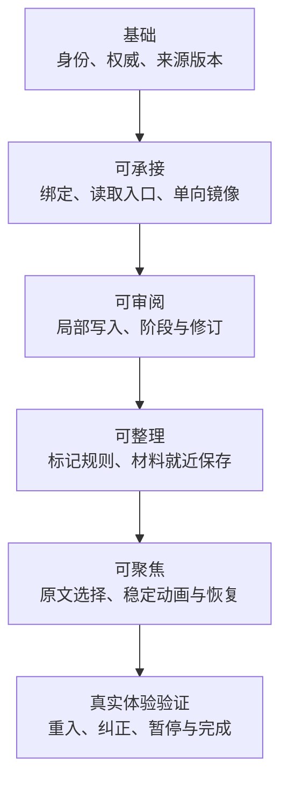
```mermaid
flowchart TB
    A["基础<br/>身份、权威、来源版本"] --> B["可承接<br/>绑定、读取入口、单向镜像"]
    B --> C["可审阅<br/>局部写入、阶段与修订"]
    C --> D["可整理<br/>标记规则、材料就近保存"]
    D --> E["可聚焦<br/>原文选择、稳定动画与恢复"]
    E --> F["真实体验验证<br/>重入、纠正、暂停与完成"]
```

</details>

*图 18：先确保同一内容可靠，再优化如何少读、如何看变化。行动建议不出现在演进链中。*

先形成模块边界，确有复用再拆包。避免一开始引入独立同步平台、分布式事件总线、通用文档数据库或 CRDT，只为处理当前单人本地工作。SQLite 事务继续服务正式状态；Graph 与文件的恢复采用明确的多来源执行记录。

已有四轮代码重构与本设计的功能开发是两件事；底层重构结束，不意味着工作区镜像、阶段历史或聚焦界面自动实现。本轮从重构后的基线增加材料能力，复用已落地的边界与保护。

## 21. 端到端场景脚本与验收

### 21.1 脚本 A：轻量任务，从建立到认可

**起点**：一个短任务块与平铺目录，没有复杂栏目。

| 步骤 | 用户 / agent 行为 | 必须观察到的产品结果 |
| --- | --- | --- |
| 1 | 用户关联目录，在 agent 中表达目标 | 一次关联即可读取，不要求填写模板 |
| 2 | agent 读取并生成短成果 | 正文或文件就位，有可靠实际版本 |
| 3 | 用户在修改位置直接改一句 | 原文更新，仍属当前阶段 |
| 4 | 用户要求 agent 调整另一处 | 同阶段新修订，历史不新增阶段卡片 |
| 5 | 用户认可阶段 | 绑定当前修订，不另确认文件成果 |
| 6 | 用户又补一句说明 | 当前正文更新，旧认可不撤回 |

**验收重点**：简单任务没有过度结构；用户能辨认 agent 改了什么；直接编辑无需再学习一套标记。

### 21.2 脚本 B：MiniProject，想法升级与文件进入

**起点**：有目标、方案、工作记录和几个已有材料。

1. 用户在方案旁写 `[注]` 修改意见，在工作记录写长期 `[注]`，另记 `[想法]` 与局部 TODO。
2. 用户把自己完成的文件放进目录，不分类、不填写说明。
3. agent 读取新增内容，按当前明确目标工作；落实修改意见并删除该批注，保留长期说明和未展开想法，TODO 不执行。
4. 经用户明确讨论，一条想法进入尝试；升级记录引用原想法，原位置可以删除。
5. 长讨论由材料模块收纳进本项目目录，笔记保留引用。
6. agent 记录验证结果与限制，阶段审阅包含主要正文和成果，不包含缓存噪声。

**验收重点**：不同用途的相同标记处理正确；原文不被过度确定化；收纳与链接不靠 agent 手工造目录规则。

### 21.3 脚本 C：长期项目，重入、聚焦与暂停

**起点**：工作已有多个阶段，背景与过程较长，用户隔一段时间重新进入。

1. 默认入口选择已有目标、成果、决定与未决问题，历史折叠，没有新摘要或欢迎页。
2. 用户问“为什么当时选择这个方案？”；原结构中显示相关选择、条件和反例，其余暂时收起。
3. 用户发现条件写错，直接改原文；选区稳定，必要时旧推断标识需要更新。
4. 用户打开相关 Markdown，读完返回；问题和位置保留。
5. 用户退出聚焦，原布局恢复，正文修改保留。
6. 用户暂停；未结束阶段与现场保留，不索要下一步。
7. 新 agent 从目录入口接续当前明确目标，不要求重写一份交接总结。

**验收重点**：少读仍足以理解；结构有位置感；动画、切换与编辑没有相互打断。

### 21.4 脚本 D：完成后补充

用户认可阶段，任务仍未完成；随后明确完成任务，视图选择已有成果。用户后来加入文件、改一处说明、补一个 TODO，任务仍是已完成。只有明确重开才进入继续推进。目录在整个过程中不自动移动。

### 21.5 脚本 E：冲突与中断

agent 读取某段后，用户先改了同一段。agent 的旧补丁到达时被保护，当前文与提议文都保留。另一文件已经成功写入时，阶段记录真实的部分结果。程序重启后恢复未结束工作，重试不重复追加。Graph 不可用时可读缓存，但连接后不把缓存全文反向覆盖。

**验收重点**：不能用“保存成功”掩盖部分失败，不能用“整体阶段回退”覆盖用户后改。

### 21.6 连续协作泳道

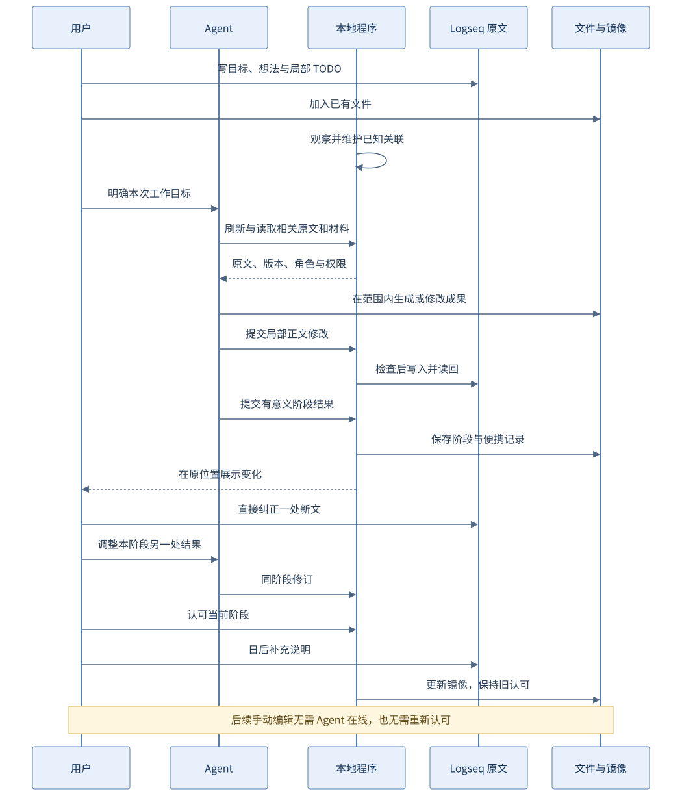

<details>
<summary>图 19 的 Mermaid 源码</summary>

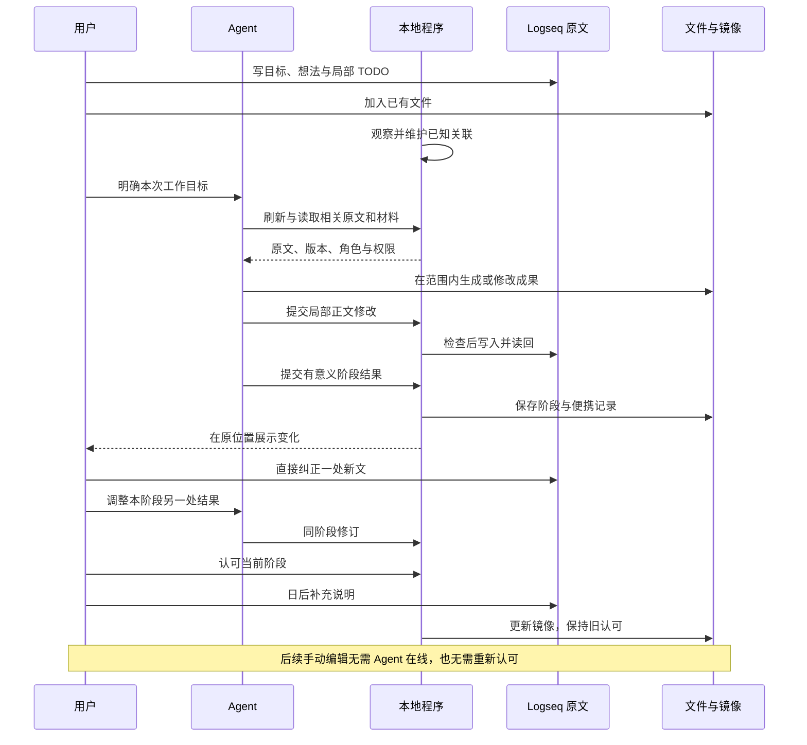
```mermaid
sequenceDiagram
    participant U as 用户
    participant A as Agent
    participant L as 本地程序
    participant G as Logseq 原文
    participant F as 文件与镜像
    U->>G: 写目标、想法与局部 TODO
    U->>F: 加入已有文件
    L->>L: 观察并维护已知关联
    U->>A: 明确本次工作目标
    A->>L: 刷新与读取相关原文和材料
    L-->>A: 原文、版本、角色与权限
    A->>F: 在范围内生成或修改成果
    A->>L: 提交局部正文修改
    L->>G: 检查后写入并读回
    A->>L: 提交有意义阶段结果
    L->>F: 保存阶段与便携记录
    L-->>U: 在原位置展示变化
    U->>G: 直接纠正一处新文
    U->>A: 调整本阶段另一处结果
    A->>L: 同阶段修订
    U->>L: 认可当前阶段
    U->>G: 日后补充说明
    L->>F: 更新镜像，保持旧认可
    Note over U,F: 后续手动编辑无需 Agent 在线，也无需重新认可
```

</details>

*图 19：端到端协作中，用户输入、agent 工作与本地程序保证持续交织。*

### 21.7 质量评价

| 维度 | 应观察的证据 | 失败信号 |
| --- | --- | --- |
| 重入 | 用户能凭入口恢复目标、成果、选择与问题 | 仍需翻聊天或读一长篇概括 |
| 语义保真 | 条件、未知和来源能被查到 | 想法变决定、运行变验证 |
| 审阅负担 | 有意义变化可在原位读懂 | 每次打开都是大量卡片或重复旧文 |
| 自由记录 | 用户能继续按原习惯写 | 必须先填表、清输入或放进固定箱 |
| 原文质量 | 直接打开 Graph 也能读懂 | 仅渲染层好看，原文不断混乱 |
| 聚焦充分性 | 相关限制、反证、缺口保留 | 页面很短，却隐藏影响判断的内容 |
| 可靠保存 | 重启后有实际修订和恢复记录 | 会话一关就丢历史，部分写入算成功 |
| 控制权 | TODO、认可、完成各守其界 | agent 主动推进未授权工作 |

不以笔记字数、生成报告数量或阶段数量评价质量。具体时间目标、可接受行数和动画参数需经原型测量，不在缺少证据时虚构固定指标。

## 22. 未决事项与设计验证

### 22.1 明确延后

| 事项 | 当前决定 | 不应提前做什么 |
| --- | --- | --- |
| 重入短暂高亮的选择规则 | 已确认可以高亮，选择逻辑以后讨论 | 不把某种 agent 选择或上次位置策略写成已确认 |

### 22.2 建议方案仍需验证

| 分支 | 本文推荐方向 | 应用什么案例验证 |
| --- | --- | --- |
| 未认可就进入下一目标 | 保留旧认可状态，以新目标建立阶段 | 用户连续开展两项工作但晚些统一审阅 |
| 阶段比较基线 | 同时记录工作起点与展示比较点 | 阶段间人工修改、部分认可、后续依赖 |
| 局部拒绝与整体恢复 | 先用直接编辑与局部恢复，保护后改 | 正文已部分人工改动时拒绝 agent 某处 |
| 一个任务多目录 / 父子工作区 | 身份与正式归属分开，按需独立工作区 | 子任务开始产生独立成果 |
| 多 agent 同时工作 | 可并行读，版本检查与来源串行写 | 同段冲突与不同文件同时产出 |
| 新语义问题但 agent 不在线 | 正常读与编辑，使用有效旧计划 | 用户仅开本地视图时尝试新问题 |
| 多来源部分失败 | 执行日志、逐项结果、幂等恢复 | 正文成功但成果文件失败 |
| 未知标记及混合批注 | 保留原意，范围清楚才拆分 | 相同标签表达不同用途的真实笔记 |
| 长段落剪枝 | 优先完整段落，不逐句裁切 | 含转折、指代和多条件的长块 |
| 完成后“继续”的解释 | 明确上下文才形成重开意图 | 补充资料、仅修改描述、重新开展工作 |
| 整包复制与跨电脑迁移 | 导入版本化记录，区分备份与新工作 | 复制目录、Graph 路径变化、外链缺失 |
| 交流引用跨平台 | 能力声明，关联不等于全文访问 | 无稳定 URL 或一个对话涉及多任务 |

这些分支并不妨碍开始原型，但可能妨碍直接写成固定开发规格。下一步用三类真实工作跑完整路径，针对具体歧义继续访谈，而非继续扩充抽象功能清单。

### 22.3 本文未实施的内容

本文只创建详细设计文档与图例，不修改生产笔记、技能、正式任务状态、文件组织或应用代码。未来 skill 样例、原型与协议实施各自需要验证；“完整设计”不表示“所有实现均已获验收”。

## 23. 完整需求与决定索引

### 23.1 访谈决定映射

编号用于追踪本轮问答，不是现有任务、issue 或实现版本号。

| 决定编号 | 最终采用内容 | 文档落点 |
| --- | --- | --- |
| 1–4 | 可承接目录、Logseq 正文权威、主要在 Logseq 使用、显式读取入口 | 2、5、7 |
| 5–7 | 根块子树镜像、程序写回、刷新与离线缓存 | 5、7、17 |
| 8–11 | 有意义阶段、程序落盘、连续人工编辑、常规维护与重要选择分开 | 8、9、18 |
| 12–15 | 紧凑历史、原位置差异、同阶段反馈与整体认可、中断保留 | 8、9 |
| 16–19 | 按工作目标划阶段、认可后人工修改无需重认、紧凑旧文、历史纠错写当前 | 8、9 |
| 20–23 | 保留标记习惯、语义区分、先读后整理、TODO 不自动正式化 | 10 |
| 24–27 | 支持后续行标记、无输入提醒、允许润色移动、按用途处理批注想法 | 10、19 |
| 28–31 | 参考真实笔记、无标记正文、歧义保留、想法升级后原位置可删、TODO 明确请求才执行 | 10、19 |
| 32–35 | 适当润色、开放标记、长文就近保存、外部来源默认保留 | 10、11、12 |
| 36–39 | 活引用更新与解释分离、失效保留、共享来源独立处理、有界搜索 | 11、17 |
| 40–43 | 简单目录、长文由模块处理、agent 文件可编辑、文件变化按合适粒度审阅 | 5、12 |
| 44–47 | 阶段认可覆盖成果、保留有价值失败、移动追踪、agent 判断 Git | 5、9、12 |
| 48–51 | 原结构重入、选择原文、安静入口、短暂高亮规则延后 | 13 |
| 52–55 | 对话为问题入口、按意图触发、整段剪枝、短暂推断不写正文 | 14 |
| 56–59 | 可逆聚焦、编辑稳定、新题替换筛选、材料打开与返回 | 14、16 |
| 60–63 | 问题整体撤回；主动行动建议取消 | 2、18、23.2 |
| 64–66 | 用户决定任务完成、选择原文展示成果、完成暂停不搬目录 | 15 |
| 67–68 | 完成后补充不重开、暂停保留现场 | 15 |

### 23.2 最初设计的保留、修订与取消

| 最初设想 | 本轮处理 | 最终含义 |
| --- | --- | --- |
| 任务块、目录与交流双向关联 | 保留并细化 | 稳定工作身份，交流引用有能力边界 |
| agent 持续维护背景、选择与状态 | 保留并收窄 | 维护原文，按有意义变化局部更新，不无限扩写 |
| 自由输入与良好组织共存 | 保留并细化 | 输入不被当成破坏；按用途保留、融合或升级 |
| 渲染层与原始笔记分离 | 修订 | 分离展示状态，正文仍是一份；不靠漂亮渲染掩盖混乱 |
| 当前状态帮助重入 | 保留并修订 | 选择原文呈现，不维护独立摘要 |
| 用笔记本身回答问题 | 保留并细化 | 原结构剪枝，反证与缺口保留，临时推断可选 |
| agent 改完可高亮、反馈或接受 | 保留并细化 | 原位置修订、同阶段纠正、精确认可时点 |
| 文件进入顺畅、自动关联 | 保留并细化 | 先进入后判断，不要求导入分类；材料模块负责收纳 |
| Git 默认使用值得讨论 | 已决定判断主体 | 由 agent 判断，多数情况下可启用，产品历史另有职责 |
| 一组个人 skill | 保留并细化 | 写作组织与标记处理独立，内容维护与聚焦按需划分 |
| 处理结果需要可见 | 收窄 | 通过正文变化与历史可查，不增加输入提醒和计数器 |
| 原始表达始终可追溯 | 保留并修订 | 历史与升级引用追溯，不强制原批注永留当前正文 |
| 认可后变化再次审阅 | 用户修正 | 后续人工直接编辑无需重新认可，不归责旧 agent 阶段 |
| 上层系统暴露可动手动作 | **取消** | 不生成、排序或刷新主动行动建议 |
| 建议背景用选择性渲染展示 | 去除主动建议用途 | 保留用户主动提问时的证据呈现能力 |
| 跨任务成果与依赖 | 保留事实关联 | 不据此恢复跨项目行动推荐 |

### 23.3 实现前必须守住的约束

- **一段正文有一个权威来源。**镜像、Focus Plan 和渲染器不会形成另外两份可编辑正文。
- **阶段认可不等于任务完成，也不等于重要方案采纳。**正式操作继续使用可信用户授权。
- **认可后的用户编辑无需重认。**历史保留当时结果，当前内容继续更新。
- **TODO 默认只读。**想法、批注和外部摘录不能变成执行授权。
- **原文清楚与自由记录同时成立。**允许暂时零散，维护时保留意思、条件和未确定性。
- **不增加未处理输入提醒。**内部处理关联服务 agent 与追溯，不变成人类清单负担。
- **长文本经过材料模块。**工作区新内容就近保存，已有外部来源默认留在原处。
- **聚焦是可逆阅读选择。**保留原结构与充分依据，不堆摘要，不任意重新剪枝。
- **历史反映实际落盘结果。**中断与部分失败可恢复，不能冒充完整完成。
- **行动建议已经取消。**模块图、协议、skill 与验收中都不重新引入主动下一步系统。

这份设计的验证对象是完整的工作体验：用户能顺手写、容易看懂变化、能从原文恢复理解，新 agent 能依据持久记录承接，同时不需要持续管理系统产生的第二套内容。
