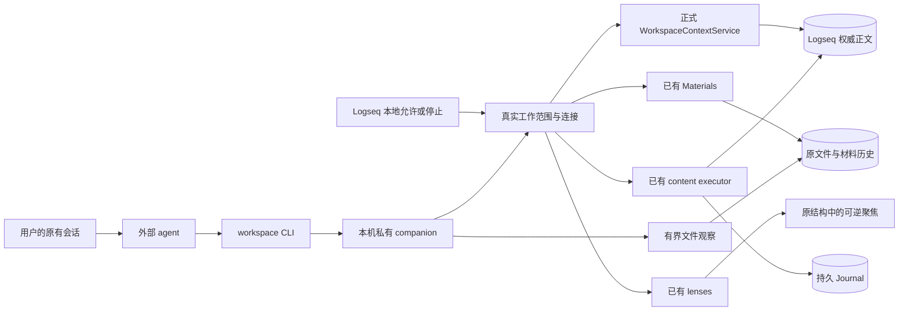
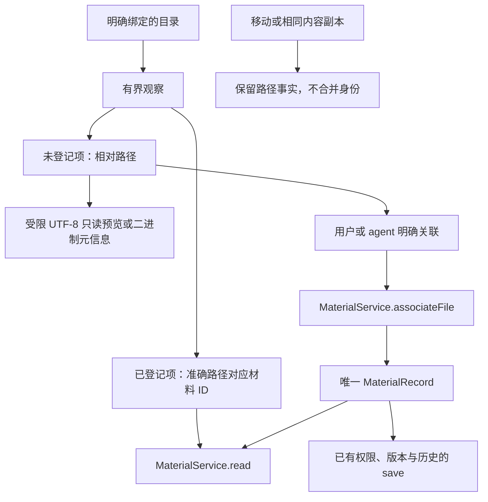
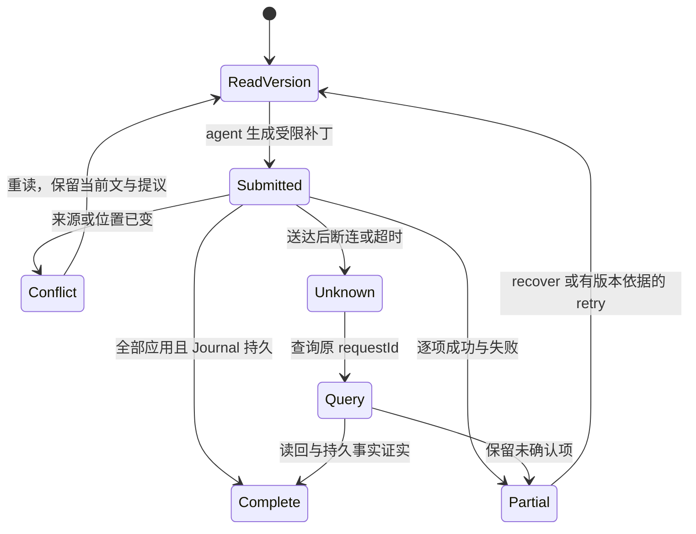

# Agent 工作区：产品设计

交付日期：2026-10-03。适用实现：`codex/agent-workspace`；首次正式来源依赖为已发布 `acb1f4a3adb5d7122632245f0c2456853d4f6897`；用户授权发布时整合远端 main `07008fca018eb7391408e52d6bdb8b868a56fcf1` 的唯一来源接线与阶段工作台。本设计描述实际实现，验收证据见 [handoff](../implementation/agent-workspace-handoff.md)。

## 用户如何使用

用户继续在原来的 agent 会话交流。在 Logseq 为工作块关联一个 Graph 外的目录，启动本机 `workspace serve`，在插件设置填入它返回的私有 descriptor **路径**，选择工作块并执行「工作台：允许 agent 连接当前工作」。这个动作允许连接维护该块的真实正文子树；后续补丁无需重复确认。材料保留已有角色和编辑权限，局部 TODO 与正式字段继续受保护。

agent 从工作目录调用 CLI，读取真实工作身份、请求刷新，再按用户问题选择原文或按明确意图提交局部修改。目录中的说明和源文本都是数据，不会授予范围、作者或正式任务权限。用户不用填写补丁 JSON、UUID 或权限矩阵；这些机器输入由 agent 根据读取结果生成。

连接故障时，Logseq 原生编辑、本地工作视图、材料、手动范围聚焦和已有历史继续运行。自然工作通道有自己的进程和生命周期，不启动正式 AgentRun、Proposal、GraphEffect、SQLite 或 Kernel；`tasksEnabled=false` 的真实路径已验证。

## 入口与刷新

正式 Registry 拥有 `.task-workspace/manifest.json` 和生成的读取入口。通常是 `WORKSPACE.md`；若用户已有同名文件，沿用 Registry 指定的 `WORKSPACE.task-copilot.md` 等入口，不覆盖用户文件。companion 只发布派生的 `agent-connection.json`，里面没有令牌，也不新增工作身份。

`workspace status` / `capabilities` 需要实时插件响应。`workspace refresh` 真正调用正式来源 provider，返回 `checked` 的原文快照、工作区读取结果、版本与发布事实；发布 revision 与正文版本、材料版本仍是不同对象。agent 可比较前后版本识别正文变化。`workspace read` 始终返回 `last-known`、`sourceAvailable:false`，即便刚刚刷新成功也不冒充第二次权威读取。断连后保留该缓存，不反向覆盖 Graph。

调用范围从本地允许的绑定产生，外部请求不能指定 root、Graph、actor 或 authorized。切换 Graph、重新绑定、解绑、正文授权撤销、插件卸载均使旧连接失效。重启 companion 或插件后要重新允许；便携 manifest 和磁盘时间不能恢复授权。首版一个 companion 同时连接一份工作，多个客户端可连接该工作。切换工作要重新允许；不同工作并行可使用独立私有状态目录与进程。

## 直接加入文件

文件无需先导入。`workspace files list` 按需观察明确绑定的目录，列出路径、真实大小和变化时间、可用性、类型、变化事实与已有材料 ID。相同大小或时间只称 `same-metadata`，真正使用正文时重新读取并 hash。没有全文索引、向量库或后台全盘扫描。

已登记 Markdown 使用 MaterialService 读取和保存。普通未登记 UTF-8 文本最多预览 256 KiB，只有只读能力；二进制返回元信息，关联后沿用材料的原生打开入口，不承诺 PDF、Word 全文理解。显式关联保留原文件位置，默认 reference 权限，不因为扩展名或加入目录而可写。不强制所有文件成为材料。

目录观察排除 `.task-workspace`、`.longdoc`、`.git` 和明确构建缓存，保留有价值的隐藏文件。深度、项数、目录数、文件大小和并发都有上限，截断范围随结果返回。路径预检查拒绝 `..`、绝对预览路径和符号链接，不默认跟随链接。普通文件系统没有跨进程原子路径锁；检查后恶意并发替换路径仍是限制，不能声称消除了 TOCTOU。

移动、复制和删除只改变观察可用性，不删除材料、引用或历史。只有材料模块已有的明确登记和重定位恢复身份；观察器不按名称或 hash 静默认领副本。

材料区沿用「查看目录文件」，有连接时显示紧凑列表，点击阅读或关联。未登记文本是只读原文预览，二进制说明实际能力。材料区只显示简短连接状态，目录详情内提供停止动作，没有收件箱、计数器或扫描 toast。

## 聚焦与写回

问题产生真正的 FocusRequest。agent 读取 `focus source`，提交现有完整块 FocusPlan，包括选中块及真实祖先版本、结构依据、必要条件与反证。router 只校验连接和请求归属，然后调用现有 `lenses.apply`；选择算法和答案质量由外部 agent 与用户负责。

已有 lenses 保持祖先结构、阅读位置、材料打开与返回、取消、退出、上一问题、来源变化和晚到结果保护。新问题替换选择。首版不做段落或句子级定位，也不增加内置模型或长篇自动解释。

正文写回完整复用 `content.read/apply/result/recover/retry/pending` 与 Journal。外部请求保留真实 `local-capability` 来源；已验证连接事实另外记录，不伪造用户亲自执行。补丁范围采用 UTF-16 `[start,end)`，基础版本采用原文 UTF-8 SHA-256；不能跨版本沿用旧偏移。

CLI 退出码 0 只表示收到了能力结果。agent 必须检查 `status`、逐项事实、`durable` 和 Journal 问题；部分结果或未知状态不能算全部写入。送达后未知的补丁先查询原 ID，不能换 ID 盲目重写。同一客户端与作用域的补丁 ID 在 companion 重启后仍映射到同一个 Journal 请求；不同客户端的结果和临时问题 ID 隔离。

材料 capture、associate、save 也调用已有模块。save 的 actor 固定为 agent，外部不能自选 user；input/reference 保存被拒绝。普通未登记文件没有任意文件写入口。

## 会话与阶段

`sessions add` 仅关联用户明确选择的平台、外部会话 ID、真实 HTTP(S) 链接或短说明。没有可靠链接就存 null。一个工作可以关联多个会话，一个会话可在不同工作各自关联；不抓取聊天全文，不搜索、联系或发送消息到其他会话。独立闭合 v1 关联记录按正式 workspaceId 保存，manifest 继续唯一拥有工作身份。

Stage 是可选的正式程序端口，只有 `read` 和 `submit`；没有用户认可命令。整合已发布 main 后，组合根注入现有阶段工作台。`stage read` 的空输入读取当前阶段，无当前阶段返回 `STAGE_CURRENT_UNAVAILABLE`；也可明确读取本工作中的历史阶段。`stage submit` 复用正式阶段提交和 content Journal，按客户端隔离正文请求 ID，不能代用户开始阶段或认可。缺少 provider 仍返回 `STAGE_PROVIDER_UNAVAILABLE`。没有另造 Stage schema、存储或审阅 renderer。

## 本轮边界

首版生产通道是 shell CLI 加本机私有 loopback companion。没有同时铺设 MCP、文件邮箱或另一套 Kernel 路径。macOS Desktop 已实测；POSIX Node 运行时具备同一实现，Linux Desktop 未实测；Windows 明确拒绝启动首版私有通道。未验收真实中文 IME、系统粘贴、原生输入提交、长期并发和断电；不宣称分布式锁或 SDK CAS。
