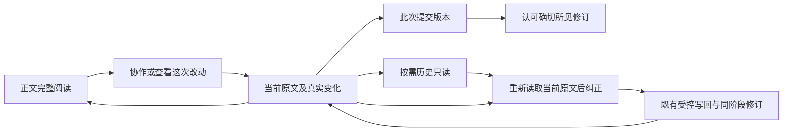

# 按需协作与所见版本审阅

2026-10-05。基线 `8529212296f0b65fb78ef7ccd2a2102474d9310a`。本轮复用已发布 stage-workbench、content-writeback-organize、agent-workspace 和材料能力。

## 交互方向

正文默认完整阅读，日常写作在真正 Logseq 原生页面。无协作时只显示一个可发现的「协作」入口；有不可变修订的真实变化时显示「查看这次改动」。展开后按当前目标准备连接、读取变化或记录当前版本，比较、历史、阶段成果和使用说明按需展开，不新增全局导航。

审阅明确区分当前原文、此次提交版本与历史版本；不可变版本标识与认可始终绑定同一修订。当前原文已更新时，先打开提交版本再认可，人工后改不追溯改变旧认可。纠正和建议复用已有受控写回；历史不能直接编辑或成为材料拖放落点，修正历史必须重新读取当前原文。

局部变化保持 Markdown 加粗、链接、代码与层级；只突出可确定的改动片段，复杂差异提供明确文字与按需旧文，避免整段涂色。真实结构变化用旧新父级及位置事实，展示分组不记为原块移动。聚焦范围与本阶段全部变化分开，返回沿用现有 bookmark。

原生输入和审阅草稿保留现场；冲突、部分成功、未知结果就近说明，未知写入先查询既有 Journal，不能自动重放。通道就绪不证明 agent 在线。断开协作后正文、材料和只读历史继续可用。

图中实线是明确用户动作；正文、材料文件、阶段快照分别沿用其已有权威。运行证据和实机限制见 [交接](../implementation/collaboration-review-ux-handoff.md)，不是用方向图代替验收。

## 已落地的操作含义

「记录当前版本」仅在本地记录当前正文与可证明 Journal 事实，不发送给 agent，不发布或认可。通道连接区默认收起，明确区分「连接正文维护」和「允许润色与原块整理」；后者才授予同一对象内的现有结构能力。状态说明连接就绪不代表 agent 在线、处理中或已完成；agent 开始提示完整保留普通文字、标记、TODO、条件／反例，要求实际版本与父级事实。

纠正读取当前完整原文后生成既有版本绑定的局部替换；建议是原文中的普通 [注]／[想法] 子块。输入不因收起、重载、来源过期或保存失败丢失。回复未知时保留原请求，先查询／恢复；已确认源写入后只允许用同一请求补记阶段。确定未应用才重新读取并明确提交新请求，没有自动重放或旧文 rollback。

当前文字比阶段结果新时保留当时提交结果，并标来源未知；旧版认可不追溯认定后来写作。历史提供「重新读取当前原文并纠正」，不能直接编辑历史或向历史拖入材料。聚焦只影响阅读，阶段全部变化临时补出范围外与缺失内容，返回保留原来的问题范围和阅读锚点。
