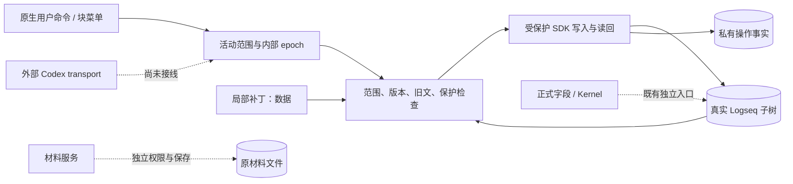

# 自然正文的局部写回与实际变更记录

2026-10-02。起点为启动时 fetch 锁定的远端 main `16ef663fc9485eb2dfb036d7eedf20d404511e70`。产品权威为[工作区使用与交互设计](2026-10-02-workspace-usage-and-interaction-design.md)。本页描述最终行为，协议与异常处理见[架构说明](../architecture/content-writeback-architecture.md)，验证及接线见[实施交接](../implementation/content-writeback-handoff.md)。

## 已交付路径

用户通过原生块菜单或命令明确选择一份工作正文。此后，插件上下文中的程序能力可以读取真实子树与版本，提交受限补丁，查询逐项事实。普通成功依靠正文呈现；冲突时按需打开一个紧凑面板。没有持续在线的模型或逐次确认。

协议与保护、SDK 端口、持久执行、注册与恢复 UI 及故障测试已经交付。Desktop 证据与未通过的键入提交验收分别列于实施交接。逻辑保留在一个插件内，没有增加进程、依赖或共享协议包。

当前支持 Logseq 普通正文的局部替换、带基础版本及邻近文本的插入、普通子块末尾追加。自然正文仍在 Logseq；材料正文仍在原文件；正式任务状态由 Kernel 的既有事务与授权管理。展示级 apply 的白名单保持原样。

## 工作范围与权限

块右键“工作台：允许维护此处正文”，或命令“工作台：允许维护当前块的正文子树”，建立唯一活动范围。范围包含实际 Graph、所选根和真实祖先路径；每次写入重新确认实际成员。视图缩进、排序、引用和请求字符串不能扩大范围。

这是显式建立持久关联的用户动作。文件 Graph 必要时保存根的原生 id::，并独立记录身份写入意图与读回；普通阅读不保存身份，既有身份不一致时拒绝关联。新增子块也复用 source-identity.ts。DB Graph 不套用文件 Graph 的 id 写法。现有普通后代不会因读取而批量加 id；未经持久关联的 UUID 仍受宿主索引重建限制。

Graph 切换、停止维护、重新选择根或释放插件撤销旧范围。重载后须重新通过本地操作选择范围；历史记录不会授予权限。content.scope() 只查询当前范围，没有供补丁自行授权的 bind、actor、capability 或 authorized 字段。

实线是本分支执行链；虚线是独立能力或尚未接线的入口，不表示权限委托已经实现。

## 局部修改

首版以完整 block 为定位单位。范围为完整 Markdown 原文中的 JavaScript UTF-16 [start,end)，必须匹配完整原文 SHA-256、真实父级及预期旧文；插入还须带邻近文本。程序可在同一完整版本下对重复片段指定明确偏移；用户表单要求旧片段唯一。代理对中间位置、重叠范围、未知操作拒绝应用。

同块不相交范围统一验证并组合为一次写入；跨块各自记录结果。另一个无关块变化不使全部补丁失效。目标基础版本变化时保留提议，不套旧偏移、不自动语义重基。

新增子块只追加到实际父块子内容末尾，使用确定 UUID 防止重复。已有 UUID 不覆盖、不冒认为自己成功；回复丢失后查询原请求，不重新追加。

没有删除、重排、整树替换、任意属性写、脚本或 Git 操作。整块正文替换仍受所有字段保护。

## 自然正文与受保护内容

身份和关联属性行保持完整原字节。正式根第一行标题、状态标记等受保护；管理投影、字段标签、受管理后代不可经正文入口修改。正式字段修改提示已有任务入口，不生成正式命令或伪造 USER。

Adapter 使用真实原文、祖先与子树判断保护。配置了 Kernel descriptor 时可读取最新 anchor index，含派生复查字段 UUID，但不会为正文启动正式 runtime。身份缓存中的普通或过期结论不授予权限。Kernel 离线或 tasksEnabled=false 时继续保护已知语法；不能区分的正式直接子块、未标明身份的分支及其后代保留并拒绝提议。仍允许正式根确切的自然描述、普通多行叶子工作记录和普通追加。最新 index 可确认的普通记录按其真实权限处理。

局部 TODO、任务标记、复选项及其连续说明、受任务影响的后代默认只读。代码围栏、引用中的文字不成为执行指令。“工作台：明确修改当前 TODO 文本”对最终提交的具体操作授权；一般整理、请求元数据和另一补丁不能复用权限。冲突后再次明确提交 TODO 需要当前版本的具体授权。没有个人标记学习、语义清洗、待处理计数或提醒。

原生编辑与组合态优先。Executor 检查目标路径和实际受影响子内容，不保存、取消或覆盖草稿。小表单也在组合态禁用提交，并保留自己的输入。

## 用户入口与冲突处理

| 命令 | 行为 |
| --- | --- |
| 允许维护当前块的正文子树 / 块菜单允许维护此处正文 | 选择范围；必要时保存稳定根身份 |
| 局部修改当前块正文 | 填唯一旧片段和替换文本 |
| 明确修改当前 TODO 文本 | 授权本次具体 TODO 修改 |
| 在当前块补充正文记录 | 追加普通子块 |
| 查看正文写回冲突与恢复 | 按需发现保留提议与未知结果 |
| 停止正文维护 | 撤销范围、关闭此模块界面 |

面板复用 host panel，最大正文宽度 760px。保留自然段；旧文按需展开；长文在各自区域滚动；原因用可理解的文字。API 普通成功不打开面板，无变化不冒充修改。不改公共 work-view renderer，不增加 diff/editor overlay。

用户可保留当前文、复制提议、从当前文明确选新片段重新提交。关闭面板不丢提议。表单首次提交前保存稳定 requestId；部分成功、未知结果、关闭和重载后复用原请求，不换 ID 悄悄再追加。

未知结果不提供失败后重写的快捷动作。观察到内容相同不能证明作者。新块正文已核验而身份未完成时，只重新验证并保存身份。历史成功后的人类后改不会被原请求还原。

## 事实与产品边界

记录实际基础、意图、宿主确认、读回正文和身份、状态、时间与失败理由。程序 API 来源为 local-capability，不猜实际是 agent 还是用户；只有真实用户命令才记录该命令。runId/stageId 只关联，没有阶段或认可。

默认用插件 FileStorage，每请求独立追加修订。意图持久化失败不写 Graph；实际成功但最终记录失败返回 durable:false。重载后查询及显式恢复，禁止自动回放离线请求。

SDK 没有正文 CAS。串行、重复检查、草稿保护和读回不能锁住所有外部写入。已发宿主调用无法取消；超时或 Graph 切换后的结果按未知记录。

材料模块既有读取、版本化保存和 editing 权限保留。此 executor 没有 Markdown 或其他来源写 adapter；这些请求明确拒绝，继续使用 materials 入口。workspace 正式 provider、记录位置、StageRecorder 消费端和外部 Codex transport 未接线。本地能力、模拟测试和 Desktop 证据分开报告。
