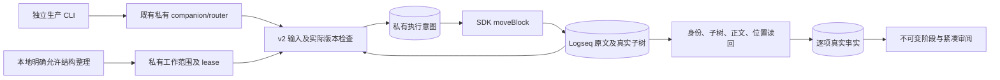

# 保留原文风格的润色与真实块移动

2026-10-04；共同基线 `e666e7be1367e97dabf5f787c7dcb944ac70e815`。沿用 main 的 content、workspace transport、材料和阶段能力。

## 产品结果与实施路径

用户继续在 Logseq 原生页面自然写作。`[注]`、`[想法]`、`[目标]`、无标记限制、TODO、链接及代码保持原样；润色语义由已经获授权的外部 agent 决定。既有 replace/insert 执行文本提议，新增 move-block 通过 SDK 移动原块。模块没有模型、后台整理器、报告正文副本或标题生成器。

实施顺序是封闭协议与权限 → 结构校验、Journal、默认 SDK → 生产 CLI 与阶段事实 → 紧凑恢复与审阅 → 隔离演练、门禁和独立提交。最终实现在现有插件内分层，没有新进程或 provider。

“允许 agent 维护当前工作”继续只允许正文维护。新的本地命令“允许 agent 润色并整理此工作原块”（块菜单），或“允许 agent 润色并整理当前工作原块”（命令面板）明确增加结构权限。它们使用当前真实工作目录绑定、Graph/root 和私有 lease；payload 中的 actor、authorized、root 或材料文本不能授予权限。`content` 自身也有“允许整理当前工作正文及原块位置”命令。重载后需要重新进行本地授权。

## 首版移动含义

| position | 真实结果 |
| --- | --- |
| before | 原块及完整子树移到明确普通目标的前面，成为目标的同级 |
| after | 原块及完整子树移到明确普通目标的后面，成为目标的同级 |
| first-child | 原块及完整子树成为明确普通父块的第一条子内容 |

不能移动工作根、跨 Graph/root、跨正式对象归属或产生循环。源和目标必须在实际授权子树内，UUID 唯一且内容可用。正式根、事务/任务标题、managed 投影及包含这些内容的外壳都不能移动；显示标签不是权限证据。

同一 MiniProject 下无 managed 证据的普通记录及其多层普通子树可重排。可信正式身份、managed 信息和祖先共同确定对象归属。未知 TASK 字段、已知正式 MiniProject 在 managed 索引不可用时的含糊字段、以及含 managed 子内容的未知正式父块继续保守拒绝；明确自然 MiniProject 下的普通记录可以在 Kernel 离线、tasksEnabled=false 时工作。`[事务]` 在本模块中作为保护事实识别，没有修改 Kernel 状态规则或实现 04 分支的标题兼容。

结构授权允许普通 TODO 保留其完整原文、状态和对象归属地移动；它不允许修改、完成或删除 TODO。文本润色仍走已有属性、id、正式字段和 TODO 范围保护。原生编辑/组合输入的源子树、目标、相关祖先及旧/新父级邻接范围受到 EditingGuard 保护。

## 版本与批次

源及目标绑定完整正文 SHA-256 和预期父级；位置绑定整个授权子树的真实 structureVersion。任何范围内结构变化都使旧移动请求冲突，首版不自动重基。其他普通块只改变正文时不会因全局 sourceSetVersion 改变而自动拒绝该移动；移入/移出成员、受保护属性或对象归属改变仍须拒绝。

文本操作、移动及 insert-child 按请求中的确定顺序执行；结构操作是同块文本组合的屏障。同一请求中第二个依赖移动必须具备其执行时的结构版本，否则第一项可能成功、第二项冲突。跨块部分成功保留真实已应用项，不回滚人类后续输入。建议逐次 read → apply → read，再提交依赖操作。

## 用户可见结果

正常成功通过现有正文与阶段呈现，无常驻审批中心。冲突入口“查看正文写回冲突与恢复”按需出现当前文、明确位置提议、折叠的旧文及已保存位置。可关闭后再找回、保留当前文、复制提议，或明确按最新结构创建新请求。未知结果只核对记录，不能使用“重试”盲目二次移动。

阶段中的同 UUID 位置变化显示为结构变化，提供旧/新父级、同父顺序和深度，不伪装为删除加新增。当前原文再次被移动时，审阅标注来源未知及当前观测位置。历史修订、认可和保存的作者证据均不变；外部 agent 没有 begin/认可入口。

实线是已运行的数据流。权限来自本地命令与接入层；CLI payload、原文和报告小标题都是数据。材料正文和 Kernel 正式状态继续由各自能力维护。

## 边界与后续消费者

01 只需提供真实 BlockTarget、正文版本和结构版本；展示 section 没有块身份，不能作为移动目标。02 的已登记跟随文件名引用可以调用现有版本化 replace-text；别名策略和材料身份归材料模块。本分支没有扩大文件保存权限、改名、全 Graph 扫描或修改材料 store。

生产 workspace CLI 已接入本机 companion；这是实际跨进程路径。远程电脑的身份/凭据分发、任意浏览器匿名写服务器及自动语义整理不在本次交付中。
