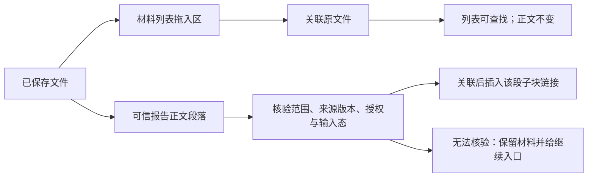

# 材料列表与阅读交互

2026-10-05。本轮建立在已发布的材料模块、拖入与文件改名能力上。源码和调用边界见[架构](../architecture/materials-reading-ux-architecture.md)，验证与整合事实见[交接](../implementation/materials-reading-ux-handoff.md)。

## 目标与范围

材料属于正在处理的工作。日常路径是正文里的引用 → 打开文件 → 只读阅读 → 必要时明确编辑 → 返回正文。需要集中整理文件时进入当前工作的材料列表。共享 shell 继续负责工作级标题、导航和版式；本模块提供材料内容、动作与释放端口，已经接入 main 的实际导航。

本轮不建立另一套文件管理器、聊天、Workspace、正文执行器、Kernel、阶段系统或目录监听平台。普通本地阅读不需要启动 Kernel。Logseq 正文仍是笔记权威，材料正文仍是实际文件；列表和概述不能成为另一份正文。

## 列表的信息层级

列表顶部显示当前工作名称，主要动作是“加入材料”“目录文件”“返回正文”。搜索、刷新和清楚的拖入区紧接其后。文件采用紧凑行：名称或用户填写的一句话概述、类型、实际阅读能力、文件失联或保留草稿状态。默认 Markdown 入口明确标识“只读阅读”。概述存在时仍显示实际文件名，完整路径折叠在阅读详情里。

行末“操作”收纳复制链接、改文件名、写概述和需要时的重定位／核验动作。目录绑定、全局查找和显式收纳放在“目录与查找”中。没有常驻连接状态、角色矩阵、目录注册信息或待处理计数。部分结果和不可用状态只在帮助判断时出现。

当前列表只展示已关联到这份工作的材料，以及调用者提供的正文中实际引用的材料。“查找全部材料”是明确选择，覆盖已登记目录；不会默认把所有项目的文件混进当前列表。

## 加入与查看

“加入材料”提供文件选择、输入已保存文件的绝对路径和显式收纳文本。宿主给出可靠 File.path 时核验实际文件名、大小和类型后关联原件。宿主没有提供路径时保留按路径关联入口，不根据名称猜位置，也不把选中文件的字节偷偷另存一份。

拖到列表只加入材料，不插入 Logseq 正文、不移动原文件、不扩大编辑权限。批量加入逐文件报告结果；一份失败不会丢弃已成功的关联。重复同一路径继续使用同一材料身份。

“目录文件”列出绑定目录的直接文件，数量有界。点击名称即可只读查看支持的文本；PDF 等普通文件交给默认应用。查看不创建材料身份，也不授权编辑；明确“关联”后才进入本工作的材料列表。离线与有目录观察能力时的关联动作共用 MaterialService，均不暗中插入正文引用。

## 两种拖入意图

正文拖入消费现有报告的可信映射。悬停明确写“在该段下插入链接”；这是原段落的子块，不是鼠标字位。展示小标题、材料标题、空白、只读历史、原生组合输入和过期范围不提供写入目标。映射失败时可以在已有当前工作范围加入文件，随后复制链接；不能把链接写到别的块。

关联成功、引用未完成时明确显示两项事实。继续入口提供复制、定位原块和重新核验补插。未知结果先查 Journal，不能盲重放或生成第二份材料。剪贴板写入成功才提示复制成功；失败在当前可见列表／正文结果中提供可选择链接，异步旧结果不会把链接展示到后来切换的工作中。

## 阅读、编辑与返回

Markdown 默认进入复用的只读阅读器；用户明确选择“编辑原文件”或“编辑”后才打开原有 Vditor。编辑意图和 agent 编辑许可分别表达：用户编辑不默认授权 agent；agent 许可仍由既有单文件授权入口处理。打开、概述和改名都不扩大正文编辑权限，内容中的 TODO 也不是授权。

阅读顶部提供返回材料列表、复制和返回正文。列表查询、滚动和选中材料在同一 Graph／工作内恢复。正文返回交给 WorkView 的既有面板、report 和 lens 端口，保留其阅读模式、范围、原段位置和焦点；材料模块不新建工作范围缓存。

草稿存在时仍先阅读外部当前版本，再由“恢复保留草稿”进入编辑。外部冲突保留原件和草稿，可另存草稿再继续。失联材料的草稿可独立查看、选择复制，不假装原件仍可编辑。组合输入未结束或草稿缓存无法保存时，切换保留当前编辑现场。已开始的保存按捕获的原 Graph／文件完成，释放模块等待其结束再销毁编辑器。

## 文件名、概述与引用别名

| 操作 | 实际改变 | 保留内容 |
| --- | --- | --- |
| 改文件名 | 原件 basename；扩展名保留 | materialId、正文、角色和权限、收纳原文、历史 |
| 写概述 | 独立记录中的可选短描述；留空清除 | 原文件名、正文、现有引用标签和编辑许可 |
| 用户手写引用别名 | Logseq 原文的可见标签 | stable longdoc 身份 |
| 跟随文件名 | 仅按已登记生成证据维护当前引用 | 手写别名、旧无证据引用和阶段历史 |

改名表单说明会改变实际文件。重名、非法路径或权限错误时，输入及错误留在同一表单，可修改后重试，不关闭后丢掉名称。文件已改、记录或引用未完成时保留实际结果，行内提供核验入口。

外部改名只沿用已有的原父目录有限物理身份核验。没有可靠事实、跨目录移动或出现多硬链接歧义时保留失联条目，用户明确重新定位后继续使用原材料 ID。相同正文、相似名称和同名文件都不能自动合并。

## 兼容与状态

旧 UUID 文件、schema 2 独立记录、longdoc 链接、未完成收纳、草稿和恢复原文继续由原核心读取。概述是可选字段，不批量改写旧记录。旧材料不会为新列表或模板自动搬迁。新收纳的保存目录、权限与阈值规则保持原实现，自动收纳未启用时不接管粘贴。

已实现：本工作材料列表、显式加入／目录发现、按真实能力打开、只读与恢复草稿、列表和正文返回、拖入意图提示、失败后继续、概述与文件名分离，以及现有核心改名／引用维护的真实接入。

已验证与待验证逐项列在交接，不能把 Happy DOM、Chromium 文件 drag 或 API 返回当作 Finder 拖放、任意原生字位、中文 IME 或 PDF 内置预览的证明。后续共享 shell 可以消费本模块 UI 端口；不会因为这个交接自动启动完整工作区、其他模块或主动行动建议。
