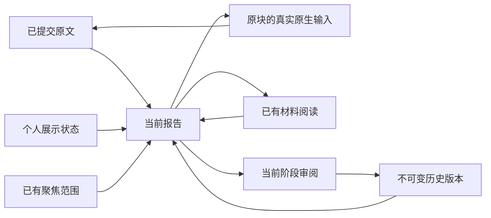
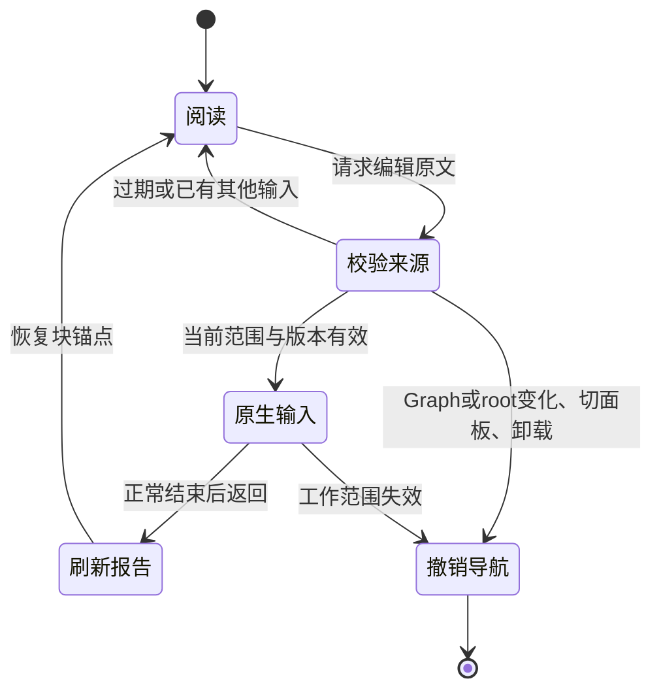

# 原生写作与报告阅读

2026-10-04。固定基线 `e666e7be1367e97dabf5f787c7dcb944ac70e815`，实施分支 `codex/view-lenses-native-report`。

用户在 Logseq 原生页面写作，报告负责把交错记录排清楚。报告读取宿主已提交的完整原文；分组、小标题和折叠只属于展示，不向 Graph 写标题，不保存第二份可编辑正文。原生输入与报告均可在 `tasksEnabled=false`、Kernel 停止及 agent 离线时使用。

## 实际使用路径

1. 在当前工作打开工作视图（`Cmd/Ctrl+Alt+P`），点击“报告”；也可执行命令“阅读当前报告”。“原结构”可恢复原有个人排列与缩进。
2. 双击报告正文、让条目获得键盘焦点后按 Enter，或在条目菜单选择“编辑原文”，进入对应 UUID 的真实 Logseq 输入框。链接继续打开原有引用，展示小标题没有编辑入口。
3. 宽窗保留左侧原生输入和右侧报告；窄窗让出面板，宿主显示“返回报告”。同一原块正在输入时，“继续原生输入”重新聚焦同一输入框，保留内容与选区。
4. 正常结束宿主输入后，点击“返回报告”或按 `Cmd/Ctrl+Alt+R`，重新读取当前来源，恢复工作范围及可靠阅读锚点。仍在编辑或组合输入时，返回请求提示先结束输入，不替用户保存、取消或结束组合态。

Logseq 安装版会在输入期间自动保存正文；报告只消费 source provider 已读取的提交事实。提示为“原生输入中 · 报告保留已读取原文”，不会把输入框当前值直接冒充报告版本。

## 宽窗与窄窗

复用现有停靠布局，报告宽度限制为 300–520px，并保留至少 560px 原生主区。实机 1440px 窗口中主区 920px、报告 520px，真实输入框完整位于主区；980px 窗口走快速切换。

从宽窗缩到窄窗时让出报告，不调用旧的光标恢复逻辑覆盖当前原生输入。用户改变宿主窗口导致输入失焦的情形已记录；不宣称调整窗口必然保留系统焦点。返回控件有文字、键盘入口，条目菜单无需悬停即可操作；触摸硬件尚未实测。

## 有限分组与正文完整性

只识别第一个非属性正文行中的明确标记，沿用已有对象识别。普通 TODO 保留只读展示含义，不自动执行或成为正式事务。

| 原文事实 | 展示分组 | 保留方式 |
| --- | --- | --- |
| `[目标]` | 目标 | 完整块与原子树 |
| `[注]`、兼容的 `[记录]`／`[说明]` | 记录与说明 | 普通记录，包含完整限定条件 |
| `[想法]` | 想法 | 原句、链接及子树 |
| 普通行首 TODO | 待办 | 原有 TODO 与全文 |
| 现有任务／事务、MiniProject 对象 | 工作事项 | UUID、真实归属与完整子树 |
| 未知标记、无标记正文 | 相邻记录上下文 | 全文保留，可定位原块 |

一个有标记的兄弟块与其后无标记／未知标记的兄弟块作为一组移动，每个块的子树整体保留。对象后面的普通兄弟记录重新归入“记录与说明”，不会伪装为对象子块。有标记时章节固定按目标、记录与说明、想法、待办、工作事项排列，同一章节内按既有个人排列确定记录组顺序，组内部保留来源顺序；没有标记时保留来源顺序。空章节不占位置。

报告使用真实来源层级。个人排列、展示缩进和持久折叠仍单独保留；报告折叠为会话展示状态，进入报告时从个人折叠初始化。报告期间禁用拖动排列与增减展示缩进，切回原结构继续沿用已有操作。报告不靠截断长正文提高密度，代码、链接、反例、局部 TODO 和嵌套对象保持可见。正文 14px，靠紧凑段距、小标题和减少装饰提高密度，Markdown 沿用现有净化器。

## 与聚焦、材料、阶段组合

当前报告先消费已有聚焦可见范围，再保留阶段审阅覆盖的结果。“看全部变化”仍可显示聚焦范围外的变化，返回后恢复原问题与位置。来源变化保留聚焦计划并提示依据变化，不自动重算问题。

材料引用沿用现有 `longdoc://` 稳定 ID、默认参考权限和材料面板。打开材料、查看原文件再返回，保留报告模式、工作范围、聚焦与阅读位置；未扩展材料编辑权限。

历史按保存的原版本展示，抑制当前报告分组与映射。历史中新增的原生编辑按钮、报告切换和落点解析均禁用；原有“在当前内容中纠正”仍重新读取当前来源。返回当前工作后恢复报告，原文的新句不会改写旧版本或认可记录。

## 异常与范围

组合输入期间不切焦点或重新分组；结束后读取排队的来源变化。异步读取、跳页和导航均受 Graph／root、版本与生命周期检查约束。外部切到材料等面板会撤销未完成的导航，保留阅读状态；窄窗为原生输入主动让出面板不会撤销自身导航。来源不可用时保留并标识最后已知阅读事实，定位请求拒绝猜测。

来源映射和落点以完整 block 为可靠单位；本轮不提供段内精确光标、段落拆分或 agent 报告布局计划。展示标题没有 UUID，不能作为写回或引用插入落点。已交付可信原生 drop 的可选宿主观察端口及版本化解析端口；02 材料导入／拖放／改名消费者未接入，不宣称任意原生文件拖放已可用。

亮色与暗色宿主均实际检查了可读性。报告 iframe 沿用既有浅色背景，没有完成宿主暗色主题同步。物理中文 IME、系统 Undo、跨应用剪贴板、任意原生拖放、触摸硬件及其他 OS 留待实机验证。

实际端口和模块边界见 [架构说明](../architecture/native-editor-report-architecture.md)，测试、截图、提交与未验项见 [实施交接](../implementation/native-editor-report-handoff.md)。
