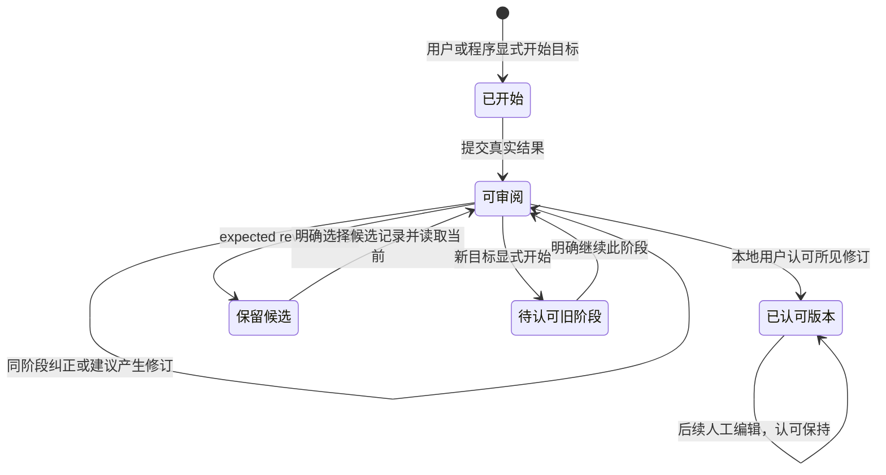
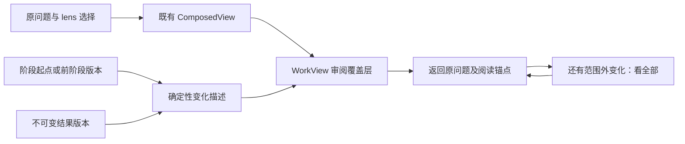
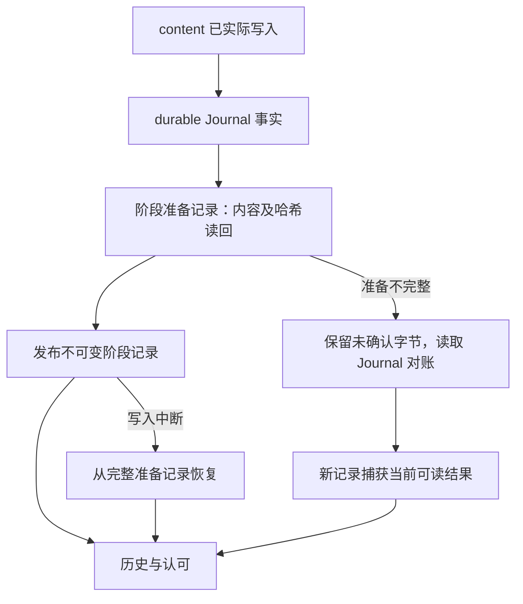

# 阶段记录与原位审阅

2026-10-03。本轮合并 stage-records 与 stage-review，已接入真实插件、content Journal、材料和发布的 workspace-context；不要求 agent、Kernel 或工作目录在线。实现与验收见 [架构](../architecture/stage-workbench-architecture.md) 和 [交接](../implementation/stage-workbench-handoff.md)。

## 用户路径与权威

从工作块打开既有工作视图，输入一句目标，点「开始阶段」。程序按真实来源读取起点。明确提交结果后，变化在原有结构与个人排列中出现，保留自然段；点击变化正文或「修改」就近编辑完整当前原文。「建议」将 **[注]** 或 **[想法]** 作为普通子块写回 Logseq。两种动作均形成同阶段修订，建议没有另一个批注正文库。

「认可」与 `mod+alt+enter` 绑定点击时实际看到的不可变修订和问题事实。无需说明、第二次文件审批或长篇变更报告。外部程序命名 `actor=USER` 不会获得认可能力；公开阶段 namespace 没有 accept。认可不是任务完成、正式状态授权、方案采纳或文件执行。认可后普通人工编辑继续正常保存，旧认可保持，不要求重认、不自动开始阶段或重开已完成任务。

未认可的提交版本与当前原文已不同，或其真实块结构已变化时，就近提供「查看待认可版本」，打开保存的版本后再一键认可；当前文不会混入旧修订。已认可版本没有这项要求，后续人工编辑不被要求重认。异步认可期间到达的新修订仍不随旧点击一起被认可。

Logseq 自然正文仍是唯一可编辑源。材料正文在原文件，保存/恢复及编辑权限继续归材料模块。阶段保存只用于历史与审阅，不能作为另一个可编辑正文源。镜像 revision、content request、材料版本、Git commit 和阶段是不同对象。没有自动推荐、语义扫描、模型设置、Git 编排、批注清理或 TODO 执行。

## 首版默认策略

以下是本轮实施选择，不声称用户曾逐项确认：

- 每个 Graph＋真实工作根有一个当前可写阶段；阶段/请求使用稳定 ID，界面不要求输入 ID。普通无目录任务使用同一能力。
- 有意义成果显式开始/提交，保存、观察事件、聊天、镜像发布与 Git 提交不创建阶段。新目标可先开始，旧阶段仍待认可；继续旧阶段需明确选择。
- 一个阶段有不可变的修订序列和多个具体版本的认可记录。重复查询、相同请求、相同事实与结果不制造重复修订。
- 不实现部分认可、整阶段撤销、语义合并或并发可写阶段。版本冲突保留候选，重新读取；真正分叉可在历史里查看候选内容并显式选择记录，再读取当前原文，过程中不写正文。
- 本轮元数据始终以插件私有 FileStorage 为唯一权威，包括已绑定目录的工作。绑定/重绑定不搬迁、复制或认领历史；工作身份继续是 Graph＋rootUuid，目录身份/位置归正式 workspace provider。没有目录迁移入口或目录内第二个 StageStore。

## 变化与历史

当前模式默认比较阶段起点与最后提交的结果，当前原文后来变化时仍显示当前文，并就近提示其与提交结果不同。原位差异按稳定 block UUID 和不可变正文计算；只有简单且明确的文字采用轻量背景/下划线，另有「新增／修改／结构变化」文字标签。复杂 Markdown、重复文本、超长块采用块级提示和按需旧文。块内 diff 不是句子级写回授权。

删除块以历史 UUID 和前驱上下文出现，不绑定同名新块；旧文默认折叠。历史模式使用当时快照，展示历史版本选择与该版本的认可。可比较「相对阶段起点」或「相对前阶段结果」。后者固定引用开始时的前阶段版本，间隔人工变化保留未知来源，不归给 agent。当前/历史模式明确区分；纠正历史时重新读取当前原文，修改当前可写阶段并记录 correctionOf，旧快照和旧认可不变。

lens 仍独立负责问题与选择，review 只描述变化。看全部不改 lens plan、个人层级或真实来源；返回原位置恢复锚点。复用未变化节点和编辑容器，不因保存重建整个 DOM。原生编辑/组合态期间不收缩输入，不强制结束原生编辑。历史布局与删除块只存在于渲染，不写 Logseq 或持久个人布局。reduced-motion 下禁用变化动画。

## 纠正、建议和文件

编辑器在变化旁显示当前完整原文；用 Unicode 字符边界计算最小合法 UTF-16 范围，提交 expectedText、contentVersion、真实 target/parent，交给已有 content executor。它继续检查保护字段、局部 TODO、原生草稿和 scope authority。旧偏移不跨版本使用。冲突/未知结果保留输入；「重新读取当前原文」是显式动作，可看到双方文字，未知操作不会换 ID 自动重放。

审阅草稿保存在插件本地存储，重启后点击变化或草稿提示继续；重新读取当前基线再计算操作。草稿不是修订，也不自带写入许可。它绑定原阶段，不能默默转移到新目标。输入法组合态期间禁止提交/关闭；原生 Logseq 草稿由原生编辑器管理，不转存或自动提交。

成果文件从现有材料列表显式勾选，默认不扫描工作目录。材料 ID、实际权限、路径和读回版本来自材料服务。Markdown 和上限内已登记 txt/csv/json 保留当时旧新正文与哈希，差异按需打开；真正文件编辑由材料入口完成，回来显式提交结果。input/reference 权限保持。二进制与过大文本仅保留当时身份、路径、可得大小/哈希、权限和问题，明确「原文件版本未保留」。没有字节副本就不承诺备份/恢复。认可涵盖同一阶段的文件记录，不执行/发布文件。

## 异常与保留

只有 durable、APPLIED_VERIFIED 且 contentVerified 的事实可以确认修改；身份事实和正文事实分开。proposedContent 不成为实际结果。partial、冲突、阻止、未知和 NO_CHANGE 保留逐项含义。程序来源只标「程序调用，实际作者未知」，无法证明的原生/间隔编辑保持未知。

阶段保存失败不驱动正文重写。重启后读取已有记录，明确提交结果可从 Journal 对账；完整准备副本可恢复，损坏的已发布记录且无完整副本时失败关闭并就近报告。其他可读历史仍展示。没有自动离线补丁重放、盲目 rollback 或与其他进程/原生形成全局 CAS 的承诺。
