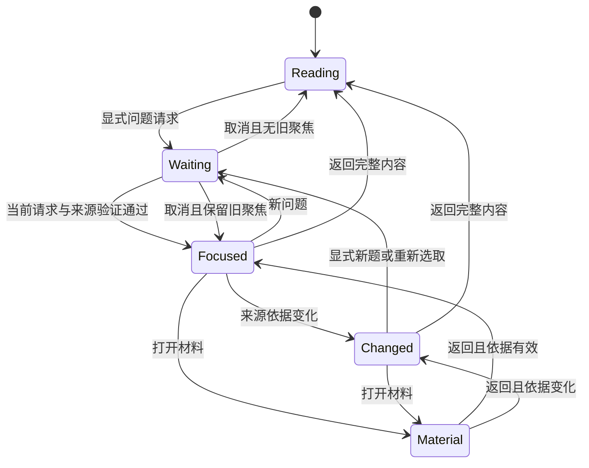
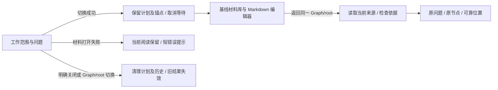

# 阅读视图与问题聚焦

本分支 `codex/view-lenses` 从固定提交 `23d0c710204d885500acacfd2e2772cb608f1395` 实施。产品依据是 [工作区交互设计](2026-10-02-workspace-usage-and-interaction-design.md)第 9、13–23 章。本文描述最终实现；验证证据与未验证边界见[交接文件](../implementation/view-lenses-handoff.md)。

普通阅读沿用已有工作视图。用户显式选择一个块范围时，可临时只看该块、其真实子树与必要祖先。程序接口也可以执行经过版本验证的多块计划。首版选择单位是**完整块**，保持条件、转折、代码、引用和原有 Markdown；不实现段落或句子剪枝。手动范围查看不会声称已经理解任意问题。

聚焦期间原文占主要空间。当前问题、完整内容、取消等待及上一问题只在需要时出现于紧凑区域；缺口和短临时推断按需显示，统一作为纯文本。来源依据改变后选择不重新计算，当前原文就地更新，旧强调、推断和缺口隐藏。原生 Logseq 编辑及材料编辑器仍是正文编辑路径。

个人排列、折叠、级别与展开状态继续保存于原布局记录；程序的临时可见集合与祖先展开另存于会话状态。退出撤销临时覆盖，并恢复可靠阅读锚点，期间的用户布局操作和正文编辑保留。材料切换保留问题、位置与可用文本选区；明确关闭、Graph/root 切换和卸载使在途计划失效。

## 实际入口

普通工作视图保留原有排列、Markdown 和材料入口。单击块正文只更新原有选中状态；单击行内“只看此处”或标题栏“只看选定范围”，进入该来源块的真实子树阅读。命令面板提供“工作台：只看当前块范围”和“工作台：返回完整内容”。没有选中块时，标题栏入口尝试宿主当前块；不在范围或不可读时保留当前阅读并显示短提示。

首版没有问题输入框、聊天面板或自动选取。已知多块范围由插件上下文的 `lenses.request/source/apply` 执行；语义选取与外部 agent transport 待独立接入。界面不要求用户输入 UUID 或 JSON。普通聊天、DB 更新和 TODO 均不自动进入聚焦。

“完整内容”撤销临时选择和历史，恢复进入前的可靠块锚点。面板内 Escape 先取消等待，下一次退出范围阅读；原生输入框、可编辑区或输入法组合期间不拦截该键。“上一问题”只保存最近 5 个会话阅读现场，重新核验前题版本后才能返回；失败时当前范围保留。

## 条件、结构和个人布局

选中的块以全文展示，临时解除普通压缩级别的三行截断。真实来源祖先由程序补齐并参与版本核验；个人展示父链另用于保留熟悉结构。相对顺序和缩进沿用个人布局，二者均不建立正式任务归属。只含空白或 `id::` 的未选中结构行不占空间。

必要展示祖先临时展开，原折叠值保持。用户在聚焦中明确折叠、重排、修改展示级别和全文偏好时，继续使用既有展示操作与持久化；退出不会用整份进入前状态覆盖这些选择。程序的选择、强调、问题、历史和锚点只保留在内存中，不写 Logseq、不写布局记录、不生成摘要。

## 编辑、来源变化和恢复

原生 Logseq 草稿可继续镜像，但其字节不参与已提交来源版本。新计划在应用前及来源捕获后检查原生编辑状态；正在编辑或组合时拒绝新的剪枝，当前范围保持，结束编辑后由用户显式重试。不存在延迟自动应用或后台模型刷新。

原文、必要祖先、结构或显式声明的依据版本变化后，显示“依据已变化”。选择集合保持，当前块仍显示最新原文；已失效的强调、临时推断和缺口隐藏。仅无关正文改变且计划未声明全来源集合版本时，不会使计划失效。失效标志在当前计划中保持，恢复来源不自动复活旧推断。

进入/退出、来源更新和材料返回按 UUID 复用行及控件节点。退出先尝试原锚点及视觉偏移，丢失时退到可用块或展示祖先。文本选区仅在端点节点仍连接、相关原文未改变时复用实际 DOM Range；不把旧字符偏移套到新正文。正文改变会撤销涉及它的旧选区；原生编辑器的选区由 Logseq 管理。

读取失败时保留最后已知正文供阅读，并标识不可用；`source()` 不将旧缓存伪装成当前 available 来源。必要来源缺失、版本过期或输入非法时不换成相似内容、不静默丢掉依据、不宣称形成完整回答。

## 材料与关闭

切换材料只暂停同一 scope 的工作阅读。等待中的请求被取消，返回恢复已应用问题；没有旧计划时恢复普通阅读。明确关闭、换 Graph、换 root 和卸载清除问题与历史。材料正文、草稿、保存和外部冲突完全由既有材料模块处理，本轮不新增材料身份或保存机制。

本轮采用局部背景强调与 120ms 背景过渡，支持 `prefers-reduced-motion` 的零过渡。折叠不依赖动画完成，隐藏项不插入解释卡片。没有实现模型调用、主动下一步、note-semantics、阶段认可、正文写回 executor、重入高亮算法或审阅业务。
