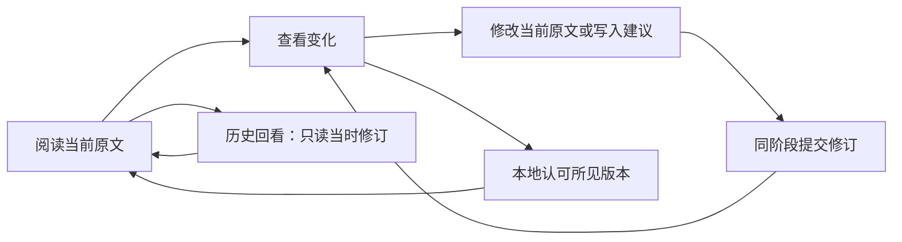

# 工作台体验优化：已交付设计

日期：2026-10-04。基线 `200249bc5a775a8d273a2ac3b7041fc29dbd1f58`，产品源码 `10f0a664ec136902e839e2503127e249da8ce81a`。用户操作见[图文手册](../user-guide/README.md)，实机与检查边界见[交接](../implementation/workbench-ux-polish-handoff.md)。

## 问题与范围

基线实机中，每个短块也附一行完整操作，叶子块有无效折叠入口；普通工作顶部只显示“工作视图”，阶段目标长期展开。目录新文件入口藏在管理区，查看前需要绕过关联概念。审阅内容默认反复铺开作者和旧文，真实细小改动难定位。

本轮保留自然段、必要加粗和 Logseq 结构，把操作移到需要时展开的位置。沿用已合入的 materials、workspace-context、view-lenses、content、stage 与 agent 连接，不创建新工作管理系统。

| 事项与路径 | 可核验责任状态 | 本轮处理 |
| --- | --- | --- |
| `work-view/controller.ts`、`renderer.ts`、`host/panel-host.ts` 的阅读与共享面板 | 旧 `codex/feature-work-view-presentation` 是已移植原型；当前实现与整合记录在 main | 修改当前组件展示；单独提交，共享路径需协调 |
| `materials/controller.ts` 的目录发现与阅读 | 旧 `feature/longdoc` 为已移植原型；材料核心与目录绑定已合入 | 入口前移、只读预览和离线识别；复用原材料服务 |
| `stage-workbench/review.ts`、`diff.ts` 的阶段审阅 | main 已有阶段开始、提交、认可与历史 | 精简顶栏、就近变化与旧文；不新增生命周期协议 |
| `content-writeback/logseq-adapter.ts` 的新增块焦点 | 实机发现 background insert 默认进入原生编辑，使身份核验结果未知 | 小修复 `focus:false`；保留全部保护和恢复 |
| 核心协议、跨电脑阶段迁移、文件适配器、个人笔记语义 | 没有本轮授权重设计，也无法排除其他电脑未发布工作 | 保持原边界，只记录后续目标 |

启动时发布的远端分支和 main 整合记录已核对，公开开放 PR 查询为 `[]`；本机 gh 未认证。远端名称不能证明活跃归属，公开资料也不能排除未发布工作。本轮没有读取、联系其他 session 或合入旧原型。

## 最终阅读规则

每块保留正文、实际缩进和有意义的折叠入口。根块不显示拖动柄；没有子块时隐藏折叠。三点入口始终存在，默认弱化，悬停、选中或键盘聚焦时增强，避免只能用鼠标悬停操作。

局部菜单沿用原生 `details/summary`，同一时刻只展开一个。操作面板位于正文滚动区域下方，附 48 字短预览。正常面板保留 112px、窄面板保留 172px 操作空间；条目与下一段位置不会因菜单出现而上下移动。动作包括展示级别、Logseq 原块、Markdown 原文、手动子树范围及视图缩进。无效动作与历史结构编辑停用；历史审阅中的“在当前内容中纠正”继续明确指向现存原文。

Tab/Enter 使用原生控件路径；Escape 关闭菜单并将焦点放回原入口，组合输入期间不截获。按 UUID 保留节点与回调，来源刷新继续使用原来的选区、草稿与阅读锚点保护。

普通工作标题派生自来源中第一条非元信息文字，正式事项保留已有正式标题解析。祖先路径只作为上下文。底部显示“显示 n / 总量 条”，同时保留来源不可用、编辑中和布局仅影响视图的真实反馈。

## 阶段与审阅规则

没有阶段时只显示“开始阶段”；点击后才展开目标输入。Enter 确认，Escape 或取消收起并返回入口，IME 组合态不提交。已有阶段显示目标、“新目标”与“提交结果”。没有待认可修订时不展示可用认可动作，已认可版本显示停用的“已认可”。

当前阶段、提交版本和历史回看分别标明，保持原来的返回与明确继续入口。认可使用展示时冻结的具体 revision/hash；当前原文有后来编辑时先查看待认可版本。人工继续编辑不改变已有认可，也不制造重新认可要求。

正文中的变化使用短标签、边线、下划线和必要的删除线，不仅依赖颜色。简单短文本用确定性单区间差异；超过 12000 字符、复杂 Markdown 或重复歧义回退块级变化，完整 Markdown 原渲染保留。旧文与来源放进展开项，程序调用没有实际作者证明时明确写“实际作者未知”。

直接纠正在当前完整原文编辑器完成；建议按原入口写进原始内容。草稿保存、重新读取、未知结果和正式字段/TODO 保护不变。范围内只显示部分阶段变化时，继续展示“看全部”入口。

## 材料、范围与反馈

工作标题旁的“材料”进入当前工作，“目录文件”直接展示有界文件列表。未关联文件可先只读预览，再明确关联；关联、权限和选入成果继续分开。在线使用正式目录 observer，离线使用现有桌面文件能力，只查当前绑定目录。两条路径都识别 reference 和 capture 的原材料身份，不因断连重复关联。

“返回工作”沿原面板导航恢复问题、阶段、范围与锚点。手动“只看此处”、跟随宿主点击、按问题聚焦和历史回看保持各自含义；没有为简化词语合并它们。聚焦依照当前来源选择完整块与必要祖先，不产生额外答案正文、行动推荐或新笔记分类。

连接状态只描述通道；停止连接不妨碍本地功能。来源或文件暂不可用时明确说明，保留关联与历史。未知写入先看原事实和恢复，不能用成功提示掩盖未完成的身份核验。

## 视觉取舍与实际界限

沿用宿主主题变量和原 CSS，未引入 UI 框架、全局总线或设计系统。明暗宿主切换后正文与控件基本可读；当前 Logseq 0.10.9 iframe 未获得宿主色变量时使用亮色回退，暗色画面与 limitation 见证据页。窄面板实际几何核验通过，截图采集停滞后没有把旧图包装成窄图；native reduced-motion 未实机验收，既有媒体查询保留。

后续只针对真实反馈继续验证原生中文 IME、剪贴板、Undo 与其他 OS，或独立处理主题传递。外部阶段创建、跨电脑阶段历史迁移、句子级聚焦、全文件备份、语义引擎和自动 Git 均不在本次交付。
