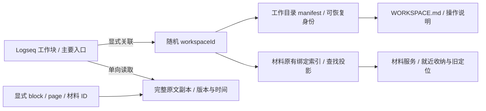

# 工作区关联与可信读取

2026-10-02。实现基线为远端 main `16ef663fc9485eb2dfb036d7eedf20d404511e70`。总体产品决定沿用 [工作区协作设计](2026-10-02-workspace-usage-and-interaction-design.md)；本文描述本分支实际交付的本地行为。

## 使用路径

从任意明确的工作块右键选择「工作台：关联工作目录」，填写 Graph 外的已有绝对目录。普通 Task 默认平铺；明确 MiniProject / Project 标记默认选择按需项目目录，也可以选择平铺。关联不会移动已有文件，不创建空的材料、工作记录、成果栏目。需要新目录时明确选择「新建并关联工作目录」。这两个动作才为文件 Graph 的根块保存原生 id；普通浏览和子块读取不写 id。DB Graph 不使用文本 id 写入。

同一块、同一目录重复关联保留 workspaceId。标题和路径不生成身份；同名工作、不同 Graph 的同 UUID 不合并。目录中的 manifest 与所选 Graph / 根块不符时拒绝关联，已有工作记录不能静默替换。

关联后目录出现短小的 `WORKSPACE.md`，说明原文权威、刷新入口、文件读取顺序和能力边界。已有用户同名文件保留，依次使用 `WORKSPACE.task-copilot.md` 或带身份的文件名。没有第二篇项目摘要。入口提供返回 Logseq 的块链接，原始子树仍在 Logseq 原生界面编辑。

图中实线表示实际关系；原文副本和索引都不能反向改正文。

## 日常读取与更新

「刷新工作记录」读取主要根块的真实子树和显式关联来源，机械保存自然正文、批注与局部 TODO，不解释、不清洗、不执行。块顺序和层级来自宿主，个人折叠、拖动及未提交草稿不进入来源副本。完整原文 SHA-256、结构版本、来源集合版本与读取时间可以判断两次读取是否相同。

插件运行时订阅 DB 变化，固定 100ms 合并刷新已登记的工作；每 5 秒核对已登记范围作为事件遗漏的兜底。同一工作串行，待刷新集合最多每份工作一项。既有任务模块的来源观察器继续服务正式关联，本模块拥有自己的镜像观察生命周期。无需 agent、API key 或 Kernel 在线；关闭任务模块仍能运行。

「打开工作读取入口」通过桌面文件桥接打开实际入口。目录阅读者先检查 `.task-workspace/status.json` 的最近尝试，再检查 `current.json`，按 revision 读取同一版本目录的 `original.md`、`source.json`、`version.json`。Markdown 原文只增加层级/续行前缀；版本清单记录每段 UTF-16 范围到原文的映射，属性、空行、换行及 Markdown 标记都保留。

插件上下文的 `workspace.read` 只读已有副本，始终标记为 last-known；`workspace.refresh` 真正检查来源后才返回 checked。这表示本次检查完成，不保证返回之后来源永不变化。外部来源各自显示 available / missing / unavailable。失联来源的最后良好内容单独放在 lastKnownSources，并注明旧读取时间。

## 中断与恢复

| 情况 | 行为 |
| --- | --- |
| Logseq 暂不可读或关闭 | 保留最后良好版本；刷新失败 / 缺失明确记录，不把缓存冒充新读取 |
| 目录失联 / 无权限 | 不改用全局目录；本进程已读取缓存可按 last-known 使用，新的写入停止 |
| 部分文件保存失败 | 当前指针继续引用旧完整版本；未完成版本文件保留供核查 |
| 当前指针损坏 | 验证 last-good 指针及其三份文件，返回 recovered 的旧副本 |
| Graph 切换 / reload / 解绑 / 重关联 | 使旧作业失效；已经进入单次宿主 IO 的调用无法取消，但目标固定，不改投新目录 |
| 工作目录整体搬迁 | 明确选择「重新关联工作目录」并读取原 manifest，保持 workspaceId；不自动猜搬迁或副本含义 |
| 解绑 | 停止工作区同步，移除实际目录绑定，保留身份提示、目录记录、成果及原笔记；材料新收纳恢复既有 fallback 规则 |

重启从材料原有绑定索引找到目录，再验证 manifest 恢复观察范围。索引丢失时，用户选择原目录可从 manifest 重建。没有索引且用户未选择目录时，不扫描磁盘或全 Graph 找工作。目录整包复制保留身份；作为新工作需要不同入口和未被其他工作占用的目录，首版没有自动复制分叉动作。

## 材料兼容与能力范围

工作区和材料界面只有同一条实际绑定命令路径。旧材料绑定保持读取与祖先就近解析；显式关联可将它承接为便携记录。材料界面的绑定操作同样建立 manifest，解除绑定同样停止镜像。原有材料根登记、全局 fallback、角色目录、精确 ID 定位、权限、转换和历史仍由材料模块负责，目录变化不改投旧材料保存位置。

本轮支持插件 API 显式关联已知 Logseq block / page 和已核验材料 ID；没有全 Graph 搜索、无关反向链接展开或材料目录扫描替代读取。交流全文同步、阶段与认可、正文写回、Git 编排、语义整理、问题聚焦及外部 agent transport 未实现。外部 agent 可以直接阅读文件副本；若需刷新，使用已运行 Logseq 的真实命令。目录入口不写不存在的 CLI/MCP 命令。

根块 id 已验证不意味着所有子块跨索引重建稳定。未持久化子块 UUID 会随文件 Graph 重索引改变，结构版本会反映变化；本轮不自动给每个子块追加身份属性。Graph 身份沿用宿主 graphIdentity，路径或 Graph 定位变化不承诺跨 Graph 自动迁移。
