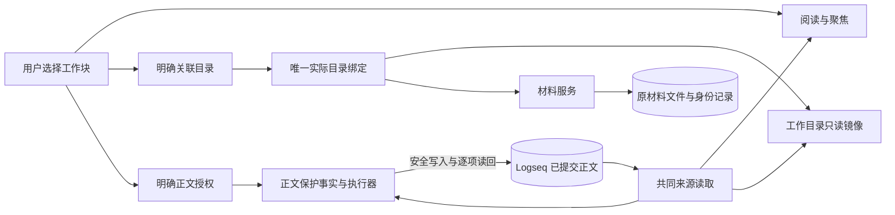
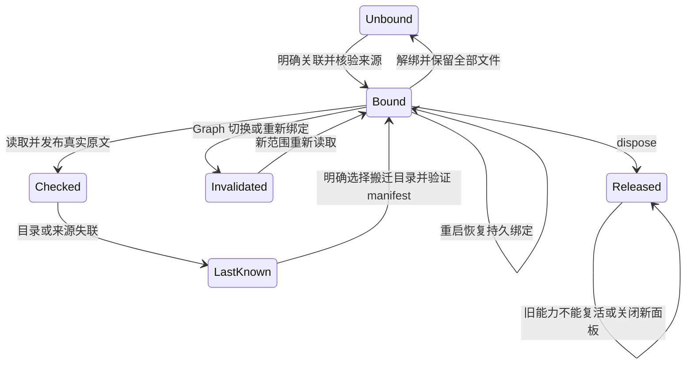

# 工作区整合与有限恢复

2026-10-03。`codex/workspace-integration` 已接入远端正式 workspace-context，依赖提交为 `acb1f4a3adb5d7122632245f0c2456853d4f6897`。本轮将工作区、材料、聚焦和安全正文写回接成同一条本地工作路径。[架构](../architecture/workspace-integration-architecture.md)与[交接](../implementation/workspace-integration-handoff.md)分别记录实现边界和当前验证。

## 使用路径

普通块无需工作目录即可阅读、聚焦。需要文件读取副本时，从工作块右键选择“关联工作目录”，使用已有紧凑表单明确选择目录。材料沿同一绑定收纳，原文仍在 Logseq，已有材料仍在各自原文件。

工作区、lenses、content 使用正式共享来源协议和同一已提交 SDK provider。草稿可在工作视图显示，但不进入已提交来源。修改正文须通过原有本地授权入口，属性、正式字段、TODO、原生编辑和逐项读回保护继续生效。写回后既有观察器更新视图与目录镜像；聚焦保持选择，标记依据变化，不自动重选或生成摘要。

任务开关关闭、Kernel 离线时上述自然工作能力仍可用。正式任务状态仍由 Kernel 管理；展示 apply 仍只改变布局。本轮没有新模型、API key、推荐系统、外部 transport、Stage 或 Git 编排。

## 搬迁与失联

目录失联时保留最后已知副本并停止写入，不改投全局目录。用户选择“重新关联工作目录”，表单显示旧位置与就近说明，允许输入搬迁后的目录；核验 manifest 的主来源和 workspaceId 后更新唯一绑定。重启继续从该绑定恢复，不扫描磁盘找目录。

材料 locator 不随工作目录偷偷改写。打开失联材料后，先“登记原材料目录”核验该材料 ID，再在“更多 → 重新定位”明确选择实际文件。已有权限、关联、历史和草稿继续使用材料模块；目录外引用不变。该步骤支持整包搬迁，未建设全文件迁移或重命名追踪。

原绑定仍存在同一身份记录时，完整目录副本不能被当作搬迁自动认领。新路径与主来源或已知身份不符时拒绝，保留双方文件。仅本机记录的未完成绑定目标可以重试；删除副本入口文件不会获得这一资格。这不是复制分叉能力。无 manifest 的旧材料绑定继续可用，自动观察不会升级其身份。

## 版本与范围

正文版本为完整原文 UTF-8 SHA-256；结构版本保留 scope 根的真实范围外父级和实际兄弟序号，后代维持真实先序。范围外父级只是定位事实，不进入聚焦成员或写入授权。时间、草稿、布局和运行 epoch 不参与正文版本，文本偏移仍为 UTF-16 半开区间。

材料目录键使用 graph.path，来源 scope 使用 graphIdentity。它们由绑定协调显式映射，不能混用。正文 Journal 保留原 FileStorage 位置，旧请求继续可查。

当前范围不包含多根、父子工作区、跨 Graph 模式迁移、复制工作区自动分叉、全文件重定位、跨进程原子写入或原生中文 IME 的完整验收。
