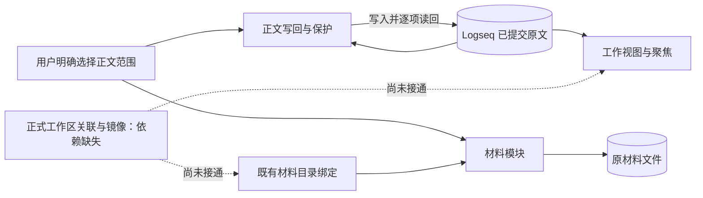
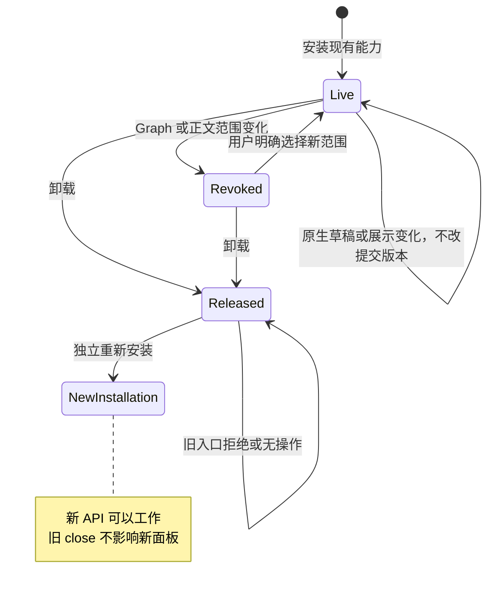

# 工作区整合与有限恢复：当前交付

2026-10-02。分支 `codex/workspace-integration`，远端基线 `1298ac2937ac18daf82d38f852e0f93a44f32dc9`。**Goal 尚未完成：该基线没有正式 workspace-context，已提供的交付 SHA 无法从远端取得。** 本次交付现有能力核验、两个接入修复及回归；没有重新实现工作区模块。完整产品目标见[工作区使用设计](2026-10-02-workspace-usage-and-interaction-design.md)，工程证据见[交接](../implementation/workspace-integration-handoff.md)。

## 已经可以使用

材料、工作视图及聚焦、正文写回继续使用已发布实现。禁用任务管理且 Kernel 离线时，普通块仍可阅读和聚焦；材料可独立读取；正文修改须先通过本地用户命令建立范围。普通阅读不建立工作区，不要求选择目录，也不保存块身份。

本轮修复两条接入路径：

- 插件释放后，保存下来的旧工作台 API 不再关闭新安装的工作面板。旧 `read` 返回空，展示 `apply` 返回关闭原因，打开和材料读取入口拒绝继续使用；旧 `close` 无操作。卸载仅撤销自己发布的 namespace。
- 聚焦消费者能够接收根块的真实父级和兄弟顺序。范围内祖先保留，范围外的父块不进入聚焦依据；负顺序、环、错误后代父链及伪造 hash 继续拒绝。

没有增加界面或后台提醒。现有命令、材料目录表单、阅读位置、聚焦选择、原生编辑和字段/TODO 保护保持。展示 `apply` 仍只修改个人布局。

实线是现有真实实现及本轮验证链，虚线是尚未交付的整合链。SDK/DOM 合成验证不代表真实 Desktop 或外部 agent 通道。

## 来源、目录和版本

正文版本继续是完整原文 UTF-8 SHA-256，包括换行、空白、Markdown 和原生属性。草稿可以呈现在工作视图，但不进入聚焦的已提交快照；布局、时间与公开 seq 不构成正文版本。旧补丁遇原生草稿仍被阻止。

**共享来源尚未统一。** lenses 默认来源来自既有提交行，scope 根的父级/顺序仍是局部表示；content 默认 SDK adapter 返回根的真实父级/兄弟顺序。因此相同原文的正文版本可以一致，但嵌套根或非首个页级块的结构版本仍可能不同。本轮只修复消费者接受真实拓扑的能力，没有用临时 provider 冒充正式共享来源。

材料目录继续走 `MaterialDirectories`。其 Graph 定位键是 `graph.path`，正文与聚焦的 scope 使用 `graphIdentity`，两者不是可直接交换的字符串。旧无 manifest 的材料绑定不升级身份。正文 Journal 保持原 FileStorage 位置。

## 当前恢复边界

既有材料显式重定位、版本冲突与草稿保存继续可用；目录不可用时不回退到全局新收纳目录，exact ID 重复时不自动认领。Graph 切换、scope 变化及卸载继续使现有模块的旧作业失效。

移动目录后核验 manifest、保持 workspaceId、更新唯一绑定、材料 locator 重关联及重启恢复尚未实现或验收。本 Goal 的完整“绑定—刷新—阅读—修改—再读取—搬迁—重启”路径必须在取得正式工作区交付后完成。目录复制身份冲突、全文件移动追踪、多根、父子工作区、跨 Graph 模式迁移仍不包含在本轮。
