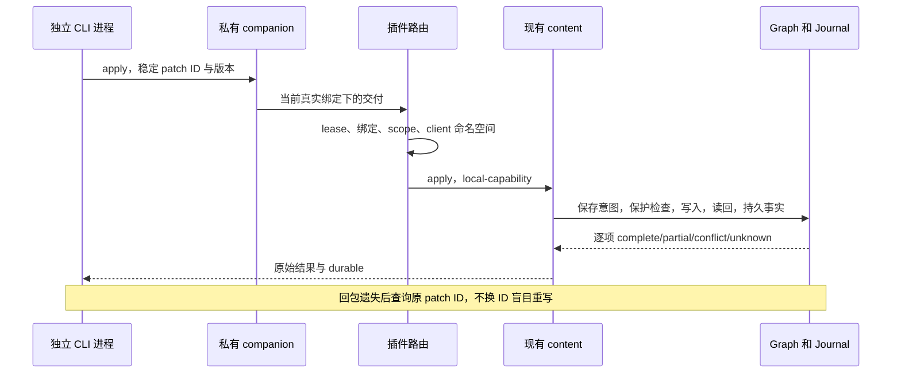

# Agent 工作区：实施交接

交付日期：2026-10-03。分支：`codex/agent-workspace`。全部三个增量在同一工作树完成，没有委派其他 agent/session，没有 push、PR、合入 main、部署或修改生产 Graph。

## 基线与归属

本机 macOS Darwin 24.2 / x86_64。起始仓库 origin 核验为 `https://github.com/wrd233/logseq-task-manager.git`。原 checkout 本地 main 是 `bb8143150b938e8f0d7f71f025fabb21a661f2e1`，有他人的未跟踪 prompts，未在该 checkout 安装、切换、stash、reset、clean 或提交。

本 session 的独立工作树：`/Users/mac/Downloads/work/logseq-agent-workspace-20261002`。启动 fetch 锁定远端 main `1298ac2937ac18daf82d38f852e0f93a44f32dc9`，最初确实缺少 workspace-context。随后用户明确提供 `acb1f4a`，已从 origin main 获取并核验完整提交 `acb1f4a3adb5d7122632245f0c2456853d4f6897`；检查 diff、保存自身提交后合入，唯一共享冲突是 index.ts dispose，保留双方安装与释放。之后没有追逐 main。

工具链由该提交 package.json 决定：Node 20.20.2（满足 >=20.19 <21）、npm 10.8.2，放在工作树 `tmp/agent-workspace/toolchain/`，未更改系统默认运行时。独立 node_modules、dist、临时文件、Graph、app/home/profile、私有 descriptor 与进程。package.json/lockfile 未改，没有新增依赖。

已保存的提交：

- `87d1e8d`：纯协议、companion、文件观察、路由与可信已有能力端口。
- `270fde8`：CLI 与插件共享组合根接线。
- `af22e2a`：合入用户明确提供的正式 workspace-context。
- `5f27a5c`：正式绑定 lifetime witness 与 WORKSPACE CLI 指引，单独共享提交。
- `3209c30`：材料引用插入保留阅读焦点，单独共享修复。
- `49e2c5c`：正式 provider 的完整适配、闭环保护与跨进程/文件测试。
- `2df98fa`：组合根接线、紧凑文件/连接 UI 与 CLI 输入上限，独立共享提交。

后续正式 provider 适配、保护与交付文档提交在本分支 `git log` 中；集成请使用明确提交和本分支完整 diff，不读取活动文件或仅摘走接口声明。

## 实际使用

在兼容 Node 环境，仓库执行 `npm ci` 和 `npm run build` 后可以直接运行构建 CLI。以下示例在 shell 中设置一次实际仓库路径与自己的私有状态目录；不要求全局安装 CLI，不改变系统 Node。

```sh
# 将此路径设为本机的构建 checkout；使用自己的 Node 20 环境。
REPO=/Users/mac/Downloads/work/logseq-agent-workspace-20261002
task-copilot() { node "$REPO/apps/task-copilot-cli/dist/main.js" "$@"; }
export TASK_COPILOT_WORKSPACE_STATE="$REPO/tmp/agent-workspace/my-private-channel"
export TASK_COPILOT_WORKSPACE_CLIENT=my-current-session
task-copilot workspace serve
```

serve 是前台 companion，输出 `pluginDescriptorPath`，不输出令牌。另一个终端或 agent shell 使用同样的 CLI/环境；也可显式 `--state-dir`。停止自己的 companion 用 Ctrl+C。一个私有目录不能启动第二个 companion，已有 lock 直接拒绝；硬杀后先核验进程归属，再人工处理自己的旧锁，程序不抢占或杀别人的进程。

在 Logseq 的实际工作块关联 Graph 外的目录；插件设置填写 **agentWorkspaceDescriptor 路径**，不粘贴 descriptor 内容。选中入口块执行「工作台：允许 agent 连接当前工作」。右键菜单也注册了「允许 agent 连接此工作」，Desktop 本轮验收主要使用宿主已注册 palette 命令。每次 Graph 切换、解绑、重绑定、正文授权撤销、卸载或重启后重新允许。停止用「工作台：停止 agent 工作连接」或材料区目录详情里的停止按钮；不停止本地材料、视图与历史。

在绑定的目录或其子目录：

```sh
task-copilot workspace status --json
task-copilot workspace capabilities --json
task-copilot workspace refresh --json
task-copilot workspace read --json
task-copilot workspace files list --json
task-copilot workspace files read '新增说明.txt' --json
task-copilot workspace files associate '已有材料.md' --json
task-copilot workspace materials list --json
task-copilot workspace sessions add --platform codex --session-id chosen-session --description '用户明确选取的会话' --json
task-copilot workspace sessions list --json
```

`--directory` 可覆盖 cwd。程序从当前目录向上至多 16 级识别派生连接入口，核对正式 manifest 的 workspaceId、主 scope、organization、entryFile；Registry 自己的完整 schema 与实时绑定核验仍在插件。WORKSPACE.md 文字、manifest 和 locator 不授予权限。`read` 只用私有 last-known 缓存，外层与嵌套工作区 freshness 都为 last-known，sourceAvailable 为 false；不能根据 status 文件的磁盘时间声称在线。

agent 从返回的实际 sourceId/materialId 读取，无需人复制 UUID：

```sh
task-copilot workspace source read "$SOURCE_ID" --json
task-copilot workspace materials read "$MATERIAL_ID" --json
task-copilot workspace materials capture --input-file capture.json --json
task-copilot workspace materials save --input-file save.json --json
task-copilot workspace materials associate --path '已有材料.md' --json
```

capture 输入闭合为 requestKey/text/可选 html,title,role；默认 agent output。save 是 id/expectedVersion/expectedContent/next，actor 固定 agent。材料角色/权限、长文本转换、原文件、版本、失败提议和历史都由既有模块拥有。材料 ID 必须属于该工作已有材料，或已通过正式工作区明确关联；路径关联只接受根内经过核验的已有相对文件，不移动原件。没有任意文件写 API。

## 聚焦与正文协议

```sh
task-copilot workspace focus request --question '哪些条件和反例影响这个判断？' --json
task-copilot workspace focus source --json
# agent 用返回的真实 request/source 生成完整块 FocusPlan
task-copilot workspace focus apply --input-file focus-plan.json --json
task-copilot workspace focus read --json
task-copilot workspace focus cancel --json
task-copilot workspace focus back --json
task-copilot workspace focus exit --json

task-copilot workspace content read --json
# agent 从当前版本和权限生成 content Patch
task-copilot workspace content apply --input-file patch.json --json
task-copilot workspace content result "$PATCH_ID" --json
task-copilot workspace content pending --json
task-copilot workspace content recover "$PATCH_ID" --json
task-copilot workspace content retry --input-file retry.json --json
```

上述 JSON 是 agent 的程序输出，不是产品要求用户填写的表单。FocusPlan 完全采用现有 lenses 协议：schemaVersion、requestId、scope、question、structureVersion、sourceVersions、完整块 visibleRanges，以及已有有界 emphasis/gaps/temporaryInference。保留选中块和祖先的真实版本。问题来源必须先通过 `focus source` 取得，不能把缓存偏移或草稿作为版本。语义充分性由外部 agent 与用户判断。

Patch 完全采用现有 content v1 协议，见 [content 架构](../architecture/content-writeback-architecture.md)；不移除 protection、真实 path 和 EditingGuard。文本范围 UTF-16 `[start,end)`，基础版本为原文 UTF-8 SHA-256。retry 输入是 previousRequestId/patch。CLI transport request ID 用 `--request-id`，补丁 Journal ID 是 Patch.requestId，两者不要混淆。每个独立 agent 会话设置不同 `--client` 或环境变量；该值是同一私有 capability 内的命名空间，不是用户身份证明。



补丁 metadata.stageId/runId 保持关联线索语义。`content.pending` 是同一已授权工作范围的既有恢复列表；各客户端的 apply/result/recover/retry 使用隔离命名空间。共享 token 的客户端能读取该工作的正文和恢复事实，不是互相保密的用户隔离。

CLI 退出码 0 不代表全部正文成功。检查返回 status、逐项 facts、durable 和 journalProblem。`outcome-unknown`、`TRANSPORT_OUTCOME_UNKNOWN` 或送达后 CHANNEL_UNAVAILABLE 时先查询原 ID；Journal 记录本次持久写入事实，不保证后来人工编辑后当前正文还等于该历史结果。冲突保留当前文与原 patch 提议，不修改旧事实伪造完成。

Stage 只有可选 `read/submit(input,binding)` 正式 provider 端口：

```sh
printf '{}' | task-copilot workspace stage read --input-file - --json
```

当前返回 `{"status":"unavailable","reason":"STAGE_PROVIDER_UNAVAILABLE"}`。没有 begin/checkpoint 存储、认可命令、Stage schema 或 renderer。接入已发布阶段能力时，组合根注入拥有闭合类型与范围/持久事实校验的 adapter；submit 只提交结果/修订，不能接受任何形式的用户认可。未实测已有阶段 provider，因为本次明确发布依赖只包含 workspace-context。

## 错误、上限与隐私

| 情况 | 返回与处理 |
| --- | --- |
| 无有效工作入口 | WORKSPACE_NOT_BOUND / WORKSPACE_BINDING_REQUIRED；先在本地明确关联 |
| 旧实例或旧 grant | DESCRIPTOR_STALE / CONNECTION_STALE / CONNECTION_REVOKED；重新本地允许 |
| 插件离线、失去心跳 | WORKSPACE_OFFLINE；本地工作台仍可使用，缓存 last-known |
| 未送达超时 | WORKSPACE_TIMEOUT；未被插件领取 |
| 送达后超时 | TRANSPORT_OUTCOME_UNKNOWN；先查原正文 Journal 请求 |
| 假 actor/root/未知字段或命令 | UNSUPPORTED_FIELD / UNKNOWN_COMMAND；闭合拒绝 |
| 重复 ID 换内容 | IDEMPOTENCY_KEY_REUSED；不覆盖原请求 |
| 越界、受限链接 | PATH_OUTSIDE_SCOPE / SYMLINK_RESTRICTED / METADATA_PATH_RESTRICTED |
| 材料非当前工作或无 agent 权限 | MATERIAL_OUTSIDE_SCOPE / MATERIAL_AGENT_WRITE_FORBIDDEN |
| 问题属于其他客户端 | FOCUS_REQUEST_NOT_OWNED；原 lenses 的晚到/版本错误保持原原因 |
| 来源不能刷新 | SOURCE_UNAVAILABLE；保留旧内容，不能写回缓存 |

扫描限额：深度 8、遍历项 1000、目录 128、并发 1、普通预览 256 KiB。扫描完整时 missing 项只是上次观察的可用性事实；截断时报告遗漏路径及原因，不推断删除。默认排除 `.task-workspace/.longdoc/.git` 和明确构建缓存，保留其他隐藏文件。额外 basename 排除配置和闭合 schema 见 [架构](../architecture/agent-workspace-architecture.md)。mtime/size 未变不是正文版本。

私有状态目录包括两个 descriptor、lock、按目录摘要定位的 last-known 缓存和 connection-facts.jsonl。事实日志只存已验证连接与调用摘要，不含 secret/全文。正式 Journal 保持 Logseq 私有 FileStorage；材料及历史仍在 `.longdoc`；镜像/manifest 仍归正式 workspace-context。会话引用唯一扩展记录 `.task-workspace/agent-sessions-v1-<workspaceId摘要>.json`，至多 64 条，不存聊天副本或访问令牌。没有 Git init、远端创建或自动提交。

## 本轮验证证据

以下证据在本工作树 `tmp/agent-workspace/`（ignored，合成内容）及自身 `tmp/logseq-sandbox/` 保留。没有把旧分支测试通过当作本轮通过。

| 层次 | 实际验证 |
| --- | --- |
| 文件/连接纯核心与真实 Node IO | 隐藏价值文件、准确材料 ID、mtime 不冒充 hash、二进制/大小/深度截断、移动/副本/missing、元数据 symlink、受限路径、闭合会话链接、并发引用保存、manifest 身份冲突、私有令牌/Origin/实例/锁、broker 超时与晚回包 |
| 独立外部进程 + DOM/合成 SDK | 真实 CLI 子进程通过注册 installer 和 HTTP 读取插件 fixture；刷新/hash/缓存、来源缺失不覆盖缓存、文件关联不移动、input/reference 保存拒绝、真实 MaterialService、持久 content Journal、冲突、假 actor/scope、TODO/编辑保护、杀掉已送达客户端后查询/幂等、双客户端隔离、FocusPlan/祖先/材料返回/新题晚到/来源变化、同 scope 重绑定与解绑、明确关联外部材料、Graph 切换、dispose、descriptor 重启 |
| 插件回归 | 本轮插件 typecheck/test/build，259 项自动测试通过；最终完整 check 使用收尾代码再次运行 |
| CLI/service 回归 | CLI 17 项、service 29 项通过；built binary smoke 与边界检查通过 |
| 真实 Desktop | Logseq 0.10.9 / SDK 0.3.4，tasksEnabled=false、Kernel 未启动；独立构建 CLI 实际请求私有 HTTP + 插件 poll，真实原文/hash/缓存、直接文本/二进制、权限、材料 capture/save/readback、正文 apply/result/冲突/幂等、双客户端、TODO/正式属性/实际编辑态、聚焦面板/材料返回/晚题/来源变化、停止/本地工作台保持、插件卸载重载、完整 app+companion 重启 |

Desktop 首次 PID 55368、companion 55367；完整重启后 PID 59170、companion 59169；最终构建重新加载插件、轮换 companion 到 PID 62408，已通过 desktop-final-verify.log 再次核验私有通道、last-known、持久 Journal 与重复提交；收尾 companion PID 64002 上通过 desktop-acceptance-final.log 重新跑完全部 11 组 Desktop 结果。每次 CDP 连接检查本 worktree sandbox manifest、完整 PID command、app/profile 路径和专属 `127.0.0.1:19339`；没有连接或停止别的 Logseq/Kernel。Graph 是自己合成的 Agent Workspace Acceptance 页，材料目录与私有状态均在自己的 tmp。公共 harness 默认 start 会启动 Kernel，因此只复用 prepare/隔离 bootstrap 和身份校验 stop，使用本地 ignored 启动脚本，不重写公共 harness。

`desktop-facts.json` / `desktop-acceptance.log` / `desktop-acceptance-final.log` 记录完整外部流程，`desktop-focus.png` 为实际面板；`desktop-restart-facts.json` / `desktop-restart.log` / `desktop-final-verify.log` 记录最终构建重启与持久 Journal 读回。CDP 只用于 fixture 设置、可信本地命令和 DOM/SDK 断言，**生产通道不使用 CDP eval**；每次自然能力调用由真正独立的构建 CLI 进程完成。测试 fixture 的 SDK 输入不冒充原生键入。

Desktop 发现并修复材料引用默认 SDK focus=true 抢走阅读状态：材料模块程序插入引用显式 focus=false，保持已有编辑保护。后续真实流程完整复验通过；没有放松 TODO、formal 或 EditingGuard。

最终 `npm run check` 全部通过，合计 510 项测试，0 失败、0 skipped；覆盖 requirements 生成、全工作区 typecheck/lint/test、sandbox 测试、build 与二进制 smoke、边界检查和 taste eval。定向跨进程/文件/连接 7 项也全部通过。收尾代码检查日志为 full-check-final.log 与 targeted-all-final.log；其他独立日志包括 typecheck.log、lint.log、plugin-tests-final.log、cli-tests.log、service-tests.log、boundaries.log、final-build.log。

## 共享路径、集成与剩余事项

共享路径逐一核验：

- `packages/contracts/src/index.ts` 与新增纯 `workspace-agent.ts`。
- CLI `src/main.ts`、`src/cli.ts`，新增三个 workspace 模块与两个测试文件。
- 插件 `src/index.ts` 的 settings/安装/dispose/namespace/provider 注入。
- `features/content-writeback/installer.ts` 只暴露可信组合根 lease 端口，未放入 public namespace。
- `features/materials/controller.ts` 目录观察注入与紧凑列表/连接状态。
- `features/materials/source.ts` 引用插入 focus=false（独立提交）。
- `workspace/context-service.ts` 只读 lifetime witness，`workspace/workspace-record.ts` 入口指引（独立提交）。

正式共享来源接线已消费 acb1f4a 的唯一 Registry/ContextService，没有复制造一套 workspace-context，manifest schema 未扩展为任意 metadata。若 workspace-integration 后续发布明确交付提交，先保存本分支、检查 diff，再在自身分支整合；重点核对 index、绑定 witness 和材料目录端口。stage-workbench 只通过可选正式端口接入，不让 CLI 导入阶段 controller，不抢 renderer/composer 所有权。

未实机验收：中文 IME、系统粘贴/Undo、原生文本键入提交、真实双 Graph 的 A→B→A 晚到竞态（自动化覆盖）、DB Graph（既有自动化保护）、Windows/Linux Desktop、断电与长期多进程压力。普通文件系统路径检查有 TOCTOU 限制，没有分布式锁或 SDK CAS。Windows 首版私有通道诚实 unavailable；Linux 的 Node POSIX 实现未在本轮运行。Stage provider 当前 unavailable；不影响已完成基础闭环。

本分支提交仅在本机，尚未远端发布；跨电脑整合需要用户后续授权发布，再使用可从 origin 获取的确切提交。正式 workspace-context 依赖 acb1f4a 已经远端可获取。

本地数据、证据和工作树保留，没有自动 push 或 PR。收尾只释放已验证归属的本 session 进程。
