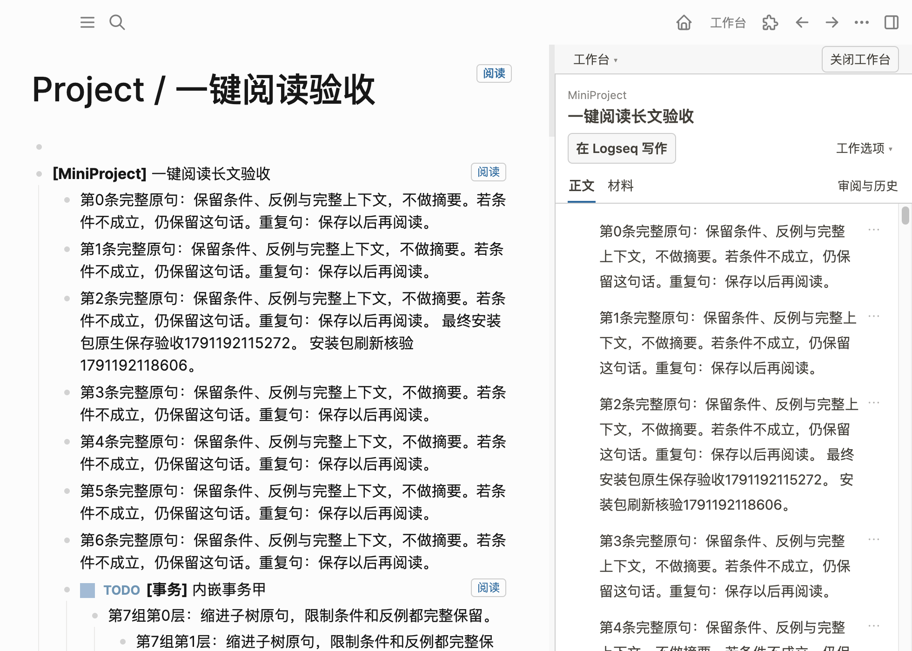

# 最终安装包与验收证据

2026-10-05，独立分支 `codex/simple-start-reading`。核心闭环已通过真正 Logseq Desktop；物理中文 IME、原生 Undo、系统拖放、剪贴板与其他平台仍未验。完整逐项目标审核与最小复验见[交接](../../simple-start-reading-handoff.md)，用户从[最短使用说明](../../../user-guide/simple-start-reading.md)开始。

## 安装产物

[task-copilot-workbench.zip](task-copilot-workbench.zip)，6,228,518 字节／428 文件；[SHA-256](task-copilot-workbench.zip.sha256)：

```text
5fcc62f3772709839429e849e5c0d5fdb5bad0c733dc62b31a1efc47df1ebab2
```

构建提交 `e5eca0588aaa2d3a418049ff716505b3528a8da1`，干净的已跟踪文件。两次打包逐字节一致。运行身份和全部运行文件哈希见 [build-identity.json](build-identity.json)；[package-proof.json](package-proof.json) 核验 ZIP、仓库外解压与无源码／node_modules 要求。[package.log](package.log)、[reproducibility.log](reproducibility.log) 记录实际产物。

包包含 SDK、本地编辑器资源及许可证、生产 workspace CLI 与可选协作启动器；不含 Graph、profile、home、用户资料、凭据、测试夹具、node_modules、类型声明或源码映射。基础阅读没有 Node 依赖；独立协作启动器需要 POSIX 和 PATH 中的 Node 20.19+。

## 证据身份

核心完整旅程使用干净 b80eb95 包。最终 e5eca05 仅增加测试等待修复并过滤开发文件，没有运行代码变化。[environment.json](environment.json) 记录两个包共有运行文件的哈希相等。`dist/index.js` 的共同 SHA-256 是 `be837238674a7e9db6f0a93fcfbe14dd9fc21f7f5660a49044cf2e578a8ced71`；最终包又在第二个空 home/profile 下实际装载，并由 Debugger 读取执行脚本核对。

所有截图来自独立复制的 Logseq Desktop 0.10.9，macOS 15.2 Intel。操作通道是该实例的 CDP Input 及真实 SDK，不是浏览器替身，也不证明物理 IME 或 OS 拖放。Graph 仅含本轮合成资料。记录中的绝对路径和 UUID 属于隔离验收，不是用户使用时需要填写的配置。私有连接文件、凭据与实际 Graph 没有交付。

## 实际旅程

| 旅程与身份 | 事实 | 证据 |
| --- | --- | --- |
| 最终 e5 空 profile 装载 | 空 Kernel／协作／材料设置；阅读／材料默认开，tasks 默认关；一处工作台工具栏；无自动导航或面板；执行脚本等于 ZIP | [final-startup.json](final-startup.json)、[实际首屏](final-first-start.png)、[装载日志](installed-startup.log) |
| b80 原生事务 | 实际输入并保存事务，2 块一次点击读取，来源不变，0 必填设置 | [final-core.json](final-core.json)、[一次点击截图](final-one-click.png) |
| b80 完整长文及范围 | 97 块、原文 9,142 字符，全部 UUID／正文哈希／父级／深度相符；明确内嵌事务 4 块与直接返回；普通段落不切范围 | [final-core.json](final-core.json)、[完整阅读](final-long-report.png) |
| b80 活跃原生输入／保存后刷新 | 同一 textarea、草稿、焦点和选区保留，宿主正常保存后报告内容版本等于 SDK 版本 | [native-input-proof.json](native-input-proof.json)、[原生输入截图](final-live-input.png) |
| b80 Project／Area | 99／2 个实际块的森林，页身份独立、block root 为 null，正文不变；材料与审阅不借页范围启用 | [final-page-proof.json](final-page-proof.json)、[页面阅读](final-page-reading.png) |
| b80 中间原生编辑／材料往返 | UUID 书签和像素偏移相同，原生选区 3–7 保留；宽度 384→444 保存；680 宽一次返回 | [final-layout-materials.json](final-layout-materials.json)、[宽窗](final-resizable-reading.png)、[窄窗](final-narrow-return.png) |
| b80 首次材料／目录失败 | 实际首次保存才准备 Graph 外目录；普通文件读回相同、稳定 longdoc 引用、user/agent 编辑均 false；普通文件占用候选目录时选择一次后保存，原文件和引用保留 | [final-layout-materials.json](final-layout-materials.json)、[材料截图](final-default-material.png)、[final-fallback.json](final-fallback.json)、[回退截图](final-material-fallback.png)、[回退日志](material-fallback.log) |
| b80 就近协作 | 随包独立启动器实际启动生产服务，空 descriptor 设置自动发现；生产 CLI status/refresh/read 的 98 块逐 UUID 正文／父级／深度相符；断连仍本地读取，未自动开始 agent，TODO/结构授权 false | [final-collaboration.json](final-collaboration.json)、[连接截图](final-connected-reading.png) |
| b80 开闭／重启／侧栏 | 3 个主动折叠子块和长文中间 UUID 恢复；444 宽恢复；整页恢复不路由；关闭后重启仍关闭。当前无工作显示具名继续；左右侧栏分别正确切紧凑布局 | [final-restart.json](final-restart.json)、[重启截图](final-restarted-reading.png)、[final-page-restart.json](final-page-restart.json)、[final-closed-restart.json](final-closed-restart.json)、[final-toolbar-sidebars.json](final-toolbar-sidebars.json)、[侧栏截图](final-sidebar-reading.png) |
| 最终 e5 全文与 CLI 核对 | 98 块、4,090 汉字、最大深度 4；SDK／报告／生产 CLI 每个 UUID 的正文版本、父级、深度相同，打开前后原文树相等 | [逐 UUID 矩阵](final-identity-matrix.json)、[最终包阅读截图](final-installed-reading.png) |
| 最终 e5 释放与重载 | 实际插件页停用后 0 入口／0 工具栏／0 分隔线；启用及重载后无重复 UUID 入口，全文继续可读 | [final-reload.json](final-reload.json)、[重载截图](final-reloaded-reading.png)、[实际日志](installed-reading-reload.log) |

b80 的全新 profile 首屏另见 [core-startup-b80.json](core-startup-b80.json) 与 [core-first-start-b80.png](core-first-start-b80.png)，用于核验第一次材料目录的创建时点。最终 profile 复用了相同合成 Graph；来源已有一次材料引用，因此全文从 97 增至 98，不是遗漏或重复渲染。

## 门禁与回归范围

最终 e5 实现的 `npm run check` [完整日志](check.log)，[退出码](check.exit) 为 0：681 个测试，0 失败、0 跳过，其中插件 430。需求地图、全仓类型、lint、sandbox、构建、边界和 Taste 均通过；文档同步后[需求地图校验](docs-requirements.log)再次通过。最终 `git diff --check` 结果见 environment。

新增与现有回归覆盖页面实际森林／空缺／版本、page-write 拒绝、输入期间读取、旧异步结果失效、Graph 切换、来源消失、快速打开、具名继续、页面 UUID 改变、宽度／书签／折叠、释放、缺省目录稳定／EACCES 注入及旧显式目录、改名／材料权限／Journal。历史只读、具体修订认可、聚焦、正式任务、未知写入恢复由现有回归保护；未把这些都写成此次新增的物理 UI 验收。

实际页重启证据 `pageUuidChanged=false`，换 UUID 的恢复来自明确的自动回归。目录 EACCES 来自故障注入，真实不可用目录采用文件占位。系统中文候选窗、Undo、拖放与剪贴板没有被模拟事件证明；剩余最小步骤与宿主直接启动 companion 的缺口均见[交接](../../simple-start-reading-handoff.md#尚未验收与最小复验)。

本目录全部交付文件的校验索引见 [evidence-manifest.json](evidence-manifest.json)。


