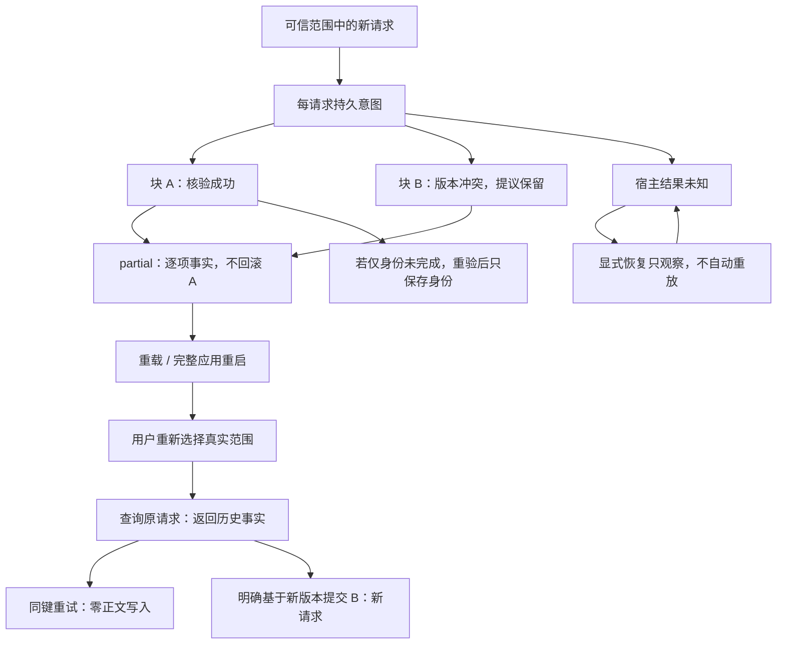

# 正文写回实施交接

2026-10-02。[产品设计](../design/content-writeback-design.md)与[架构说明](../architecture/content-writeback-architecture.md)描述最终实现。本分支已交付默认 Logseq 适配器、持久 Journal、真实注册入口和受控恢复路径；Desktop 验收有明确的未通过项，不宣称全部端到端场景通过。

## 远端与隔离环境

| 项目 | 本次实际值 |
| --- | --- |
| origin | https://github.com/wrd233/logseq-task-manager.git |
| 启动 fetch main SHA | 16ef663fc9485eb2dfb036d7eedf20d404511e70 |
| REMOTE_BASE_SHA | 16ef663fc9485eb2dfb036d7eedf20d404511e70 |
| OS | macOS 15.1 / arm64 |
| 原 checkout | /Users/wangrundong/work/任务管理中心-logseq插件 |
| 独立工作树 | /Users/wangrundong/.codex/worktrees/content-writeback/任务管理中心-logseq插件 |
| 功能分支 | codex/content-writeback |
| 工具链 | Node 20.20.2 / npm 10.8.2 |
| 命令环境 | PATH=/opt/homebrew/opt/node@20/bin:$PATH，仅本次命令 |

启动时检查机器、pwd、origin、status、HEAD、worktree list 和适用 AGENTS.md；未发现适用 AGENTS.md。核验正确远端后 fetch，显式从锁定完整 SHA 创建 Codex worktree，验证无带入改动，再建立指定分支。原 checkout 和其他 worktree 未进行编辑、安装或构建。未复制未提交内容，未追逐 main，未合并其他功能分支，未创建或联系其他 session。

收尾的只读核验曾观察到共享 origin/main 跟踪引用为 820df318268f5c44755fcba198fa03d9d5b6d981。本会话没有再次 fetch；该引用的变化不改变启动基线，下面本地提交直接接在锁定的 16ef663fc9485eb2dfb036d7eedf20d404511e70 后。

用户要求的设计、架构、集成、四轮重构、材料设计与架构及历史交接文档均在所选提交中存在，已阅读。历史材料交接里的追逐 main / 未合入背景不覆盖当前代码和本次锁定基线。材料实现已在基线中，直接保留真实 service。

独立 npm ci 和基线 npm run build 通过。未增加依赖、改变 package-lock 或系统默认 Node。所有 node_modules、dist、临时记录、Desktop profile、合成 Graph、材料和 FileStorage 都位于本工作树；没有可写符号链接指向其他工作目录。

## 交付文件与接入

新增 features/content-writeback/：protocol、validation、protection、authority、logseq-adapter、journal、executor、ui、installer。逻辑核心只依赖窄端口，默认组合使用真实 SDK。入口为 window.taskCopilotWorkbench.content，包含 scope/read/apply/result/pending/conflict/recover/retry/resolve/resumeIdentity/revoke。具体 schema、完整 SHA-256 算法、保护规则、状态和调用示例见架构说明。

用户通过原生块菜单“工作台：允许维护此处正文”建立真实子树范围；也可使用命令面板的允许维护、局部修改、明确修改 TODO、追加普通记录、查看冲突与恢复、停止维护。用户表单不要求输入 JSON、UUID 或版本。只有实际本地命令记录 local-user-command；API 记录 local-capability，不猜用户或 agent 作者。run/stage 是未经权限认证的关联元数据。

文件 Graph 的显式范围关联与新增子块复用 source-identity.ts，分别保存意图和身份读回；普通读取不写 id::。既有原生身份不一致时拒绝关联。DB Graph 不追加文件属性文本。

共享路径仅有：

- apps/logseq-plugin/src/index.ts：一处 import、content 变量、安装、释放和 namespace；保留材料、阅读、任务逻辑的顺序。
- apps/logseq-plugin/tests/integration/workbench-ui.test.mjs：为实际块菜单注册补齐 SDK registerCommand stub，并验证 content 注册和初始未授权状态；原有材料及正式 runtime 断言保留。

共享入口及其集成验证独立提交。没有修改 plugin-runtime、source-change-observer、graph-adapter、work-view renderer/controller、presentation-only operations、材料实现、Kernel schema/registry 或身份缓存生命周期。

## 请求、部分结果与恢复

Journal 默认使用 logseq.FileStorage；实际 Desktop 位置在隔离 Logseq home 的 .logseq/storages/task-copilot-vnext/。键为 scope/requestId 的 SHA-256 和六位修订序号；每请求独立追加，写后读回，最新损坏失败关闭。正文、descriptor 和草稿不进入公开日志。SDK 不提供硬断电 fsync 保证。

先持久意图，写前重读成员、父级、正文版本、字段保护和原生编辑状态。同源串行，同块不相交范围一次组合。独立块分别记录，不回滚成功块。超时或切换后的已发调用结果未知；观察到内容一致不提升作者归因。相同请求返回历史事实，异 payload 拒绝；稳定 UUID 不覆盖已有块。未知或已核验内容不能失败后盲目重写。



实线为已交付执行和恢复路径；partial 不是 complete，未知不是未应用。关闭面板保留提议；等待其他面板关闭期间撤销或 dispose，不会晚到打开界面。表单先保存稳定 requestId，再调用 executor，避免重复点击或重装追加第二份。

## 自动化验证

最终代码的定向测试 53 项通过；插件全套 223 项通过。完整 check 的 13 个测试组共 468 项通过。未跳过或降低原有断言。执行顺序为定向验证、插件检查与构建、边界检查、最后完整 npm run check。首次完整检查发现既有 composition fixture 缺少新增真实菜单注册所需的 SDK 方法，补齐 fixture；一次 UI 测试在正文已写而 Journal 尚未完成时清理目录，修正为等待实际恢复完成状态。这些问题修复后完整检查通过。

| 验证 | 结果与范围 |
| --- | --- |
| 定向 tsx --test | 53 PASS：纯逻辑、真实默认 SDK adapter、私有文件 Journal、模拟 DOM 和实际注册入口 |
| 插件 typecheck / test / build | PASS；插件 223 tests，保留正式授权、presentation-only 和材料回归 |
| npm run check:boundaries | PASS；12 个检查器测试及实际依赖扫描 |
| npm run check | PASS：requirements、所有 workspace typecheck/lint/test、sandbox tests、完整 build、boundaries、taste eval |
| Taste candidate | PASS，KEEP_0.1.0_ACTIVE；未改变激活版本 |

重点覆盖：完整原文 SHA-256/CRLF/UTF-16、真实顺序、重复旧文、越界与相交、真实成员和根变化、正式标题/投影/属性/TODO、伪造授权、输入作为数据、原生编辑和组合态、Graph/范围/dispose 失效、并发幂等及部分成功、稳定 UUID 冲突/丢回包、Journal 失败/损坏、宿主超时、读回不匹配、结果持久化失败、重启恢复、历史成功后修改、未知来源归因。额外验证特殊对象键 operationId 不会隐藏冲突或改变对象原型。

tasksEnabled=false 和 Kernel 离线的真实组合根不启动正式 runtime；在真实 adapter 上仍保护正式字段。正常 API 成功不打开面板。注册和释放检查包括 namespace、命令、Graph 订阅、DOM 面板和失效的旧 API。

可复核命令，全部在独立工作树运行：

```sh
export PATH=/opt/homebrew/opt/node@20/bin:$PATH
node_modules/.bin/tsx --test apps/logseq-plugin/tests/content-writeback.test.ts apps/logseq-plugin/tests/content-writeback-entry.test.ts
npm run typecheck --workspace @task-copilot/logseq-plugin
npm test --workspace @task-copilot/logseq-plugin
npm run build --workspace @task-copilot/logseq-plugin
npm run check:boundaries
npm run check
```

首次完整构建需 npm run build 生成依赖包和 Console 资源；不能把缺资源误判为本模块失败。本次已按实际构建顺序完成。

## macOS Desktop：真实证据与限制

Logseq 0.10.15 / SDK 0.3.4。使用本工作树的 sandbox:prepare 创建独立 app/home/profile/Graph；tasksEnabled=false、descriptor 为空，无 Kernel。基线 harness 的默认 CDP 19333 属于另一工作树实例，只作端口与进程归属核验，未连接、重载或停止它。采用已验证空闲的 127.0.0.1:19334，在本隔离副本传入独立启动配置；未改公共 harness。

每次 CDP 连接校验 sandbox manifest、实际 PID command、app 路径、profile、Graph、isolation-runtime home 和端口。验收期间只操作合成页 Content Writeback Acceptance 及独立材料目录。完整重启从本隔离 PID 31586 到 PID 57438；所有应用记录、Graph 和材料保留供复核。

| Desktop 场景 | 结果 |
| --- | --- |
| 真实原生块菜单授权、注册后 API 读取版本 | PASS |
| 局部替换、普通子块追加、原生身份与正文分别读回 | PASS |
| 另一宿主 SDK 写入后提交旧补丁 | PASS：CONFLICT，当前文及提议保留 |
| 跨块一项成功一项冲突 | PASS：partial，真实逐项事实 |
| 真实命令打开紧凑冲突入口、旧文默认折叠、关闭保留 | PASS |
| 插件重载及整个应用停止/重启后重新授权 | PASS：查询历史、重试不重复、旧成功不恢复旧文 |
| 实际原生编辑中有未提交草稿 | PASS：NATIVE_EDITING_ACTIVE，未写入、草稿和编辑块保留 |
| 材料原文件保存、过期版本、只读 input 权限 | PASS：分别 success / conflict / 拒绝，复用原 service |
| 原生键入提交后再提交旧补丁 | 未通过驱动验收：CDP 键入产生草稿，但未在 SDK Graph 模型中提交；断言 native input did not commit 失败，没有标作 PASS |
| 真正 OS IME、两 Graph 晚到写入、DB Graph | 未执行 Desktop；相应逻辑/DOM/SDK 模式测试已执行 |
| 正式 runtime 在线时的新正文 self-write | 未执行 Desktop；现有正式授权及观察测试继续通过 |
| Windows/Linux Desktop、外部 Codex session transport | 未执行；transport 未实现 |

SDK 没有 CAS，全局并发覆盖不能靠本程序队列彻底排除。Desktop 原生键入驱动失败不能由模拟测试替代；也不以 SDK 修改证明真实键盘提交已验收。

本地证据保存在 tmp/content-writeback/（ignored，含合成正文，不进入 Git）：targeted-tests.log、full-check.log、desktop-facts.json、desktop-reload-facts.json、desktop-restart-verify.log、desktop-final-build.log、desktop-final-verify.log、desktop-draft-guard-facts.json、desktop-native-edit.log、desktop-conflict.png。最终构建已重新加载并复核入口、历史查询、幂等、材料权限和原生草稿保护；菜单驱动需等待宿主异步绘制，已修正等待，未降低断言。cdp.mjs / desktop-acceptance.mjs / desktop-reload.mjs / desktop-draft-guard.mjs 为本次独立验收脚本；不是外部 agent 网关。隔离进程最后通过本工作树 sandbox:stop 释放，数据与工作树保留。

## 后续接线清单

| 消费者 / provider | 待接线 | 当前可运行默认 |
| --- | --- | --- |
| workspace-context | 统一共享 Snapshot provider、真实身份读取和 OperationJournal 位置 | 消费者协议 + 默认 SDK / FileStorage |
| view-lenses | 消费真实 source 更新，接其阅读或 composer 的调用入口 | 不改 renderer/composer；本模块命令与冲突面板 |
| 未来 StageRecorder | 消费逐项事实、版本、身份与未知状态 | 无阶段、认可或变更总结文章 |
| 外部 agent transport | 可信范围、已验证来源及跨进程调用 | 插件上下文 content 能力；无匿名 HTTP 和镜像写入 |
| 材料来源 adapter | 仅消费 MaterialService 的身份、版本化 save 和 editing 权限 | 未接入 content executor；原 materials namespace 正常可用 |

本分支从锁定基线独立推进，没有 merge/cherry-pick 其他功能分支。所有成果只本地提交，未 push、建 PR、合入 main、部署或删除 worktree。提交按核心、共享入口及其集成验证、最终三份文档拆分；具体 SHA 见下方记录及 git log。

## 本地提交记录

- b5250af41933210e53d2f77f595ce2b4d890859c：核心、默认 SDK / Journal / 受控 UI 及核心故障测试。
- 009c2334dc7d7e16d5a9df48757c19885b1233bd：最小共享组合入口、注册/释放集成测试及既有 fixture 补齐。
- 最后三份设计、架构和交接文档独立提交；文档提交自身的 SHA 以本分支 HEAD / git log 为准。
