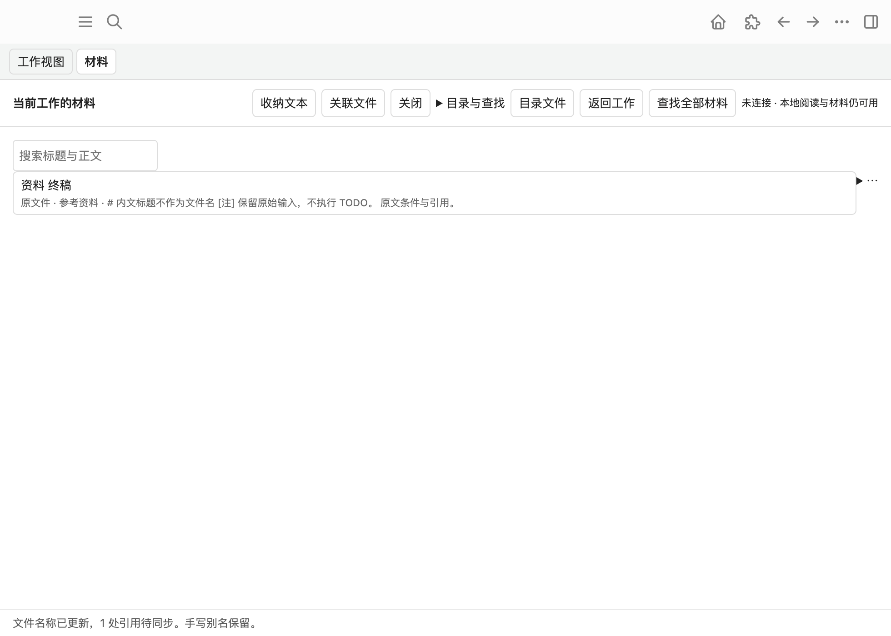
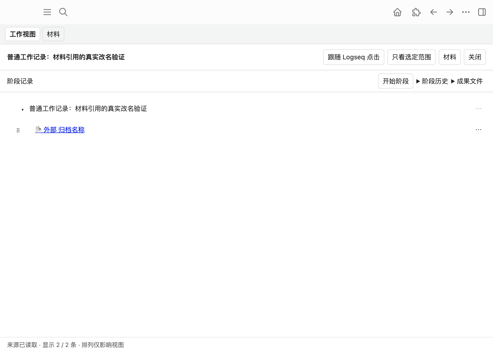

# 材料拖入与双向改名交接

2026-10-04。分支 `codex/materials-drop-rename`；固定共同基线 `e666e7be1367e97dabf5f787c7dcb944ac70e815`，已 fetch 核验为发布的 main 历史。本轮独立 managed worktree 开发、安装和验证。没有读取其他活动 checkout 的实现、委派 session／agent、修改生产 Graph、推送、创建 PR、合入 main 或部署。

产品规则见[设计](../design/materials-drop-rename-design.md)，具体接口与数据权威见[架构](../architecture/materials-drop-rename-architecture.md)。已有材料模块的收纳／编辑能力保留，本文交接增量，公共手册和 PDF 留给最终整合。

后续用户已明确授权合入最新 main 并推送；[整合记录](../integration/materials-drop-rename-main-2026-10-04.md)补充新版报告端口、schema 2 兼容、MiniProject 组合回归与本轮检查。下文“没有推送／合入 main”及基线限制是原功能交付时点，不代表整合后的当前状态；原 Desktop 截图继续标识原构建。

## 用户现在可做

- 拖已保存文件到当前材料列表：按原路径关联，重复同一路径沿用材料 ID，正文不插引用；宿主缺少 File 路径时可以明确路径关联。
- 拖文件或已有材料到可靠报告正文行：消费实际 block、scope、正文与结构版本，在已授权范围插入该块的子块引用。成功读回 Graph 和 Journal；部分失败保留材料，提供复制、定位、重新核验补插。
- 行末复制稳定链接：Clipboard API 成功才提示已复制；失败有可选择文本。没有接管普通原生 paste／drop。
- 真正改文件 basename，保持扩展名、原字节、稳定 UUID、用途、正文编辑权限和收纳恢复原文；有证据的当前引用按原正文 executor 同步，用户别名和历史保留。
- 在原父目录外部改名后刷新或读取，宿主物理身份唯一时更新路径／名称。未知、跨目录或硬链接歧义保留关系并明确重新定位。
- 文件已改、记录失败、引用失败或回复丢失可逐项恢复；未知先核验原请求，不复制材料、不盲重放、不恢复用户后来编辑的正文。

## 实际代码与共享接线

核心在 `apps/logseq-plugin/src/features/materials/`：新增 `names.ts/file-operations.ts/references.ts/drop.ts/transfer-ui.ts`，增量修改 `service/store/source/controller`。没有重建转换、工作区 provider、写入 executor、Kernel 或全局 catalog。

共享接线单独提交：

1. `host/file-io.ts` 增加可选物理身份能力；`host/desktop-files.ts` 仅在 raw stat 全部事实可靠时返回 `[dev,ino,birthtimeMs]`，否则 null。
2. `index.ts` 一个 import 和一处 `installMaterialTransfers(materials,content,workspace.source,work)`。
3. `features/materials/install-transfer.ts` 消费 main 现有 `.wb-row .wb-body`，核对实际来源字节和当前 work snapshot；不是另一份 renderer。`valid` 在导入后及交给 executor 前复核当前工作。已交给 executor 的操作仍按原 scope 和既有生命周期完成，不会移到新工作的“当前块”。
4. `tests/integration/material-editor.test.mjs` 的 SDK 插入夹具把真实返回 child 放入 block Map，并携带空 properties，使读回测试有真实对象；没有放松断言。

独立集成测试 `material-drop-rename-ui.test.ts` 验证这些接线；core 回归在 `material-drop-rename.test.ts`；宿主兼容在 `desktop-files.test.ts`。未改共同 panel、source protocol、content-writeback 核心、stage-review 或 agent transport。

## 基线与自动检查

环境：Darwin x86_64；项目自己的 Node 20.20.2、npm 10.8.2（符合基线范围），独立 `node_modules/dist/tmp`。没有更换系统默认运行时或升级依赖。

初始 `npm run check` 中 Console API 测试返回 404，原因是新 checkout 尚未构建 Console 静态资源；先执行原 `npm run build` 后，独立 Console API 测试 1/1 通过。没有改产品逻辑解决这个构建前置条件。中间完整并发测试发现新 UI 测试的固定 100ms 等待不可靠，改为等待真实材料行／操作事实，未放宽业务断言。

最终检查记录在此 worktree 的忽略目录 `tmp/complete-check.log`。完整门禁包含 requirements 生成、全部类型与 lint、所有 workspace 测试、sandbox 回归、全部构建及二进制校验、边界与 Taste；本轮数量和最终结果见本文末的交付事实。不是旧交接的通过数。

相关回归关注文件／Graph 的真实行为：basename 与重名、Unicode／空格／大小写、二进制与 UUID 旧文件、原文和权限保留、同内容双文件和硬链接歧义、物理 rename 后元数据失败／回复丢失／恢复不重放、无 identity 明确重定位、登记范围批量更新、别名保护、未知 Journal 查询、原生编辑／composition、来源版本与结构、跨 Graph payload、导入中切换工作、复制后的面板导航与已提交粘贴证据。DOM paste/drop 是模拟事件，测试名与下面实机范围分别说明。

## 隔离 Desktop 的实际证据

应用为私有复制的 Logseq 0.10.9（Darwin x86_64），独立 profile、home、Graph、材料目录、私有存储与本轮专用调试端口。关闭 tasks、没有启动 Kernel／agent／companion；旧素材只是本轮合成文件。Area“个人工具”关联 Project“资料工作台”，MiniProject 中包含 `[注]`、`[目标]`、`[想法]`、普通条件／反例和 TODO；原文没有报告小标题。另建普通工作验证受保护范围之外的正常更新。

| 操作 | 实际证据与结果 | 能证明的边界 |
| --- | --- | --- |
| 文件到列表 | `desktop-drag-probe.json` 记录 Chromium 真实 dragenter/over/drop 的 Files、Electron path 和 size；原材料 ID、路径读回，Graph 未插入 | 安装版 Desktop Chromium 文件 drag；**不是 Finder 原生系统拖放** |
| 未允许的报告 drop | 材料保留，原文无写入，提供继续路径 | 不凭 drop payload 获取权限 |
| 允许后报告 drop | `desktop-report-success.json`：目标 `[注]` 块新增 UUID child，Journal durable 且 `APPLIED_VERIFIED` | main 块级子块落点，非鼠标精确字位 |
| 实际复制 | 在可见“复制链接”按钮上 Chromium 输入点击，`desktop-copy.json` 读回系统 Clipboard API 的完整 longdoc 链接 | Clipboard 写入真实成功；不等于 native paste / Undo 通过 |
| 列表改名 | 可见改名输入、实际文本输入与保存点击；`desktop-rename-file.json`、`desktop-plain-rename-verified.json` 读回新 basename、原 UUID、原文件版本，普通工作的默认标签已更新 | 真正文件改名和当前可信范围同步 |
| 外部改名 | 独立文件操作把“资料 终稿.md”改为“外部 归档名称.md”；`external-rename-facts.json` 物理身份相同；`desktop-external-rename.json` 读回新路径、标题及普通工作 child 的新标签 | 原父目录唯一物理身份；没有 hash 认领 |
| MiniProject 名称同步 | 文件改名成功；原正文模块返回 `PROTECTED_AMBIGUOUS_FORMAL_FIELD`，没有改旧引用 | 保留正式字段保护，部分结果；不能声称此嵌套路径完整通过 |
| 旧 ID 打开与返回 | `desktop-stable-open-return.json` 从可见 longdoc 点击进入新文件的只读阅读，`desktop-return-proof.json` 返回同一普通工作；未加载 Vditor | 稳定 ID 沿新路径解析，阅读优先 |

上述 JSON 为本轮忽略目录的实测诊断记录，不把带绝对个人机器路径的记录提交。下面原始界面截图不含用户资料；来自安装版 Desktop 的截图，不是重绘 mock。

列表显示一份真实原文件，行末操作沿用紧凑控件；底部提示另一工作范围的引用待同步。截图中的名称属于稍早的已验证 basename 改名阶段，之后同一文件已经完成外部改名核验。

外部改名后，原 child UUID 和 longdoc UUID 保留，普通工作中默认标签已更新；实际点击先打开新路径的只读阅读，然后返回上述现场。

## 明确未验与整合事项

- 没有 Finder 原生系统拖动、原生任意字位 drop、跨 OS、真实中文 IME 与完整原生 Undo 结论。Chromium/CDP 文件 drag、可见 UI 点击和 DOM 替身分别记录，不能互相冒充。
- 本轮实际 Clipboard API 已复制；CDP 组合键尝试未证明原生 paste 提交，故**复制后原生粘贴、点击及 Undo 的连续实机路径尚未通过**。自动化证明复制后的生成证据可跨面板导航、只观察已提交内容、不覆盖输入。最小人工补验：在本轮隔离 Graph，从工作材料复制 → 关闭面板 → 手动 Cmd+V → 结束编辑 → 点引用打开／返回 → 改名 → 核对标签、原生 Undo 和 IME。未验证时链接按普通未管理引用保留。
- 01 的精确片段／原生共同 UI 端口未发布接入；本分支交付真实块级 `resolve/valid/navigate` 消费适配，后续替换映射，不复制 work-view。
- content-writeback 在缺少 Kernel 正式所有权证据时会保守锁住部分 MiniProject 嵌套正文。引用插入前普通 `[注]` 可插子块；插入后该父块拥有子树，现有识别可能将它判作含糊正式字段，阻止后续名称同步。文件、稳定 ID 和普通工作标签仍可用；03／整合 session 需核对来源保护的窄兼容，不能通过材料旁路 updateBlock 解决。
- 二进制登记／改名由实际文件和权限回归验证；本轮未启动外部 PDF／图片应用验收，不声称完成其预览。外部打开仍沿原 DesktopBridge。
- 普通 stat/read/rename 不提供跨进程原子 CAS 或 no-replace 保证；派发前检测到冲突会停止，极端外部竞争窗口仍存在。二进制同大小改写不能证明全文相同。需要更强宿主原语时后续明确扩展，不假称全局事务。
- 外部识别只限原父目录直接文件、可靠身份和不超过 200 项，跨目录移动、旧无身份记录和多硬链接继续明确重定位；不做全盘扫描。旧 UUID 文件、旧 longdoc 文字、恢复记录与阶段历史保持兼容。

## 交付事实

完整 `npm run check` 最终退出 0：workspace 测试 552/552（插件 318/318），sandbox 5/5，边界回归 12/12，共 569/569。requirements、全仓类型、lint、构建、二进制校验、依赖边界和 Taste 均通过；`git diff --check` 通过。新增材料 core/UI 回归 18/18，新增宿主身份回归 1/1，包含在上述数量中。补充回归证明模块自身版本化保存后更新物理身份，后续外部改名仍能读取已编辑文件；权限与收纳时原文保持。

本地提交：`4492b81` 为宿主窄能力与读回夹具；`bbb22dc` 为材料核心与行为回归；`0c484a3` 为共享 installer 接线与 UI 集成回归。最终文档 HEAD 以交付回复和 `git log` 为准。功能、共享适配和文档分开提交，便于最终整合统一注册及释放。没有通过清理主 checkout、他人 stash 或其未提交文件生成交付。
