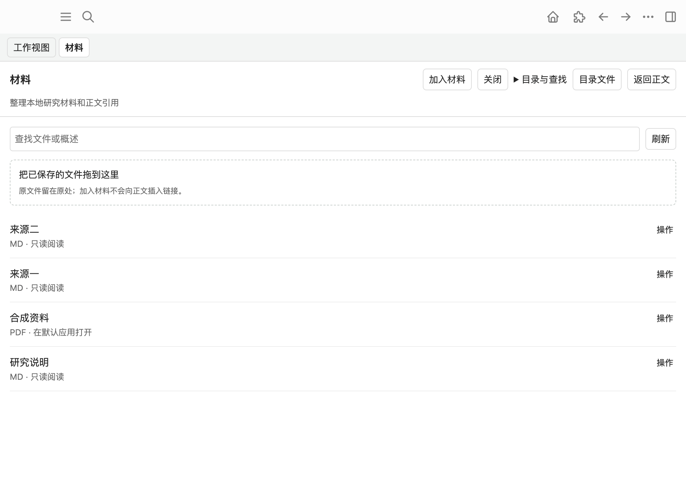
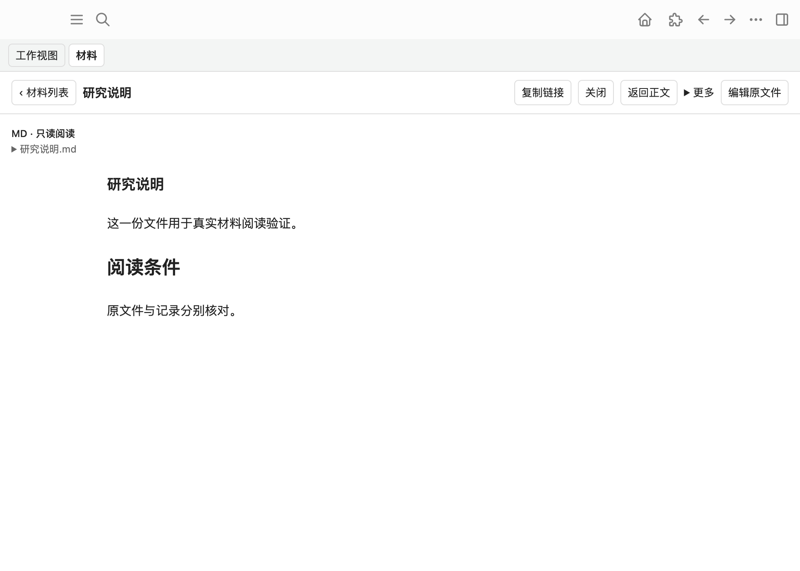

# 材料列表、阅读与引用交互交接

2026-10-05。本轮固定开发起点为已发布 main `8529212296f0b65fb78ef7ccd2a2102474d9310a`，独立分支 `codex/materials-reading-ux`。沿用已合入的材料模块、拖入／双向改名、报告正文映射和正文 Journal；没有重建共享运行时、Kernel、工作目录 provider、正文执行器或阶段系统。

产品规则见[设计](../design/materials-reading-ux-design.md)，实际接口、依赖和数据权威见[架构](../architecture/materials-reading-ux-architecture.md)。用户随后明确授权合并最新 main 并推送远端，覆盖最初仅本地交付的限制。没有部署、创建 PR、委派 agent、联系其他 session 或修改生产 Graph。主 checkout 的用户未跟踪提示词保留，不属于本轮提交。

## 可用交互

当前工作的材料列表提供加入、目录发现、搜索和明确拖入区。文件使用紧凑行，优先呈现文件名或一句话概述、类型、真实读取能力、失联和草稿状态；行末操作折叠复制、改文件名、概述和核验动作。目录设置与全局查找不常驻为配置矩阵。

加入／列表拖入只关联原文件，不复制、移动或写 Logseq 正文。目录文件可以先查看，明确关联后才加入当前工作。Markdown 名称点击进入只读阅读；用户明确编辑才进入既有 Vditor。二进制准确声明交给默认应用，没有内置 PDF 预览。草稿不会自动覆盖当前外部版本，恢复草稿是显式动作。

正文拖入消费已有可信块级落点，提示“在该段下插入链接”。落点无效、原生输入中或范围变化时保留关联，给复制、定位和核验继续入口。引用未知结果仍查原 Journal，不盲重放导入或补插。剪贴板失败提供当前可见的可选择文本，迟到结果不渲染进新工作。

改文件名改变真实 basename，扩展名、原件正文和稳定 ID 保留。错误表单保持输入，可直接重试。可选概述只写独立记录，留空清除，不改变权限或引用别名。登记生成证据的当前引用按核心维护；手写别名、旧无证据链接和历史不追溯改写。外部改名仅在原父目录取得唯一可靠物理身份时确认；跨目录失联由用户明确重定位，稳定 ID 不变。

同一 Graph／工作内返回材料列表保留查询、滚动与所选材料。返回正文使用现有 WorkView/lens/report；报告引用沿当前工作返回，原生其他笔记的引用优先使用实际点击的块，避免被旧工作范围覆盖。组合输入或草稿缓存失败会保留当前编辑现场；已开始保存仍绑定原 Graph／文件，释放等待保存完成再销毁编辑器。

## 提交与最小接线

| 提交 | 内容 |
| --- | --- |
| `1fd9612aa5f023798efb0f75cd4ddba49cf5a2ce` | 局部列表、只读／编辑和草稿保护、表单错误重试、概述、拖入与复制反馈、行为回归及长样例 |
| `7a11cfd52d4524c02f85d8a58b5b21baedadafe8` | 当前工作材料入口和可信正文／当前范围钩子的独立接线 |
| `84b6ca6c5dd6617ff6b91e617ecb77f9f81d6935` | 原生引用返回实际点击块；保存及引用测试等待真实完成结果 |

文档提交与最终整合提交 SHA 以交付回复和 `git log` 为准。代码验证 HEAD 为 `84b6ca6`；两张 Desktop 截图来自 `7a11cfd` 构建，后续原生链接返回修正由回归覆盖，未冒充为截图验证。

公共端口 `materials.ui` 已挂载到现有 FeaturePanel，包含 `element/show/open/returnToBody/dispose`。`index.ts` 材料导航调用 `ui.show(currentWorkRoot())`。共享 shell 的标题、公共样式和现有“工作视图／材料”导航仍由其模块负责；本轮未另建导航宿主。

`install-transfer.ts` 的 `body(element)` 和 `currentScope()` 仅适配反馈与当前关联范围；唯一正文落点仍由现有 `resolve/valid/navigate/read` 与 executor 核验。人和 agent 的 `list/read/capture/associate/save` 共用原核心，文件写入没有放进展示 apply。旧公共 `associate` 明确包含正文关联引用，而 UI“加入材料”调用核心 `associateFile`。真实调用示例及插件上下文限制在架构文档中。

## 基线与最终自动检查

Darwin x86_64；Node 20.20.2、npm 10.8.2，符合仓库指定工具链。独立依赖、构建和测试临时目录，没有升级依赖或格式化无关代码。最后复用已完成 checkout 中相同版本的只读 Node/npm 二进制，清理本轮重复运行时以释放磁盘；没有修改该 checkout。

初始完整基线通过：workspace 617/617、sandbox 5/5、边界 12/12，共 634/634。本轮新增十个行为回归，覆盖长样例、加入不改正文、同内容双文件、可信子块与 Journal、改名／别名／外部改名／重定位、概述、权限和重名重试、真实宿主路径入口、剪贴板迟到、部分失败、输入态／释放、草稿缓存失败及原生返回来源。原编辑、恢复、Graph／异步和共同 agent 行为仍由现有回归覆盖。

最终完整 `npm run check` 通过：workspace 627/627（插件 393/393），sandbox 5/5，边界 12/12，共 644/644，无失败或跳过。包括需求地图原脚本生成、全部类型、lint、全部 workspace 测试、sandbox、构建及二进制校验、依赖边界与 Taste。`git diff --check` 通过。最终日志在本轮忽略目录 `tmp/materials-reading-final-check-verified.log`，可维护的结果摘要随证据提交。

中间验证区分问题来源：旧 UI 断言根据“加入不写正文／名称点击阅读／显式恢复草稿”更新；两处并发测试使用固定毫秒等待，改为等独立记录的材料 ID、已同步引用和实际结果消息，不放松断言。机器磁盘不足导致临时运行／IO 失败，清理仅限本轮临时文件后重验；未改产品行为绕过失败。

## 隔离 Desktop 事实

Logseq 0.10.9 的私有应用运行，独立 home、profile、Graph、材料和工作 B 目录，调试端口 19351。SDK 每次准备先核对 Graph 为本轮隔离路径。自动收纳设置没有替用户启用；未启动 Kernel、agent 或 companion。私有进程按已记录 PID 与完整命令核验后停止，临时应用副本已清理。

样例为完整长篇 MiniProject：93 个实际来源块，包括原句、多层条件、TODO、注释和别名引用；插入两次可信子块后 SDK 读回 95 块。块和 materialId 都为真实 UUID。短 exampleId 只在测试夹具标记样例位置，不用作生产身份。四份原文件为 Markdown、一页合成 PDF、同字节但不同来源的两个 Markdown；它们得到四个不同材料 ID。

| 路径 | 实测事实 | 验证层 |
| --- | --- | --- |
| 列表加入四文件 | 原路径登记、四个身份，来源块未因加入新增；同正文两文件独立 | Desktop Chromium 文件 drag；核心／Graph 回归另验证原文不变 |
| 复制链接 | 实际系统剪贴板与完整 longdoc 链接相同 | Chromium 点击、Clipboard API 与系统读回 |
| 可信报告子块 | 原 UUID 段落下生成真实 child；Journal durable、`APPLIED_VERIFIED` | Desktop Chromium drag、SDK／独立记录／Journal |
| 列表改名 | “研究说明.md”→“研究 终稿.md”，正文与 ID 保留，有证据的引用已验证同步 | Chromium 点击／文本输入和文件读回 |
| 本地外部改名 | 同父目录改为“外部归档.md”，物理身份核验后旧 ID 读到新路径 | 控制的合成文件 rename、公共 read |
| 工作 A→B 打开旧引用 | 当前范围 B，读取仍为 A 文件，B 未新增材料关联；A 编辑仍保留原路径 | 公共 UI API、Vditor 输入、磁盘及草稿基础版本 |
| 外部冲突及恢复 | 原件为外部版本；草稿缓存含未保存输入，显式恢复后冲突存在，另存草稿副本，原件不覆盖且有历史 | Desktop 编辑／恢复动作、实际文件读回 |
| 失联→重新定位 | 跨父目录移动时 unavailable；显式表单找回后 ID、正文和编辑边界保留 | Desktop DOM 表单动作及公共 read |
| PDF 外部打开 | 真实宿主返回“已交给默认应用”；内容能力为 external、无伪造正文 | Desktop DOM 按钮与实际 `openPath` 回执；未验证 PDF 窗口渲染 |
| 返回原段及别名 | 最终 A 范围、report 模式、选中原 b01 的实际 UUID，手写别名仍保留 | Desktop DOM 返回；自动化另核对位置／焦点／模式及其他页面原块返回 |

原生输入中的拒绝在隔离宿主状态中观察，权限失败、回复丢失、过期位置／Graph、恢复不重复插入和剪贴板失败／迟到有自动回归，不能说它们都完成了物理系统输入验收。外部改名后在 B 范围未同步的 A 引用保留部分／未知状态，提供核验入口；不会借当前 B 授权写 A，也不承诺跨文件／Graph 的全局原子事务。

截图、方法和脱敏事实见[证据说明](assets/materials-reading-ux/README.md)。后续重启的截图接口超时，因此没有冲突或重定位截图，不用 mock 填补。两张真实截图如下：

## 未覆盖边界与补验

- Finder 原生文件拖放、跨面板系统拖动、原生任意鼠标字位及其他 OS 未验证。当前交付是已核验原段的子块落点。补验：在隔离 Graph 从 Finder 拖实际文件到材料区，核对正文不变；再拖到报告可信段，核对子块／Journal；拖到标题、空白和历史区域应不写正文。
- 真实中文 IME、原生复制→粘贴→提交→点击→Undo 的完整连续实机路径尚未验证。补验：隔离原生 textarea 中组合输入期间尝试切换／拖入，随后结束输入；复制材料链接、原生粘贴并提交，打开返回后检查编辑位置和 Undo，再改名核对有证据的当前标签。自动化保护与 Clipboard 成功不能代替这条物理输入链。
- 默认应用打开已取得真实回执，PDF／图片内容窗口、文件占用、系统权限弹窗和 OS 原生文件选择器交互未完整人工验证；浏览器／宿主路径入口及失败返回有回归。没有内置二进制预览。
- 普通 stat/read/rename/Web Locks 无跨进程原子 CAS 或 no-replace 保证；旧无物理身份、硬链接歧义、跨目录移动、超过有限目录范围继续明确重定位。不新增全盘扫描或内容 hash 静默认领。
- 外部 Graph 变化、浏览器存储／磁盘不可写或进程崩溃仍受宿主可用性限制；导航草稿缓存失败会保留现场，不声称机器资源耗尽时拥有无限恢复能力。

公共使用手册、统一索引和 PDF 按并行归属留给最终整合，本轮提供实际可消费端口与独立材料文档。不继续启动完整工作区、阶段系统、Git 编排或主动行动建议。
