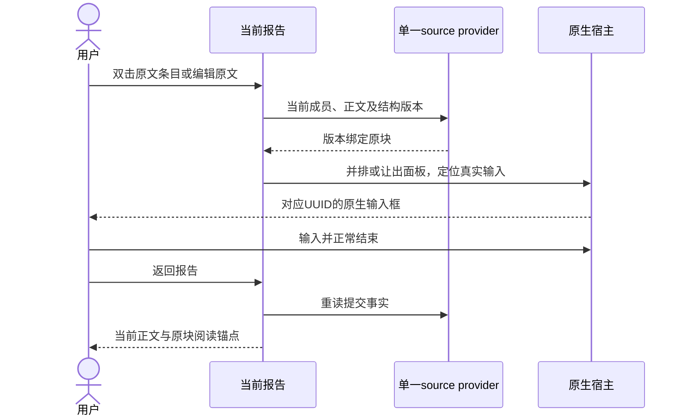

# 原生编辑与报告视图：实施交接

2026-10-04。本分支交付当前报告、原生输入往返和版本化来源／落点端口，已完成自动化检查及隔离 Desktop 演练。

## 交付身份与提交

- 仓库：<https://github.com/wrd233/logseq-task-manager.git>。
- 工作树：`/Users/wangrundong/.codex/worktrees/native-editor-report/任务管理中心-logseq插件`。
- 分支：`codex/view-lenses-native-report`。
- 启动时已 fetch 并核验的共同基线：`e666e7be1367e97dabf5f787c7dcb944ac70e815`。
- 本轮只形成本地提交；没有发布、创建 PR、合并 main 或部署。原 checkout、其他活动工作树及生产 Graph 没有用作实施环境。

| 成果 | 不可变提交 |
| --- | --- |
| 共同宿主原生编辑／面板能力 | `81c0c8cb5132ab9bb1f5b61c08f52d127330db81` |
| 报告、映射、导航与自身测试 | `4e09677ea8b461bc58a7b73b4e7a0502fab78bd8` |
| 共享入口与组合回归（完整代码 HEAD） | `e71f376d55df9cbd26e74ad59766488d2063545b` |

文档及合成截图单独提交，最终 HEAD 由本分支 Git 历史和交付回复给出。未改共同手册／PDF、依赖／lockfile、source schema、Kernel schema、材料 store 或 content-writeback 协议。

## 用户路径与主要改动

打开当前工作视图（`Cmd/Ctrl+Alt+P`），点击“报告”，双击正文／在条目上按 Enter／菜单“编辑原文”进入真实 Logseq 输入。宽窗并排，窄窗让出面板；正常结束输入后用“返回报告”或 `Cmd/Ctrl+Alt+R` 回到阅读现场。同块继续输入保留原输入框和选区。材料、聚焦、阶段与只读历史继续通过已有入口到达。



源码路径以下均以 `apps/logseq-plugin/` 为前缀。

| 路径 | 改动／整合责任 |
| --- | --- |
| `src/features/work-view/report-model.ts`、`report-target.ts` | 纯分组、完整块映射、封闭落点与真实父级事实 |
| `src/features/work-view/report-controller.ts`、`report-style.ts` | 模式与缓存、原生往返、局部样式及失效保护 |
| `src/features/work-view/controller.ts`、`lens-controller.ts`、`renderer.ts` | 消费现有 source，组合聚焦／阶段，稳定节点与实际入口 |
| `src/host/native-editor.ts`、`panel-host.ts` | 共同宿主端口，原生输入校验、组合态、并排／快速切换 |
| `src/index.ts` | 仅增加 `report: work?.reportAPI ?? null`；保留其他 namespace |
| `tests/native-report.test.ts` | 4 项模型／落点测试 |
| `tests/integration/native-report-ui.test.mjs` | 14 项生命周期、真实入口适配、输入及来源竞态测试 |
| `tests/integration/workbench-ui.test.mjs`、`tests/stage-review.test.ts` | 共享入口、同一 provider、离线材料往返、阶段覆盖与不可变历史回归 |

host 没有反向导入 feature，报告没有正文写 executor。实例监听、返回控件和样式随 WorkView 释放；共享入口没有重新排列整文件。

## 自动化门禁

工具链为 Node 20.20.2／npm 10.8.2，所有安装、构建与检查均在上述工作树完成。最终代码冻结后：

| 检查 | 结果 |
| --- | --- |
| 四个相关测试文件 | 32／32 通过 |
| 最终 `npm run check` | exit 0；类型、lint、全部测试、构建／产物、边界、需求图与 taste 全通过 |
| 工作区业务测试 | 552／552，其中 Logseq 插件 318／318 |
| sandbox 脚本测试 | 5／5 |
| 边界测试与实际扫描 | 12／12；Dependency boundaries verified |
| taste | PASS，保留已激活 0.1.0，未自动切换候选版本 |
| `git diff --check` | 通过 |

最终测试无失败、跳过或取消。初次完整检查中的 9 项 lint 报错已修复（未使用 import、测试宿主 global 引用），随后重新执行完整检查。实机发现的 SDK 路由时序问题、历史只读及外部面板切换竞态均已修复并补回归，不通过跳过断言或改无关模块过关。

针对性覆盖：未知／伪造目标、raw 版本与真实父级、整组子树与条件、标题不可定位、稳定节点、紧凑窗口往返、相同原生输入及选区、源更新与慢读排队、组合态延迟、其他草稿拒绝、跳页期间内容变化、Graph／root／dispose 晚到拒绝、外部面板切换取消导航、来源不可用与恢复、阶段“看全部变化”及只读历史。模拟 composition／drop 不计为物理 IME 或原生系统拖放验证。

可复现的最终命令（先使用符合仓库 engines 的运行时）：

```sh
node --import tsx --test apps/logseq-plugin/tests/native-report.test.ts apps/logseq-plugin/tests/stage-review.test.ts apps/logseq-plugin/tests/integration/native-report-ui.test.mjs apps/logseq-plugin/tests/integration/workbench-ui.test.mjs
npm run check
git diff --check
```

完整及针对性输出保留在本地忽略目录 `tmp/native-editor-report/full-check.log`、`targeted-final.log`。原始失败及中间复验日志也保留在同目录；交付结论以最终日志为准。

## 隔离 Desktop 事实

实际环境：macOS 15.1 arm64、Logseq 0.10.15、SDK 0.3.4；应用为本工作树 `tmp/logseq-sandbox/Logseq Task Copilot Lab.app`。先核验进程身份、独立 Graph、home／profile、材料／私有存储及端口 19333，再通过真实可见 UI 演练。所有最终演练中 `tasksEnabled=false`、Kernel 停止，无 agent 连接。

合成“个人工具／资料工作台”预置 18 个明确 UUID 原块，包含 MiniProject、事务、局部 TODO、交错标记、无标记条件／反例、未知标记、代码、链接、长段落及嵌套子树。在真实原生页面另行新建并输入 1 条记录，再通过已有材料关联生成 1 条子块引用，最终 20 个来源块。预置夹具不冒充全部由键盘创建。

实际通过的路径：

- 报告双击进入对应 UUID 的真实原生 textarea，输入中文和英文后正常结束并返回；跨页面请求亦进入正确原块，核验焦点及 SDK 当前编辑 UUID。
- 1440px 宽窗主区 920px、报告 520px，输入框可见且没有被遮挡；980px 窄窗快速切换。缩窗保留输入内容，同块“继续原生输入”保留同一输入框和 9–13 选区。
- 报告开关／折叠前后 raw 正文 hash、真实结构及个人展示 JSON 不变，稳定原块 DOM 节点相同；明确范围聚焦后仍保留计划，源变化提示依据变化。
- Tab、Enter、Escape 操作条目菜单并进入原生输入；返回恢复 493px 滚动值、原块锚点偏移 −16.5px 和同一节点。
- 已有 Markdown 材料引用实际打开并返回，稳定 materialId 与 `longdoc://` 链接沿用，报告模式、工作／聚焦范围和阅读位置保留；参考材料默认只读。
- 真实阶段 UI 提交并认可后，再在原生输入追加新句；当前报告显示新句，旧认可版本全文 JSON、原句和认可记录仍相同。历史中报告分组为零，新原生入口／模式按钮禁用，API 解析及导航拒绝 `historical-view`；返回当前报告显示最新正文。
- 实际落点解析返回“原块之后”的真实父级与版本；旧正文 hash 拒绝 `stale-content`，额外 actor 拒绝 `unknown-field`。
- 亮色及暗色宿主均检查长正文、链接和代码的可读性；iframe 沿用已有浅色报告背景，未实现完整暗色同步。

SDK 路由修复前曾出现跳页后输入消失；证据保留失败及修复说明。最终成功同时确认真实输入框、对应原块和焦点，未用插件自制编辑器替代。

## 证据与构建对应

均为本分支合成 Graph 的原始截图，没有生产资料：

| 证据 | 内容 |
| --- | --- |
| [wide-native-report.jpeg](assets/native-editor-report/wide-native-report.jpeg) | 最终完整构建的宽窗原生输入与报告 |
| [narrow-native-input.jpeg](assets/native-editor-report/narrow-native-input.jpeg) | 窄窗真实原生输入与新增句 |
| [narrow-report-return.jpeg](assets/native-editor-report/narrow-report-return.jpeg) | 返回报告及阅读位置 |
| [material-reading.jpeg](assets/native-editor-report/material-reading.jpeg) | 现有参考材料查看与返回入口 |
| [accepted-stage-history.jpeg](assets/native-editor-report/accepted-stage-history.jpeg) | 当前新正文与不可变旧认可历史 |
| [dark-host-report.jpeg](assets/native-editor-report/dark-host-report.jpeg) | 暗色宿主下已有浅色报告的可读性 |
| [desktop-evidence.json](assets/native-editor-report/desktop-evidence.json) | 逐步事实、合成 source、截图 SHA-256、构建与未验项 |

冻结代码的插件 workspace 构建 SHA-256 为 `b3c463308f100791c269e0fbb492f83366f4533eefac6b1f7c8073646717c67d`；最终完整检查从仓库根构建为 `e6399df03c11cbada4b4682ebc5c343e785ba3e26b016b38202968920d664c7e`。已读取 Desktop 实际加载脚本比较，两者仅 esbuild 按工作目录生成的源码路径注释不同，移除注释行后的代码完全一致（SHA-256 `cb9516a47d8399032d4245f6994c2202ba57a83b114aa66a0e4c4f6dd3d0784b`）。随后重载并核验 Desktop 精确加载最终完整构建，又实测原生进入及返回。

宽窗最终截图对应完整构建，其余上述截图对应同一冻结代码的 workspace 构建；逐步记录保留各时点构建标识，不把中间失败或旧构建标成最终通过。

累计宿主 error-level 输出 308 条：反复 SDK 热重载造成的重复命令注册 192 条、宿主空目录提示 114 条、connection refused 2 条、Workbench bootstrap failed 0 条。未推定两个资源请求的来源；功能结论来自实际路径证据，不声称宿主日志全零。

验证结束使用仓库脚本只停止身份核验后的本实例进程，最终 desktop／kernel 均为停止。生产 Graph 与全局 Logseq 配置中纳入核验的 3,540 个文件前后数量一致，changed／missing／added 均为 0；提交只含汇总，不包含生产文件列表或原文。原始核验及停止日志在本地忽略目录保留。

## 未验范围与后续整合

物理中文 IME、系统 Undo、跨应用剪贴板、任意原生文件拖放／段内光标插入、触摸硬件、两个同时运行的 Graph 及其他 OS 未完成实机验证。自动化覆盖组合事件和 Graph 竞态，不能替代这些宿主验收。

01 的落点与原生导航已由真实条目消费者运行。02 需接材料导入／引用生成／插入／改名消费者：只接受封闭请求，重读正文与父级／结构，保留权限及恢复边界；模糊、编辑中或紧凑窗口隐藏导致的失效落点保留材料并提供复制链接等降级。03 的后台正文写回继续走既有受控 executor，不把定位事实当授权。04 的新兼容交付没有从活动工作树读取或合入。

整合者应从这里列出的不可变本地提交接入，保留 `index.ts` 现有 namespace、WorkView dispose、面板导航及组合回归，统一验证 01／02／03／04 的已提交版本。跨 iframe／原生文件拖放、改名及结构写回闭环仍需最终整合实机验收，本分支没有将其记为完成。

产品决定见 [设计](../design/native-editor-report-design.md)，六个本地 API、完整块映射、落点例子及生命周期见 [实际架构](../architecture/native-editor-report-architecture.md)。
