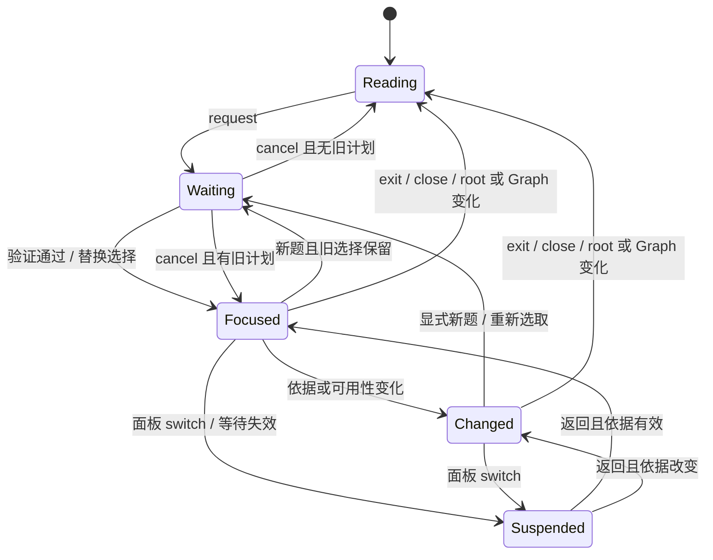

# View lenses 实施交接

功能实现分支 `codex/view-lenses`，固定基线 `23d0c710204d885500acacfd2e2772cb608f1395`。独立工作树：`/Users/wangrundong/.codex/worktrees/view-lenses/任务管理中心-logseq插件`。最初实现轮没有合入材料、workspace-context 或 content-writeback 的其他分支，没有读取其未提交实现，也没有 push、PR、部署或生产 Graph 安装。用户后续授权的 main 整合单独记录如下。

## main 整合记录（2026-10-02）

复用本工作树，在 `codex/merge-view-lenses-main` 从已核验的远端 `main@16ef663fc9485eb2dfb036d7eedf20d404511e70` 合入 `codex/view-lenses@f41c4a9be7a32235301c8e52614378b8c914369f`，目标为普通快进推送到远端 main。材料的新实现来自该远端不可变提交，没有读取或修改其他 session 的未提交工作。

两处内容冲突已保留双方意图：renderer 继续使用材料链接的安全 URI 规则，并保留聚焦完整块、组合态和选区保护；整合测试采用新材料正文路径和显式进入编辑，同时验证实际“返回工作”按钮恢复聚焦、稳定节点、滚动位置与冲突草稿。共享入口同时保留 materials 与 lenses namespaces。

合并后的代码通过 46 项针对性测试、插件 typecheck 与完整 `npm run check`：419 项工作区测试（含 191 项插件测试）、5 项 sandbox 测试、12 项边界测试均通过，0 fail / skip；lint、构建、二进制检查和 taste 评估通过。日志在 ignored 的 `tmp/view-lenses-merge/targeted.log` 与 `full-check.log`。本次整合未重新运行 Desktop；下文 Desktop 证据属于原功能实现轮，不能视为新材料合并版本的 Desktop 复验。

已实现的是本地、可逆、完整块单位的阅读计划执行。手动范围入口和合法多块计划在真实工作面板运行；语义选取与跨进程 agent transport 尚未接通。程序不验证答案语义是否完整、不自动回答问题、不写自然正文或正式任务状态。

产品细节见[设计](../design/view-lenses-design.md)，状态分层、模块职责与流水线见[架构](../architecture/view-lenses-architecture.md)。

## 本地入口与接口

`window.taskCopilotWorkbench.lenses` 在**插件 iframe JavaScript 上下文**中可用。`workViewEnabled=false` 时为 null；既有根 `read/open/openMaterial/close/readMaterials/apply` 保留。读取或展示不写 `id::`，旧 apply 仍只允许展示操作；旧 `focus` 仍只是选中 UUID。

| 方法 | 返回与行为 |
| --- | --- |
| `read()` | 同步 `LensStatus` 的独立副本：scope、phase、pending、plan、历史问题、basisChanged、suspended、notice；声明 `rangeUnits:["block"]`、`transport:"plugin-local"` |
| `source()` | 刷新已提交来源，异步 `{ok:true,value:LensSourceSnapshot}` 或 `{ok:false,reason}`；不是 work-view.read 草稿镜像 |
| `request({schemaVersion:1,question})` | 同步生成当前请求 UUID 和 scope；返回 FocusRequest。保留旧已应用范围等待新计划，隐藏旧临时推断 |
| `apply(plan)` | 异步封闭输入、当前请求、scope、真实来源、版本与编辑状态核验；通过后替换选择，失败保留当前阅读 |
| `select(uuid?)` | 显式当前来源块及真实子树；省略时使用选中块或宿主当前块。不是语义选取 |
| `cancel()` | 取消等待及提示，保留已应用范围 |
| `exit()` | 撤销聚焦、等待及历史，恢复可靠进入锚点；用户明确的布局与正文编辑保留 |
| `back()` | 核验最近前题，成功消费该条历史并恢复它的锚点；失效保留当前范围 |

UI 使用“只看此处”“只看选定范围”“完整内容”“上一问题”“取消等待”；注册命令 `workbench-focus-range` / `workbench-exit-lens`。面板内 Escape 取消等待或退出，原生输入和组合态不拦截。没有 UUID/JSON 输入 UI。

### 来源端口

`lens-source.ts` 提供 feature-local `LensSourcePort.read(scope):Promise<unknown>` 与快照消费类型，形状遵循共同交换约定。默认从 WorkView 的已提交 `sourceRows` 捕获；scope 使用现有 graphIdentity 和 rootUuid，真实来源先序、父链、同父 order 与 depth 生成拓扑。

来源 ID 是 `JSON.stringify(["logseq",graphId,blockUuid])`。完整 raw content（包括 Markdown、空白、换行、`id::`）的 UTF-8 SHA-256 是正文版本；拓扑 `[sourceId,parentUuid,order,depth]` 和集合 `[sourceId,availability,contentVersion]` 元组数组的 JSON UTF-8 SHA-256 分别是 structureVersion/sourceSetVersion。capturedAt 不参与版本；seq、revision、generation、草稿和 DOM 变化不是正文版本。

保留到当前范围外的旧布局行不成为快照成员。缺失/不可用快照的 content/contentVersion 是 null；最后已知正文独立留在视图中并显示不可用，不伪装成 available。`source()` 刷新失败时返回失败；当前范围与正文保留，旧推断保持失效。

可信安装代码可通过 `new WorkView(onMaterials,{source:trustedPort})` 注入 provider；调用方 API 不接受 provider、actor 或 capability。注入快照仍须核验 closed schema、scope、sourceId、成员唯一性、真实先序、同父顺序与所有 hash。正式共享协议模块/provider 的落点留给 workspace 分支。

### FocusPlan v1

```ts
type FocusPlan = {
  schemaVersion: 1;
  requestId: string; // 从当前 request() 返回，不使用调用方 generation
  scope: { graphId: string; rootUuid: string };
  question: string; // 必须与当前 request 完全一致
  structureVersion: string;
  sourceSetVersion?: string; // 声明后，任何来源集合变化都使该题依据失效
  sourceVersions: Array<{sourceId: string; contentVersion: string}>;
  visibleRanges: Array<{sourceId: string; contentVersion: string; unit: "block"}>;
  emphasisRanges?: Array<{sourceId: string; contentVersion: string; unit: "block"}>;
  gaps?: string[];
  temporaryInference?: string | null;
};
```

sourceVersions 必须含选中块及程序计算的**真实来源祖先**版本；可额外声明反证或其他依据。强调只能指向显式选中范围。相同来源/范围重复、任意 HTML/CSS/执行指令/未知字段、accessor、错误 Graph/root、伪造身份、过期内容/结构均拒绝。个人展示父链只帮助保留熟悉结构，不替代真实祖先版本。

边界：question≤240 UTF-16 字符；requestId≤128；范围≤2000；依据/来源块≤10000；gaps≤8条、每条≤240；temporaryInference≤300；每块正文≤2000000、来源正文总计≤8000000 UTF-16 字符；来源深度≤512。首版只有完整块，`start/end` 或 paragraph/sentence 单位拒绝；没有假精确文本偏移映射。

本地开发者对明确已选 UUID 应用多块计划的实际方式：

```js
// 在本插件上下文执行；这段例子只验证并呈现已知范围。
const api = window.taskCopilotWorkbench.lenses;
const requested = api.request({schemaVersion:1,question:"复查条件与反证"});
const captured = await api.source();
if (!requested.ok || !captured.ok) throw Error("当前来源不可读");
const source = captured.value;
const chosen = new Set(knownBlockUuids); // 用户/独立 planner 已明确选择的真实成员
const needed = new Set(chosen);
const byUuid = new Map(source.blocks.map(b => [b.target.blockUuid,b]));
for (const id of chosen) {
  if (!byUuid.has(id)) throw Error("选定内容不在当前范围");
  for (let b=byUuid.get(id); b; b=byUuid.get(b.parentUuid)) needed.add(b.target.blockUuid);
}
const result = await api.apply({
  ...requested.value, structureVersion:source.structureVersion,
  sourceVersions:source.blocks.filter(b=>needed.has(b.target.blockUuid))
    .map(b=>({sourceId:b.sourceId,contentVersion:b.contentVersion})),
  visibleRanges:source.blocks.filter(b=>chosen.has(b.target.blockUuid))
    .map(b=>({sourceId:b.sourceId,contentVersion:b.contentVersion,unit:"block"})),
});
// result.ok / result.reason；不能把该本地调用描述为远端 Codex transport。
```

常见原因：`superseded-request`、`scope-mismatch`、`view-not-visible`、`stale-content`、`stale-structure`、`stale-source-set`、`source-unavailable`、`ancestor-version-required`、`source-not-in-scope`、`unsupported-range-unit`、`unknown-field`、`editing-in-progress`、`source-changed-during-read`、`source-read-failed`。合法当前请求失败时保留待应用请求，允许结束编辑后显式重试；back 失败会取消其等待并保留短提示。晚到旧结果不会污染当前问题的提示。

## 生命周期、编辑与材料



来源更新只标记依据变化，不调用模型、不剪枝选择。新计划在来源刷新前后检查原生编辑，最后检查期间 revision 变化则拒绝。draft 不参加来源 hash；组合态跳过正文更新和 Tab 缩进，结束后局部重绘。普通 Markdown 继续由现有 DOMPurify 净化，受控块 class 强调不改变链接。节点、按钮和未变化的正文/状态文本复用，不全表 innerHTML 重建。

材料 switch 捕获块锚点、视觉偏移、可用焦点/选区，取消 pending 且保留计划。基线真实材料库/编辑器负责保存、草稿与冲突；返回同一 scope 后检查依据、恢复位置和状态条。打开失败保留阅读。明确关闭、Graph/root 切换和 dispose 清除 lens/history、在途读取及 hash cache；旧 API 不能复活计划。

## 验证与证据

本轮用 Node 20.20.2 / npm 10.8.2，独立 node_modules/dist/Graph/profile/材料/SQLite/descriptor。详细日志在工作树 ignored 的 `tmp/view-lenses/`，没有复制生产 Graph。

| 层次 | 当前证据 |
| --- | --- |
| 纯核心与入口针对性测试 | 来源 hash、closed input、真实/展示父链、依据失效、有限历史；最终 lens UI 12 项及既有 work-view 更新回归共 23 项通过 |
| 插件 typecheck / test / build | 最终通过；173 项测试通过，0 fail / skip。基线插件 152 项先独立通过 |
| 完整 `npm run check` | 最终退出码 0：requirements map、所有 workspace typecheck、lint、全部 workspace 测试、sandbox、全部构建与 binary 检查、依赖边界及 taste:eval PASS；taste 保持既有 0.1.0 active，未自动激活候选 |
| 边界检查 | 12 项检查器测试通过、实际依赖扫描通过 |
| 真实 Desktop 0.10.15 | 本分支隔离实例：按钮范围、多块计划、原生 textarea 输入/保存、依据变化、新题替换/晚到拒绝、真实 Markdown 材料编辑保存与返回、打开失败、退出和个人偏好保持 |
| tasksEnabled=false / Kernel 离线 | 实例禁用任务管理；身份核验后停止本实例 Kernel，再应用多块计划及全部后续阅读操作成功 |
| 安全与版本 | 真实 Chromium 相邻 script/img/iframe/style payload 无危险节点、无执行，链接 href 保留；独立 Node SHA-256 核对正文/拓扑/集合全部一致 |
| 减少动画 | 真实 Chromium emulate reduced-motion，matchMedia=true、computed transitionProperty=none |

材料往返实测 scrollTop 127→127，UUID 行及控件引用相同，问题与个人布局相同；材料经真实编辑器保存后从原文件读回核验。退出实测返回进入前 scrollTop=0，期间明确展示级别/折叠偏好及原生正文修改保留。自动化另有实际几何锚点模拟：前方正文增长后按原块视觉偏移恢复，避免沿用旧 scrollTop。

证据文件：`desktop-evidence.json`、`desktop-focus.jpeg`、`desktop-final.jpeg`、`sandbox-prepare.log`、`sandbox-start.log`、`sandbox-stop.log`、`plugin-typecheck.log`、`plugin-tests.log`、`plugin-build.log`、`boundaries.log`、`final-targeted.log`、最终 `full-check.log`。Desktop JSON 记录具体观察结果，不是外部 agent 调用证据。最终构建重新加载到本实例后，会话清空，材料等待取消后返回的状态条与实际 Escape 键取消均复验通过。

首次最终完整检查在本轮新增 resume 的普通重复打开路径发现展示 seq 误增（原断言 7≠6）；已将刷新限制为真正 suspended 的返回，原测试断言未改。保留失败日志 `full-check-initial.log`，随后 23 项针对性回归和第二次完整检查全部通过。没有跳过检查或修改无关领域。

原 checkout 仍为干净 `main@14845dc553f95238c3136ce2740a597925c81047`；测试前后生产 `~/.logseq` 的 29 个文件与 `Logseq_File` 的 3491 个文件逐一 SHA-256 核对，变化/缺失/新增均为 0（`production-before.json`、`production-after.json`）。sandbox 结束时只停止身份核验为本工作树的实例，最终 Desktop/Kernel running=false，保留合成 Graph、材料和证据；没有删除 worktree。

未验证：真实 macOS 中文 IME 候选窗的完整组合流程、DB Graph 真实实例、极大 Graph 的交互性能，以及未存在的 workspace/content/stage-review 和外部 agent transport。组合 start/end 与 isComposing 的竞态已通过自动化；原生 textarea 中文插入、Escape 保存通过 Desktop，这不等于 OS IME 全流程。Happy DOM 对相邻危险节点移除存在 NodeIterator 差异；自动化分开覆盖 script/img，组合 payload 由真实 Chromium 验证，未放宽 sanitizer。

## 共享改动与后续接线

| 共享路径 | 本轮修改与边界 |
| --- | --- |
| `workspace/context.ts` | 通用 PanelCloseReason，activate→switch，closeActive→close；不变为聚焦业务中心 |
| `host/panel-host.ts` | 传递通用关闭原因给已有 callback；其余布局/样式不变，没有 feature import |
| `index.ts` | 返回现有材料 callback Promise，使 WorkView 可处理失败；增加独立 lenses namespace，沿用既有释放路径，单独入口提交 |
| `tests/fixtures/work-view.mjs` | 仅测试 fixture：可注入来源/材料端口、真实命令 callback 与当前块选择 |
| `tests/integration/workbench-ui.test.mjs` | 真实组合根 lenses namespace、tasksEnabled=false / 无 Kernel 启动、材料切换回归 |

后续接线只依据已核验不可变提交：

1. workspace 合入正式 SourceSnapshot provider 后，在 WorkView 构造 options.source 接入薄适配器；统一消费类型落点，仍验证完整原文、真实拓扑与 hash。不把 read() 的草稿、layout seq 当权威版本。
2. 外部选择方用当前 requestId/scope 和 source 快照生成合法计划；独立实现 transport/授权/生命周期后再调用 lenses namespace。本轮没有远程服务、文件轮询、模型、API key 或 mock planner。
3. content-writeback 提供真实 source edit capability 后，使用 BlockTarget 与当前版本走它的 executor。WorkView 继续导航原生编辑及读取更新，旧 apply 不扩展正文操作。
4. 材料新 provider/定位/权限只从材料模块消费；基线 openMaterial 与通用 panel close reason 保持兼容，不推导第二套材料 ID。
5. stage-review 将来在已实际使用的 ComposedView→renderer 描述边界扩展 overlay；本轮不提供阶段状态机、diff/认可或 Git 编排。重入可复用锚点和已选原文，不自动生成重入摘要或高亮算法。

已提交：`8bdb75f` 通用 panel lifecycle；`9f7b7e1` 纯来源/计划/状态/组合核心；`116954c` 工作面板交互与恢复；`ede6477` 共享入口及组合根回归。最终三份文档单独提交，具体文档 SHA 以 git log 和最终交付记录为准。
