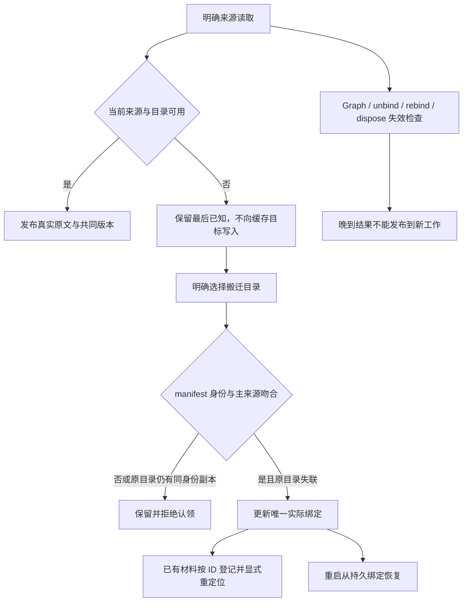

# 工作区整合与恢复交接

2026-10-03。三个增量已在 `codex/workspace-integration` 完成：正式工作区交付接入、共享来源与唯一材料绑定、有限搬迁与重启恢复。[产品设计](../design/workspace-integration-design.md)与[架构](../architecture/workspace-integration-architecture.md)描述最终行为；下列门禁来自本工作树本次运行。

## 起点、依赖和提交

| 项目 | 当前证据 |
| --- | --- |
| origin | https://github.com/wrd233/logseq-task-manager.git |
| 初始锁定远端 | `1298ac2937ac18daf82d38f852e0f93a44f32dc9` |
| 用户明确通知后有意整合的远端 main | `acb1f4a3adb5d7122632245f0c2456853d4f6897` |
| 正式 workspace 交付 | `42b07b0`、`00ff900`、`9b4ce91`，已包含于上述已 fetch 的远端 main；保留原材料、lenses、content |
| 本分支合并提交 | `e16328d`，仅 index.ts 文本冲突，保留两方安装及本分支卸载保护 |
| Desktop 适配 | `02d2fb8`，compact stat、跨 realm 错误、旧 missing-stat 断言保留 |
| 共享来源与有限恢复 | `ed81032`，正式 provider、专用保护核验、manifest 副本拒绝、恢复表单与实际菜单 |
| 共享组合根接线 | `8391a7e`，同一实例注入 lenses/content，完整入口回归 |
| 先前独立修复 | `5b94701` 根拓扑消费；`0dbe375` 旧能力释放保护 |
| OS / 工具链 | Darwin 24.1.0 arm64；Node 20.20.2 / npm 10.8.2 |
| 独立工作树 | `/Users/wangrundong/.codex/worktrees/workspace-integration/任务管理中心-logseq插件` |

初始依赖未发布时保存了独立修复和阻塞记录；用户提供远端更新后，fetch 并检查明确差异才合入自己的分支。未读取其他活动工作树来补依赖，未追逐后续 main。原 checkout、生产 Graph、其他 session 的进程和目录未用于写入。没有 push、PR、合入 main、部署、委派或删除工作树；不改依赖/lockfile。AGENTS.md 与运行环境检查沿初始独立工作树记录。

## 最终入口与共享路径

根 namespace 保留 read/open/openMaterial/close/readMaterials/materials/lenses/content/workspace 和 presentation-only apply。任务关闭不影响自然工作安装；旧 API 不能复活或关闭新面板。

- `workspace/source-protocol.ts` 是唯一共享类型与原文、结构、集合版本算法；content/lenses 重导出或消费它。
- `workspace/logseq-source.ts` 的 `logseqSourceReader()` 提供真实已提交 SDK 来源，无工作目录也可读。`SourceReader.read(scope, valid, pageName?)` 不包含草稿、布局或时间版本。
- `installWorkspaceContext().source` 是 lenses 的窄 read(scope) 端口；`.sourceReader` 供可信组合根注入 content。外部输入不能自行指定 provider 或授权。
- content 的 `SourceRead` 保留 protections、children、paths；专用读取与共享快照的结构/集合版本不一致就拒绝，不删字段/TODO、EditingGuard、scope authority 或逐项事实。Journal 留在既有 FileStorage。
- workspace API 继续提供 bind/resolve/read/refresh/unbind/associate。read 标记 last-known；refresh 只有真正读取才标记 checked。材料 graph.path 与 scope graphIdentity 通过正式绑定协调映射。
- 工作区仅管理身份与目录绑定。搬迁材料继续用已有“登记原材料目录 → 重新定位”，读取 exact ID 后选择实际文件；没有默改目录外引用。

相对整合远端 main 的共享路径包括 index.ts；workspace/{source-protocol,source-reader,logseq-source,registry,context-service}.ts；workspace-context/install.ts；content-writeback/{protocol,validation,logseq-adapter,installer}.ts；work-view/{lens-source,lens-plan}.ts；host/desktop-files.ts。对应测试和三份文档一并交付。正式交付对 materials/controller.ts 和 material-context.ts 的协调注入由 merge 原样保留，本次没有重写材料业务。未改 work-view controller/renderer/composer、content executor/authority/protection、Kernel 或 SQLite。

## 实际验证

| 门禁 | 最终结果 |
| --- | --- |
| 定向来源/目录/桥接/连续入口 | PASS，最终定向 14 项 0 fail/skip；其余新回归同时包含在插件全测 |
| 插件 typecheck/test | PASS，265 项测试 0 fail/skip |
| 全仓 lint / typecheck / requirements | PASS |
| build 与二进制探测 | PASS，包含 CLI/service、插件和 Console |
| check:boundaries | PASS，12 项检查器测试及实际依赖扫描 |
| 完整 `npm run check` | PASS，13 组累计 510 项测试，0 fail/skip；含 sandbox 与 Taste |
| Taste | PASS / KEEP_0.1.0_ACTIVE，没有激活候选 |
| diff whitespace | PASS |
| 真实 Desktop | Logseq 0.10.15：本地授权写回、版本一致、镜像观察、目录搬迁、材料显式恢复、进程重启读回 |

合成组合根连续测试真实安装 index.ts、注册菜单和表单，使用实际临时文件及 Journal：未绑定阅读 → 绑定 → 授权 → content 写入/读回 → DB 事件更新镜像 → 三处版本一致且聚焦 changed → 材料收纳 → 拒绝完整/去入口的副本 → 原目录搬迁 → 表单重关联 → 材料按 ID 登记与显式定位 → 重装恢复；tasksEnabled=false 且 fetch 计数为零。旧 namespace、Graph 切换、晚读晚写、解绑/重绑定、原生草稿、字段/TODO、旧无 manifest 材料绑定等现有断言继续通过。

本次 Desktop 在自己的应用副本、home、profile、Graph 和材料目录中运行。19333 属于其他工作树，因此使用经身份核对的 19335，Kernel 未启动，descriptor 为空。通过原生右键“允许维护此处正文”建立范围，调用现有 content API 写入真实 SDK；结果为 complete / APPLIED_VERIFIED。未把 SDK 写入称作真实输入法验收。

写回后先读取工作区镜像确认自动观察已更新，再读取 workspace/lenses/content：完整 blocks、structureVersion、sourceSetVersion 三者一致；聚焦 phase 为 changed，原选择保留。实际材料 capture 成功并关联到 workspace。搬迁目录后旧路径读为 last-known，refresh 拒绝；真实重新关联表单仍能显示旧位置，最终通过相同正式 bind 入口恢复同一 workspaceId。材料通过真实 UI 登记 `.longdoc` 目录及“更多 → 重新定位”读回原内容。

最终构建启动的独立进程重启后，恢复 `fcf1e72f-4d3a-4384-ac3f-fda989883d28` 及 `desktop-moved` 路径；workspace.refresh=checked、workspace.read=last-known，lenses 与 workspace 来源集合版本一致，更新正文仍在，材料 availability=available 且路径为搬迁后的原文件。测试完成后仅停止经身份核验的本工作树 sandbox，保留测试 Graph、材料、镜像和证据。

Desktop 暴露并修复：中文生成菜单 hook 不路由；0.10.15 stat 省略 mode；跨 iframe Error 不能直接 instanceof；缺失多级目录需要区别于桥接不可用。测试 profile 的旧 `theme: "light"` 与本机 Logseq 形状不兼容，仅移除本工作树忽略目录的该配置项，未改系统或生产配置。

证据位于本工作树 ignored 的 `tmp/workspace-integration/`：
`integrated-targeted.log`、`integrated-full-check.log`、`desktop-content.json`、`desktop-versions.json`、`desktop-material.json`、`desktop-relocation.json`、`desktop-material-relocated.json/png`、`desktop-restart.json`、`evidence.json`。日志、源码和最终读回共同支撑结论，不把旧交付测试数字当本轮结果。

## 异常与后续接入边界

中/大分支可消费正式 source-protocol、logseqSourceReader 和原 workspace API；不需要导入本安装器/controller 才能读取来源。它们保留各自专用保护和业务，外部 transport/文件发现/Stage 未在本分支实现。

不支持全文件重命名追踪、自动批量迁移、自动复制分叉、多根、父子工作区、跨 Graph 模式迁移。已知绑定冲突被拒绝，但不扫描未知备份或提供全盘身份唯一性服务。本机 pending 记录仅允许重试程序自身未完成的绑定，不是副本授权。

本次未验真实中文 IME、系统 Undo、真实双 Graph 及跨进程竞争、断电、Windows/Linux；Graph/晚到竞态有自动化覆盖。SDK 读取非事务，读中版本差异失败关闭；SDK 写入无 CAS，文件检查与 rename 之间仍可能有外部竞争。0.10.15 listdir 会递归列所选目录，兼容 stat 因宿主能力限制可能有额外 IO；不承诺符号链接 realpath 或跨进程原子性。
