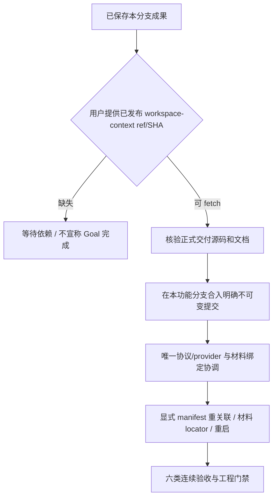

# 工作区整合交接：依赖未发布，Goal 未完成

2026-10-02。分支 `codex/workspace-integration`。本轮完成三个现有模块核验、来源消费者兼容修复、组合根生命周期修复和工程回归；**没有取得正式 workspace-context，未完成三个增量及四模块闭环。** [产品设计](../design/workspace-integration-design.md)和[模块架构](../architecture/workspace-integration-architecture.md)均按这一实际状态编写。

## 启动与远端证据

| 项目 | 实际核验 |
| --- | --- |
| 仓库 origin | https://github.com/wrd233/logseq-task-manager.git |
| 启动 fetch / 锁定 REMOTE_BASE_SHA | `1298ac2937ac18daf82d38f852e0f93a44f32dc9` |
| OS / 工具链 | Darwin 24.1.0 arm64；Node 20.20.2 / npm 10.8.2 |
| 原 checkout | `/Users/wangrundong/work/任务管理中心-logseq插件`，开始时 main 与上述 SHA 相同且干净 |
| 独立工作树 | `/Users/wangrundong/.codex/worktrees/workspace-integration/任务管理中心-logseq插件` |
| 工作树起点 | 工具返回后重新核对 HEAD 为锁定 SHA，status 干净，再建立指定分支 |
| AGENTS.md | 已检查仓库和适用祖先目录，未发现 |

安装、构建、测试、node_modules/dist/临时文件只作用于本工作树。命令使用 `PATH=/opt/homebrew/opt/node@20/bin:$PATH`，未更改系统默认 Node。未修改 main、生产 Graph 或其他 checkout；未推送、建 PR、部署、删除工作树或委派其他 agent。

远端 heads 核验仅列出 main、vnext、feature/longdoc、feature/task-copilot-mvp、codex/feature-work-view-presentation，没有 workspace-context。锁定树只有原 `workspace/context.ts` 与 `material-context.ts`，缺少正式 source-protocol/source-reader/registry/mirror/context-service 和安装器；也没有该模块设计、架构或 handoff，已搜索已提交路径历史。没有把本机其他工作树的实现作为可发布依赖。

目标文件给出的交付线索尝试通过 `git fetch --no-tags origin <完整SHA>` 从正确远端直接获取；远端返回 `upload-pack: not our ref`。详见本工作树 ignored 的 `tmp/workspace-integration/dependency-fetch*.log`。仍需用户提供已发布、可 fetch 的正式交付 ref/SHA；接入前需核验真实源码、文档、保护和持久数据兼容。

三个实际获取失败的 SHA：`9b4ce914a66f496ca1b4cd8dedac68cbf67a3910`、`00ff90013c2a6ece98d42e1e66475ff6afa56088`、`42b07b0947633bfc54760fcbd87838f1fd99567f`。本地 merge 提交 `bb814315…` 仅是目标文件的历史观察，没有从本机其他 checkout 获取或合入。

## 已提交内容与共享路径

| 路径 | 最终行为 |
| --- | --- |
| `apps/logseq-plugin/src/index.ts` | 发布/撤销 API 所有权；已释放根 API 不关闭新面板，不返回旧工作快照或继续调用材料入口 |
| `apps/logseq-plugin/src/features/work-view/lens-source.ts` | 接受真实 scope 根父级/兄弟 order，继续验证后代拓扑、环、scope 和全部 hash |
| `apps/logseq-plugin/src/features/work-view/lens-plan.ts` | 必要祖先在所选根停止，不越范围要求外部父块正文 |
| `apps/logseq-plugin/tests/workspace-integration.test.ts` | 三项默认 adapter / 来源拓扑 / 实际 provider 消费回归 |
| `apps/logseq-plugin/tests/workspace-integration-entry.test.ts` | 两项真实组合根卸载/重装、离线与草稿/布局版本回归 |
| 三份 workspace-integration 文档 | 当前设计、模块边界、依赖与验证交接 |

共享组合入口单独提交；源码消费者修复及其回归另作提交，文档单独提交。完整 SHA 从本分支 `git log` 读取，避免在文档自身提交中循环记录自身 SHA。没有改 controller、renderer、composer、content executor/authority/protection、材料目录协调、Journal 位置、Kernel 或 lockfile。

保留根 read/open/openMaterial/close/readMaterials、materials、lenses、content 和 presentation-only apply。workspace namespace 未创建。禁用 task runtime 不关闭自然工作能力；本轮合成组合根测试确认未发起任何 fetch。

最终当前窄端口为 `LensSourcePort.read(scope)`、content `SourceRead`（snapshot/protections/children/paths）、材料 `MaterialWorkContext / MaterialDirectories`。**唯一正式共享来源端口尚未公布或接线**；中/大分支继续使用其当前可运行适配器，不应将本分支视为已完成的正式 workspace provider。材料 graph.path 和 SourceScope 的 graphIdentity 仍需正式绑定协调显式映射。

## 本轮实际验证

| 门禁 | 结果 |
| --- | --- |
| 新回归在修改前复现 | 3 项中 2 失败：旧 close 关闭新面板；真实嵌套根快照被拒绝；日志 reproduction.log |
| 定向测试 | PASS：26 项，0 fail / skip，含五项新回归及原 lenses/content 入口回归 |
| 插件 typecheck | PASS |
| 插件全部测试 | PASS：251 项，0 fail / skip |
| 仓库 build / built binary probes | PASS，包含插件、CLI/service/Console 构建与二进制启动检查 |
| check:boundaries | PASS：12 项检查器测试及真实扫描 |
| 完整 npm run check | PASS：13 组累计 496 项，0 fail / skip；requirements、全 workspace 类型、lint、tests、sandbox、build、boundaries、taste 均完成 |
| git diff --check | PASS |
| 本轮真实 Desktop / 原生输入与 IME | 未执行；没有连接或重载生产或其他 session 实例 |
| 工作区绑定/镜像/搬迁/重启闭环 | 未执行且未完成：正式工作区依赖缺失 |

详细日志在本工作树 `tmp/workspace-integration/`：reproduction.log、targeted.log、typecheck.log、plugin-tests.log、boundaries.log、build.log、full-check.log 及 dependency-fetch*.log。完整检查的 Taste 结果为 PASS / KEEP_0.1.0_ACTIVE，没有自动激活候选。一次新测试的静态 renderer 导入早于 DOM 初始化，已改成初始化后动态导入；类型检查中的不可达分支也已修正，没有改旧断言或消毒器。

完整检查之后，仅把五项新回归按来源消费者和共享组合根分成上述两文件，以配合独立提交；生产代码不变。定向测试、插件 typecheck/test 与受影响文件 lint 再验。未启动 Desktop sandbox；已核对本机有 Logseq.app、默认 19333 没有 listener，但没有以端口空闲冒充 Desktop 验收。

验证只证明现有 SDK adapter 的合成运行、真实安装入口、FileStorage 临时记录与 DOM 交互。普通根的 content/lenses 正文及集合版本一致，草稿不进入已提交快照；display 变化不改正文/结构版本；旧补丁保留原生编辑保护。真实 provider 注入点接受嵌套根/后代和非首个页级根；伪造拓扑即使 hash 正确也拒绝。原 content 字段/TODO、Journal 恢复、材料往返和 Graph/lifecycle 回归在完整插件测试中继续通过。

默认 lenses 的 scope 根父级和 order 仍为局部表示，content 返回实际定位。**所有根的 structureVersion 一致尚未达成。** 原文算法相同、测试端口运行或既有历史验收均不能代替共享 provider、镜像和工作区恢复的本轮验收。

## 继续整合的条件

接线时复用正式 source-protocol 的原文/结构/集合算法；不删正文写入专用事实，不恢复旧孤立原型，不把工作视图展示 apply 扩为正文写入。材料绑定使用原唯一路径；Journal 保持现有位置，若有必要迁移须另证兼容。

尚需完成 manifest 身份及主来源核验、保持 workspaceId 的显式搬迁、唯一实际绑定更新、原目录失联不回退、材料 ID 与实际文件定位、重启恢复、Graph/root/解绑重绑定旧作业失效，以及镜像/lenses/content 的连续版本一致验收。目录复制身份冲突须保留并拒绝自动认领，不凭同名/hash 猜认。

不支持的全面迁移、全文件重命名追踪、复制工作区自动分叉、多根、父子工作区、Graph 跨模式迁移仍保持范围外。SDK 无正文 CAS、文件写入有最后比较与 rename 间竞争；不承诺跨进程原子写入或真实原生输入已验收。
