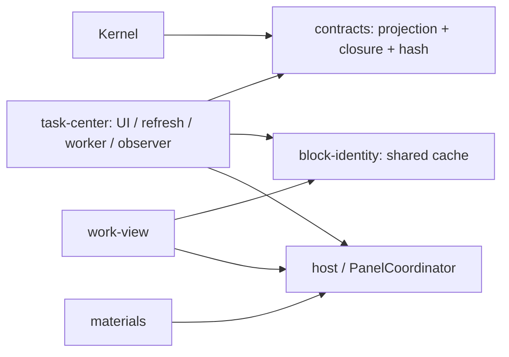

# 第一轮结果：投影收敛、身份解耦与边界整理

2026-10-01；基线 `main@61e2db0`，开始时工作区干净。使用 Node 20.20.2 / npm 10.8.2。本轮已落地；没有开始第二轮，也没有实现新的 Workspace、内容维护、问题聚焦、协作审阅或行动建议。

## 改动与当前依赖

- `packages/contracts` 提供唯一的 `buildManagedProjection()` 与 `projectClosure()`。Kernel 复用，插件的 `expectedProjection()` 只负责读取 closure 和调用纯构造。七个 UUID 字段、语义字段、null 值、closure 的省略、canonicalization 和 hash 均沿用旧实现；不添加 Node / SDK / 数据库依赖。
- `block-identity.ts` 持有原来的单实例展示缓存和只读查询。工作视图不再导入任务控制器。刷新、失效、直接正式化后的更新和任务运行时启动仍由原调用方负责；没有新容器或事件总线。
- 现有边界脚本增加 TypeScript AST import 检查，覆盖 `.ts` / `.mjs` 的静态导入、再导出、字面量动态导入与 require。工作视图不得依赖任务模块；contracts 不得引入 Node、SDK、数据库或 Client；原有禁止依赖与 localhost 检查继续执行。

缓存没有新增连接或刷新职责：`setFormal`、`replace`、`invalidate` 保持原生产路径，`isStale` 和刷新节流不变；原先没有 Graph 事件清空整个索引的路径，本轮也没有新增。工作视图仍在 Graph 切换时清空当前范围、使旧读取失效；未知 UUID 按自然标记 fallback。`tasksEnabled=false` 不启动任务控制器、Graph Worker 或身份刷新。

## 删除与合并证据

| 删除 / 合并 | 生产调用证据与验证 |
|---|---|
| Kernel `projectionFor`、`closureProjection` 与插件重复构造 | 两端字段逐项一致；迁入 contracts。重构前从原 Kernel 捕获 10 个固定协议样本，测试重放真实创建、改名、等待/恢复、完成、修订、重开、取消和补偿 Undo；逐字段与 hash 比对，并核对浏览器构造结果。现有 focus、WorkIntent、Graph 适配及失败链测试继续通过。 |
| 任务控制器 `taskIdentity` 导出 | 唯一生产消费者为工作视图；替换为共享查询。同一缓存继续服务菜单和正式标记；新增工作视图实入口测试覆盖正式身份、失效、Graph 切换与自然 fallback。 |
| `agentContext`、`checkAgentPatch` | 仅定义与两个原型测试调用；插件全局 `read/apply`、构建入口、CLI/HTTP、动态导入和导出没有该路径。原型使用 `rows`，当前快照为 `blocks`；删除函数与两个专属测试。实际 `applyPresentation` 的 scope / expectedSeq / 操作白名单测试保留。 |
| `continuingLayout` 与声明 | 仅定义、声明和一个原型自动排序测试；生产通过 `reconcile` 初始化、恢复手动排列。删除这项未接入自动排序及专属测试；排列、缩进、来源重读与 300 节点 / 2000 次更新测试保留。 |
| `workspace/context.ts` 的 `SourceRef`、`WorkScope` | 未被生产、类型导入、构建、公开入口或测试使用；删去空声明。contracts 中另一个同名来源契约及其消费者保留。 |

核查范围包括 `apps/`、`packages/`、构建与检查脚本、包导出、动态 import、插件注册命令与全局协作接口，以及测试和文档引用。历史任务规格中的候选名称保留为追溯信息。

保留的检查：材料写前比较、历史快照、await 后再读、临时写与读回核对保护不同的外部写入时刻；PanelCoordinator 的 resolved tail 保证失败后还能导航，同时原失败仍抛给调用者，新增回归已证明；Graph 离线 fallback、epoch/generation、草稿保护、trusted USER channel、proof/hash、幂等、事务、Undo、projection obligation、迁移和 legacy `#prepare` 均保留。Kernel 的 SHA-256 UUID 与 contracts 的另一套 UUID 算法不同，未因名称相似而合并。

## 文档状态

[根 README](../../README.md)是当前入口；[整合说明](../integration/README.md)解释已实现的行为；[05/06/07 索引](../vnext/README.md)按正式治理范围使用。[工作区需求](../requirements/2026-10-01-project-workspace-collaboration.md)与架构报告的建议仍是演进目标。

旧 01 不再被推荐为当前“宪法”，旧 03 不再标为可直接执行的任务。[状态机说明](../architecture/commit-state-machine.md)区分当前 formal commit + obligation 与受支持 legacy prepare/complete；ADR 003 标明被 ADR 014 部分替代，ADR 042 标明历史 RC 冻结范围。架构报告 / PDF 保留为 `a6d2f63` 设计快照，MD 加入后续状态链接；当前包架构已更新。没有删除历史 ADR、迁移或验收证据。

## 检查与实机边界

| 检查 | 实际结果 |
|---|---|
| 初始完整 `npm run check` | 类型检查通过；lint 因 Git 忽略的本机 `docs/research/longdoc-2026-09-14/file-watch-probe.cjs` 报 22 个既有错误。没有删除文件、关闭规则或增加忽略项。 |
| 初始后续测试 / 构建 | 本机 SQLite 模块为 ABI 137，Node 20 需要 ABI 115；另缺已锁定的 turndown / GFM 包。按锁定版本补齐缺项，并仅重建 SQLite 原生模块；没有升级依赖或修改 lockfile。系统默认 Node 25 缺动态库，执行时改用已有 Node 20。 |
| 最终主工作区完整 `npm run check` | 仍仅因同一历史文件的 22 项 lint 错误中止；主测试单独执行为 317 项通过、0 失败、0 跳过；其余 Gate 单独通过。 |
| 交付文件副本完整 `npm run check` | PASS：主测试 317 + sandbox 5 + import 边界回归 3 = **325**，0 失败、0 跳过；需求生成、类型、lint、构建、依赖边界、Taste 全通过。副本复制交付文件、复用现有依赖，不带 Git 忽略的个人文件；先按现有流程构建 Console 资源，未修改规则或测试预期。 |
| 隔离 Desktop smoke | macOS arm64 / Logseq 0.10.15；注册命令回调驱动正式化 → 完成 → Undo，实际 SDK 与 Graph 写入核对。工作视图识别正式对象、自然 fallback、展示操作不改来源、插件重载恢复布局通过；关闭任务模块后只有工作视图/材料入口，重新启用后恢复；Kernel 离线视图可读，重启后来源与布局保留。截图已查看。 |
| 数据与进程 | 测试对象最终 OPEN / version 3，创建投影义务 VERIFIED，recovery 为空，SQLite integrity 为 ok、外键错误为 0。仅停止归属核对后的测试进程；生产 Logseq PID 持续运行。C locale 的 ps 会转义中文路径，测试启停使用 UTF-8 locale；未放宽进程归属校验。 |

原始日志和 JSON / 截图留在忽略目录 `tmp/round01/` 与 `tmp/logseq-sandbox/evidence/round01-*`，不提交凭据、路径配置、数据库或临时制品。Desktop 属于合成数据 smoke，并非完整 UI 验收：未验证真实个人 Graph、中文输入法组合、材料编辑器的本轮实机保存/冲突、跨 Graph 实机切换、长期 soak、断电故障或远程模型 Gate；相关自动化与首版历史记录不能代替这些验收。

## 第二轮建议与边界

依据实际调用拆分任务控制器中的 Graph Worker / observer / 身份刷新启动职责，再收窄 Service 编排与存储访问接口。必须保持功能开关含义、同一 SQLite 事务和投影恢复链；迁移调用方与持久状态依赖之前，不删除 legacy 提交/恢复路径。视图更新机制属于第三轮；新 Workspace 与协作能力需要另行实施规格。本轮没有开始这些工作。
