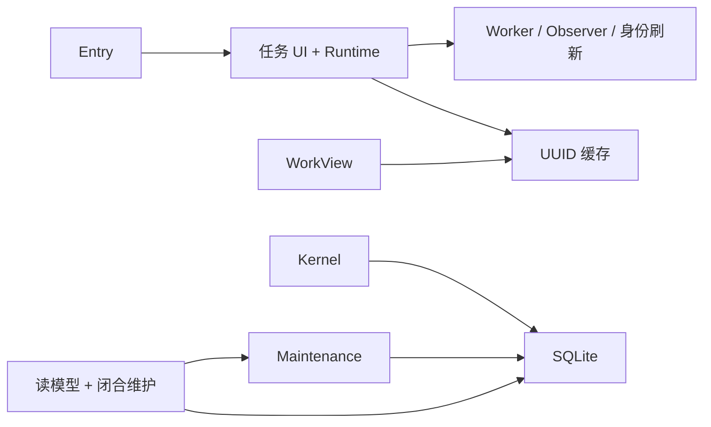
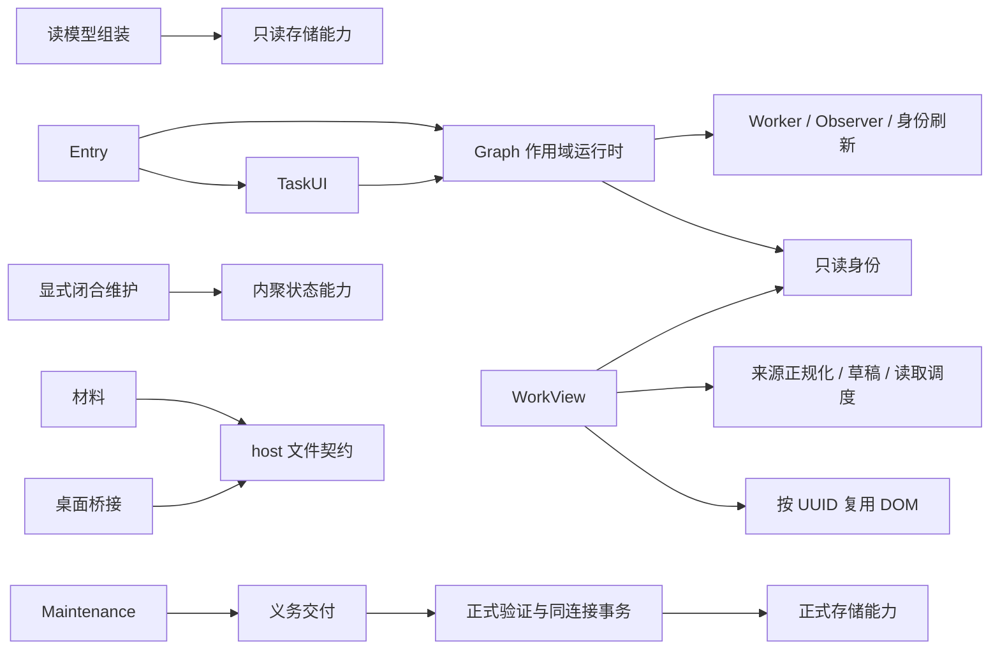
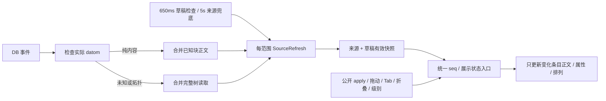

# 第二、三轮合并重构结果

完成日期：2026-10-02。代码按运行时、后端、视图、作用域、材料及 Desktop 回归分别提交，未开始第四轮。

基线 `main@9293ad6bad3d778ae1897603c34a9c90c2fcacf3`，工作区干净；第一轮提交已经在远端。Node 20.20.2 / npm 10.8.2，SQLite 原生模块可用。没有发现适用的 AGENTS.md。本轮不改变 schema、投影协议、权限、布局记录或功能启用条件，不实施新 Workspace、内容维护、FocusPlan、审阅或行动建议，也不提前退出 legacy 提交链。

| 职责 | 开始时的实际所有者 | 本轮目标与进展 |
|---|---|---|
| 连接、Graph Worker、来源观察、身份刷新 | task-center 控制器；UUID 单实例缓存 | 已迁至插件级 Runtime；入口按 tasksEnabled 启动，Graph/generation 隔离 |
| 正式标记、菜单、用户命令 | task-center | 保留 UI 所有权，订阅小范围身份变化回调 |
| 正式事务与恢复 | Kernel + SQLite 同连接 | 保留；已改为消费者定义的结构存储能力 |
| 上下文、阅读基线、闭合维护、义务交付 | Kernel / 投影与维护协调器 | 已分出 ContextAssociations / UserReading / ClosureReadiness / ProjectionDelivery |
| 工作视图来源、展示、版本、读取、DOM | WorkView 控制器 | 已收敛状态入口；SourceRefresh 合并读取，Renderer 按 UUID 更新 |
| 文件契约 / 材料草稿和保存 | host 反向导入 materials；材料模块 | FileIO 已迁至 host 契约；保存绑定 Graph，编辑器按文档复用 |

开始时的依赖：

交付代码依赖：

## 已核对的基线

主工作区完整 `npm run check` 在 lint 因 Git 忽略的个人研究文件 `docs/research/longdoc-2026-09-14/file-watch-probe.cjs` 的同一 22 项既有错误中止，类型检查通过。没有删除用户文件、改 lint 规则或扩大忽略项；日志在 `tmp/round0203/` 汇总，原始日志为 `/tmp/task-copilot-round0203-*`。最终检查与 Desktop 结果见下文。

## 运行时阶段

`index.ts` 是组合根；只在 tasksEnabled 启用时启动 `PluginRuntime`，再安装任务 UI，初始化 UI 失败时停止运行时。面板切换只导航，不创建 Worker。运行时拥有 Graph 订阅、Worker、来源观察、30 秒身份刷新、自身写入清理计时器；任务 UI 保留正式标记、菜单、Online DONE 用户命令和可移除交互注册。运行时不导入面板控制器。

Graph 切换立即清空身份并提升 generation；读取新 Graph 后才启用新作用域。索引、单块 revalidate、直接正式化、异常标记都过滤同一 Graph；晚到索引、观察批次和适配器调用先核对捕获的 scope。卸载停止未来领取；已经领取的 Graph 请求失效时向 Broker 报告失败，不能假报成功。已经进入 SDK 的单次调用没有取消 API，但后续读写都受作用域保护；正式义务仍由 Kernel 持久恢复。

自身写入采用每次写入 token，重叠写入不会因另一写入过期而解除抑制。抑制只服务语义观察和 Online DONE 识别，工作视图的 DB 变化仍可刷新。Descriptor 仍从私有 FileStorage 读取，按原文缓存解析而非永久缓存连接；私有内容变化自动重解析，连接命令替换私有内容并使在途刷新失效。缺文件的 SDK 兼容处理保留，其他 IO 失败仍上报。

运行时回归覆盖单实例启动、部分失败清理、重复 stop、A/B 同 UUID、A 延迟返回、停止后 revalidate、绑定适配器失效、重叠自身写入、descriptor 更新；来源观察覆盖旧 pending 与晚到批次，Graph Worker 覆盖领取后失效。关闭任务的组合根测试仍能打开自然工作视图和材料库，且不请求 Kernel。

## 后端阶段

Kernel 以正式存储能力执行原提交引擎，保留薄的上下文/阅读兼容方法；HTTP 和后台结构关联调用迁到实际 `context` / `reading` 能力。ContextStore 只包含关联、纠正及同连接事务，ReadingStore 只需要对象、按 target/status 的提交与基线写入。Kernel 生产依赖不再包含 SQLite 实现；测试仍使用其 devDependency，锁定版本不变。

投影组装只依赖只读 ProjectionStore 和协调器的小型查询能力；闭合副作用集中在显式 `maintainAssessment()`，`assembleClosureAssessment()` 根据捕获的 gate/revision/watermark 纯组装，同步 blocker 和合并评估入队保留。objectContext 在短同步事务内捕获正式字段与评估，然后读取 Graph 片段；返回的 freshness 对应返回的 formalVersion / semanticRevision，不声称异步 IO 后仍是最新正式版本。

投影交付只读取义务与 Commit，调用 Broker，再由 Kernel 权威 verify/failed；没有第二套队列或正式状态修改。维护 tick 合并重入并串行运行，预算仅在实际执行开始重置；stop 阻止新的领取，已领取作业真实收尾。Service 关闭 Broker 后等待维护和闭合执行结束，再关闭同一个数据库连接。恢复先于语义暂停检查，原重试、generation、scope、幂等、Undo 和 legacy 恢复均保留。

固定 300 TASK / 300 合成提交、macOS arm64 / Node 20 的相同场景，`node --import tsx scripts/measure-refactoring-backend.mjs` 从 `9293ad6` 编译原实现比较当前代码。统计实际 SQLite prepare 次数与返回的提交扫描量，不采用毫秒硬断言：

| 查询 | 原 SQL 次数 → 当前 | 原提交扫描 → 当前 | 其他变化 |
|---|---|---|---|
| listWorkObjects | 301 → 1 | 0 → 0 | 统一行映射消除逐 ID 查询 |
| Now | 1204 → 6 | 300 → 300 | ownership 集合 300 → 1，阅读基线整批映射，提交一次建立索引 |
| objectContext | 17 → 16 | 600 → 300 | 提交集合 2 → 1，子项 join 保留 childId 顺序 |
| markViewed | 3 → 3 | 300 → 1 | 只读目标 COMMITTED 记录，保留 updatedAt 排序与同时间稳定顺序 |

阶段全仓主测试 334 项通过，0 失败、0 跳过；新增故障测试验证纠正写入失败时关联失效原子回滚、跨 Graph 关联、阅读不改正式版本/账本、同版本 ProjectIntent 的阅读判断、异步 Graph 期间正式快照一致、慢 tick 不重叠和 stop 后不领取。阶段 typecheck、受影响 lint、构建与 import 边界通过；最终交付门禁见下文。

核查中保留两个独立既有问题：objectContext 子项待确认原因使用已经过滤到父对象的 package 集合，因此子项条件不可达；尚无 coverage 的 manual reconcile 成功落账会因 SOURCE_COVERAGE_NOT_FOUND 重排。这些没有混入性能改造静默改变业务条件，后续需独立复现与修复，不能解释成已经解决。

## 工作视图阶段

控制器继续负责导航、公开 read/apply 和布局持久化；`source.ts` 负责 SDK 正规化、完整来源/范围外条目读取、草稿检查和每范围的串行队列；`renderer.ts` 负责当前 Graph/root 的 UUID 节点及内容判断。生产控制器实际使用这两个模块，没有另建平台或未来接口。

队列采用固定 40ms 合并窗口，不因持续输入延长等待；一个读取期间到来的事件进入下一批。每批自己的 Promise 成功或失败后结算，失败不会使后续队列失效。切换范围停止旧队列并结算等待者，新范围不等待旧 IO；旧结果按 epoch 拒绝。保留条目最多四个并发，按布局顺序组装；读失败等待该批收尾后再开启下一批。隐藏面板不轮询；重新打开显式重读。未知事件、拓扑变化和低频兜底仍读取完整树，来源不可用明确显示而非冒称最新。

草稿检查保留 checkEditing 前后核对，独立于树读取；退出或切换编辑块恢复正式来源正文。source/presentation 有效变化、草稿及范围失效递增公开 seq，渲染本身不递增；来源变化即使暂被草稿遮住也使旧版本失效。同范围重开不重置 seq。公开字段、操作白名单和拒绝 reason 保持；成功的无变化操作不渲染、不持久化，无效移动仍拒绝。read 返回独立 blocks/presentation/view，apply 成功返回独立 state，外部修改不能改变内部状态。

每范围只缓存当前布局条目的节点和上次正文；删除范围及 dispose 清空。内容不变不 parse/sanitize；展示、选择、折叠及布局移动复用节点，原文/全文控件及监听器只绑定 UUID，再从当前状态执行。布局和来源层级继续独立；范围外或暂缺来源条目仍保留原位置，恢复后更新原节点。焦点和 select 保持，滚动按原阅读条目的视觉偏移修正；实机复核发现浏览器自动 scroll anchoring 已经调整 scrollTop 时，恢复旧 scrollTop 会抵消该调整；现在基于布局后的当前 scrollTop 补偿偏移。自动化覆盖 DOM 重排后的可见锚点和浏览器已调整滚动两种情况，实机结果见下文。

`node --import tsx scripts/measure-refactoring-work-view.mjs` 从 `9293ad6` 编译旧控制器，以相同 300 节点 SDK stub 和 Happy DOM 比较；10 次可见检查覆盖模拟 6.5 秒，连续 20 次编辑各隔 70ms。统计工作量，不声称真实 Desktop 延迟：

| 场景 | 完整树读取 原 → 当前 | parse / sanitize 各自 原 → 当前 | article 创建 原 → 当前 |
|---|---|---|---|
| 初次 300 条 | 1 → 1 | 300 → 300 | 300 → 300 |
| 无变化的 10 次可见检查 | 10 → 1 | 0 → 0 | 0 → 0 |
| 单块正文变化 | 1 → 0 | 300 → 1 | 300 → 0 |
| 连续编辑 20 次 | 20 → 0 | 6000 → 20 | 6000 → 0 |
| 展示 / 选择 / 布局（各一次） | 0 → 0 | 300 → 0 | 300 → 0 |
| 20 条移出范围 | 1 → 1 | 300 → 0 | 300 → 0 |
| 300 条正文重新加载 | 1 → 1 | 300 → 300 | 300 → 0 |

20 条范围外来源仍逐条核对，原/当前均 20 次读取，没有靠少读丢失恢复能力。初次元素创建均 4205；单块变化 4205 → 0，连续编辑 84100 → 0；DOMPurify 内部解析树不计为条目创建。缓存只比较正文和固定渲染选项，不使用正式 hash。消毒参数与原实现相同；Happy DOM 的 NodeIterator 在删除相邻恶意元素时与真实浏览器有差异，不能以该模拟器证明完整 XSS 安全，实机组合 script + img/onerror 样本无执行标记，禁止元素数为零；这只证明该样本，不能替代完整安全审计。

## 材料与生命周期复核

FileIO 的唯一声明位于 `host/file-io.ts`，host 实现、材料 Store 和现有测试依赖该契约；已迁移唯一旧类型导入，未保留无消费者的转发声明。新增 import 规则在 .ts/.mjs 拒绝 host 反向导入 feature；原规则保留。

材料仍采用可见轮询、pollBusy、saving、epoch、IME、稳定外部版本、草稿和磁盘版本检查。编辑器只在第一次打开时创建；相同内容及无关轮询不 setValue，切换文档仍清理原文档 Undo 栈。Graph 切换先保留草稿并取消尚未启动的自动保存；已经启动的保存绑定原 Graph 和 Store，卸载等待该保存结束才销毁编辑器。保存失败保留草稿并向用户报告，关闭后的晚错误不复活界面。关联/恢复/定位及上下文读取核对捕获范围，失败粘贴只在原范围和原输入位置未变时回退。

运行时进一步复核：Graph 订阅在第一次 SDK Graph 读取前建立，初始化期间的晚读不能装入旧身份；显式 restart 等停止中的初始化结算后再建立一套资源。日记兼容读取的每次 SDK fallback 都核对范围；正式化在读取来源前捕获 scope，持久 id 写入及后续写入沿用该 scope，切走再回同一 Graph 也不能接受旧 generation。正式化失败的回退只恢复仍匹配本次规范化文本的来源，不覆盖新用户编辑。

最终插件测试 145 项通过、0 失败/跳过，包含 11 个工作视图场景、4 个材料场景、实际注册的正式化命令及运行时晚读/初始化竞态。Desktop 0.10.15 的实际正文 datom 同时携带 properties 元数据及页面 updated-at；分类器允许这些已核实字段，缺正文、不明字段及 parent/left/page/uuid 变化仍走完整读取。对应真实事件样本与不完整事件均有回归。

## 删除/合并及保留依据

| 收敛的职责或重复 | 活跃调用与验证 | 保留边界 |
|---|---|---|
| task UI 内的 Worker、观察、连接及身份定时器 | index 唯一启动 Runtime；任务 UI 只使用能力，面板切换不启动资源 | tasksEnabled、私有 descriptor、scope、自身写入 token |
| Kernel 上下文与阅读实现 | HTTP / 维护消费 context/reading；兼容方法仍有测试和 discovery 调用 | 原 ID/排序、OPEN、correction 幂等和同连接事务 |
| 投影副作用及维护内交付循环 | HTTP / Query 显式调用 Readiness；Maintenance 消费 Delivery | gate/watermark、义务状态、Kernel verify、重试与暂停顺序 |
| semanticRevision / Graph response 重复规则 | 协调器复用 closure-gate / broker；旧孤立查询转发入口无消费者已删除 | ProjectIntent revision、响应 kind 校验 |
| SQLite 逐 ID 映射与请求内重复集合过滤 | 当前读模型与阅读能力；固定 SQL/扫描测量及语义测试 | 无任意 LIMIT，排序和同版本提交 tie-break |
| WorkView 全量条目重建、render 递增 seq、UI 直接修改布局 | read/apply 与真实 DOM 控件回归、固定工作量对比 | 外部输入、状态快照、草稿检查、epoch、来源恢复、消毒 |
| feature 内 FileIO 声明与初次冗余 setValue | desktopFiles / MaterialStore / 编辑器与边界测试 | 磁盘写前与读回检查、稳定外部版本、IME、Undo 和草稿 |

没有删除历史迁移、账本、证据、vendor/许可证、恢复文档或 legacy prepare/complete。SDK 缺能力、离线 fallback、PanelCoordinator 失败后的 resolved tail、HTTP/LLM/磁盘校验继续承担真实边界；没有批量删除 catch 或 await 前后检查。

## 最终验证与文档状态

| 门禁 / 环境 | 实际结果 |
|---|---|
| 原工作区 `npm run check` | typecheck 通过；lint 在上述个人研究脚本同一 22 项既有错误中止，未声称整条通过 |
| 原工作区独立 `npm test` | 354 项，0 失败、0 跳过；其中插件 145 项 |
| 干净交付副本 `npm run check` | 全部通过：requirements 生成、typecheck、lint、354 项业务测试、5 项 Sandbox 测试、build/二进制检查、7 项 import 负向测试与正式边界检查、Taste PASS |
| 性能重放 | 两份受版本控制的测量脚本重放同一 300 节点/对象场景，结果如上表；不以模拟器计时替代 Desktop 性能 |
| 真实隔离 Desktop | macOS arm64，Logseq 0.10.15，插件 0.2.0 / SDK 0.3.4，Node 20.20.2；见下文 |

交付副本复制所有受版本控制的当前文件，工作区包链接指向副本，复用同一锁定第三方依赖；没有移走个人文件或修改忽略规则。首次未构建副本时 Console 静态资源测试返回 404，完成仓库构建后完整检查通过；该项是验证环境前置条件，未删测试。最终视口测试最初因几何桩产生 -0 与严格 0 比较失败，桩改为真实坐标差表达，原位置断言保留。日志留在 `/tmp/task-copilot-round0203-*`，复制环境及性能 JSON 在被忽略的 `tmp/round0203/`；无个人文件和临时制品入提交。

隔离 Desktop 的实际注册正式化命令产生 OPEN/version 1 与 VERIFIED 创建义务；完成至 COMPLETED/version 2，Undo 回到 OPEN/version 3。后两项沿用现有 legacy 任务入口，不能把它们描述成新增 formal 义务。服务停止、重启并轮换 descriptor 后数据库仍为 OPEN/version 3，创建义务仍 VERIFIED。自动化继续覆盖原子形成义务、Graph 失败/重试/重启恢复、正式 proof/hash/expectedVersion 与 legacy recovery。

21 条真实来源场景验证：级别控件保留焦点与节点，正文更新递增 seq、其余节点保持，修改公开快照不改内部状态，旧 expectedSeq 拒绝；原生 CDP Tab/Shift+Tab 改变视图深度且焦点保持。真实纯正文事件在独立四节点探针的 550ms 窗口内没有完整树或单块 SDK 重读，正文更新、节点复用均确认。实际滚动验收改变上方正文高度，原阅读条目视觉偏移保持，并保留原节点；这覆盖此次发现的浏览器自动锚定回归。

Vditor 实例复用；真实浏览器编辑命令产生输入并自动写到隔离材料磁盘、草稿清除，清洁外部版本经过稳定轮询同步。并发外部写入保留 dirty 草稿并提示冲突，切换工作面板再返回后恢复草稿、保留磁盘外部内容。原生 CDP insertText 未改变材料编辑器，不能据此声称原生输入通过；这里的实际编辑来自浏览器 execCommand。tasksEnabled=false 重载后任务导航不存在，服务离线仍可更新自然笔记并打开材料；恢复设置及服务后任务入口可用。关闭任务不创建 Worker/Observer/身份刷新、面板切换不重启资源的数量约束由组合根和运行时回归证明。

每次操作前核对 Sandbox Graph 路径；仅停止工具验证 owned 的测试进程。测试前后生产 Graph 10745 个、全局配置 29 个 md/edn/json 文件的数量及聚合 SHA-256 完全一致。Desktop 证据及截图在被忽略的 `tmp/logseq-sandbox/evidence/round0203-*`，未公开私有 descriptor 或凭据。首次启动后 host 插件未完成 ready，重载后可用；不把这次 host 加载时序解释成所有冷启动均已验收。

真实中文输入法、真实双 Graph 同 UUID 切换、原生指针拖动/系统粘贴与撤销、长期 soak、断电/崩溃和真实模型未重新验收。组合事件、A/B/返回 A 的 generation 竞态、晚保存/卸载、IME composition、指针与几何行为已有自动化覆盖，不能替代这些实机场景。

当前入口说明与包图已更新并链接本结果；首版 integration/VALIDATION、第一轮结果、历史架构报告/PDF 与 ADR 保留原适用范围，没有重写历史验收或将未来需求写成已实现。

## 第四轮边界

只在核实全部生产调用、持久 legacy 状态和恢复依赖后制定旧路径退出与数据迁移；本轮未删除 prepare/complete 或历史迁移。两个独立业务问题需先建立最小复现再单独修复。真实 IME/双 Graph/指针和长期运行验收可补充，但不借此实现新 Workspace、维护、审阅或行动建议。第四轮尚未开始。
