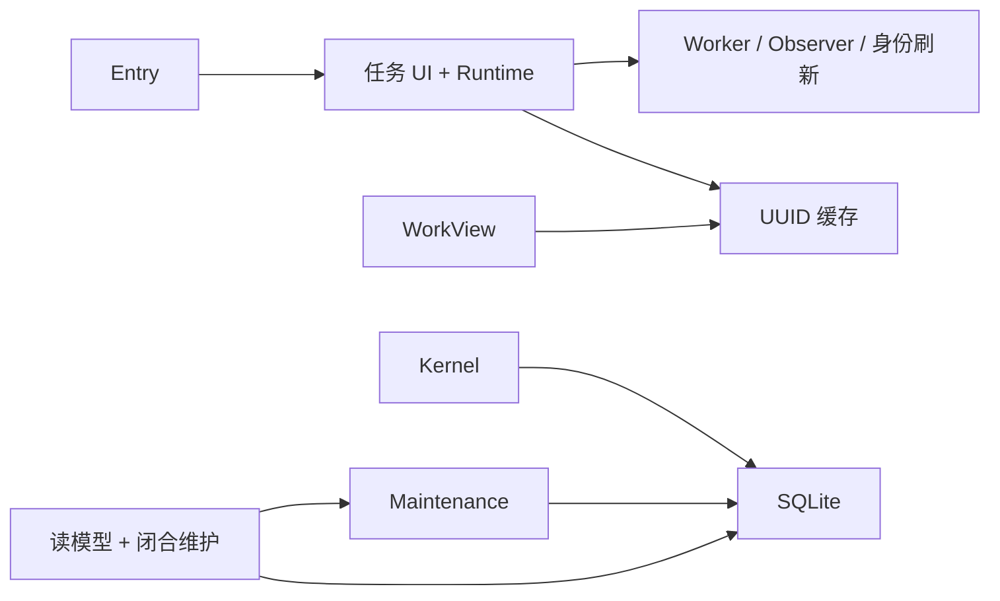
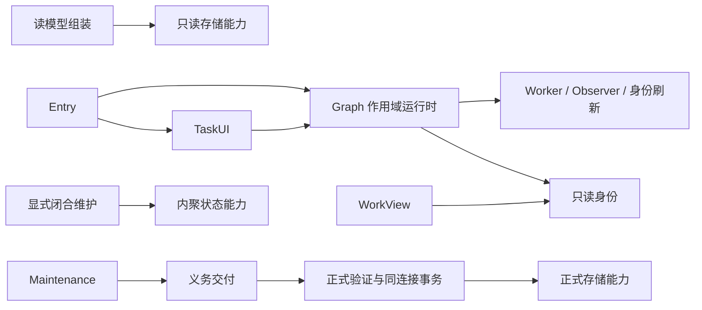

# 第二、三轮合并重构（实施中）

基线 `main@9293ad6bad3d778ae1897603c34a9c90c2fcacf3`，工作区干净；第一轮提交已经在远端。Node 20.20.2 / npm 10.8.2，SQLite 原生模块可用。没有发现适用的 AGENTS.md。本轮不改变 schema、投影协议、权限、布局记录或功能启用条件，不实施新 Workspace、内容维护、FocusPlan、审阅或行动建议，也不提前退出 legacy 提交链。

| 职责 | 开始时的实际所有者 | 本轮目标与进展 |
|---|---|---|
| 连接、Graph Worker、来源观察、身份刷新 | task-center 控制器；UUID 单实例缓存 | 已迁至插件级 Runtime；入口按 tasksEnabled 启动，Graph/generation 隔离 |
| 正式标记、菜单、用户命令 | task-center | 保留 UI 所有权，订阅小范围身份变化回调 |
| 正式事务与恢复 | Kernel + SQLite 同连接 | 保留；已改为消费者定义的结构存储能力 |
| 上下文、阅读基线、闭合维护、义务交付 | Kernel / 投影与维护协调器 | 已分出 ContextAssociations / UserReading / ClosureReadiness / ProjectionDelivery |
| 工作视图来源、展示、版本、读取、DOM | WorkView 控制器 | 待收敛状态入口、读取调度与条目更新 |
| 文件契约 / 材料草稿和保存 | host 反向导入 materials；材料模块 | 待调整契约边界，保留编辑恢复 |

开始时的依赖：

目标依赖（后端及视图尚在实施，不能作为已完成状态）：

## 已核对的基线

主工作区完整 `npm run check` 在 lint 因 Git 忽略的个人研究文件 `docs/research/longdoc-2026-09-14/file-watch-probe.cjs` 的同一 22 项既有错误中止，类型检查通过。没有删除用户文件、改 lint 规则或扩大忽略项；日志在 `tmp/round0203/` 汇总，原始日志为 `/tmp/task-copilot-round0203-*`。现有测试独立运行通过；完整交付检查、性能对比和 Desktop smoke 将在全部变更后记录。

## 运行时阶段

`index.ts` 是组合根；只在 tasksEnabled 启用时启动 `PluginRuntime`，再安装任务 UI，初始化 UI 失败时停止运行时。面板切换只导航，不创建 Worker。运行时拥有 Graph 订阅、Worker、来源观察、30 秒身份刷新、自身写入清理计时器；任务 UI 保留正式标记、菜单、Online DONE 用户命令和可移除交互注册。运行时不导入面板控制器。

Graph 切换立即清空身份并提升 generation；读取新 Graph 后才启用新作用域。索引、单块 revalidate、直接正式化、异常标记都过滤同一 Graph；晚到索引、观察批次和适配器调用先核对捕获的 scope。卸载停止未来领取；已经领取的 Graph 请求失效时向 Broker 报告失败，不能假报成功。已经进入 SDK 的单次调用没有取消 API，但后续读写都受作用域保护；正式义务仍由 Kernel 持久恢复。

自身写入采用每次写入 token，重叠写入不会因另一写入过期而解除抑制。抑制只服务语义观察和 Online DONE 识别，工作视图的 DB 变化仍可刷新。Descriptor 仍从私有 FileStorage 读取，按原文缓存解析而非永久缓存连接；私有内容变化自动重解析，连接命令替换私有内容并使在途刷新失效。缺文件的 SDK 兼容处理保留，其他 IO 失败仍上报。

运行时回归覆盖单实例启动、部分失败清理、重复 stop、A/B 同 UUID、A 延迟返回、停止后 revalidate、绑定适配器失效、重叠自身写入、descriptor 更新；来源观察覆盖旧 pending 与晚到批次，Graph Worker 覆盖领取后失效。关闭任务的组合根测试仍能打开自然工作视图和材料库，且不请求 Kernel。

## 后端阶段

Kernel 以正式存储能力执行原提交引擎，保留薄的上下文/阅读兼容方法；HTTP 和后台结构关联调用迁到实际 `context` / `reading` 能力。ContextStore 只包含关联、纠正及同连接事务，ReadingStore 只需要对象、按 target/status 的提交与基线写入。Kernel 生产依赖不再包含 SQLite 实现；测试仍使用其 devDependency，锁定版本不变。

投影组装只依赖只读 ProjectionStore 和协调器的小型查询能力；闭合副作用集中在显式 `maintainAssessment()`，`assembleClosureAssessment()` 根据捕获的 gate/revision/watermark 纯组装，同步 blocker 和合并评估入队保留。objectContext 在短同步事务内捕获正式字段与评估，然后读取 Graph 片段；返回的 freshness 对应返回的 formalVersion / semanticRevision，不声称异步 IO 后仍是最新正式版本。

投影交付只读取义务与 Commit，调用 Broker，再由 Kernel 权威 verify/failed；没有第二套队列或正式状态修改。维护 tick 合并重入并串行运行，预算仅在实际执行开始重置；stop 阻止新的领取，已领取作业真实收尾。Service 关闭 Broker 后等待维护和闭合执行结束，再关闭同一个数据库连接。恢复先于语义暂停检查，原重试、generation、scope、幂等、Undo 和 legacy 恢复均保留。

固定 300 TASK / 300 合成提交、macOS arm64 / Node 20 的相同场景，`node --import tsx scripts/measure-refactoring-backend.mjs` 从 `9293ad6` 编译原实现比较当前代码。统计实际 SQLite prepare 次数与返回的提交扫描量，不采用毫秒硬断言：

| 查询 | 原 SQL 次数 → 当前 | 原提交扫描 → 当前 | 其他变化 |
|---|---|---|---|
| listWorkObjects | 301 → 1 | 0 → 0 | 统一行映射消除逐 ID 查询 |
| Now | 1204 → 6 | 300 → 300 | ownership 集合 300 → 1，阅读基线整批映射，提交一次建立索引 |
| objectContext | 17 → 16 | 600 → 300 | 提交集合 2 → 1，子项 join 保留 childId 顺序 |
| markViewed | 3 → 3 | 300 → 1 | 只读目标 COMMITTED 记录，保留 updatedAt 排序与同时间稳定顺序 |

阶段全仓主测试 334 项通过，0 失败、0 跳过；新增故障测试验证纠正写入失败时关联失效原子回滚、跨 Graph 关联、阅读不改正式版本/账本、同版本 ProjectIntent 的阅读判断、异步 Graph 期间正式快照一致、慢 tick 不重叠和 stop 后不领取。完整 typecheck、受影响 lint、构建与 import 边界通过。全量最终检查仍待视图阶段结束。

核查中保留两个独立既有问题：objectContext 子项待确认原因使用已经过滤到父对象的 package 集合，因此子项条件不可达；尚无 coverage 的 manual reconcile 成功落账会因 SOURCE_COVERAGE_NOT_FOUND 重排。这些没有混入性能改造静默改变业务条件，后续需独立复现与修复，不能解释成已经解决。

## 仍需完成

工作视图状态与局部更新、材料边界、性能证据、完整交付检查、隔离 Desktop smoke、最终删除/保留清单与第四轮事项尚未完成。第一轮历史证据不能代替本轮验收。
