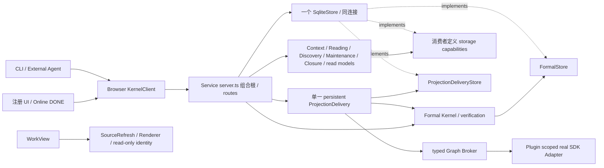

# 第四轮重构结果

2026-10-02。收尾范围是既有系统的正确性、正常提交入口、必要历史兼容、存储边界与可测量冗余；没有实现新的 Workspace / ContentPatch / FocusPlan / 内容维护或审阅产品。

## 基线与提交

实际仓库为本机 `work/任务管理中心-logseq插件`，远端身份 `wrd233/logseq-task-manager`。目标文件中的旧路径不存在；开始时工作区干净，HEAD 与 fetch 后 `origin/main` 均为 `ffce330927a75a9c8b18eb07d77e01e6146d0618`，没有适用的 AGENTS.md。第一轮 `9293ad6bad3d778ae1897603c34a9c90c2fcacf3` 和前三轮结果保留；未根据旧审查假定 main 仍落后。当前本地分支 `codex/refactoring-round-04`，未推送。

| 提交 | 交付职责 |
| --- | --- |
| `c8db298` | schema v23：历史对象定位与可删除当前态解耦、保留审计外键、迁移回滚 |
| `26de6d2` | formal governance / compensation 原子落账，D1–D8，启动资源清理 |
| `7d6d54e` | 正常 Plugin / HTTP / Client / CLI / external 入口迁移，回执不确定性与作用域 |
| `5844967` | Context/Reading 消费者迁移、剩余 Service 存储能力、实际 import 边界与可诊断错误 |
| 第四阶段与最终验收提交 | WorkView 正规化测量、实机发现的 SDK 缺文件语义、历史/当前文档校正；完整 SHA 见本分支提交记录 |

当前契约的主要权威是 [Kernel API](../architecture/kernel-api-contract.md) 与[状态机](../architecture/commit-state-machine.md)。[包架构](../architecture/target-package-map.md)负责依赖，[deferred 清单](../architecture/known-deferred-items.md)逐项标注现状。[2026-10-01 架构报告/PDF](../architecture/2026-10-01-workspace-architecture-review.md)保留阶段快照，未重做 PDF、改写旧验收或更新第三方依赖。

## 八个已确认问题

| 问题 | 实际修复与行为 | 有效回归 |
| --- | --- | --- |
| D1 CREATE Undo 外键冲突 | v23 历史定位不依赖当前行；同一个 Undo planner 分别执行 formal 原子补偿和 old protocol。删除前冻结 anchor、owned UUID/hash/effect；当前态删除后原 Commit/Evidence/run/package/obligation 可查；正式移除要求真实 absence proof | `kernel/tests/formal-round04.test.ts`：CREATE 删除、source edit/后续提交拒绝、重试、历史；`sqlite/tests/history-migration.test.ts`；real adapter 的部分写/重试/移除测试；原 Closure/Undo 回归 |
| D2 Proposal 治理遗漏 | APPLIED、appliedCommitId、ACCEPTED Feedback 与正式当前态、Commit、义务同事务；补偿链接、UNDONE_AFTER_APPLY 同样原子。USER decision 审计也在其业务事务内 | `formal-round04.test.ts`：Focus/Engagement 注入 feedback 失败全回滚，重复接受和 Undo 恰好一次；USER decision audit 失败后重试；external 失败投影/重启；实际注册命令 |
| D3 晚到失败降级 VERIFIED | VERIFIED 对重复成功与普通迟到失败幂等，不增加 attempt；单一 drain 按目标版本排序，较早失败/backoff/exhausted 阻挡同目标后续效果 | `kernel-service/tests/round04-regressions.test.ts`：真实 Broker 延迟失败；并发 drain 和外部交付回归；Kernel 相同义务读回相等 |
| D4 一次失败两次 attempt | Kernel verification 记录失败后抛 typed `ProjectionVerificationError`；Delivery 不重复记账。apply/read/request 失败仍由明确交付边界记录，离线不消费预算 | `round04-regressions.test.ts`：maxAttempts=2 首次不耗尽；现有 bounded retry/offline/restart/recovery 测试 |
| D5 首次 manual reconcile 无 coverage | 用实际 fresh snapshot + source references 建立/更新 coverage；实际认知对应版本。完成事务比较原 observed revision，新的来源不能被旧 job 覆盖 | `round04-regressions.test.ts`：无 observation 的首次 NO_CHANGE、再查、新来源期间 supersession；`phase9-maintenance-queue.test.ts`：首次正式变更覆盖实际来源与结果版本 |
| D6 子对象原因不可达 | 一次捕获全部 OPEN packages；父对象只取自己的 pending，子对象按自己的 ID 取包，顺序/优先级/数量不变 | `kernel-service/tests/read-model.test.ts`：父、子、无关及非开放 packages |
| D7 ACTIVE association 查询错参 | 实际查询改为 `listContextAssociations(undefined, "ACTIVE")`；审查全部调用，未引入 query DSL | `round04-regressions.test.ts`：同 Graph/block ACTIVE 跳过且 cognition=0，INVALIDATED 重新处理；原 correction/budget 回归 |
| D8 部分启动泄漏 | 只登记已获得资源；清理 timers、settled coordinators、Broker、owned listener/lease/descriptor、SQLite；close 同一 Promise 幂等。descriptor 比较 token/instanceId 归属，清理失败有日志且保留最初启动异常 | `round04-regressions.test.ts`：缺 Skill、listen 占用后立即同库重试；未获 lease 的 contender 不释放别人资源，重复 close/新 descriptor 归属；SQLite 失败关闭连接 |

表中短路径以 `packages/` 或 `apps/` 为前缀。新增断言围绕业务状态、审计、来源、防覆盖和实际资源释放，而非只检查 helper 调用。

## 正常调用关系与迁移

| 实际消费者 / 触发 | 当前提交路径 | 回执与 Graph 责任 |
| --- | --- | --- |
| Plugin 注册正式化 palette / block-context command | stable source identity、捕获 Graph/generation → `/commits/commit` | 正式 Commit + obligation；source 只在明确未接受且仍是本次系统写入时恢复 |
| Task Complete / Cancel / Reopen / Amend 注册命令 | prompt 前固定 target/version/scope → formal semantic Commit | 接受、待交付、失败可恢复、VERIFIED 分别反馈；不因后续 target 选择变更操作另一对象 |
| Online DONE `DB.onChanged` | self-write 抑制 → 按 changed block 重验真实对象 → 同一 formal Closure 能力 | 保留 USER 意图，不套用全局当前对象 |
| Plugin CurrentFocus / Engagement | approved Skill、fresh Evidence/proof、Proposal policy → `/proposals/:id/commit` | Proposal 治理随 Commit 完成；调用 Service delivery，Plugin 不直接 apply/complete |
| External 允许自动应用、CLI `proposal apply --wait` | `applyExternalProposalFormal` → `/external/proposals/:id/commit` | 正式提交成功后交付失败仍返回 accepted business + obligation；重复 APPLIED 返回同一事实 |
| WorkIntent / ProjectIntent / Ownership / completion recommendation | DecisionPackage → trusted Plugin USER event → compile → execute | USER-owned；USER decision、业务和 package/candidate 审计原子；外部 Agent 没有新增自动权限 |
| Plugin Undo palette / 快捷键 | captured latest Commit、fresh snapshot → `/commits/:id/undo/commit` | 同规划器的正式补偿，稳定 operationId，持久 projection obligation |
| Maintenance / normal request / External auto-apply | 共用一个 `ProjectionDelivery` 实例 | 序列化 drain，Kernel verify/failure authority，按目标版本恢复 |
| Plugin 历史 recovery 注册命令 | active Graph 过滤 → durable effect resume / fresh verify / abort | REMOVE 两个恢复分支都读实际 absence；manual reconciliation 保留 |
| Context / Reading / Discovery | Service 注入 ContextAssociations / UserReading / DiscoveryStore | HTTP 兼容；无 Kernel Context/Reading 转发；Discovery ACTIVE 查询修正 |
| Service start/close/部分失败 | 具体 SQLite 仅组合根及生命周期；应用路由经 ServiceApplicationStore | 单连接事务、own lease/descriptor、立即失败清理 |

浏览器 formal 请求网络失败/5xx 后查询稳定 operationId 的已接受回执；查不到且无法确定时抛 `FormalOutcomeUnknownError`。Plugin 每 Graph 保存原 payload，下一次命令先恢复该请求；不会生成第二份业务提交。USER decision 按原 decision ID 恢复已执行回执。A→B→A 拒绝旧 generation；已接受晚到结果诚实保留 Commit/义务，不覆盖新 recent state/UI。新 scoped FileStorage 在 Desktop 0.10.15 不存在时会抛 `file not existed`：实机发现后复用精确缺文件 guard，其他 IO 继续抛出，并把该实际返回形态加入注册命令回归。

## 必要历史兼容与删除依据

| 删除/合并对象 | 原保护行为、实际消费者与持久面 | 现在的所有者 / 证明 |
| --- | --- | --- |
| Kernel Context/Reading 的五个转发方法及 FormalStore 整套继承 | 上下文校验、关联/correction、阅读基线；生产消费者已迁移，没有对应独立持久协议依赖；HTTP 功能保留 | `ContextAssociations`、`UserReading` + 自有 ports；application-state、维护、Discovery、read baseline 回归 |
| 正常 UI / external 的 legacy prepare→Graph apply→complete 编排 | 权限、版本、治理、恢复；公开老 API 和中间持久状态仍有消费者，故只移除正常入口调用 | formal 事务承担业务/audit，shared delivery 承担 Graph；实际注册命令、HTTP 丢响应、external failure/restart 测试 |
| normal maintenance / Plugin 的重复 direct projection delivery | Graph hash、source/topology、失败恢复；effect/obligation 是持久面 | 一个 Service drain + 原 Kernel/Adapter guard；并发/排序/attempt/readback/late failure 测试。显式 presentation rerender 遇未交付义务先走 shared delivery，不越过义务 |
| Discovery / External 的重复 Graph response guard | 外部 Broker response kind 边界仍必需；没有新增公开/持久契约 | 已有 `expectGraphResponse` 统一承担；真实 Broker 错型与跨 Graph 回归 |
| 把数据库/磁盘异常解释成“run 失效”/“source stale”的 broad catch | 真实 inactive/correction/page-not-found fallback 仍必需；不能吞意外 IO | typed 已知条件明确处理；服务器记录原异常再返回 error；External receipt IO 注入验证 INTERNAL_ERROR 与原 diagnostics |
| WorkView source 的重复 flatten / 单 retained block 子树正规化 | full tree、范围外 retained、缺失/available 标记、并发读取和 draft guard 必需 | 同一 `sourceRow`；一遍主树 + 单条 retained；测量 assert deepEqual 输出，原 WorkView/草稿/seq/renderer 全部回归 |

保留 `prepare/applyProposal/prepareUndo/complete/graph-failed`、旧 external `/apply`、PREPARED/KERNEL_APPLIED/GRAPH_APPLIED/RECOVERY_REQUIRED 的读取/恢复和现有测试。formal preparation 失败也可能留下 PREPARED，不按“legacy”名称判定是否可删。不删账本/审计，不 bulk promote，不省略 proof/hash。未建立通用 Repository、事件总线、路由或生命周期框架。

## schema v23 与数据安全

历史表中的 work object ID 改为永久定位字段，而非要求 `work_objects` 当前行存在的 FK。迁移只重建这 15 张受影响表：projection_obligations、evidence_references、agent_run_receipts、proposals、curation_receipts、completion_records、cancellation_records、closure_amendments、reopen_records、context_associations、association_corrections、governance_issues、decision_packages、reconcile_jobs、closure_assessment_jobs。其他 Commit/Proposal/run 审计关系保留；current anchor/ownership/coverage/baseline/intent 继续受当前态约束。

同连接事务内 shadow copy 原列值、恢复 indexes/triggers、保存并还原 decision_candidates（避免 DROP parent 的 CASCADE），检查外键并记录版本。只使用事务级 `defer_foreign_keys`，不关闭 `foreign_keys`。删除当前对象时 active association INVALIDATED、OPEN package STALE、queued work STALE/TARGET_REMOVED；历史义务、尝试/时间戳、ledger 和 evidence 不级联删除。

验证包含：新库 v23、冻结的真实 v22 DDL fixture 升级和原行值逐值比对、attempt/时间戳、Commit FK 仍阻挡删除、foreign_key_check、版本登记失败注入后 DDL/数据/版本全部回滚并立即重试；既有 v16–21 升级、未来 v99 拒绝、CLI backup/restore/restart/WAL 安全回归仍运行。未来版本拒绝在初始化写入前执行。历史迁移链和 RC 数据安全资料保留。

## 当前依赖

所有 Service `src` 应用模块都受 SQLite 实现 import 禁止约束，例外仅实际组合根 `server.ts`；CLI 例外仅 `local-runtime.ts`。检查 value/type import、re-export、ImportType、literal dynamic import/require、relative/package subpath/TypeScript alias，包含新增或未来应用模块。12 个负向测试与实际全源码扫描验证边界，非协调器文件名白名单。dogfood 每请求捕获 ownership 一次，不缓存到下一请求。

## 工作量重放

两个原测量脚本保留 `9293ad6`，新增 `ffce330` 对照，产物写入 `tmp/round04/`，未覆盖前三轮 JSON。环境从实际 runtime 读取：本次 Node v20.20.2、arm64、darwin 24.1.0；最终运行 commit 记录于 JSON。锁定依赖和 SDK 未升级。

| 场景（300 对象/来源） | 9293ad6 | ffce330 | 第四轮 |
| --- | ---: | ---: | ---: |
| listWorkObjects SQL | 301 | 1 | 1 |
| Now SQL / ownership 集合读 | 1204 / 300 | 6 / 1 | 6 / 1 |
| ObjectContext SQL / scanned Commit | 17 / 600 | 16 / 300 | 16 / 300 |
| markViewed SQL / scanned Commit | 3 / 300 | 3 / 1 | 3 / 1 |
| dogfood300 SQL / ownership 集合读 | 未定义该历史场景 | 600 / 300 | 301 / 1 |
| WorkView 10 次 unchanged visible 的树读取 | 10 | 1 | 1 |
| WorkView 单正文变化 parse/sanitize/article 创建 | 300 / 300 / 300 | 1 / 1 / 0 | 1 / 1 / 0 |
| WorkView 连续 20 edit 树读 / sanitize / article 创建 | 20 / 6000 / 6000 | 0 / 20 / 0 | 0 / 20 / 0 |
| WorkView retained20 SDK 读取 | 21 | 21 | 21 |
| source 正规化 body getter 读取（20 retained 各含30子节点） | 未定义该历史场景 | 2444 | 642 |

source 对照返回同样 321 行且 `available=true`，通过 deepEqual；没有少读 SDK、去掉范围外恢复、草稿/消毒/seq/未知事件 fallback。SourceRefresh 和 Renderer 没有重写。历史 bundle 的 parser 使用同等实际计数 hook，避免打包私有 marked 实例漏计为零。模拟器耗时不代表真实 Desktop 性能。

## 验证环境与证据

- 原工作区：Node20 完整业务 `npm test` 379 项通过、0 fail、0 skip；Sandbox 5 项通过。完整 `npm run check` 在 lint 停止，仅用户已有忽略研究文件 `docs/research/longdoc-2026-09-14/file-watch-probe.cjs` 的22条错误；该文件原样保留，未扩大忽略。后续门禁不是原工作区全通过。
- 交付副本：仅受版本控制文件，相同 package-lock 与锁定第三方依赖；workspace 包链接全部指向副本；先 build 再完整 check。完整 `npm run check` 通过，business / Sandbox / boundary 均 0 fail / 0 skip，requirements 生成、typecheck、lint、build/binary probe、实际 boundary scan 和 Taste eval 全通过。最终计数见本页验收记录。验证副本 `tmp/round04/verification-p2i_vkg8`；manifest 验证每个 workspace symlink 与 package-lock，详见 `verification-copy.json` / `verification-check.log`。
- 自动化：真实 SQLite/HTTP/Broker 与丢响应、失败注入、迁移、重启；Happy DOM/FakeGraph 注册命令覆盖 target prompt、A/B/返回 A、late accepted、focus/engagement/closures/Undo/Online DONE。此层不代表 Desktop/IME。
- 真实 Desktop：本机 Logseq 0.10.15、SDK 0.3.4，受工具管理的独立 app/home/profile/Graph/SQLite；CDP 仅连接 Sandbox 目标。正式化、Task Complete/Undo、CurrentFocus 实际注册命令的业务/audit/VERIFIED 已读回。首次 native SDK 冷启动未 ready，重载此测试插件后恢复；未宣称所有冷启动均通过。同一实际注册命令另验证 CREATE Undo：删除 current row、保留自然父/子块、历史 Commit/补偿关系和两份 VERIFIED 义务。WorkView 的真实 SDK/datoms 刷新推进 seq，保持 UUID DOM 节点、focus 和 scrollTop=137，外部 snapshot 不可变且旧 seq 拒绝。材料浏览器编辑命令（非 IME）遇 native FileIO 外部写入：保留冲突草稿、复用 editor、磁盘外部版本不被覆盖，Desktop 重启后草稿/冲突仍在。tasksEnabled=false 按设置说明重载后不注册任务导航，自然 WorkView 和材料仍可使用。离线时用真实 SDK fresh snapshot 与 Plugin USER capability 接受 Focus 补偿，PENDING/attempt=0；关闭并重启 identity-checked Sandbox Service/Desktop 后仍 pending，重新开启 bridge 后同一 Commit/义务 VERIFIED，UNDONE_AFTER_APPLY 恰好一次。Sandbox 数据库 integrity_check=ok、foreign_key_check 为空。

本地详细证据在忽略目录 `tmp/round04/`（完整 check/test/measure 日志、JSON、Desktop readbacks）、`tmp/logseq-sandbox/evidence/`（隔离运行时与进程日志）。公开结果不包含 descriptor/token。可重放的业务/边界/迁移断言已提交为测试；Desktop 合成内容均留在 Sandbox，原 Graph 与原配置只读哈希核对。测试动作前/后比较生产 Graph 的10745份 .md/.edn/.json 和全局 .logseq 的29份同类文件，数量及 SHA-256 均相同；起点是在 Sandbox 启动后、验收动作前，不扩展成所有生产文件或全程监控的证明。

未验证范围：真实中文 IME 候选/提交、系统粘贴/原生拖动、真实双 Graph、长期 soak 与真实远程 DeepSeek gate。本轮 Fake cognition 不消耗生产凭据。浏览器 insertText、合成事件与 Happy DOM 不作为这些条件的证明。未来 Workspace/动态剪枝/跨任务调度仍是需求。耗尽义务与 RECOVERY_REQUIRED 保持显式人工处理，不宣称自动解决所有来源冲突。
