# 用工作台推进一份实际工作

本例是一份普通工作：**整理一份本地资料协作方案**。正文包含背景、两种方案、选型条件、反例、参考链接，以及自己的 **[注]**、**[想法]** 和一条局部 TODO。正文继续保存在 Logseq；参考文件和成果保存在 Graph 外的实际工作目录。

手册版本与实际验证环境见[导航页](README.md)。全部图片都是同一份合成工作的真实 Logseq Desktop 画面。图中的块数会随材料引用、建议和修订从初始内容增加到 26 条。

## 每天开始时

打开 Logseq，定位自己的工作块，结束正在进行的块编辑，运行“工作台：从当前块打开工作视图”，或按 **Cmd/Ctrl+Alt+P**。只阅读正文、材料和已有阶段历史时，无需开启 agent 连接或正式任务系统。

需要 agent 协作时，保持自己的工作连接进程运行，在本地允许这份工作，然后让 agent 从工作目录刷新并读取。首次配置和进程启动见文末附录。**“连接就绪”表示程序通道可用**，不表示某个 agent 已经开始思考。

## 1. 建立一份工作

在 Logseq 写一个能说明工作的普通块，把相关自然段放在它下面。本例根块写“整理一份本地资料协作方案”；无需先正式化成任务，也无需维护第二个展示标题。

需要使用外部材料时，在根块的右键菜单选择“工作台：关联工作目录”，填入已有的 Graph 外目录，保留适合这份工作的平铺方式，再确认关联。也可从当前工作“材料 → 目录与查找 → 绑定工作目录”进入。目录中会出现工作入口与读取副本；**Logseq 正文仍是当前原文**。已有文件留在原位置，不必为每个工作新建分类树。

选中根块，结束编辑，再打开工作视图。第一行显示工作名称，正文保留原有缩进、加粗和链接，底部显示当前可见条目数与总数。

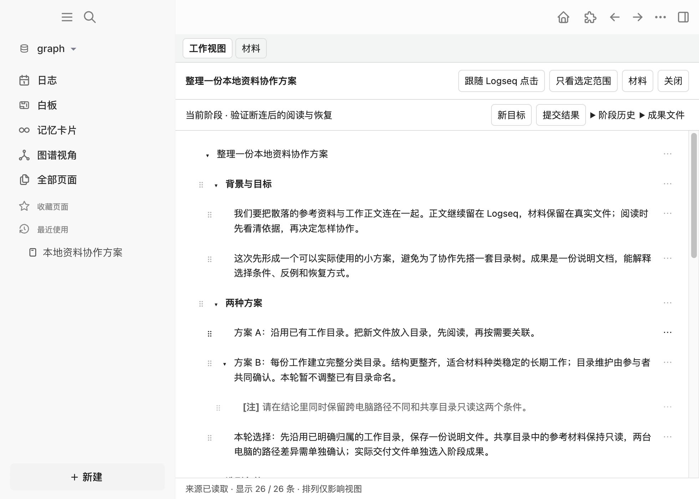

图中工作已推进到第二个目标。首次进入时不会要求先填写阶段目标；需要记录一个有意义的结果时再开始阶段。

## 2. 先读正文，需要时再打开局部操作

直接阅读自然段，用有子块的折叠标记展开或收起结构。叶子块不显示没有作用的折叠按钮。每条右侧的 **⋯** 是“条目操作”：无需悬停也能发现，用 Tab 可以到达，Enter 打开，Escape 关闭并返回入口焦点。

局部操作在阅读区域下方展开，附带当前条目的短预览。选择“在 Logseq 中打开”进入原块；选择“查看 Markdown 原文”查看原始文本。展示级别、增加／减少视图缩进和拖动用于调整阅读布局，**只保存视图选择**。

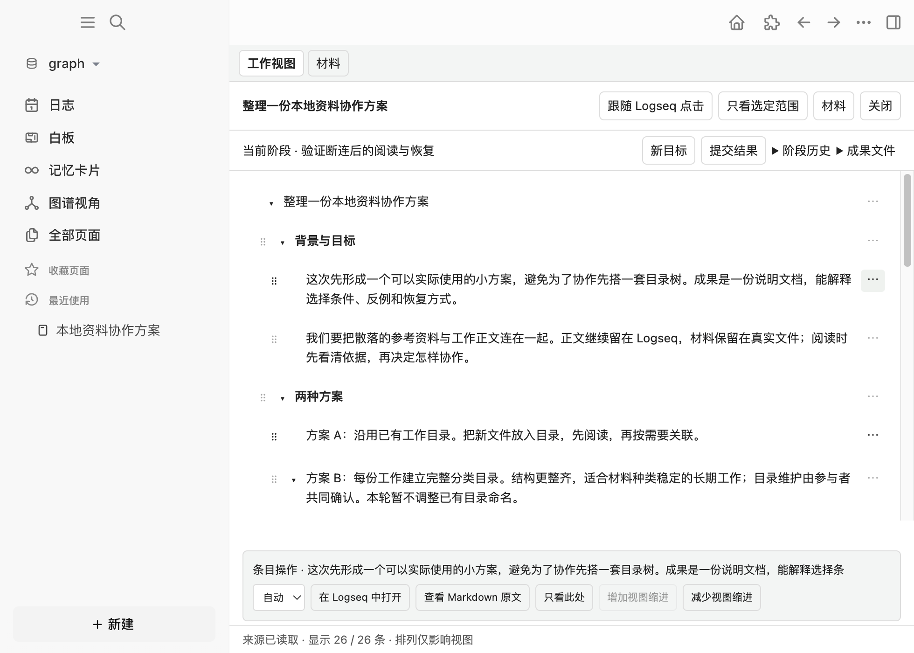

“跟随 Logseq 点击”让视图跟随宿主中的工作定位；“只看选定范围”或条目里的“只看此处”是手动范围查看。后面的按问题聚焦还会保留具体问题，两者分别使用各自的返回入口。

自己的想法继续写在原来的地方。保留 **[注]**、**[想法]**、普通文字和局部 TODO；工作台不会把它们自动变成待办队列，也不会自动执行 TODO。

## 3. 加入文件，先看再关联

把 `协作参考.md` 或 `目录说明.txt` 放进已经绑定的工作目录。在这份工作的标题旁点 **材料 → 目录文件**，即可查看目录里的文件。已关联项和“目录文件 · 尚未关联”分别标明。

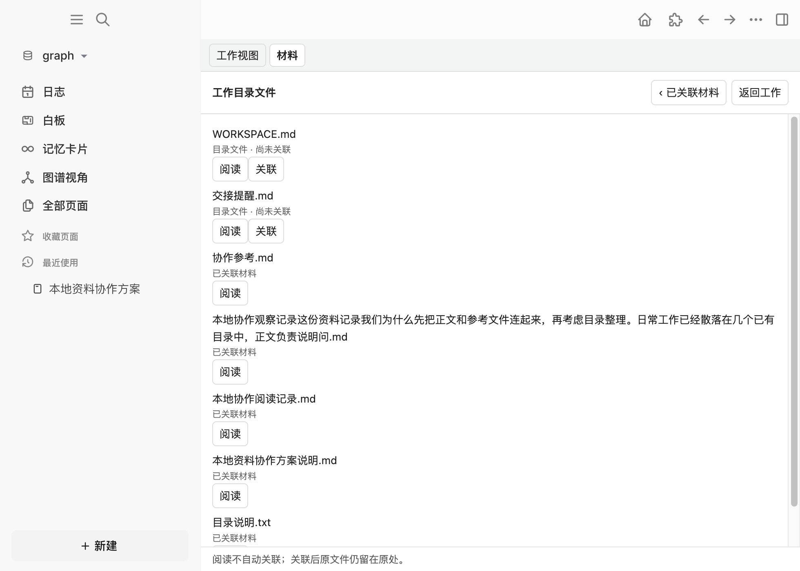

先点“阅读”。尚未关联的 Markdown 或小文本进入只读预览，标题区仍有“关联当前工作”和“返回工作”。**阅读不会建立关联或授权编辑**。本例的 `交接提醒.md` 经预览后仍保持尚未关联。

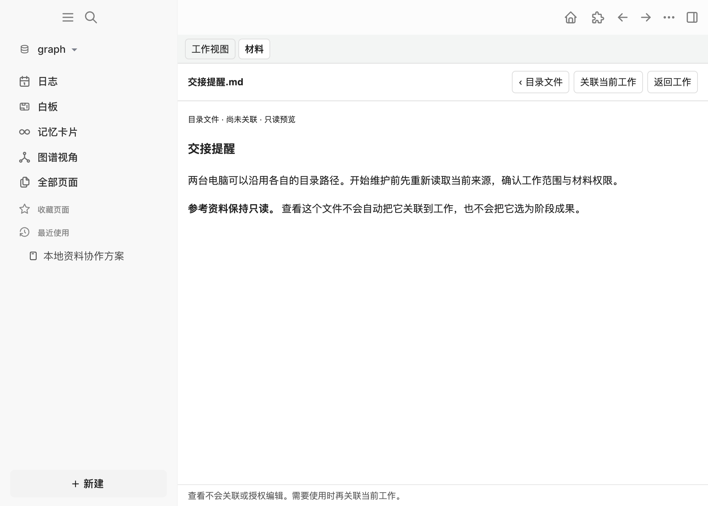

确认需要使用，再点“关联当前工作”，或在目录列表点“关联”。本例显式关联了参考 Markdown 和普通文本文件；原文件没有搬动。参考和输入材料默认只读；输出材料沿用既有编辑权限。主动选择“编辑原文件”或“编辑”才开启本地编辑；进入编辑后另有“允许 agent 编辑此工作稿”。这两项授权不能由关联或正文维护权限代替，本轮没有给参考和输入材料开启编辑。

关联后的 Markdown 从材料库打开阅读；其他格式按现有能力关联并外部打开。目录预览只覆盖有界的小文本，不能据此认为 PDF、图片或大文件已有正文预览。本轮实际覆盖了 Markdown 阅读、TXT 目录预览与关联；其他格式的外部打开未实机覆盖。

没有 agent 连接时仍可从本地目录发现和阅读文件。目录很大时仅显示有界结果，可用“关联文件”指定其他路径。阅读完成点“返回工作”，保留原问题、阶段和可靠阅读位置。

## 4. 把长文收纳为材料

一段需要完整保存、又不适合长期占据工作正文的长文，可以从当前工作的 **材料 → 收纳文本** 输入。首行写一个简短标题，例如“本地协作阅读记录”，再用空行分开正文，确认收纳。

材料模块完成 Markdown 转换与文件保存，在工作原文留下短引用。点击引用或材料标题即可阅读完整长文；“返回工作”回到工作现场。本例保存了含 26 个换行的完整阅读记录，磁盘文件、短引用和材料权限都经核对。

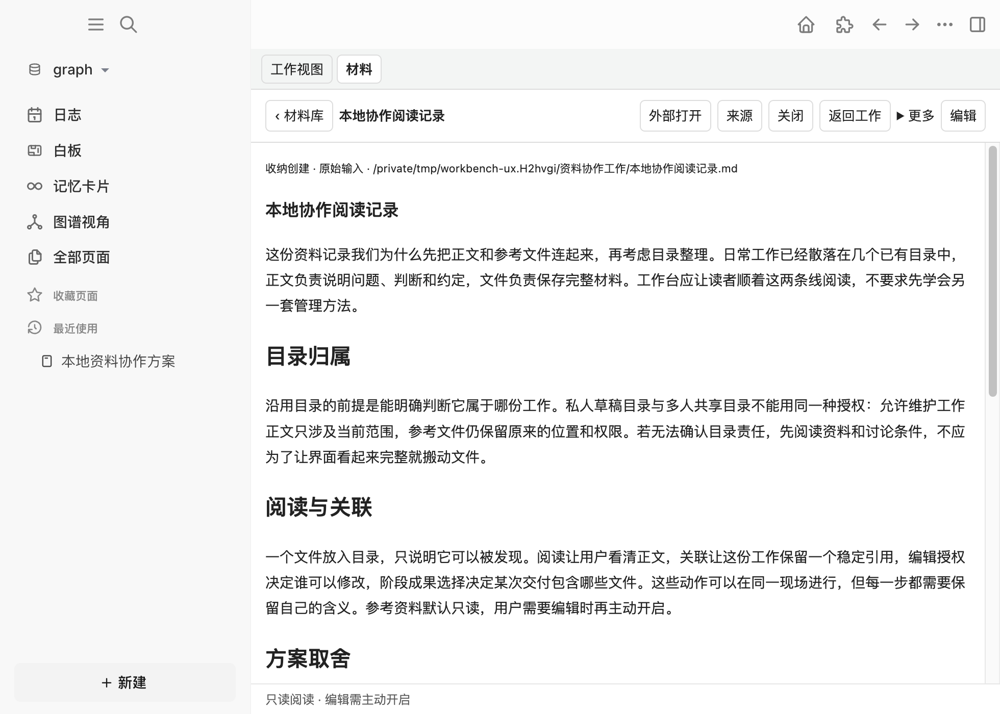

收纳失败时原输入或恢复记录仍保留。已经保存文件、但引用插入未完成时，可从材料库打开已保存材料，再按提示补关联。无需让 agent 重新制作另一套转换和保存程序。长文本自动粘贴收纳是另一个可选设置，默认关闭，本轮没有把浏览器输入测试当作系统剪贴板验收。

## 5. 推进一个有意义的阶段

准备形成一次可审阅的结果时，点 **开始阶段**，输入目标并点“开始”或按 Enter。本例目标是“比较两种目录协作方案，形成可实际使用的说明”。输入只在开始操作时展开；有当前阶段后入口变成“新目标”。每次聊天、保存或 Git 提交不会自动创建新阶段。

外部 agent 先刷新读取正文和阶段，通过现有连接提交修订，并经材料模块保存输出文件。本例第一次修订删除了方案 A 中“每天都要重建目录”的错误表述，修改方案 B，并新增结论，保存 `本地资料协作方案说明.md`。

在 **成果文件** 中明确选择实际交付的说明文件，再点“提交结果”。工作目录中的参考文件和其他文件不会自动成为阶段成果；成果记录也不是第二次文件保存确认。

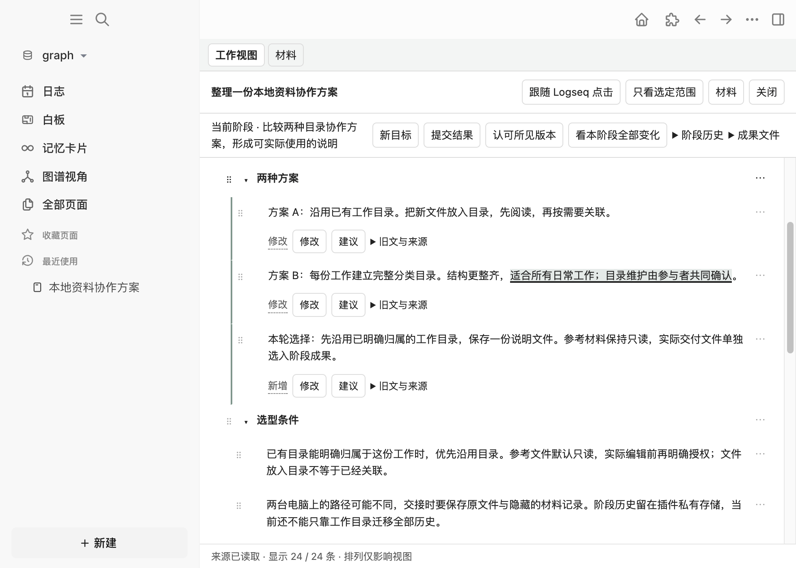

默认先读当前内容与变化标记。展开 **旧文与来源** 可查看删除线旧文及已记录的来源事实；[删除示例](assets/workbench/old-text.png)保留了被删掉的错误表述。复杂 Markdown 或不适合精确定位的差异仍按块显示，不把所有变化都冒充逐字比较。程序调用的实际作者未知时，界面会如实标明。

发现一句话不准确，直接点击变化正文或旁边 **修改**。编辑器读出完整当前原文，本例把“适合所有日常工作”改成“适合材料种类稳定的长期工作”，再点 **提交修改**。保存写回 Logseq 当前原文，历史版本继续保留。

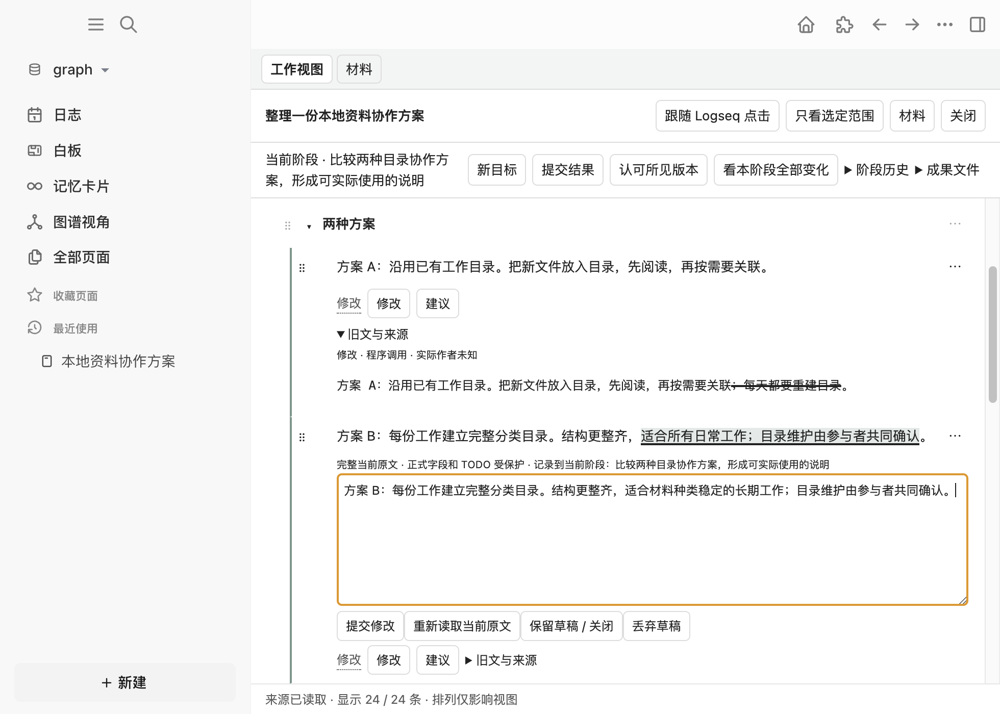

希望 agent 继续处理时，点 **建议**，写“请在结论里同时保留跨电脑路径不同和共享目录只读这两个条件”，再点“写入原文建议”。它进入原始内容，agent 下次刷新就能读到；不另建批注收件箱。

本例 agent 读取纠正和建议后，在**同一阶段**修改结论、补充恢复约定，并更新输出文件。原来的 **[注]**、**[想法]** 与 TODO 都保留。还未形成新的目标时，不必点“新目标”。

## 6. 认可所见版本，继续自己的写作

读完本轮变化与选入的成果，点 **认可所见版本**。如果当前只展示一部分变化，先用“看本阶段全部变化”或“还有…处范围外变化 · 看全部”展开；聚焦范围不等于所有提交内容。

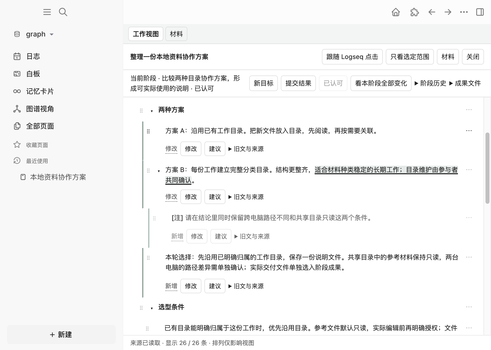

认可只绑定当时展示的具体修订。当前原文已经包含后来编辑时，界面会提示查看 **待认可版本**，避免顺带认可未展示的新内容。认可不表示正式任务完成、发布成果或授予更多权限，外部 agent 也不能替用户认可。

认可后继续在 Logseq 编辑原文即可。本例随后在方案 B 末尾人工补写“本轮暂不调整已有目录命名”，实际保存到当前原文；[认可后画面](assets/workbench/after-accept.png)仍显示已认可，没有要求重新认可。上一提交与认可记录保持原样，后来这句话没有归责旧 agent。

## 7. 按问题聚焦，再恢复完整内容

需要集中查看已有依据时，明确向正在协作的 agent 提问：**“哪些条件和反例影响选择？”** agent 读取当前聚焦来源，选择完整原块，并保留必要祖先、条件、反例和来源版本，通过现有 focus 流程应用。

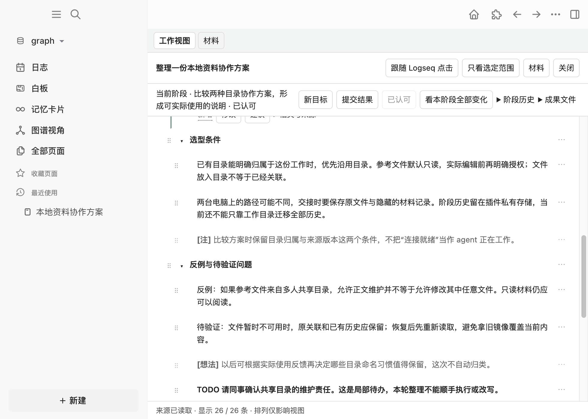

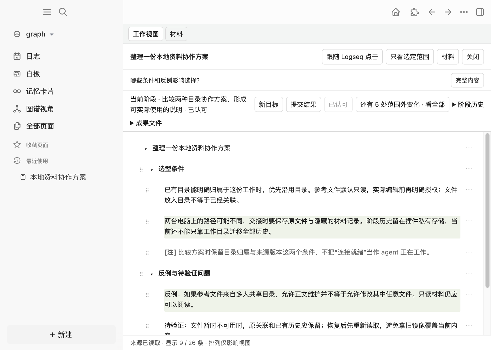

本例显示 6 个被选择的完整块及必要祖先，共 9 / 26 条。它没有生成另一篇答案摘要，也没有改写原文。重点标记与熟悉的缩进共同帮助阅读；“还有 5 处范围外变化 · 看全部”仍提醒还有阶段变化不在这个范围。

聚焦时点“材料”，阅读文件，再点“返回工作”，问题、范围和阅读锚点继续保留。点 **完整内容** 退出按问题聚焦，恢复完整的 26 条和进入聚焦前的阅读位置。本轮这两次往返都核对了实际段落位置和原块顺序。

原文版本变了，旧聚焦计划可能不再适用。让 agent 重新取得当前来源并选择，不从旧镜像直接应用；它只能在当前工作范围内选择完整块，不支持句子级剪枝或自动行动推荐。

## 8. 回看历史、停止连接和重新进入

展开 **阶段历史**，选择之前的目标，顶部显示 **历史回看**；可选择当时的修订版本。这里的正文是只读的当时记录。图中的“在当前内容中纠正”和“建议”会重新读取现存原文，写入当前阶段，历史不会被改写；本例只回看，没有使用这两个入口。选择“返回原位置”回到当前阶段；只有明确要继续旧目标时才用“继续此阶段”。


本例当前阶段后来改为“验证断连后的阅读与恢复”。上一阶段方案 B 不含认可后人工追加的一句，返回当前工作则包含那句话。阶段权威记录在插件私有存储，**不能只复制工作目录就认为已迁移到另一台电脑**。

停止协作时，进入 **材料 → 目录与查找 → 停止 agent 连接**，或运行本地命令“工作台：停止 agent 工作连接”。本地材料、目录阅读和已有历史继续可用；agent 的状态查询会报告工作已断开。

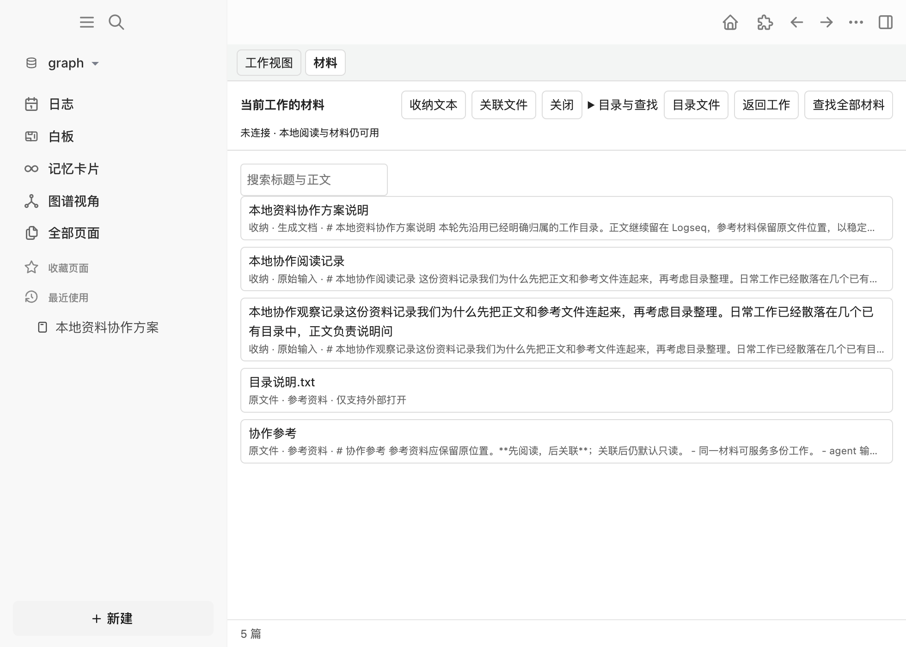

下一次协作时，确认自己的 companion 进程仍运行，在根块本地执行“工作台：允许 agent 连接当前工作”，让 agent 先刷新再读取。[重入画面](assets/workbench/reentry.png)来自本轮插件重载、Desktop 重启后的实际重新接入：同一工作、26 条原文、当前阶段与上一阶段认可均保留。

## 遇到问题时怎样继续

| 看到的情况 | 当前内容在哪里，下一步做什么 | 本轮证据 |
| --- | --- | --- |
| 未连接或连接已停止 | 本地正文、材料和阶段历史仍在；需要外部协作才启动自己的进程并本地重新允许，随后刷新 | 实际停止、离线阅读、重载与重新接入 |
| 参考材料处于只读阅读，agent 写入被拒绝 | 文件可阅读；选择“编辑原文件”才主动开启本地编辑，agent 编辑需另行授权。不要以关联或正文维护权限代替文件授权 | [参考材料画面](assets/workbench/reference.png)，外部写入被拒绝且文件未变 |
| 文件暂不可用 | 关联与历史保留，界面提供“更多 → 重新定位”；先恢复路径或明确定位后重新读取 | [文件暂不可用画面](assets/workbench/unavailable.png)，测试文件改名后恢复原路径并重读 |
| Logseq 块正在编辑 | 结束本地块编辑后重新读取；写回或聚焦保护不会绕过这个状态 | 实际拒绝编辑中的聚焦，结束编辑后正常应用 |
| 写入尚未完整确认 | 保留输入与原请求，查看现有写回事实及恢复入口。先查询原结果，不能重复提交未知写入 | 首次新增块的身份核验未完成；本地“查看正文写回冲突与恢复”重新核验后完成原请求，没有重复块 |
| 当前原文或材料已被别人改动 | 保留草稿，在“重新读取当前原文”或材料冲突入口核对双方内容后再保存 | 既有版本与草稿回归测试；本轮未另做一次真实并发文件冲突 |

文件位置重选、并发文件冲突、原生撤销等现有入口不能据自动测试写成已实机覆盖。具体界限见[验证证据](assets/workbench/evidence.md)。

## 首次准备

使用仓库规定的 Node **>=20.19 且 <21**、npm **10.8.2**。在自己的仓库目录执行 `npm ci` 和 `npm run build`，在 Logseq 的插件页加载 `apps/logseq-plugin`。插件名称为 Task Copilot 工作台，版本 0.2.0。每天使用已加载的版本不必重新构建。

从宿主 **… → 插件 → 本插件齿轮 → 打开配置项**进入设置。启用“工作视图”和“材料”，自然工作不要求启用“任务管理”或填 Kernel descriptor。启用设置改变后重载本插件。

需要外部 agent 时，启动下面附录中的 `workspace serve`。把它输出的 **pluginDescriptorPath** 填入“Agent 工作连接”设置，随后重载本插件。这是自己的工作连接文件路径，与正式任务 Kernel descriptor 是不同入口；不要复制 descriptor 正文或凭据到聊天。

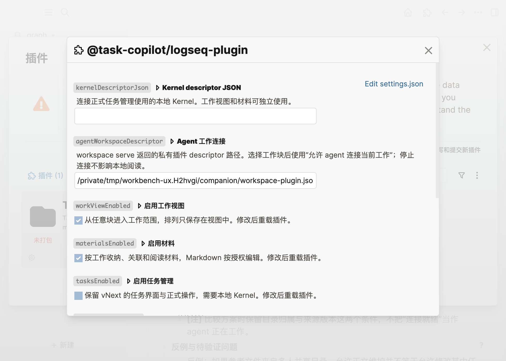

本轮截图中的临时路径只用于合成环境。另一台电脑使用自己的仓库、工作目录、状态目录和插件 profile。当前工作连接是手动启动的前台进程，没有自动后台启动或自动安装管理。

## Agent 接入附录

### 从本机路径运行构建 CLI

下面路径都替换成本机真实绝对路径。CLI 来自本轮构建的仓库，不要求安装全局命令；私有状态目录放在自己的本机位置，与工作目录分开。

```sh
REPO="/absolute/path/to/logseq-task-manager"
CLI="$REPO/apps/task-copilot-cli/dist/main.js"
export TASK_COPILOT_WORKSPACE_STATE="/absolute/path/to/private-workspace-state"
export TASK_COPILOT_WORKSPACE_CLIENT="my-current-work"
node "$CLI" workspace serve
```

保持这个终端运行。它返回 `pluginDescriptorPath`，供上面的插件设置使用；`Ctrl+C` 停止自己的进程。本轮实机为 macOS；当前工作连接进程要求 POSIX 私有文件权限，尚不支持 Windows 的 `workspace serve`。另一个终端使用同一套变量和状态目录：

```sh
WORK_DIRECTORY="/absolute/path/to/current-work"
cd "$WORK_DIRECTORY"
node "$CLI" workspace --help
node "$CLI" workspace status --json
node "$CLI" workspace capabilities --json
node "$CLI" workspace refresh --json
node "$CLI" workspace content read --json
node "$CLI" workspace materials list --json
```

运行前在 Logseq 根块本地允许当前工作。CLI 从 cwd 向上查找工作入口与本地连接定位，不要求用户手抄块标识。`status` 成功应返回当前工作通道在线；能力中普通工作不要求 Kernel，也不授权执行 TODO。

**先 refresh，再取得写回所需的当前版本。** `workspace read` 始终只读最后已知缓存，返回 last-known，不是写入依据。换 Graph、根块、目录绑定或进程实例后重新核对身份，不沿用旧结果。

### 阶段读取、输出和同阶段修订

阶段由用户通过本地 UI 开始。当前 CLI 的 `stage read` 也要求输入文件；读取当前阶段时文件内容为 `{}`。下列 IO 目录由使用者自己创建，后续计划和补丁由 agent 根据真实返回生成：

```sh
AGENT_IO="/absolute/path/to/private-agent-io"
mkdir -p "$AGENT_IO"
printf '{}\n' > "$AGENT_IO/stage-read.json"
node "$CLI" workspace stage read --input-file "$AGENT_IO/stage-read.json" --json
node "$CLI" workspace materials capture --input-file "$AGENT_IO/output-capture.json" --json
node "$CLI" workspace stage submit --input-file "$AGENT_IO/stage-submit.json" --json
```

`output-capture.json` 使用当前材料契约的 `requestKey/text/html/title/role`，输出的 `role` 为 `output`。读取实际材料身份与版本后，更新文件用 `materials save --input-file`，内容包含 `id/expectedVersion/expectedContent/next`。参考和输入材料的写入权限按返回能力检查，不能替换文件保存实现或绕过权限。

`stage-submit.json` 使用既有契约的 `stageId/expectedRevision/patch`；同阶段修正可包含 `correctionOf`。补丁来自本次 `content read` 的 scope、目标、结构与正文版本，沿用 content 入口的范围、Journal 和保护。agent 生成这些字段，用户不手填测试标识。具体格式见[阶段架构](../architecture/stage-workbench-architecture.md)与[安全写回架构](../architecture/content-writeback-architecture.md)。

没有阶段时读取诚实失败，不自动开始。外部入口只有阶段读取与提交，**没有阶段创建或认可命令**。成果是否选入、所见修订是否认可，留在现有本地用户路径。

### 按当前来源版本聚焦

```sh
node "$CLI" workspace focus request --question "哪些条件和反例影响选择？" --json
node "$CLI" workspace focus source --json
node "$CLI" workspace focus apply --input-file "$AGENT_IO/focus-plan.json" --json
node "$CLI" workspace focus read --json
```

agent 根据 `focus source` 的真实 request、scope 和版本生成完整块选择计划，保留必要祖先、条件与反例，不能制作第二篇回答正文。旧计划、范围变化或编辑中的来源应先处理，再重新读取与选择。用户从“完整内容”退出；程序也有现有 `focus exit/back/cancel` 入口，含义按当前状态处理，不能混作一个动作。

### 断连或未知结果先查询事实

通道不可用时保留工作目录与本地内容，确认自己的 companion 和本地允许状态后重新刷新。写请求超时可能已经送达，不能把失败返回当作“肯定未写”。

```sh
ORIGINAL_PATCH_REQUEST_ID="returned-original-content-request-id"
node "$CLI" workspace content result "$ORIGINAL_PATCH_REQUEST_ID" --json
node "$CLI" workspace content pending --json
node "$CLI" workspace content recover "$ORIGINAL_PATCH_REQUEST_ID" --json
```

这里使用原 content 补丁的 requestId；它与 CLI 的 `--request-id` transport 标识是不同层。恢复查询原事实，不重新执行未知操作。需要修正时，先重新读取并沿现有 `content retry` 契约生成明确的新请求。本轮确实用本地恢复入口补完了原请求的身份核验，未重放新增块。

### 可复制的开始工作提示词

> 在我已经本地允许的当前工作目录内协作。使用本机构建 CLI 与我自己的 workspace 状态目录，先查状态和能力，再 refresh、content read、materials list 与当前 stage read；从 cwd 识别工作，不让我抄块标识。Logseq 正文和实际材料文件是当前来源，workspace read 的 last-known 缓存不能用于直接写回。保留我的 [注]、[想法]、普通文字和局部 TODO；只按明确请求修改当前工作内获准的内容，检查版本、编辑保护和真实结果。长文与输出沿材料模块保存，参考及输入默认只读，成果文件由本地明确选择。阶段由我本地开始，你只能读取和提交，同一目标的纠正继续在同一阶段，你不能代我认可。按问题聚焦时选择当前版本的完整原块，保留祖先、条件和反例，不另写一篇摘要或主动推荐下一步。断连、冲突或未知写入先保留草稿并查询原事实，再刷新，不能从旧镜像重放。报告实际改变了什么、保存在哪里、哪些结果尚未确认。
