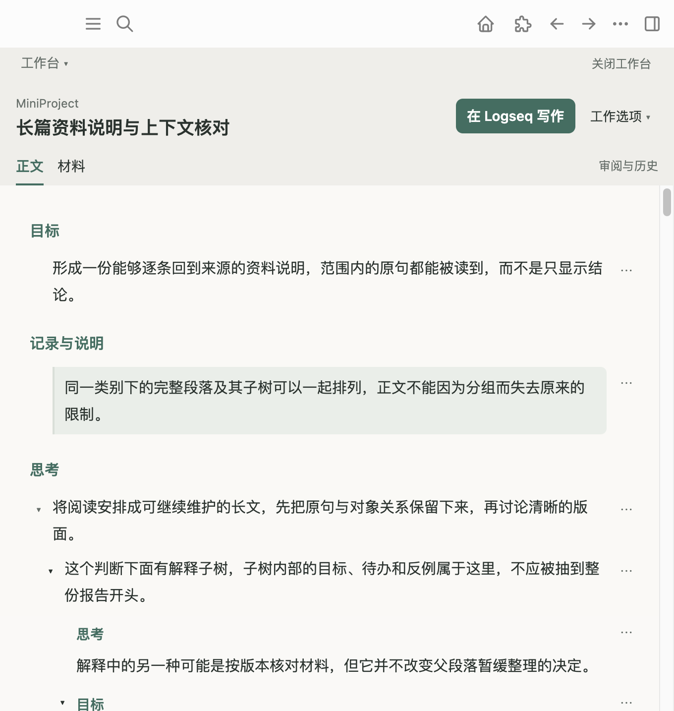
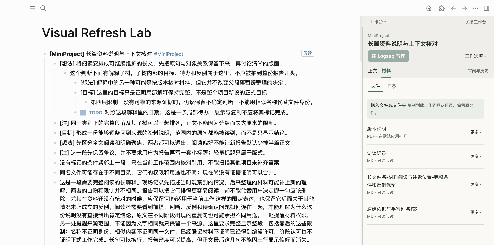
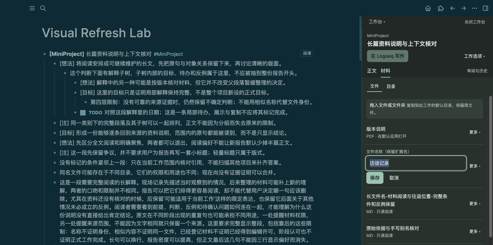
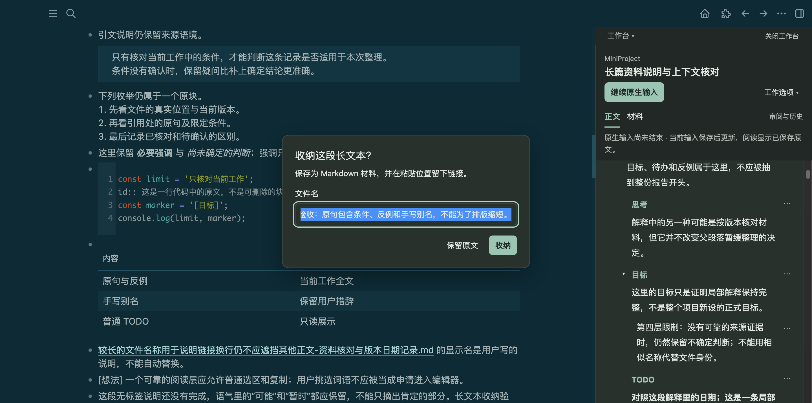

# 用工作台推进一份实际工作

本例是一份普通工作：**整理一份本地资料协作方案**。正文包含背景、两种方案、选型条件、反例、参考链接，以及自己的 **[注]**、**[想法]** 和一条局部 TODO。正文继续保存在 Logseq；参考文件和成果保存在 Graph 外的实际工作目录。

操作路径已按 2026-10-06 的视觉刷新更新。新版[设计](../design/workbench-visual-refresh-design.md)、[实机证据](../implementation/assets/workbench-visual-refresh/README.md)和[交接](../implementation/workbench-visual-refresh-handoff.md)记录本轮范围。下方未替换的旧图保留历史说明，操作以本文当前入口为准。

## 每天开始时

打开 Logseq，直接点事务、任务或 MiniProject 标题旁的「阅读」。正在输入时也可以打开。普通工作块可运行“工作台：从当前块打开工作视图”，或按 **Cmd/Ctrl+Alt+P**。只阅读正文、材料和已有阶段历史时，无需开启 agent 连接或正式任务系统。

需要 agent 协作时，保持自己的工作连接进程运行，在本地允许这份工作，然后让 agent 从工作目录刷新并读取。首次配置和进程启动见文末附录。**“连接就绪”表示程序通道可用**，不表示某个 agent 已经开始思考。

## 1. 建立一份工作

在 Logseq 写一个能说明工作的普通块，把相关自然段放在它下面。本例根块写“整理一份本地资料协作方案”；无需先正式化成任务，也无需维护第二个展示标题。

使用材料无需先配置目录：拖入后保存到这份工作的专属默认位置。“材料 → 目录”可用“添加目录”选择多个已有目录，再指定一个默认保存位置。需要正式工作区与 agent 连接时，另用根块右键菜单“工作台：关联工作目录”；该主目录关联才管理工作入口与读取副本。**Logseq 正文仍是当前原文**。

选中根块，再打开工作视图。第一行显示工作名称和「在 Logseq 写作」，下方以「正文／材料」切换当前内容。正文默认完整报告，保留原句、加粗和链接；需要查看原有排列时用「工作选项 → 查看原结构」。已打开一份工作后，普通子块点击不会另选工作；从「工作台 → 打开当前块的工作」明确切换。


图中工作已推进到第二个目标。首次进入时不会要求先填写阶段目标；需要记录一个有意义的结果时再开始阶段。

## 2. 先读正文，需要时再打开局部操作

直接阅读完整自然段，点「在 Logseq 写作」进入真实原生页面。宽窗可并排读写，窄窗从当前段落进入，再点「返回正文」。报告不会把每一块做成卡片；原结构中的折叠与展示排列从工作选项进入。每条右侧的 **⋯** 是“条目操作”：无需悬停也能发现，用 Tab 可以到达，Enter 打开，Escape 关闭并返回入口焦点。

局部操作在条目入口旁以覆盖菜单展开，附带当前条目的短预览，不推开正文。选择“对照原文”就地查看该段原始文本；选择“编辑原文”进入对应原块。原结构中的对照入口名为“查看 Markdown 原文”。展示级别、增加／减少视图缩进和拖动用于调整阅读布局，**只保存视图选择**。



写作过程中点“继续原生输入”，会保留当前输入和光标。只想显示宿主原生区域时，用“工作选项 → 显示原生页面”；窄窗在宿主提供“返回正文”。结束原生输入后返回阅读，会回到原段落附近。本轮证据与未验范围见[视觉刷新交接](../implementation/workbench-visual-refresh-handoff.md)；此前旅程见[原生往返整合记录](../integration/native-editor-reading-main-2026-10-05.md)。

「工作选项 → 跟随工作对象点击」可开启跟随宿主中的工作定位；同菜单的“只看选定范围”或条目里的“只看此处”是手动范围查看。后面的按问题聚焦还会保留具体问题，两者分别使用各自的返回入口。

自己的想法继续写在原来的地方。原生页面仍可写 **[目标]**、**[想法]**、**[注]**、**[说明]**、**[记录]**、**[问题]**；阅读中分别显示局部目标、思考、说明、记录和问题。完整原句与子块保留，连续同类不逐段贴标签。代码、引文、未知标记和句中标记保持字面内容。TODO 显示真实文字状态，阅读不会完成或执行它。需要核对标记时用“对照原文／查看原结构”。

新记录的行首使用加粗标记，例如 `**[想法]** 目前偏向先试一周，但尚未询问退出条件。`；普通待办仍写 `TODO 核对取消条款`，不加粗状态，也不新增正式任务或事务。

明确需要整理旧裸标记时，在“工作选项 → 正文维护 → 查看并整理行首格式”，或运行“工作台：查看并整理行首格式”。选定范围（含下属）和标记后，点“重读并查看差异”，核对原行与新行，再点“明确写入这份差异”。默认只整理目标、想法、注、说明、记录和问题；其他已有自然标记需明确选择。正式对象、受管内容、任务、代码、引文和句中字面标记保留。页面需要先选定真实块范围。

Agent 提出的差异可从“已有格式提议”选择查看，它不能通过外部调用替你确认。格式确认仅限这份差异，不开启普通正文、文件或 TODO 权限。原文已有变化时，旧差异停止；原差异和日志保留。遇到冲突、部分写入或未知结果，先查询并核对原文、提议与已观察内容；明确保留当前原文后再重读生成新差异，避免重复写入已完成部分。窗口中的组合输入和原生输入继续受保护。

## 3. 拖入文件，单击阅读

从正文切到“材料”，将文件或文件夹拖到“文件”页。名称立即出现，逐项显示加入状态；完成后进入下方列表。文件复制到当前默认位置，原件保留。已经在默认目录中的文件直接关联，不再复制。失败条目可重试。

已有目录无需搬入：在“目录”页点“添加目录”，使用文件管理器选择，里面的普通文件登记为当前工作只读材料。以后自行加入文件，可用该目录行的“更多 → 刷新文件”。这里可以绑定多个目录，用单选项指定新文件的默认保存位置；切换位置不会搬迁已有材料。

单击材料名打开 Markdown 阅读；其他普通格式由默认应用打开。“更多 → 复制链接”会直接复制，可在 Logseq 粘贴；“改文件名”负责改名，拖出材料行仍提供稳定引用。复制成功后该行显示“已复制”，失败就地重试；“更多 → 改文件名”直接在该行编辑，保存／取消不会把表单插到列表顶部，失败保留输入草稿。更多菜单覆盖列表，关闭后回到入口。当前界面见[实机截图](../implementation/assets/workbench-visual-refresh/README.md)。此前的[目录列表](assets/workbench/directory.png)和[尚未关联预览](assets/workbench/preview.png)为旧布局的历史验证画面，不作为现在的操作指引。

参考和输入材料默认只读，导入副本也不自动授权编辑。主动选择“编辑原文件”或“编辑”才开启本地编辑；进入编辑后另有“允许 agent 编辑此工作稿”。这两项授权不能由关联或正文维护权限代替。PDF、图片等普通文件仅支持登记和外部打开，未提供内置预览。

没有 agent 连接时仍可使用材料。当前“材料 → 目录”的“添加目录”可选择多个目录，添加或刷新登记其中普通文件；日常文件加入采用拖入，没有路径输入入口。以下目录预览截图记录较早验收版本。阅读完成点“正文”，保留原问题、阶段和可靠阅读位置。





## 4. 把长文收纳为材料

一段需要完整保存、又不适合长期占据工作正文的长文，直接粘贴到 Logseq 原生编辑区。开启“粘贴长文本时询问收纳”后，达到阈值会出现文件名确认；填写例如“本地协作阅读记录”，再选择“收纳”，或选择“保留原文”。材料页没有单独的文本输入入口。确认框跟随宿主明暗主题，保存失败时文件名和原文保留。



材料模块完成 Markdown 转换与文件保存，在工作原文留下短引用。点击引用或材料标题即可阅读完整长文；“正文”回到工作现场。本例保存了含 26 个换行的完整阅读记录，磁盘文件、短引用和材料权限都经核对。


收纳失败时原输入或恢复记录仍保留。已经保存文件、但引用插入未完成时，可从材料库打开已保存材料，再按提示补关联。无需让 agent 重新制作另一套转换和保存程序。长文本自动粘贴收纳是另一个可选设置，默认关闭，本轮没有把浏览器输入测试当作系统剪贴板验收。

## 5. 推进一个有意义的阶段

准备形成一次可审阅的结果时，先点 **审阅与历史**，再点 **开始阶段**，输入目标并点“开始”或按 Enter。本例目标是“比较两种目录协作方案，形成可实际使用的说明”。输入只在开始操作时展开；有当前阶段后入口变成“新目标”。每次聊天、保存或 Git 提交不会自动创建新阶段。

外部 agent 先刷新读取正文和阶段，通过现有连接提交修订，并经材料模块保存输出文件。本例第一次修订删除了方案 A 中“每天都要重建目录”的错误表述，修改方案 B，并新增结论，保存 `本地资料协作方案说明.md`。

在审阅区的 **历史、比较与阶段成果 → 成果文件** 中明确选择实际交付的说明文件，再点“记录当前版本”。这只记录本地版本，不发送或发布。工作目录中的参考文件和其他文件不会自动成为阶段成果；成果记录也不是第二次文件保存确认。


正常正文先完整阅读；有提交变化时从 **有改动 · 进入审阅** 查看变化标记。展开 **旧文与说明** 可查看删除线旧文及已记录的来源事实；[删除示例](assets/workbench/old-text.png)保留了被删掉的错误表述。复杂 Markdown 或不适合精确定位的差异仍按块显示，不把所有变化都冒充逐字比较。程序调用的实际作者未知时，界面会如实标明。

发现一句话不准确，在审阅中明确点 **纠正**；报告正文点击继续阅读。编辑器读出完整当前原文，本例把“适合所有日常工作”改成“适合材料种类稳定的长期工作”，再点 **提交修改**。保存写回 Logseq 当前原文，历史版本继续保留。


希望 agent 继续处理时，点 **原文建议**，写“请在结论里同时保留跨电脑路径不同和共享目录只读这两个条件”，再点“写入原文建议”。它进入原始内容，agent 下次刷新就能读到；不另建批注收件箱。

本例 agent 读取纠正和建议后，在**同一阶段**修改结论、补充恢复约定，并更新输出文件。原来的 **[注]**、**[想法]** 与 TODO 都保留。还未形成新的目标时，不必点“新目标”。

## 6. 认可所见版本，继续自己的写作

读完本轮变化与选入的成果，在审阅区点 **认可这个版本**。如果当前只展示一部分变化，先用“看本阶段全部变化”或“还有…处范围外变化 · 看全部”展开；聚焦范围不等于所有提交内容。


认可只绑定当时展示的具体修订。当前原文已经包含后来编辑时，界面会提示查看 **待认可版本**，避免顺带认可未展示的新内容。认可不表示正式任务完成、发布成果或授予更多权限，外部 agent 也不能替用户认可。

认可后继续在 Logseq 编辑原文即可。本例随后在方案 B 末尾人工补写“本轮暂不调整已有目录命名”，实际保存到当前原文；[认可后画面](assets/workbench/after-accept.png)仍显示已认可，没有要求重新认可。上一提交与认可记录保持原样，后来这句话没有归责旧 agent。

## 7. 按问题聚焦，再恢复完整内容

需要集中查看已有依据时，明确向正在协作的 agent 提问：**“哪些条件和反例影响选择？”** agent 读取当前聚焦来源，选择完整原块，并保留必要祖先、条件、反例和来源版本，通过现有 focus 流程应用。


本例显示 6 个被选择的完整块及必要祖先，共 9 / 26 条。它没有生成另一篇答案摘要，也没有改写原文。重点标记与熟悉的缩进共同帮助阅读；“还有 5 处范围外变化 · 看全部”仍提醒还有阶段变化不在这个范围。

聚焦时点“材料”，阅读文件，再点“正文”，问题、范围和阅读锚点继续保留。点 **完整内容** 退出按问题聚焦，恢复完整的 26 条和进入聚焦前的阅读位置。本轮这两次往返都核对了实际段落位置和原块顺序。

原文版本变了，旧聚焦计划可能不再适用。让 agent 重新取得当前来源并选择，不从旧镜像直接应用；它只能在当前工作范围内选择完整块，不支持句子级剪枝或自动行动推荐。

## 8. 回看历史、停止连接和重新进入

从 **审阅与历史 → 历史、比较与阶段成果 → 阶段历史** 选择之前的目标，顶部显示 **历史回看**；可选择当时的修订版本。这里的正文是只读的当时记录。图中的“在当前内容中纠正”和“建议”会重新读取现存原文，写入当前阶段，历史不会被改写；本例只回看，没有使用这两个入口。选择“返回原位置”回到当前阶段，或点“收起审阅”继续当前正文；只有明确要继续旧目标时才用“继续此阶段”。


本例当前阶段后来改为“验证断连后的阅读与恢复”。上一阶段方案 B 不含认可后人工追加的一句，返回当前工作则包含那句话。阶段权威记录在插件私有存储，**不能只复制工作目录就认为已迁移到另一台电脑**。

停止协作时，从 **工作选项 → 外部连接与恢复 → 停止 agent 工作连接** 操作，或运行本地命令“工作台：停止 agent 工作连接”。本地材料、目录阅读和已有历史继续可用；agent 的状态查询会报告工作已断开。

“查看正文写回冲突与恢复”只建立读取范围，不顺带开启正文写权限，也不为查看结果写入原生身份。同一范围已有的明确权限继续保留；切换恢复范围后，需要写入或重新提交时再使用相应的授权入口。


下一次协作时，确认自己的工作连接进程仍运行，先用“带当前工作去协作”准备只读现场，让 Agent 刷新再读取。需要补充正文时再明确选择“允许 Agent 维护这里正文”；文件写作和普通 TODO 分别允许。[重入画面](assets/workbench/reentry.png)来自较早插件重载、Desktop 重启后的实际重新接入：同一工作、26 条原文、当前阶段与上一阶段认可均保留。

正式任务的当前事项、最近提交和待处理请求保存在这台电脑的插件私有记录中。看到“未能确认本机恢复记录已保存”时，先保留笔记并检查本机存储，再查看原提交的结果；不要另发一份重复操作。正式提交已经成功但本机记录未更新时，会保留成功提交与待核对投影的事实。普通阅读、正文写作和 TODO 仍各自使用独立许可，重启不会恢复上一连接的写权限。

升级前保留 Graph、材料和插件私有记录；正式系统启用时同时保留其数据。新版可读取部分旧范围记录，并保留旧文件，但旧版本不理解新版恢复记录。来回安装新旧版本尚未验证，旧版可能读到旧指针；不要把换回旧包当作撤销笔记或正式提交。需要回退时，先在隔离副本核对记录和正式结果。

## 遇到问题时怎样继续

| 看到的情况 | 当前内容在哪里，下一步做什么 | 本轮证据 |
| --- | --- | --- |
| 未连接或连接已停止 | 本地正文、材料和阶段历史仍在；需要外部协作才启动自己的进程并本地重新允许，随后刷新 | 实际停止、离线阅读、重载与重新接入 |
| 参考材料处于只读阅读，agent 写入被拒绝 | 文件可阅读；选择“编辑原文件”才主动开启本地编辑，agent 编辑需另行授权。不要以关联或正文维护权限代替文件授权 | [参考材料画面](assets/workbench/reference.png)，外部写入被拒绝且文件未变 |
| 文件暂不可用 | 关联与历史保留，界面提供“更多 → 重新定位”；先恢复路径或明确定位后重新读取 | [文件暂不可用画面](assets/workbench/unavailable.png)，测试文件改名后恢复原路径并重读 |
| Logseq 块正在编辑 | 结束本地块编辑后重新读取；写回或聚焦保护不会绕过这个状态 | 实际拒绝编辑中的聚焦，结束编辑后正常应用 |
| 写入尚未完整确认 | 保留输入与原请求，查看现有写回事实及恢复入口。先查询原结果，不能重复提交未知写入 | 首次新增块的身份核验未完成；本地“查看正文写回冲突与恢复”重新核验后完成原请求，没有重复块 |
| 当前原文或材料已被别人改动 | 保留草稿，在“重新读取当前原文”或材料冲突入口核对双方内容后再保存 | 既有版本与草稿回归测试；本轮未另做一次真实并发文件冲突 |

文件位置重选、并发文件冲突、原生撤销等现有入口不能据自动测试写成已实机覆盖。具体界限见[验证证据](assets/workbench/evidence.md)。

## 首次准备

基础阅读直接使用[安装 ZIP 和简明说明](simple-start-reading.md)，不需要安装 Node 或自行构建。工作视图和材料默认开启，正式任务默认关闭；用户已有明确设置继续保留。

协作在实际需要时运行包内启动器，再在当前工作允许连接。默认位置由程序发现，无需填写 descriptor 路径；已有自定义位置继续有效。可选协作需要 Node，基础阅读不需要。Logseq 0.10.9 的进程能力限制与剩余步骤见[交接](../implementation/simple-start-reading-handoff.md)。

下面旧设置截图记录的是 2026-10-03–04 的手动准备流程；首次使用请按新版说明。开发者仍可使用仓库规定的 Node **>=20.19 且 <21**、npm **10.8.2**，执行 `npm ci` 和 `npm run build` 后加载源码目录。


## Agent 接入附录

### 从本机路径运行构建 CLI

下面路径都替换成本机真实绝对路径。CLI 来自本轮构建的仓库，不要求安装全局命令；私有状态目录放在自己的本机位置，与工作目录分开。

```sh
REPO="/absolute/path/to/logseq-task-manager"
CLI="$REPO/apps/task-copilot-cli/dist/main.js"
export TASK_COPILOT_WORKSPACE_STATE="/absolute/path/to/private-workspace-state"
export TASK_COPILOT_WORKSPACE_CLIENT="my-current-work"
node "$CLI" workspace serve
```

保持这个终端运行。它返回 `pluginDescriptorPath`，供上面的插件设置使用；`Ctrl+C` 停止自己的进程。本轮实机为 macOS；当前工作连接进程要求 POSIX 私有文件权限，尚不支持 Windows 的 `workspace serve`。另一个终端使用同一套变量和状态目录：

```sh
WORK_DIRECTORY="/absolute/path/to/current-work"
cd "$WORK_DIRECTORY"
node "$CLI" workspace --help
node "$CLI" workspace status --json
node "$CLI" workspace capabilities --json
node "$CLI" workspace refresh --json
node "$CLI" workspace content read --json
node "$CLI" workspace materials list --json
```

运行前在 Logseq 根块本地允许当前工作。CLI 从 cwd 向上查找工作入口与本地连接定位，不要求用户手抄块标识。`status` 成功应返回当前工作通道在线；能力中普通工作不要求 Kernel，也不授权执行 TODO。

**先 refresh，再取得写回所需的当前版本。** `workspace read` 始终只读最后已知缓存，返回 last-known，不是写入依据。换 Graph、根块、目录绑定或进程实例后重新核对身份，不沿用旧结果。

### 阶段读取、输出和同阶段修订

阶段由用户通过本地 UI 开始。当前 CLI 的 `stage read` 也要求输入文件；读取当前阶段时文件内容为 `{}`。下列 IO 目录由使用者自己创建，后续计划和补丁由 agent 根据真实返回生成：

```sh
AGENT_IO="/absolute/path/to/private-agent-io"
mkdir -p "$AGENT_IO"
printf '{}\n' > "$AGENT_IO/stage-read.json"
node "$CLI" workspace stage read --input-file "$AGENT_IO/stage-read.json" --json
node "$CLI" workspace materials capture --input-file "$AGENT_IO/output-capture.json" --json
node "$CLI" workspace stage submit --input-file "$AGENT_IO/stage-submit.json" --json
```

`output-capture.json` 使用当前材料契约的 `requestKey/text/html/title/role`，输出的 `role` 为 `output`。读取实际材料身份与版本后，更新文件用 `materials save --input-file`，内容包含 `id/expectedVersion/expectedContent/next`。参考和输入材料的写入权限按返回能力检查，不能替换文件保存实现或绕过权限。

`stage-submit.json` 使用既有契约的 `stageId/expectedRevision/patch`；同阶段修正可包含 `correctionOf`。补丁来自本次 `content read` 的 scope、目标、结构与正文版本，沿用 content 入口的范围、Journal 和保护。agent 生成这些字段，用户不手填测试标识。具体格式见[阶段架构](../architecture/stage-workbench-architecture.md)与[安全写回架构](../architecture/content-writeback-architecture.md)。

没有阶段时读取诚实失败，不自动开始。外部入口只有阶段读取与提交，**没有阶段创建或认可命令**。成果是否选入、所见修订是否认可，留在现有本地用户路径。

### 按当前来源版本聚焦

```sh
node "$CLI" workspace focus request --question "哪些条件和反例影响选择？" --json
node "$CLI" workspace focus source --json
node "$CLI" workspace focus apply --input-file "$AGENT_IO/focus-plan.json" --json
node "$CLI" workspace focus read --json
```

agent 根据 `focus source` 的真实 request、scope 和版本生成完整块选择计划，保留必要祖先、条件与反例，不能制作第二篇回答正文。旧计划、范围变化或编辑中的来源应先处理，再重新读取与选择。用户从“完整内容”退出；程序也有现有 `focus exit/back/cancel` 入口，含义按当前状态处理，不能混作一个动作。

### 断连或未知结果先查询事实

通道不可用时保留工作目录与本地内容，确认自己的 companion 和本地允许状态后重新刷新。写请求超时可能已经送达，不能把失败返回当作“肯定未写”。

```sh
ORIGINAL_PATCH_REQUEST_ID="returned-original-content-request-id"
node "$CLI" workspace content result "$ORIGINAL_PATCH_REQUEST_ID" --json
node "$CLI" workspace content pending --json
node "$CLI" workspace content recover "$ORIGINAL_PATCH_REQUEST_ID" --json
```

这里使用原 content 补丁的 requestId；它与 CLI 的 `--request-id` transport 标识是不同层。恢复查询原事实，不重新执行未知操作。需要修正时，先重新读取并沿现有 `content retry` 契约生成明确的新请求。本轮确实用本地恢复入口补完了原请求的身份核验，未重放新增块。

### 可复制的开始工作提示词

> 在我已经本地允许的当前工作目录内协作。使用本机构建 CLI 与我自己的 workspace 状态目录，先查状态和能力，再 refresh、content read、materials list 与当前 stage read；从 cwd 识别工作，不让我抄块标识。Logseq 正文和实际材料文件是当前来源，workspace read 的 last-known 缓存不能用于直接写回。保留我的 [注]、[想法]、普通文字和局部 TODO；只按明确请求修改当前工作内获准的内容，检查版本、编辑保护和真实结果。长文与输出沿材料模块保存，参考及输入默认只读，成果文件由本地明确选择。阶段由我本地开始，你只能读取和提交，同一目标的纠正继续在同一阶段，你不能代我认可。按问题聚焦时选择当前版本的完整原块，保留祖先、条件和反例，不另写一篇摘要或主动推荐下一步。断连、冲突或未知写入先保留草稿并查询原事实，再刷新，不能从旧镜像重放。报告实际改变了什么、保存在哪里、哪些结果尚未确认。
